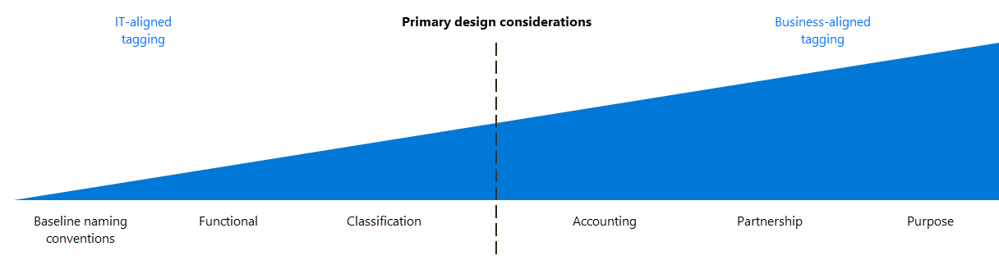

# Resource naming and tagging decision guide

Organizing cloud-based resources is a crucial task for IT, unless you only have simple deployments. Use naming and tagging standards to organize your resources for these reasons:

- **Resource management:** Your IT teams will need to quickly locate resources associated with specific workloads, environments, ownership groups, or other important information. Organizing resources is critical to assigning organizational roles and access permissions for resource management.
- **Cost management and optimization:** Making business groups aware of cloud resource consumption requires IT to understand the resources and workloads each team is using. The following topics are supported by cost-related tags:

  - [Cloud accounting models](../../strategy/cloud-accounting.md)
  - [ROI calculations](../../strategy/cloud-migration-business-case.md)
  - [Cost tracking](../../ready/azure-best-practices/track-costs.md)
  - [Budgets](/azure/cost-management-billing/costs/tutorial-acm-create-budgets?toc=/azure/cloud-adoption-framework/toc.json&bc=/azure/cloud-adoption-framework/_bread/toc.json)
  - [Alerts](/azure/cost-management-billing/costs/cost-mgt-alerts-monitor-usage-spending?toc=/azure/cloud-adoption-framework/toc.json&bc=/azure/cloud-adoption-framework/_bread/toc.json)
  - [Recurring spend tracking and reporting](../../govern/cost-management/compliance-processes.md)
  - [Post-implementation optimizations](../../govern/cost-management/discipline-improvement.md#operate-and-post-implementation)
  - [Cost-optimization tactics](../../govern/guides/complex/cost-management-improvement.md#incremental-improvement-of-best-practices)
- **Operations management:** Visibility for the operations management team regarding business commitments and SLAs is an important aspect of ongoing operations. To be well-managed, tagging for [mission criticality](../../manage/considerations/criticality.md) tagging is a requirement.
- **Security:** Classification of data and security impact is a vital data point for the team, when breaches or other security issues arise. To operate securely, tagging for [data classification](../../govern/policy-compliance/data-classification.md) is required.
- **Governance and regulatory compliance:** Maintaining consistency across resources helps identify deviation from agreed-upon policies. [Prescriptive guidance for resource tagging](../../govern/guides/complex/prescriptive-guidance.md#resource-tagging) demonstrates how one of the following patterns can help when deploying governance practices. Similar patterns are available to evaluate regulatory compliance using tags.
- **Automation:** In addition to making resources easier for IT to manage, a proper organizational scheme allows you to take advantage of automation as part of resource creation, operational monitoring, and the creation of DevOps processes.
- **Workload optimization:** Tagging can help identify patterns and resolve broad issues. Tag can also help identify the assets required to support a single workload. Tagging all assets associated with each workload enables deeper analysis of your mission-critical workloads to make sound architectural decisions.

## Tagging decision guide

Jump to: [Baseline naming conventions](#baseline-naming-conventions) | [Resource tagging patterns](#resource-tagging-patterns) | [Learn more](#learn-more)

Your tagging approach can be simple or complex, with the emphasis ranging from supporting IT teams managing cloud workloads to integrating information relating to all aspects of the business.

An IT-aligned tagging focus, such as tagging based on workload, application, function, or environment, reduces the complexity of monitoring assets and simplifies making management decisions based on operational requirements.

Tagging schemes that include a business-aligned focus, such as accounting, business ownership, or business criticality may require a larger time investment to create tagging standards that reflect business interests and maintain those standards over time. This investment yields a tagging system that provides improved accounting for costs and value of IT assets to the overall business. This association of an asset's business value to its operational cost is one of the first steps in changing the cost center perception of IT within your wider organization.

## Baseline naming conventions

A standardized naming convention is the starting point for organizing your cloud-hosted resources. A properly structured naming system allows you to quickly identify resources for both management and accounting purposes. If you have existing IT naming conventions in other parts of your organization, consider whether your cloud naming conventions should align with them or if you should establish separate cloud-based standards.

> [!NOTE]
> [Naming rules and restrictions](/azure/azure-resource-manager/management/resource-name-rules) vary per Azure resource. Your naming conventions must comply with these rules.

## Resource tagging patterns

For more sophisticated organization than a consistent naming convention only can provide, cloud platforms support the ability to tag resources.

Tags are metadata elements attached to resources. Tags consist of pairs of key/value strings. The values you include in these pairs is up to you, but the application of a consistent set of global tags, as part of a comprehensive naming and tagging policy, is a critical part of an overall governance policy.

As part of your planning process, use the following questions to help determine the kind of information your resource tags need to support:

- Does your naming and tagging policies need to integrate with existing naming and organizational policies within your company?
- Will you implement a chargeback or showback accounting system? Will you need to associate resources with accounting information for departments, business groups, and teams in more detail than a simple subscription-level breakdown allows?
- Does tagging need to represent details such regulatory compliance requirements for a resource? What about operational details such as uptime requirements, patching schedules, or security requirements?
- What tags will be required for all resources based on centralized IT policy? What tags will be optional? Are individual teams allowed to implement their own custom tagging schemes?

The common tagging patterns listed below provide examples of how tagging can be used to organize cloud assets. These patterns are not meant to be exclusive and can be used in parallel, providing multiple ways of organizing assets based on your company's needs.

<!-- cSpell:ignore catalogsearch northamerica jsmith contactalias catsearchowners businessprocess businessimpact revenueimpact -->

| Tag type | Examples | Description |
|--|--|--|
| Functional | `app` = `catalogsearch1`   `tier` = `web`   `webserver` = `apache`   `env` = `prod`   `env` = `staging`   `env` = `dev` | Categorize resources in relation to their purpose within a workload, what environment they've been deployed to, or other functionality and operational details. |
| Classification | `confidentiality` = `private`   `SLA` = `24hours` | Classifies a resource by how it's used and what policies apply to it. |
| Accounting | `department` = `finance`   `program` = `business-initiative`   `region` = `northamerica` | Allows a resource to be associated with specific groups within an organization for billing purposes. |
| Partnership | `owner` = `jsmith`   `contactalias` = `catsearchowners`   `stakeholders` = `user1;user2;user3` | Provides information about what people (outside of IT) are related or otherwise affected by the resource. |
| Purpose | `businessprocess` = `support`   `businessimpact` = `moderate`   `revenueimpact` = `high` | Aligns resources to business functions to better support investment decisions. |

## Learn more

For more information about naming and tagging in Azure, see:

- [Naming conventions for Azure resources](../../ready/azure-best-practices/naming-and-tagging.md). Refer to this guidance for recommended naming conventions for Azure resources.
- [Use tags to organize your Azure resources and management hierarchy](/azure/azure-resource-manager/management/tag-resources). You can apply tags in Azure at both the resource group and individual resource level, giving you flexibility in the granularity of any accounting reports based on applied tags.

## Next steps

Resource tagging is just one of the core infrastructure components requiring architectural decisions during a cloud adoption process. Visit the architectural decision guides overview to learn about alternative patterns or models used when making design decisions for other types of infrastructure.

> [!div class="nextstepaction"]
> [Architectural decision guides](../index.md)