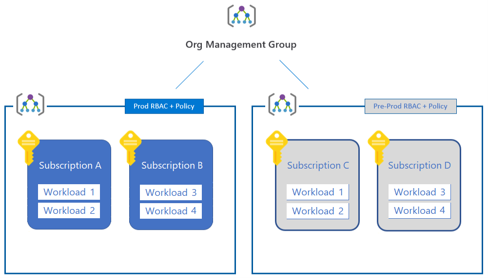

# Subscription decision guide

Effective subscription design helps organizations establish a structure to organize and manage assets in Azure during cloud adoption. This guide will help you decide when to create additional subscriptions and expand your management group hierarchy to support your business priorities.

## Prerequisites

Adopting Azure begins by creating an Azure subscription, associating it with an account, and deploying resources like virtual machines and databases to the subscription. For an overview of these concepts, see [Azure fundamental concepts](../../ready/considerations/fundamental-concepts.md).

- [Create your initial subscriptions](../../ready/azure-best-practices/initial-subscriptions.md).
- [Create additional subscriptions](../../ready/azure-best-practices/scale-subscriptions.md) to scale your Azure environment.
- [Organize and manage your subscriptions](../../ready/azure-best-practices/organize-subscriptions.md) using Azure management groups.

## Model your organization

Because every organization is different, Azure management groups are designed to be flexible. Modeling your cloud estate to reflect your organization's hierarchy helps you define and apply policies at higher levels of the hierarchy, and rely on inheritance to ensure that those policies are automatically applied to management groups lower in the hierarchy. Although subscriptions can be moved between different management groups, it's helpful to design an initial management group hierarchy that reflects your anticipated organizational needs.

Before finalizing your subscription design, also consider how [resource consistency](../resource-consistency/index.md) considerations might influence your design choices.

> [!NOTE]
> An Azure Enterprise Agreement (EA) allows you to define another organizational hierarchy for billing purposes. This hierarchy is distinct from your management group hierarchy, which focuses on providing an inheritance model for easily applying suitable policies and access control to your resources.

## Subscription design strategies

Consider the following subscription design strategies to address your business priorities.

### Workload separation strategy

As an organization adds new workloads to the cloud, different ownership of subscriptions or basic separation of responsibility may result in multiple subscriptions in both the production and nonproduction management groups. While this approach does provide basic workload separation, it doesn't take significant advantage of the inheritance model to automatically apply policies across a subset of your subscriptions.

### Application category strategy

As an organization's cloud footprint grows, additional subscriptions are typically created to support applications with fundamental differences in business criticality, compliance requirements, access controls, or data protection needs. Building from the initial production and nonproduction subscriptions, the subscriptions supporting these application categories are organized under either the production or nonproduction management group as applicable. These subscriptions are typically owned and administered by the operations staff of a central IT team.

Each organization will categorize their applications differently, often separating subscriptions based on specific applications or services or along the lines of application archetypes. This categorization is often designed to support workloads that are likely to consume most of the resource limits of a subscription, or separate mission-critical workloads to ensure they don't compete with other workloads under these limits. Some workloads that might justify a separate subscription include:

- Mission-critical workloads.
- Applications that are part of cost of goods sold (COGS) within your company. For example, every widget manufactured by a company contains an Azure IoT module that sends telemetry. This may require a dedicated subscription for accounting or governance purposes as part of COGS.
- Applications subject to regulatory requirements such as HIPAA or FedRAMP.

### Functional strategy

The functional strategy organizes subscriptions and accounts along functional lines, such as finance, sales, or IT support, using a management group hierarchy.

### Business unit strategy

The business unit strategy groups subscriptions and accounts based on profit and loss category, business unit, division, profit center, or similar business structure using a management group hierarchy.

### Geographic strategy

For organizations with global operations, the geographic strategy groups subscriptions and accounts based on geographic regions using a management group hierarchy.

## Mix subscription strategies

Management group hierarchies can be up to six levels deep. This provides you with the flexibility to create a hierarchy that combines several of these strategies to meet your organizational needs. For example, the following diagram shows an organizational hierarchy that combines a business unit strategy with a geographic strategy.

## Related resources

- [Resource access management in Azure](../../govern/resource-consistency/resource-access-management.md)
- [Multiple layers of governance in large enterprises](../../govern/guides/complex/multiple-layers-of-governance.md)
- [Multiple geographic regions](../../migrate/azure-best-practices/multiple-regions.md)

## Next steps

Subscription design is just one of the core infrastructure components requiring architectural decisions during a cloud adoption process. Visit the architectural decision guides overview to learn about additional strategies used when making design decisions for other types of infrastructure.

> [!div class="nextstepaction"]
> [Architectural decision guides](../index.md)
