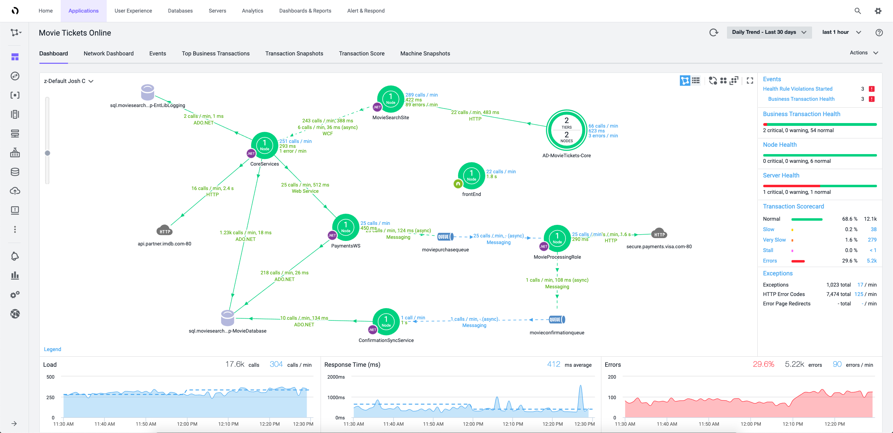
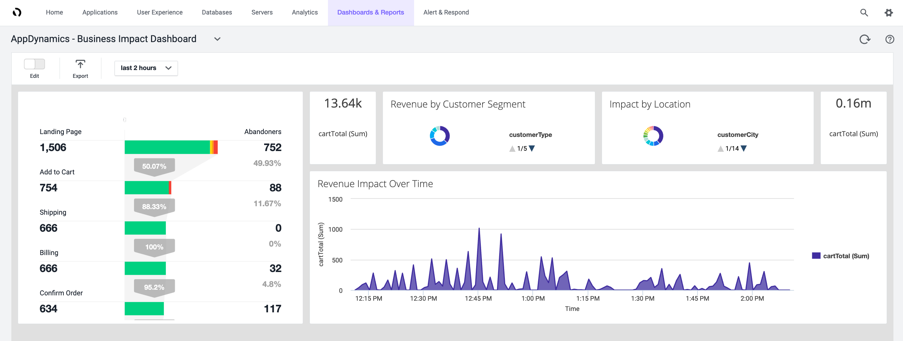
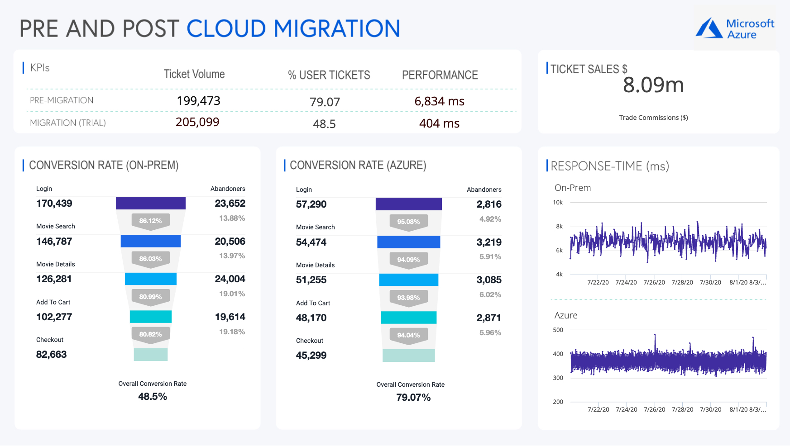

<!-- docutune:casing "Movie Tickets Online" -->

# Measure business outcomes with AppDynamics

Measuring and quantifying successful business outcomes is a crucial part of any cloud adoption strategy. Understanding an application's performance and user experience is key to measuring those business outcomes. However, accurately measuring the correlation between application performance, user experience, and business impact is often difficult, inaccurate, and time consuming.

AppDynamics can provide business insights for most use cases, and many organizations start a comprehensive cloud adoption strategy with the following use cases:

- A pre-migration and post-migration comparison
- Business health
- Release validation
- Segment health
- User journeys
- Business journeys
- Conversion funnels

This guidance will focus on how to measure business outcomes of a pre-migration and post-migration comparison and how to accelerate and reduce risk for a migration during your cloud adoption journey.

## How AppDynamics works

Prior to migration, a small, lightweight agent is deployed alongside your applications. Agents are purpose-built for various languages such as .NET, Java, and Node.js. The agent collects performance and diagnostic data during the migration and sends it to a controller to correlate and analyze the information. Controllers can reside in a fully managed AppDynamics environment, or the customer can choose to manage them in Azure. Key user experiences are identified as *business transactions*, which help you to discover the baseline for normal application or business performance. Whether they're traditional server infrastructure, database, middleware components, on-premises, or in the cloud, all application components and dependencies are identified in real time for the entire application and each business transaction.

*Figure 1: An AppDynamics flow map.*

## AppDynamics identifies business metrics

AppDynamics helps you to define business value for your applications, identify the key metrics that they should meet to retain their value, and verify if they're fulfilling their target business outcomes. AppDynamics agents collect these data points and traditional application performance metrics like response time and memory utilization in real time, directly from the application, and without any changes to code.

Business metrics are closely related to business outcomes. Many organizations have complex metrics that measure unique business outcomes, and these outcomes can range from fiscal and agility-related to performance and customer engagement goals. AppDynamics collects the metrics that are specific and useful to your organization, and those metrics can contribute to current business operations before and after migrating workloads to Azure.

**Example:**

A company that sells widgets from an online marketplace has identified the following key business transactions within their web application:

- Landing page
- Add to cart
- Shipping
- Billing
- Confirm order

These types of business transactions are common to e-commerce applications. A conversion funnel is the journey that a user takes through these pages, and it directly leads to sales revenue on the company's platform. When users abandon the journey because of poor page performance or errors, this directly impacts the company's underlying profit.

Additionally, the company has identified the following key business metrics:

- Cart totals
- Customer segments
- Customer locations

Combining application and business performance metrics helps to clearly demonstrate how their application's performance relates to their underlying profit. This level of visibility and types of insights will be vital during migrations.

Configurable dashboards are one of many AppDynamics tools that visualize these insights. In this real-time example, we see the overall conversion funnel and the impact on individual page performance against abandoners alongside shopping cart totals, customer segment, location, and general revenue details.

*Figure 2: AppDynamics business impact dashboard.*

## Resources to help identify business metrics

The [strategy](../strategy/index.md) and [business outcomes](../strategy/business-outcomes/index.md) sections of the Cloud Adoption Framework provide the guidance and strategies to help you identify business outcomes for your organization.

## Pre- and post-migration comparison

The cloud offers vast benefits and potential, but the first steps of a migration are often unclear and full of risk. A successful migration must be evaluated by more criteria than the capability for a successful deployment. Understanding the user experience and business performance before and after the cloud migration helps you to adjust and stabilize both as needed, which helps produce successful business outcomes while reinforcing the value that Azure provides throughout your migration journey.

To build on the foundation of understanding how AppDynamics provides business and application metrics, compare those metrics before and after a migration to evaluate its success and if the target business outcomes are met.

**Example:**

Movie Tickets Online, a fictitious online movie ticket seller, is working to retire their existing datacenters and move their workloads to Azure. Their capacity issues have led to poor business transaction performance, and they look forward to the performance optimizations and capacity in Azure.

In addition to improving performance, they want to ensure that the business outcomes of improving their sales funnels and growing their revenue will be met. As part of their migration, they deployed AppDynamics to their existing on-premises environments to clearly understand their current performance. As part of the cloud deployment, Movie Tickets Online can use AppDynamics native integration with Azure to understand post-migration performance and business outcomes.

In this case, they were able to see an increase in conversion rates from 48 to 79 percent and improvements to underlying performance, response time, and ticket sales volume.

*Figure 3: AppDynamics migration comparison.*

## Next steps

AppDynamics gives organizations the unique ability to measure the business outcomes during their cloud adoption strategy. Visit [AppDynamics](https://www.appdynamics.com/solutions/azure-monitoring) to learn more about AppDynamics with Azure.
