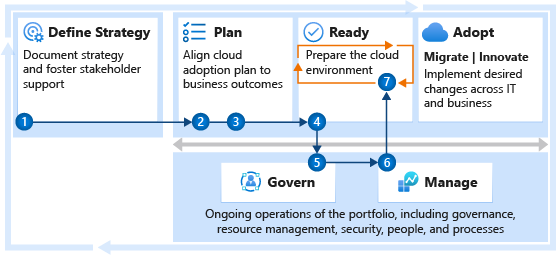

# Get started: Environment design and configuration

Environment design and configuration are the most common blockers to adoption efforts that are focused on migration or innovation. Quickly implementing a design that supports your long-term adoption plan can be difficult. This article establishes an approach and series of steps that help to overcome common blockers and accelerate your adoption efforts.

The technical effort required to create an effective environmental design and configuration can be complex. You can manage the scope to improve the odds of success for the cloud platform team. The greatest challenge is alignment among multiple stakeholders. Some of these stakeholders have the authority to stop or slow the adoption efforts. These steps outline ways to quickly meet short-term objectives and establish long-term success.

## Step 1: Document the business strategy

To avoid common migration blockers, make sure that you have a clear and concise business strategy. Stakeholder alignment on motivations, expected business outcomes, and the business justification is important throughout adoption and environment configuration.

A clear and concise business strategy helps the cloud platform team understand what's important and what should be prioritized when they're making environmental configuration decisions. In particular, it helps the teams make decisions when they're forced to choose between speed of innovation or adherence to controls.

**Deliverables:**

- Use the [strategy and plan template](https://raw.githubusercontent.com/microsoft/CloudAdoptionFramework/master/plan/cloud-adoption-framework-strategy-and-plan-template.docx) to record motivations, desired business outcomes, and high-level business justification.

**Guidance to support deliverable completion:**

- [Understand business motivations](../strategy/motivations.md): The first step to strategic alignment is to agree on the motivations that drive the migration effort. Start by understanding and categorizing motivations and common themes from various stakeholders across business and IT.
- [Document business outcomes](../strategy/business-outcomes/index.md): After motivations are aligned, you can capture the desired business outcomes. This information provides clear metrics you can use to measure the overall transformation.
- [Build a cloud migration business case](../strategy/cloud-migration-business-case.md): Start developing a business case for migration, including clear guidance on the formulas and tools that help your business justification.

 

| Accountable team | Responsible and supporting teams | Informed teams |
| --- | --- | --- |
| <li> Cloud strategy team | <li> Cloud adoption team <li> Cloud center of excellence or central IT team | <li> Cloud platform team |

## Step 2: Assess the digital estate

Discovery and assessment provide a deeper level of technical alignment, which helps you create an action plan you can use to deliver on the strategy. During this step, you validate the business case by using data about the current state of the environment. Then you perform quantitative analysis of that data and a deep qualitative assessment of the highest priority workloads.

The output of the digital estate assessment provides the cloud platform team with a clear view of the end-state environment and the requirements that are needed to support the adoption plan.

**Deliverables:**

- Raw data on the existing inventory.
- Quantitative analysis of the existing inventory to refine the business justification.
- Qualitative analysis of the first 10 workloads.
- Updated business justification in the [strategy and plan template](https://raw.githubusercontent.com/microsoft/CloudAdoptionFramework/master/plan/cloud-adoption-framework-strategy-and-plan-template.docx).

**Guidance to support deliverable completion:**

- [Inventory existing systems](../digital-estate/inventory.md): Understanding the current state from a programmatic, data-driven approach is the first step. Find and gather data to enable all assessment activities.
- [Incremental rationalization](../digital-estate/rationalize.md#incremental-rationalization): Streamline assessment efforts to focus on a qualitative analysis of all assets, possibly even to support the business case. Then add a deep qualitative analysis for the first 10 workloads to be migrated.

 

| Accountable team | Responsible and supporting teams | Informed teams |
| --- | --- | --- |
| <li> Cloud adoption team | <li> Cloud strategy team | <li> Cloud platform team |

## Step 3: Create a cloud adoption plan

Your cloud adoption plan provides an accelerated approach to developing a project backlog. The backlog can then be modified to reflect assessment results, rationalization, needed skills, and partner contracting.

A review of the short-term cloud adoption plan and backlog helps the cloud platform team understand the needs of the environment for the next few months. This background helps them to tighten the "definition of done" for the first few landing zones.

**Deliverables:**

- Deploy the backlog template.
- Update the template to reflect the first 10 workloads to be migrated.
- Update people and velocity (people's time) to estimate release timing.
- Timeline risks:
  - Lack of familiarity with Azure DevOps can slow the deployment process.
  - Complexity and data available for each workload can also affect timelines.

**Guidance to support deliverable completion:**

- [Cloud adoption plan](../plan/template.md): Define your plan using the basic template.
- [Workload alignment](../plan/workloads.md): Define workloads in the backlog.
- [Effort alignment](../plan/assets.md): Align assets and workloads in the backlog to clearly define efforts for prioritized workloads.
- [People and time alignment](../plan/iteration-paths.md): Establish iteration, velocity, and releases for the migrated workloads.

 

| Accountable team | Responsible and supporting teams | Informed teams |
| --- | --- | --- |
| <li> Cloud adoption team | <li> Cloud strategy team <li> Cloud platform team | <li> Cloud platform team |

## Step 4: Deploy the first landing zone

Initially, the cloud adoption team needs a landing zone that can support the requirements of the first wave of workloads. Over time, the landing zone scales to address more complex workloads. For now, start with a landing zone that enables early learning for the cloud platform team and the cloud adoption team.

**Deliverables:**

- Deploy a first landing zone for initial low-risk migrations.
- Develop a plan to refactor with the cloud center of excellence or the central IT team.
- Timeline risks:
  - Governance, operations, and security requirements for the first 10 workloads can slow this process. Actual refactoring of the first landing zone and subsequent landing zones takes longer, but it should happen in parallel with migration efforts.

**Guidance to support deliverable completion:**

- [Choose a landing zone](../ready/landing-zone/index.md): Use this section to find the right approach to deploying a landing zone based on your short-term adoption plan. Then deploy that standardized code base.
- [Expand your landing zone](../ready/considerations/index.md): Don't attempt to meet long-term governance, security, or operation constraints yet, unless they're required to support the short-term adoption plan.

 

| Accountable team | Responsible and supporting teams |
| --- | --- |
| <li> Cloud platform team | <li> Cloud adoption team <li> Cloud center of excellence or central IT team |

## Step 5: Deploy an initial governance foundation

Governance is a key factor to the long-term success of any migration effort. Speed to migration and business impact is important. But speed without governance can be dangerous. Your organization needs to make decisions about governance that align to your adoption patterns and your governance and compliance needs.

As those decisions are made, they feed back into the parallel efforts of the cloud platform team.

**Deliverables:**

- Deploy an initial governance foundation.
- Complete a governance benchmark to plan for future improvements.
- Timeline risks:
  - Improvement of policies and governance implementation can add one to four weeks per discipline.

**Guidance to support deliverable completion:**

- [Governance approach](../govern/index.md): This methodology outlines a process for thinking about corporate policy and processes. Then build the disciplines required to deliver on governance across your cloud enterprise adoption efforts.
- [Governance benchmark tool](../govern/benchmark.md): Find gaps in your current state so that you can plan for the future.
- [Initial governance foundation](../govern/guides/complex/prescriptive-guidance.md): Understand the governance disciplines that are required to create a governance minimum viable product (MVP) to serve as the foundation for all adoption.

 

| Accountable team | Responsible and supporting teams | Consulted teams |
| --- | --- | --- |
| <li> Cloud governance team | <li> Cloud strategy team <li> Cloud center of excellence or central IT team | <li> Cloud platform team |

## Step 6: Implement an operations baseline

Migrating to the cloud without understanding ongoing operations is risky. In parallel with migration, start planning for longer-term operations management. Feed those plans back into the parallel efforts of the cloud platform team.

**Deliverables:**

- Deploy a management baseline.
- Complete the operations management workbook.
- Identify any workloads that require an Microsoft Azure Well-Architected Review assessment.
- Timeline risks:
  - Review the workbook: estimate one hour per application owner.
  - Complete the Microsoft Azure Well-Architected Review assessment: estimate one hour per application.

**Guidance to support deliverable completion:**

- [Establish a management baseline](../manage/index.md)
- [Define business commitments](../manage/considerations/business-alignment.md)
- [Expand the management baseline](../manage/best-practices.md)
- [Get specific with advanced operations](../manage/design-principles.md)

 

| Accountable team | Responsible and supporting teams | Consulted teams |
| --- | --- | --- |
| <li> Cloud operations team | <li> Cloud strategy team <li> Cloud center of excellence or central IT team | <li> Cloud platform team |

## Step 7: Expand the landing zone

As the cloud adoption team begins their first few migrations, the cloud platform team can begin building toward the end-state environment configuration with the support of the cloud governance and cloud operations teams. Depending on the pace of the cloud adoption plan, this process might need to happen in iterative releases. Functionality might be added ahead of the requirements of the adoption plan.

**Deliverables:**

- Adopt a test-driven development approach to refactoring landing zones.
- Improve landing zone governance.
- Expand landing zone operations.
- Implement landing zone security.

**Guidance to support deliverable completion:**

- [Refactor landing zones](../ready/landing-zone/refactor.md)
- [Test-driven development of landing zones](../ready/considerations/test-driven-development.md)
- [Expand landing zone governance](../ready/considerations/landing-zone-governance.md)
- [Expand landing zone operations](../ready/considerations/landing-zone-operations.md)
- [Expand landing zone security](../ready/considerations/landing-zone-security.md)

 

| Accountable team | Responsible and supporting teams |
| --- | --- |
| <li> Cloud platform team | <li> Cloud adoption team <li> Cloud center of excellence or central IT team |

## Value statement

The steps outlined in this guide can help you and your teams accelerate their path to an enterprise-ready cloud environment that's properly configured.

## Next steps

Consider these next steps in a future iteration to build on your initial efforts:

- [Environmental technical readiness learning paths](../ready/suggested-skills.md)
- [Migration environment planning checklist](../migrate/migration-considerations/prerequisites/planning-checklist.md)
