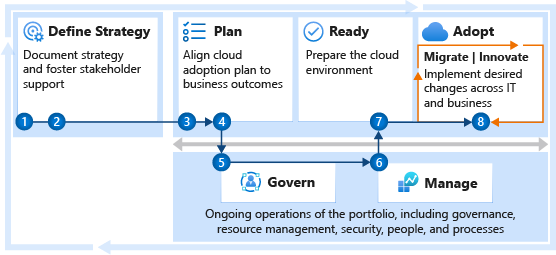

# Get started: Accelerate new product and service innovation in the cloud

Creating new products and services in the cloud requires a different approach than migration requires. The Innovate methodology of the Cloud Adoption Framework establishes an approach that guides the development of new products and services.

This guide uses the sections of the Cloud Adoption Framework that are highlighted in the following illustration. Innovation is less predictable than a standard migration, but it still fits within the context of the broader cloud adoption plan. This guide can help your enterprise provide the support needed to innovate and provide a structure for creating a balanced portfolio throughout cloud adoption.

*Figure 1: The Cloud Adoption Framework methodologies, including the Innovate methodology.*

## Step 1: Document the business strategy

To avoid common blockers, create a clear and concise business strategy for innovation. Stakeholder alignment on motivations and expected business outcomes shapes decisions that the cloud adoption team makes.

**Deliverables:**

- Use the [strategy and plan template](https://raw.githubusercontent.com/microsoft/CloudAdoptionFramework/master/plan/cloud-adoption-framework-strategy-and-plan-template.docx) to record motivations and desired business outcomes.

**Guidance to support deliverable completion:**

- [Motivations](../strategy/motivations.md): The first step to strategic alignment is to gain agreement on the motivations that drive the innovation effort. Start by understanding and categorizing motivations and common themes from stakeholders across business and IT.
- [Business outcomes](../strategy/business-outcomes/index.md): After motivations are aligned, it's possible to capture the desired business outcomes. This information provides clear metrics that you can use to measure the overall transformation.
- [Balancing the portfolio](../strategy/balance-the-portfolio.md): Innovation isn't the right adoption path for every workload. This approach to adoption is more relevant to new custom-built applications or workloads that *require* rearchitecture or full rebuilds. When motivations heavily favor innovation for all workloads, it's important to evaluate the portfolio to ensure that those investments can produce the desired return on investment. Modernization of specific resources and small-scale rebuilding efforts can be innovative but might be better served by following [Get started: Accelerate migration](./migrate.md).

 

| Accountable team | Responsible and supporting teams |
| --- | --- |
| <li> Cloud strategy team | <li> Cloud adoption team <li> Cloud center of excellence or central IT team |

## Step 2: Evaluate the business justification

In this first pass at building the business case, evaluate the initial high-level return from a potential cloud adoption effort. The goal of this step is to align all stakeholders around one simple question: based on the available data, is the overall adoption of the cloud a wise business decision? Building on that question, the team can better align on how this innovation project helps meet the users' projected needs within the goal of adopting the cloud.

**Deliverables:**

- Use the [strategy and plan template](https://raw.githubusercontent.com/microsoft/CloudAdoptionFramework/master/plan/cloud-adoption-framework-strategy-and-plan-template.docx) to record the business justification.

**Guidance to support deliverable completion:**

- [Business justification](../strategy/cloud-migration-business-case.md): Before you evaluate each opportunity to innovate in the cloud, complete a high-level business justification to establish stakeholder alignment for the overall adoption plan.
- [Business value consensus](../innovate/business-value.md): Quantifying the value of an innovation can be difficult early in the process. The exercise in this article can aid in evaluating alignment on the business value of a specific innovation effort.

 

| Accountable team | Responsible and supporting teams |
| --- | --- |
| <li> Cloud strategy team | <li> Cloud adoption team |

## Step 3: Gather data and analyze assets and workloads

In most enterprises, innovation can be accelerated through the use of existing assets like applications, virtual machines (VMs), and data. When you plan for innovation, it's important to understand how and when those assets are migrated to the cloud.

**Deliverables:**

- Get raw data on existing inventory like applications, VMs, and data.
- If the proposed innovation has dependencies on existing inventory, complete the following deliverables:
  - Quantitative analysis on any supporting inventory required to support the planned innovation.
  - Qualitative analysis of any supporting workloads required to deliver the innovation.
- Calculate the cost of new inventory required to support the innovation effort.
- Update the business justification in the [strategy and plan template](https://raw.githubusercontent.com/microsoft/CloudAdoptionFramework/master/plan/cloud-adoption-framework-strategy-and-plan-template.docx) with refined calculations.

**Guidance to support deliverable completion:**

Discovery and assessment provide a deeper level of technical alignment. You can then create an action plan for migrating any dependent workloads that the planned innovation requires. This scenario is common when companies have existing data sources, centralized applications, or service layers that are necessary for delivering innovation within the context of the rest of the enterprise.

When there are dependent systems, the following articles can guide the discovery and assessment:

- [Inventory existing systems](../digital-estate/inventory.md): Understanding the current state from a programmatic, data-driven approach is the first step. Discover and gather data to enable all assessment activities.
- [Incremental rationalization](../digital-estate/rationalize.md#incremental-rationalization): Streamline assessment efforts to focus on a qualitative analysis of all assets, possibly even to support the business case. Then add a deep qualitative analysis for the first 10 workloads.

 

| Accountable team | Responsible and supporting teams |
| --- | --- |
| <li> Cloud adoption team | <li> Cloud strategy team |

## Step 4: Plan for migration of dependent assets

When new innovation depends on existing workloads or assets, a cloud adoption plan provides an accelerated approach to developing a project backlog. The backlog can then be modified to reflect discovery results, rationalization, needed skills, and partner contracting.

**Deliverables:**

- Deploy the backlog template.
- Update the template to reflect the first 10 workloads to be migrated.
- Update people and velocity (people's time) to estimate release timing.
- Timeline risks:
  - Lack of familiarity with Azure DevOps can slow the deployment process.
  - Complexity and data available for each workload can also affect timelines.

**Guidance to support deliverable completion:**

- [Cloud adoption plan](../plan/template.md): Define your plan using the basic template.
- [Workload alignment](../plan/workloads.md): Define workloads in the backlog.
- [Effort alignment](../plan/assets.md): Align assets and workloads in the backlog to clearly define the effort for prioritized workloads.
- [People and time alignment](../plan/iteration-paths.md): Establish iteration, velocity, and releases for the workloads.

 

| Accountable team | Responsible and supporting teams |
| --- | --- |
| <li> Cloud adoption team | <li> Cloud strategy team |

## Step 5: Align governance requirements to your adoption plan

Discussing planned innovations with the governance team helps you avoid many blockers before they arise. Sometimes, innovative new solutions might require practices that are discouraged in sound governance practices. Some of those required features might even be blocked through automated tooling for governance enforcement.

**Deliverables:**

- Create transparency and understanding between innovation needs and governance constraints.
- When necessary, update policies and processes to reflect any changes or exceptions to existing governance constraints.

**Guidance to support deliverable completion:**

These links help the adoption team understand the approach of the cloud governance team:

- [Governance approach](../govern/index.md): This methodology outlines a process for thinking about corporate policy and processes. Then you can build the disciplines required to deliver on governance across your cloud enterprise efforts.
- [Definition of corporate policy](../govern/corporate-policy.md): Identify and mitigate business risks.

 

| Accountable team | Responsible and supporting teams |
| --- | --- |
| <li> Cloud governance team <li> Cloud adoption team | <li> Cloud strategy team <li> Cloud center of excellence or central IT team |

## Step 6: Define operational needs and business commitments

Define the plan for long-term operational responsibilities for the planned innovation. Will the established management baseline meet your operational needs? If not, evaluate options for funding operations that are specific to the technology that supports this innovation.

**Deliverables:**

- Complete the [Microsoft Azure Architecture Review](/assessments/?id=azure-architecture-review) to assess various architecture and operation decisions.
- Adjust the [operations management workbook](https://raw.githubusercontent.com/Microsoft/CloudAdoptionFramework/master/manage/opsmanagementworkbook.xlsx) to reflect any required advanced operations.

**Guidance to support deliverable completion:**

- [Expand the management baseline](../manage/best-practices.md): This section of the Cloud Adoption Framework guides you through various transitions into operational management in the cloud.
- [Get specific with advanced operations](../manage/design-principles.md): Discover ways to go beyond your management baseline.
- If advanced operations are required to support your operations needs, evaluate the [business commitments](../manage/considerations/business-alignment.md) to determine operational responsibilities for both teams.

 

| Accountable team | Responsible and supporting teams |
| --- | --- |
| <li> Cloud operations team <li> Cloud adoption team | <li> Cloud strategy team <li> Cloud center of excellence or central IT team |

## Step 7: Deploy an aligned landing zone

All assets hosted in the cloud live within a landing zone. That landing zone might have explicit governance, security, and operational requirements. Or, it might be a new subscription without support from other teams. In either scenario, it's important to start with a landing zone that aligns to governance and operational requirements from the beginning.

Starting with an approved landing zone helps your team to discover policy violations early during development versus when the solution is released to production. Early discovery helps your team to remove blockers and gives adoption and governance teams enough time to make changes.

**Deliverables:**

- Deploy a first landing zone for initial, low-risk experimentation during early innovation.
- Develop a plan to refactor with the cloud center of excellence or the central IT team to ensure governance, security, and operational alignment.
- Timeline risks:
  - Governance, operations, and security requirements for the first 10 workloads can slow this process. Refactoring the first landing zone and later landing zones takes longer, but it should happen in parallel with migration efforts.

**Guidance to support deliverable completion:**

- [Choose a landing zone](../ready/landing-zone/index.md): Use this section to find the right approach to deploying a landing zone based on your adoption pattern. Then deploy that standardized code base.
- [Expand your landing zone](../ready/considerations/index.md): Regardless of the starting point, identify gaps in the deployed landing zone to add required components for resource organization, security, governance, compliance, and operations.

 

| Accountable team | Responsible and supporting teams |
| --- | --- |
| <li> Cloud platform team <li> Cloud adoption team | <li> Cloud adoption team <li> Cloud center of excellence or central IT team |

## Step 8: Innovate in the cloud

The Innovate methodology provides guidance on the tools and product management approaches most commonly used to innovate in the cloud. These steps help you get started with this approach.

**Deliverables:**

- Technology-based solutions that enrich your customers' lives and drive value for the business.
- Processes and tools to iterate on those solutions faster and add more value by using the cloud:
  - Iterative development approaches.
  - Custom-built applications.
  - Technology-based experiences.
  - Integration of physical products and technology by using IoT.
  - Ambient intelligence: integration of nonintrusive technology into an environment.
  - Azure Cognitive Services: big data, AI, machine learning, and predictive solutions.

**Guidance to support deliverable completion:**

- [Create hypothesis with business value consensus](../innovate/business-value.md): Before you decide on technical solutions, identify how new innovations can drive business value and come up with a hypothesis about customer needs.
- [Build your first MVP](../innovate/considerations/build.md): Once a hypothesis has enough value potential to be built into your application, the build process starts. Development sprints should be as quick as possible, to allow quick verification or rejection of the hypothesis, or to fine tune the way in which the required functionality is to be integrated in the application.
- [Measure](../innovate/considerations/measure.md) and [learn](../innovate/considerations/learn.md): You want to verify the accuracy of your hypothesis as soon as possible. A minimum viable product (MVP) is a preliminary version of the new functionality, that offers just enough functionality to gather feedback that confirms if you are moving in the right direction.
- [Expand digital innovation](../innovate/considerations/invention.md): To refine your hypothesis using the innovation disciplines or the digital inventions which include democratize data, engage via applications, empower adoption, interact with devices, and predict and influence. These inventions are a core part of the Innovate methodology.

## Step 9: Assess the innovation maturity of your organization

To support the development of your innovation strategy, the [AI readiness assessment tool](https://info.microsoft.com/ww-landing-ai-maturity-model-website.html) is a free resource that helps organizations assess their ability to create and own AI-based systems. There are four levels of maturity: foundational, approaching, aspirational, and mature. Each level includes a specific set of characteristics to help determine your organization's ability to adopt specific types of AI solutions, mitigate associated risks, and implement strategies.

The assessment takes 5 to 10 minutes and measures your organization's capability across four categories: strategy, culture, organizational characteristics, and capabilities. Measuring these categories allows the AI readiness assessment tool to compute your organization's score and provide an estimate of the AI innovation maturity on a curve.

**Deliverables:**

- Use the [Gartner AI Maturity Model](https://www.gartner.com/en/documents/3982174/artificial-intelligence-maturity-model) to assess your organization's AI maturity to create AI-based systems.

**Guidance to support deliverable completion:**

- When the assessment is complete, the tool's output will provide a score that estimates the status of AI innovation maturity.

 

| Accountable team | Responsible and supporting teams |
| --- | --- |
| <li> Cloud adoption team | <li> Cloud center of excellence <li> Cloud center of excellence or central IT team |

## Value statement

The steps outlined in this guide can help you and your teams create innovative solutions in the cloud that create business value, are governed appropriately, and are well architected.

## Next steps

The Cloud Adoption Framework is a lifecycle solution. It can help you begin an innovation journey. It can help your organization to start an innovation journey and to advance the maturity of the teams that support innovation efforts.

The following teams can use these next steps to continue to advance the maturity of their efforts. These parallel processes aren't linear and shouldn't be viewed as blockers. Instead, each is a parallel value stream to help mature your company's overall cloud readiness.

| Team | Next iteration |
|--|--|
| Cloud&nbsp;adoption&nbsp;team | [Process improvements](../innovate/considerations/index.md) provide insight about approaches to deliver on innovations that affect customers and drive recurring adoption. |
| Cloud&nbsp;strategy&nbsp;team | The [Strategy methodology](../strategy/index.md) and the [Plan methodology](../plan/index.md) are iterative processes that evolve with the adoption plan. Return to these overview pages and continue to iterate on your business and technical strategies. |
| Cloud&nbsp;platform&nbsp;team | Revisit the [Ready methodology](../ready/index.md) to continue to advance the overall cloud platform that supports migration or other adoption efforts. |
| Cloud&nbsp;governance&nbsp;team | Use the [Govern methodology](../govern/index.md) to continue to improve governance processes, policies, and disciplines. |
| Cloud&nbsp;operations&nbsp;team | Build on the [Manage methodology](../manage/index.md) to provide richer operations in Azure. |
