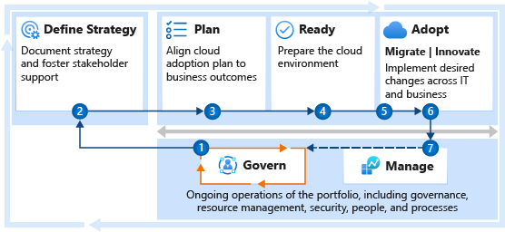

# Get started: Manage cloud costs

The Cost Management discipline of cloud governance focuses on establishing budgets, monitoring cost allocation patterns, and implementing controls to improve cloud spending behaviors across the IT portfolio. Enterprise cost optimization involves many other roles and functions to minimize cost and balance the demands of scale, performance, security, and reliability. This article maps those various supporting functions into a getting started guide that helps create alignment among the involved teams.

However, enterprise cost optimization involves many other roles and functions to minimize cost and balance the demands of scale, performance, security, and reliability. This article maps those supporting functions to help create alignment between the involved teams.

Governance is the cornerstone of cost optimization within any large enterprise. The following section outlines cost optimization guidance within the context of governance. The subsequent steps help each team take actions that target its role in cost optimization. Together, these steps will help your organization get started on a journey toward cost optimization.

## Step 1: Optimize enterprise costs

The cloud governance team is well prepared to evaluate and act on overspending or unplanned spending through a combination of monitoring performance, reducing resource sizing, and safely terminating unused resources. Enterprise cost optimization starts with a shared team understanding of the tools, processes, and dependencies required to wisely act on cost concerns at an environment level.

**Deliverables:**

- Implement wise changes to your Cost Management policies across the enterprise.
- Document your Cost Management policies, processes, and design guidance in the [Cost Management discipline template](../govern/cost-management/template.md).

These deliverables are the result of a few recurring tasks:

- Ensure strategic alignment with the cloud strategy team (which includes workload stakeholders across the portfolio).
- Optimize cost across the environment:
  - Manually or automatically shut down unused VMs.
  - Delete or deallocate stopped VMs.
  - Ensure proper resource sizing.
  - Align spending to budget expectations.
- Validate any architectural change by using the Microsoft Azure Well-Architected Review to facilitate a conversation with technical owners of the workloads.

**Guidance to support deliverable completion:**

- Ensure that all workloads and resources follow [proper naming and tagging conventions](../ready/azure-best-practices/naming-and-tagging.md). [Enforce tagging conventions by using Azure Policy](/azure/governance/policy/tutorials/govern-tags) with a specific emphasis on tags for "cost center" and "technical owner."
- On a regular basis, review and apply [Cost Management discipline best practices](../govern/cost-management/best-practices.md) to guide analysis and improvements across the enterprise. Important governance practices include:

  - Acting on [general cost best practices](../govern/cost-management/best-practices.md) to reduce sizing and costs and to stop unused machines.
  - Applying [hybrid use benefits](../govern/cost-management/best-practices.md#best-practice-take-advantage-of-azure-hybrid-benefit) to reduce licensing costs.
  - Aligning [reserved instances](../govern/cost-management/best-practices.md#best-practice-use-azure-reserved-vm-instances) to reduce resource costs.
  - [Monitoring resource utilization](../govern/cost-management/best-practices.md#best-practice-monitor-resource-utilization) to minimize impacts on resource performance.
  - [Reducing nonproduction costs](../govern/cost-management/best-practices.md#best-practice-reduce-nonproduction-costs) through policies to govern nonproduction environments.
  - Acting on [cost optimization recommendations](/azure/cost-management-billing/costs/tutorial-acm-opt-recommendations?toc=/azure/cloud-adoption-framework/toc.json&bc=/azure/cloud-adoption-framework/_bread/toc.json).

- Trade-offs at the workload level might be needed to implement effective cost optimization changes. The [Microsoft Azure Well-Architected Framework](/azure/architecture/framework/cost/tradeoffs) and [Microsoft Azure Well-Architected Review](/assessments/?id=azure-architecture-review) can help guide those conversations with the technical owner of a specific workload.
- If you're new to cloud governance, establish [governance policies, processes, and disciplines](../govern/index.md) using the Govern methodology.
- If you're new to the Cost Management discipline, consider following the [Cost Management discipline improvements article](../govern/guides/complex/cost-management-improvement.md), with a focus on the [Implementation](../govern/guides/complex/cost-management-improvement.md#incremental-improvement-of-best-practices) section.

 

| Accountable team | Responsible and supporting teams |
| --- | --- |
| <li> Cloud governance team | <li> Cloud strategy team <li> Cloud adoption team <li> Cloud center of excellence or central IT team |

The governance team can detect and drive significant cost optimization across most enterprises. Basic, data-driven resource sizing can have an immediate and measurable impact on costs.

As discussed in [Build a cost-conscious organization](../organize/cost-conscious-organization.md), an enterprise-wide focus on cost management and cost optimization can deliver much more value. The following steps demonstrate ways the various teams can help build a cost-conscious organization.

## Step 2: Define a strategy

Strategic decisions directly affect cost controls, rippling through the adoption lifecycle and into long-term operations. Strategic clarity will improve cost optimization efforts, driven by the governance team.

**Deliverables:**

- Record motivations, outcomes, and business justification in the [strategy and plan template](https://raw.githubusercontent.com/microsoft/CloudAdoptionFramework/master/plan/cloud-adoption-framework-strategy-and-plan-template.docx).
- Create your first budget by using Azure Cost Management + Billing.

**Guidance to support deliverable completion:**

- [Understand motivations](../strategy/motivations.md). Critical business events and some migration motivations tend to be cost sensitive, increasing the importance of cost control for all later efforts. Other forward-looking motivations related to innovation or growth through migration might focus more on top-line revenue. Understanding motivations will help you decide how high to prioritize your cost management.
- [Business outcomes](../strategy/business-outcomes/index.md). Some fiscal outcomes tend to be extremely cost-sensitive. When the desired outcomes map to fiscal metrics, you should invest in the Cost Management governance discipline very early.
- [Business justification](../strategy/cloud-migration-business-case.md). The business justification serves as a high-level view of the financial plan for cloud adoption. This is a good source for initial budgeting efforts.

 

| Accountable team | Responsible and supporting teams |
| --- | --- |
| <li> Cloud strategy team | <li> Cloud governance team <li> Cloud adoption team <li> Cloud center of excellence or central IT team |

## Step 3: Develop a cloud adoption plan

The adoption plan provides clarity on the timeline of activities during adoption. Aligning the plan and the digital estate analysis allows you to forecast your monthly growth in spending. It also helps your cloud governance team align processes and identify spending patterns.

**Deliverables:**

- Complete steps 1 through 6 of building a [cloud adoption plan](../plan/plan-intro.md#build-your-cloud-adoption-plan).
- Work with your cloud governance team to refine budgets and create realistic spending forecasts.

**Guidance to support deliverable completion:**

- [Gather inventory](../digital-estate/inventory.md). Establish a source of data for analysis of the digital estate before adoption.
- [Best practice: Azure Migrate](../plan/contoso-migration-assessment.md). Use Azure Migrate to gather inventory.
- [Incremental rationalization](../digital-estate/rationalize.md#incremental-rationalization). During incremental rationalization and quantitative analysis, identify cloud candidates for budgeting purposes.
- [Align cost models and forecast models](../digital-estate/calculate.md). Use Azure Cost Management + Billing to align cost and forecast models by [creating budgets](/azure/cost-management-billing/costs/tutorial-acm-create-budgets?toc=/azure/cloud-adoption-framework/toc.json&bc=/azure/cloud-adoption-framework/_bread/toc.json).
- [Build your cloud adoption plan](../plan/plan-intro.md#build-your-cloud-adoption-plan). Build a plan with actionable workload, assets, and timeline details. This plan provides the basis for spending over time (or cost forecasting). *Spending over time* is the initial baseline for all actionable optimization analysis within the Cost Management governance discipline.

 

| Accountable team | Responsible and supporting teams |
| --- | --- |
| <li> Cloud adoption team | <li> Cloud strategy team <li> Cloud governance team <li> Cloud center of excellence or central IT team |

## Step 4: Implement best practices for landing zones

The Ready methodology of the Microsoft Cloud Adoption Framework for Azure focuses heavily on the development of landing zones to host workloads in the cloud. During implementation of landing zones, an organization should consider various decisions for cost optimization.

**Deliverables:**

- Deploy one or more landing zones that can host workloads in the short-term adoption plan.
- Ensure that all landing zones meet cost optimization decisions and cost management requirements.

**Guidance to support deliverable completion:**

- [Track costs](../ready/azure-best-practices/track-costs.md#provide-the-right-level-of-cost-access). Establish a well-managed environment hierarchy, provide the right level of cost access, and use additional cost management resources in each landing zone.
- [Optimize your cloud investment](/azure/cost-management-billing/costs/cost-mgt-best-practices?toc=/azure/cloud-adoption-framework/toc.json&bc=/azure/cloud-adoption-framework/_bread/toc.json). Understand best practices for optimizing investments.
- [Create and manage budgets](/azure/cost-management-billing/costs/tutorial-acm-create-budgets?toc=/azure/cloud-adoption-framework/toc.json&bc=/azure/cloud-adoption-framework/_bread/toc.json). Understand best practices for creating and managing budgets.
- [Optimize costs from recommendations](/azure/cost-management-billing/costs/tutorial-acm-opt-recommendations?toc=/azure/cloud-adoption-framework/toc.json&bc=/azure/cloud-adoption-framework/_bread/toc.json). Understand best practices for using recommendations that will optimize costs.
- [Monitor usage and spending](/azure/cost-management-billing/costs/cost-mgt-alerts-monitor-usage-spending?toc=/azure/cloud-adoption-framework/toc.json&bc=/azure/cloud-adoption-framework/_bread/toc.json). Understand best practices for monitoring usage and spending within a landing zone.

 

| Accountable team | Responsible and supporting teams |
| --- | --- |
| <li> Cloud adoption team | <li> Cloud strategy team <li> Cloud governance team <li> Cloud center of excellence or central IT team |

## Step 5: Complete waves of migration effort

Migration is a repeatable process executed by the cloud adoption team. Throughout this process, there are many opportunities to optimize costs across your portfolio. Many of these in-process decisions are applied to a small group of workloads during each migration wave or iteration.

**Deliverables:**

- Benchmark, test, resize, and deploy a collection of fully optimized workloads.

**Guidance to support deliverable completion:**

- [Migration-focused cost-control mechanisms](../migrate/azure-migration-guide/manage-costs.md) provides insights about the cloud-native cost optimization controls that help during migration.
- [Best practices for optimizing cost of migrated workloads](../migrate/azure-best-practices/migrate-best-practices-costs.md) contains a checklist of 14 best practices to follow before and after migration to maximize cost optimization of each workload release.

Long-term operational costs are a common theme in each area of migration process improvements. This list of process improvements is organized by the phase of the migration process:

- [Prerequisites](../migrate/migration-considerations/prerequisites/index.md) provides information on managing change and the backlog, which influences both budgeted and actual cloud costs.
- [Assess](../migrate/migration-considerations/assess/index.md) provides six specific processes, from validating assumptions to understanding partner options. Each process influences cloud optimization opportunities.
- [Migrate](../migrate/migration-considerations/migrate/index.md) contains one process suggestion about remediating assets. This suggestion provides an opportunity to optimize the as-configured state, in favor of an optimized solution.
- [Promote](../migrate/migration-considerations/optimize/index.md) focuses heavily on testing, resizing, validating, and releasing migrated assets, along with decommissioning retired assets. This is the first clear point at which forecasts and budgets can be tested against actual performance and configuration.

 

| Accountable team | Responsible and supporting teams |
| --- | --- |
| <li> Cloud adoption team | <li> Cloud strategy team <li> Cloud governance team <li> Cloud center of excellence or central IT team |

## Step 6: Drive customer-focused innovation

Innovation and development of new products require a much deeper degree of architectural review. The Cloud Adoption Framework provides details on the innovation process and product management thinking. Cost optimization decisions about innovations are largely out of scope in this guidance.

**Deliverables:**

- Make key architectural decisions about innovations to balance cost and other critical design considerations.

**Guidance to support deliverable completion:**

- Use the [Microsoft Azure Well-Architected Review](/assessments/?id=azure-architecture-review) to understand the balance in architecture decisions.
- Review the [Microsoft Azure Well-Architected Framework](/azure/architecture/framework/) for deeper guidance on cost optimization during innovation.

 

| Accountable team | Responsible and supporting teams |
| --- | --- |
| <li> Cloud adoption team | <li> Cloud strategy team <li> Cloud governance team <li> Cloud center of excellence or central IT team |

## Step 7: Implement sound operations

Establishing a solid management baseline will help you collect data and create operational alerts. This effort can aid in detecting opportunities to optimize costs. It will create a balance between resiliency and cost optimization.

**Deliverables:**

- Monitor your enterprise environment for ongoing recommendations to optimize costs, aligned to the criticality and resiliency classifications of each workload.

**Guidance to support deliverable completion:**

- [Create business alignment](../manage/considerations/business-alignment.md) to gain clarity regarding criticality and appetite for resiliency investments.

 

| Accountable team | Responsible and supporting teams |
| --- | --- |
| <li> Cloud operations team | <li> Cloud strategy team <li> Cloud governance team <li> Cloud center of excellence or central IT team |

## Value statement

Following these steps helps you [build a cost-conscious organization](../organize/cost-conscious-organization.md). Simplify cost optimization by using shared ownership and driving collaboration with the right teams at the right times.
