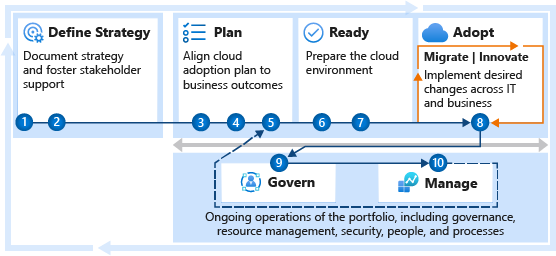

# Get started: Accelerate migration

Proper alignment of business and IT stakeholders can help your organization overcome migration roadblocks and accelerate migration efforts. This article provides recommended steps for:

- Stakeholder alignment.
- Migration planning.
- Deploying a landing zone.
- Migrating the first 10 workloads.

It can also help you with long-term success provided by proper governance and management.

Use this guide to reduce the number of materials and the processes required to align an overall migration effort. This process uses the sections of the Cloud Adoption Framework for Azure that are highlighted in this illustration.

If your migration scenario is atypical, you can get a personalized assessment of your organization's migration readiness by using the [strategic migration and readiness tool (SMART) assessment](https://docs.microsoft.com/assessments/?id=strategic-migration-assessment). Use it to identify the guidance that best aligns to your current needs.

## Get started

The technical effort and process required to migrate workloads is relatively straightforward. It's important to complete the migration process efficiently. But strategic migration readiness has an even bigger impact on the timelines and successful completion of the overall migration.

To accelerate adoption, you must take steps to support the cloud adoption team during migration. This guide outlines these iterative tasks to help customers start on the right path toward any cloud migration. To show the importance of the supporting steps, migration is listed as step 10 in this article. In reality, the cloud adoption team is likely to begin their first pilot migration in parallel with steps 4 or 5.

## Step 1: Align stakeholders

To avoid common migration blockers, create a clear and concise business strategy for migration. Stakeholder alignment on motivations and expected business outcomes shapes decisions made by the cloud adoption team.

- [Motivations](../strategy/motivations.md): The first step to strategic alignment is to gain agreement on the motivations that drive the migration effort. Start by understanding and categorizing motivations and common themes from various stakeholders across business and IT.
- [Business outcomes](../strategy/business-outcomes/index.md): After motivations are aligned, it's possible to capture the desired business outcomes. This information provides clear metrics you can use to measure the overall transformation.

**Deliverables:**

- Use the [strategy and plan template](https://archcenter.blob.core.windows.net/cdn/fusion/readiness/Microsoft-Cloud-Adoption-Framework-Strategy-and-Plan-Template.docx) to record motivations and desired business outcomes.

<!-- markdownlint-disable MD033 -->
 

| Accountable team | Responsible and supporting teams |
| --- | --- |
| <li> Cloud strategy team | <li> Cloud adoption team <li> Cloud center of excellence or central IT |

## Step 2: Align partner support

Partners, Microsoft services, or various Microsoft programs are available to support you throughout the migration process.

- [Understand partnership options](../migrate/migration-considerations/assess/partnership-options.md) to find the right level of partnership and support.

**Deliverables:**

- Establish terms and conditions or other contractual agreements before you engage supporting partners.
- Identify approved partners in the [strategy and plan template](https://archcenter.blob.core.windows.net/cdn/fusion/readiness/Microsoft-Cloud-Adoption-Framework-Strategy-and-Plan-Template.docx).

<!-- markdownlint-disable MD033 -->
 

| Accountable team | Responsible and supporting teams |
| --- | --- |
| <li> Cloud strategy team | <li> Cloud adoption team <li> Cloud center of excellence or central IT |

## Step 3: Gather data and analyze assets and workloads

Discovery and assessment provide a deeper level of technical alignment, which helps you create an action plan you can use to deliver on the strategy. During this step, you validate the business case by using data about the current state environment. Then you perform quantitative analysis of that data and a deep qualitative assessment of the highest priority workloads.

- [Inventory existing systems](../digital-estate/inventory.md): Understanding the current state from a programmatic, data-driven approach is the first step. Discover and gather data to enable all assessment activities.
- [Incremental rationalization](../digital-estate/rationalize.md#incremental-rationalization): Streamline assessment efforts to focus on a qualitative analysis of all assets, possibly even to support the business case. Then add a deep qualitative analysis for the first 10 workloads to be migrated.

**Deliverables:**

- Raw data on existing inventory.
- Quantitative analysis on existing inventory to refine the business justification.
- Qualitative analysis of the first 10 workloads.
- Update business justification in the [strategy and plan template](https://archcenter.blob.core.windows.net/cdn/fusion/readiness/Microsoft-Cloud-Adoption-Framework-Strategy-and-Plan-Template.docx).

<!-- markdownlint-disable MD033 -->
 

| Accountable team | Responsible and supporting teams |
| --- | --- |
| <li> Cloud adoption team | <li> Cloud strategy team |

## Step 4: Make a business case

Making the business case for migration is likely to be an iterative conversation among stakeholders. In this first pass at building the business case, evaluate the initial high-level return from a potential cloud migration. The goal of this step is to ensure that all stakeholders align around one simple question: Based on the available data, is the overall adoption of the cloud a wise business decision?

- [Building a cloud migration business case](../strategy/cloud-migration-business-case.md) is a good starting point for developing a migration business case. Clarity on formulas and tools can aid in business justification.

**Deliverables:**

- Use the [strategy and plan template](https://archcenter.blob.core.windows.net/cdn/fusion/readiness/Microsoft-Cloud-Adoption-Framework-Strategy-and-Plan-Template.docx) to record business justification.

<!-- markdownlint-disable MD033 -->
 

| Accountable team | Responsible and supporting teams |
| --- | --- |
| <li> Cloud strategy team | <li> Cloud adoption team |

## Step 5: Create a migration plan

The cloud adoption plan template provides an accelerated approach to developing a project backlog. The backlog can then be modified to reflect discovery results, rationalization, needed skills, and partner contracting.

- [Cloud adoption plan template](../plan/template.md): Deploy the basic template.
- [Workload alignment](../plan/workloads.md): Define workloads in the backlog.
- [Effort alignment](../plan/assets.md): Align assets and workloads in the backlog to clearly define effort for prioritized workloads.
- [People and time alignment](../plan/iteration-paths.md): Establish iteration, velocity (people's time), and releases for the migrated workloads.

**Deliverables:**

- Deploy the backlog template.
- Update the template to reflect the first 10 workloads to be migrated.
- Update people and velocity to estimate release timing.
- Timeline risks:
  - Lack of familiarity with Azure DevOps can slow the deployment process.
  - Complexity and data available for each workload can also affect timelines.

<!-- markdownlint-disable MD033 -->
 

| Accountable team | Responsible and supporting teams |
| --- | --- |
| <li> Cloud adoption team | <li> Cloud strategy team |

## Step 6: Build a skills readiness plan

Existing employees can play a hands-on role in the migration effort, but additional skills might be required. In this step, the team identifies opportunities to develop those skills or use partners to add to those skills.

- [Build a skills-readiness plan](../plan/adapt-roles-skills-processes.md). Quickly evaluate required and existing skills to better understand what skill requirements should be addressed.

**Deliverables:**

- Add a skills-readiness plan to the [strategy and plan template](https://archcenter.blob.core.windows.net/cdn/fusion/readiness/Microsoft-Cloud-Adoption-Framework-Strategy-and-Plan-Template.docx).

<!-- markdownlint-disable MD033 -->
 

| Accountable team | Responsible and supporting teams |
| --- | --- |
| <li> Cloud adoption team | <li> Cloud strategy team |

## Step 7: Deploy and align a landing zone

All migrated assets are deployed within a landing zone. Initially, the landing zone is simple to support smaller workloads. Over time, it scales to address more complex workloads.

- [Choose a landing zone](../ready/landing-zone/first-landing-zone.md): Use this article to find the right approach to deploying a landing zone based on your adoption pattern. Then deploy that standardized code base.
- [Expand your landing zone](../ready/considerations/index.md): Regardless of the starting point, identify gaps in the deployed landing zone to add required components for resource organization, security, governance, compliance, and operations.

**Deliverables:**

- Deploy a first landing zone for initial, low-risk migrations.
- Develop a plan to refactor with the cloud center of excellence or central IT.
- Timeline risks:
  - Governance, operations, and security requirements for the first 10 workloads can slow this process.
  - Actual refactoring of the first landing zone and subsequent landing zones takes longer, but it should happen in parallel with migration efforts.

<!-- markdownlint-disable MD033 -->
 

| Accountable team | Responsible and supporting teams |
| --- | --- |
| <li> Cloud platform team | <li> Cloud adoption team <li> Cloud center of excellence or central IT |

## Step 8: Migrate your first 10 workloads

The technical effort required to migrate your first 10 workloads is relatively straightforward. It's also an iterative process that you repeat as you migrate more assets. In this process, you assess your workloads (see step 4), deploy your workloads, and then release them to your production environment.

Cloud migration tools make it possible to migrate all VMs in a datacenter in one pass or iteration. It's more common to migrate a smaller number of workloads during each iteration. Breaking up the migration into smaller waves or releases requires more planning. But a smaller number reduces technical risks and the impact of organizational change management.

With each iteration, the cloud adoption team gets better at migrating workloads. These steps start the technical team on this maturity curve:

1. Migrate your first workload in a pure information as a service (IaaS) approach by using the tools outlined in the [Azure migration guide](../migrate/azure-migration-guide/index.md).
2. Expand tooling options to use migration and modernization by using the [migration scenarios](../migrate/azure-best-practices/contoso-migration-overview.md).
3. Develop your technical strategy by using broader approaches outlined in the [migration best practices](../migrate/azure-best-practices/index.md).
4. Improve consistency, reliability, and performance through an efficient migration-factory approach as outlined in [migration process improvements](../migrate/migration-considerations/index.md).

**Deliverables:**

Continuous improvement of the adoption team's ability to migrate workloads.

<!-- markdownlint-disable MD033 -->
 

| Accountable team | Responsible and supporting teams |
| --- | --- |
| <li> Cloud adoption team | <li> Cloud strategy team <li> Cloud center of excellence or central IT |

## Step 9: Hand off production workloads to cloud governance

Governance is a key factor to the long-term success of any migration effort. Speed to migration and business impact is important. But speed without governance can be dangerous. Your organization needs to make decisions about governance that align to your adoption patterns and your governance and compliance needs.

- [Governance approach](../govern/index.md): This methodology outlines a process for thinking about corporate policy and processes. Then you can build the disciplines required to deliver on governance across your cloud enterprise adoption efforts.
- [Initial governance foundation](../govern/guides/complex/prescriptive-guidance.md): Understand the Identity Baseline discipline, Security Baseline discipline, and Deployment Acceleration discipline that are required to create a governance minimum viable product (MVP) to serve as the foundation for all adoption.

**Deliverables:**

- Deploy an initial governance foundation.
- Complete a governance benchmark to plan for future improvements.
- Timeline risk: improvement policies and governance implementation can add one to four weeks per discipline.

<!-- markdownlint-disable MD033 -->
 

| Accountable team | Responsible and supporting teams |
| --- | --- |
| <li> Cloud governance team | <li> Cloud strategy team <li> Cloud center of excellence or central IT |

## Step 10: Hand off production workloads to cloud operations

Operations management is another requirement to reach migration success. Migrating individual workloads to the cloud without an understanding of ongoing enterprise operations is a risky decision. In parallel with migration, you should start planning for longer-term operations.

- [Establish a management baseline](../manage/index.md)
- [Define business commitments](../manage/considerations/business-alignment.md)
- [Expand the management baseline](../manage/best-practices.md)
- [Get specific with advanced operations](../manage/design-principles.md)

**Deliverables:**

- Deploy a management baseline.
- Complete the operations management workbook.
- Identify any workloads that require an Microsoft Azure Well-Architected Review assessment.
- Timeline risks:
  - Review the workbook: Estimate one hour per application owner.
  - Complete the Microsoft Azure Well-Architected Review assessment: Estimate one hour per application.

<!-- markdownlint-disable MD033 -->
 

| Accountable team | Responsible and supporting teams |
| --- | --- |
| <li> Cloud operations team | <li> Cloud strategy team <li> Cloud center of excellence or central IT |

## Value statement

The steps outlined in this guide can help your teams speed up their migration efforts through better change management and stakeholder alignment. Following these steps might slow the process. These steps also remove common blockers and accelerate the realization of business value.

## Next steps

The Cloud Adoption Framework is a lifecycle solution. It can help you begin a migration journey. It can also help you advance the maturity of the teams that support the migration efforts. The following teams can use these next steps to continue to advance the maturity of their efforts. These parallel processes aren't linear and shouldn't be viewed as blockers. Instead, each is a parallel value stream to help mature your company's overall cloud readiness.

| Team  | Next iteration |
|---|---|
| Cloud&nbsp;adoption&nbsp;team | [Process improvements](../migrate/migration-considerations/index.md) provide insight about moving toward a migration factory with efficient ongoing migration capabilities. |
| Cloud&nbsp;strategy&nbsp;team | The [Strategy methodology](../strategy/index.md) and the [Plan methodology](../plan/index.md) are iterative processes that evolve with the adoption plan. Return to these overview pages and continue to iterate on your business and technical strategies. |
| Cloud&nbsp;platform&nbsp;team | Revisit the [Ready methodology](../ready/index.md) to continue to advance the overall cloud platform that supports migration or other adoption efforts. |
| Cloud&nbsp;governance&nbsp;team | Use the [Govern methodology](../govern/index.md) to continue to improve governance processes, policies, and disciplines. |
| Cloud&nbsp;operations&nbsp;team | Build on the [Manage methodology](../manage/index.md) to provide richer operations in Azure. |

If your migration scenario is atypical, you can get a personalized assessment of your organization's migration readiness by using the [strategic migration and readiness tool (SMART) assessment](https://docs.microsoft.com/assessments/?id=strategic-migration-assessment). Based on the answers you provide while taking the assessment, we can help you identify the guidance that best aligns to your current needs.
