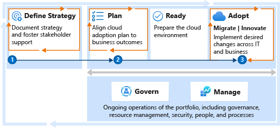

# Get started: Deliver operational excellence during digital transformation

How do you ensure operational excellence during digital transformation? Operational excellence is a business function that directly affects IT decisions. To achieve operational excellence, you must focus on customer and stakeholder value by keeping an eye on revenue, risk, and cost impacts.

This organizational change management approach requires:

- A defined strategy.
- Clear business outcomes.
- Change management planning.

From a cloud perspective, you can manage the impact of risk and cost by making post-adoption changes and continuously refining operational processes. Areas to monitor include systems automation, IT operations management practices, and Resource Consistency discipline throughout the cloud adoption lifecycle.

The steps in this article can help the strategy team lead the organizational change management that's required to consistently ensure operational excellence.

Operational excellence across the enterprise and portfolio starts with peer processes of strategy and planning to align and report on organizational change management expectations. The following steps help technical teams deliver the disciplines required to achieve operational excellence.

## Step 1: Define a strategy to guide digital transformation and operational excellence expectations

A clear business strategy is the foundation for any digital transformation and operational excellence effort. IT can reduce costs and streamline IT processes. Without a clear strategy, it's difficult to understand how those changes might affect the business outcomes identified in the broader transformation effort.

**Deliverables:**

- Record motivations, outcomes, and business justification in the [strategy and plan template](https://raw.githubusercontent.com/microsoft/CloudAdoptionFramework/master/plan/cloud-adoption-framework-strategy-and-plan-template.docx).
- Ensure learning metrics are well understood and included in the business outcomes section. Those metrics guide operational excellence activities and reporting within IT.

**Guidance to support deliverable completion:**

- [Understand motivations](../strategy/motivations.md): Critical business events and some migration motivations tend to be cost sensitive. These areas can increase the importance of cost control for all later efforts. Other forward-looking motivations related to innovation or growth through migration might be focused more on top-line revenue. Understanding motivations helps you prioritize your cost management.
- [Business outcomes](../strategy/business-outcomes/index.md): Some fiscal outcomes tend to be extremely cost sensitive. When the desired outcomes map to fiscal metrics, you should invest early in the Cost Management governance discipline.
- [Business justification](../strategy/cloud-migration-business-case.md): The business justification serves as a high-level view of the overall financial plan for cloud adoption. It can be a good source for initial budgeting efforts.
- [Learning metrics](../strategy/learning-metrics.md): To maintain alignment between the overarching business strategy and the more tactical change-management plans, establish learning metrics. These metrics should be designed to show iterative and incremental progress toward the plan.

 

| Accountable team | Responsible and supporting teams |
| --- | --- |
| <li> Cloud strategy team | <li> Cloud adoption team <li> Cloud governance team <li> Cloud operations team <li> Cloud center of excellence or central IT team |

## Step 2: Develop an organizational change management plan to span cloud adoption

Organizational change management is an iterative approach to subtly realign people, processes, and technology to support a holistic business strategy. In the case of operational excellence for digital transformation, this approach often centers on an IT-centric cloud adoption plan.

**Deliverables:**

- Update the [strategy and plan template](https://raw.githubusercontent.com/microsoft/CloudAdoptionFramework/master/plan/cloud-adoption-framework-strategy-and-plan-template.docx) to reflect change that's needed to achieve the desired strategy. The changes recorded can include:

  - An assessment of the existing digital estate.
  - A cloud adoption plan that reflects the required changes and the work involved.
  - The organizational changes that are required to deliver on the plan.
  - A plan for addressing the skills that are needed to enable the existing team to successfully complete the required work.

**Guidance to support deliverable completion:**

- [Gather inventory](../digital-estate/inventory.md): Establish a source of data for analysis of the digital estate prior to adoption.
- [Best practice: Azure Migrate](../plan/contoso-migration-assessment.md): Use Azure Migrate to gather inventory.
- [Incremental rationalization](../digital-estate/rationalize.md#incremental-rationalization): During incremental rationalization, a quantitative analysis identifies cloud candidates for budgeting purposes.
- [Align cost models and forecast models](../digital-estate/calculate.md): Use Azure Cost Management + Billing to align cost and forecast models by [creating budgets](/azure/cost-management-billing/costs/tutorial-acm-create-budgets?toc=/azure/cloud-adoption-framework/toc.json&bc=/azure/cloud-adoption-framework/_bread/toc.json).
- [Build your cloud adoption plan](../plan/plan-intro.md#build-your-cloud-adoption-plan): Build a plan with actionable workload, assets, and timeline details.

 

| Accountable team | Responsible and supporting teams |
| --- | --- |
| <li> Cloud strategy team | <li> Cloud adoption team <li> Cloud governance team <li> Cloud operations team <li> Cloud center of excellence or central IT team |

## Step 3: Manage change across cloud adoption efforts

Realization of business outcomes is the result of continuous delivery of adoption waves. Those waves could include migration and innovation cycles. In either case, delivery on operational excellence starts with regular cycles of change management.

Each wave (or release, in agile terms) delivers a set of workloads to the cloud. As each wave of adoption is completed, the cloud strategy team reports on progress toward learning metrics, business outcomes, and the overall strategy. Likewise, as each wave of adoption is completed, the adoption teams need backlog updates that reflect the prioritized workloads in the plan. These updates are based on any changes to business plans and customer needs.

**Deliverables:**

- Continuous testing and improvements to the strategy and change management plan based on changing market conditions and completion of the most recent wave of technical change.

**Guidance to support deliverable completion:**

- [Release planning](../digital-estate/approach.md): Approaches to change management through release planning.
- [Incremental rationalization](../digital-estate/rationalize.md#incremental-rationalization): Iterative approach to change management. The focus is on managing the release backlog to support manageable waves of change.
- [Power of 10 approach](../digital-estate/rationalize.md#release-planning): Limits the change management plan. The focus is on detailed analysis and planning of a continuous base of 10 workloads to balance incremental change and iterative adoption efforts.
- [Align iteration paths](../plan/iteration-paths.md): Update and add details at each release to ensure current iteration paths.
- [Assess workloads](../migrate/azure-migration-guide/assess.md?tabs=challenge-assumptions): The efforts of the cloud adoption team to evaluate and act on the most recent set of migration priorities.
- [Business value consensus](../innovate/business-value.md): The cloud adoption team's efforts to ensure business value alignment at each release of new innovation.

 

| Accountable team | Responsible and supporting teams |
| --- | --- |
| <li> Cloud strategy team | <li> Cloud adoption team |

## Value statement

The previous steps outline a business-led approach to establish operational excellence requirements throughout digital transformation. This approach provides a consistent foundation that carries through other operating model functions.

## Next steps to delivering operational excellence across the portfolio

Operational excellence requires a disciplined approach to reliability, performance, security, and cost optimization. Use the remaining guidance in this series to implement these principles through consistent approaches to automation.

- **Cost optimization:** Continuously optimize operating costs by using the getting started guide on [managing enterprise costs](./manage-costs.md)
- **Security:** Reduce risk by integrating enterprise security across the portfolio by using the getting started guide on [implementing security across the portfolio](./security.md).
- **Performance management:** Ensure IT asset performance supports business processes by using the getting started guide on [performance management across the enterprise](./performance.md).
- **Reliability:** Improve reliability and reduce business disruptions by using the getting started guide on [implementing controls to create reliability](./reliability.md).
