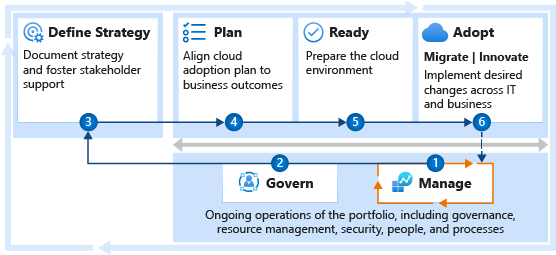

# Get started: Ensure consistent performance across a portfolio

How do we ensure adequate performance across a portfolio of workloads? This guide can help you establish processes for maintaining performance across the enterprise. The steps outlined here can help the operations team ensure consistent performance expectations across all workloads. Performance also depends on other roles and functions. This article maps those supporting functions to help you create alignment between each of the involved teams.

Centralized operations management is the most common approach to consistent performance across the portfolio. The decisions made regarding operational practices define the operations baseline and any holistic enhancements. The first step in this guide helps the operations team get started. The subsequent steps help get the entire enterprise started on a shared journey towards enterprise performance across the portfolio of workloads.

## Step 1: Establish operations management requirements

The operations management baseline, outlined in the Cloud Adoption Framework, provides a set of controls and cloud-native operations tools to ensure consistent operations. Expanding that baseline with automation tooling provides the performance monitoring and automation required to meet consistent performance requirements across the portfolio.

**Deliverables:**

- Enhance the management baseline to include automated remediation tasks related to deviations from performance expectations.
- When workload specific data patterns or architecture changes are needed to meet performance requirements, workload specific operations can provide greater performance controls.
- Document operational decisions across the IT portfolio in the [operations management workbook](https://raw.githubusercontent.com/Microsoft/CloudAdoptionFramework/master/manage/opsmanagementworkbook.xlsx) with a focus on including performance automation decisions in the "operational compliance" section of the "baseline" tab.

**Guidance to support deliverable completion:**

- The [enhanced management baseline](../manage/azure-management-guide/enhanced-baseline.md) article outlines examples of using tools like Azure Automation to add performance related enhancements. This approach can aid in maintaining consistent performance through basic modifications to size and scale of supporting assets.
- [Workload-specific operations](../manage/azure-management-guide/platform-specialization.md) uses the Microsoft Azure Well-Architected Review to provide guidance on automation for a specific workload. This approach to performance management is particularly useful when operational actions should be driven by workload specific data.
- The above guidance assumes there is an existing implementation of a [management baseline](../manage/considerations/discipline.md) to support the full portfolio of workloads.

> [!NOTE]
> **Steps to start aligning performance expectations across the organization:** Various decisions throughout the cloud adoption lifecycle can have a direct impact on performance. The following steps help outline the partnerships and supporting efforts required to deliver performance across the IT portfolio.

<!-- markdownlint-disable MD033 -->
 

| Accountable team | Responsible and supporting teams |
| --- | --- |
| <li> Cloud operations team | <li> Cloud strategy team <li> Cloud adoption team <li> Cloud governance team <li> Cloud center of excellence or Central IT |

## Step 2: Consistent application of the management baseline

As the management baseline is improved, it is important to ensure that those improvements carry through to the Resource Consistency discipline of cloud governance. Doing so ensures the application of the enhanced baseline in all managed environments.

**Deliverables:**

- Ensure proper application of the enhanced management baseline for all affected systems.
- Document your Resource Consistency policies, processes, and design guidance in the [Resource Consistency discipline template](../govern/resource-consistency/template.md).

**Guidance to support deliverable completion:**

- Ensure all workloads and resources follow [proper naming and tagging conventions](../ready/azure-best-practices/naming-and-tagging.md) and [enforce tagging conventions using Azure Policy](https://docs.microsoft.com/azure/governance/policy/tutorials/govern-tags) with a specific emphasis on tags for "criticality".
- If you are new to cloud governance, establish [governance policies, processes, and disciplines](../govern/index.md) using the Govern methodology.
- If you are new to the Cost Management discipline, consider following the [cost management improvements article](../govern/guides/complex/cost-management-improvement.md), with a focus on the [implementation](../govern/guides/complex/cost-management-improvement.md#incremental-improvement-of-the-best-practices) section.

<!-- markdownlint-disable MD033 -->
 

| Accountable team | Responsible and supporting teams |
| --- | --- |
| <li> Cloud governance team | <li> Cloud strategy team <li> Cloud operations team <li> Cloud center of excellence or Central IT |

## Step 3: Define strategy

Strategic decisions directly affect performance, rippling through the adoption lifecycle and into long-term operations. Strategic clarity improves performance efforts across the portfolio. That clarity also help the operations team understand which workloads need a degree of workload specialization and advanced operations.

**Deliverables:**

- Record motivations, outcomes, and business justification in the [strategy and plan template](https://archcenter.blob.core.windows.net/cdn/fusion/readiness/Microsoft-Cloud-Adoption-Framework-Strategy-and-Plan-Template.docx).
- Ensure the management baseline provides operational support which aligns to the strategic direction of cloud adoption.

**Guidance to support deliverable completion:**

- [Understand motivations](../strategy/motivations.md): Critical business events and some migration motivations tend to be cost sensitive, which increases the importance of cost control for all subsequent efforts. Other forward looking motivations related to innovation or growth through migration might be focused more on top-line revenue. Understanding motivations can help you understand how high of a priority cost management should be.
- [Business outcomes](../strategy/business-outcomes/index.md): Some fiscal outcomes tend to be extremely cost sensitive. When the desired outcomes map to fiscal metrics, you should invest in the Cost Management discipline of governance early.
- [Business justification](../strategy/cloud-migration-business-case.md): The business justification serves as a high-level view of the overall financial plan for cloud adoption. This can be a good source for initial budgeting efforts.

<!-- markdownlint-disable MD033 -->
 

| Accountable team | Responsible and supporting teams |
| --- | --- |
| <li> Cloud strategy team | <li> Cloud governance team <li> Cloud operations team <li> Cloud center of excellence or Central IT |

## Step 4: Assess and plan for workload adoption

The digital estate (or analysis of the existing IT portfolio) can aid in validating the business justification and provide a refined view of the overall IT portfolio. The adoption plan provides clarity on the timeline of activities during adoption. Aligning that plan and digital estate analysis provides a means of planning for future operations management dependencies. Understanding the plan also invites the cloud operations team into the development cycles to evaluate and plan for any changes to the management baseline, required to provide workload operations.

**Deliverables:**

- Update the [strategy and plan template](https://archcenter.blob.core.windows.net/cdn/fusion/readiness/Microsoft-Cloud-Adoption-Framework-Strategy-and-Plan-Template.docx) to reflect changes triggered by the digital estate analysis.
- Work with the cloud operations team to clearly define the criticality and business impact of each workload in the near-term and long-term adoption plan.
- Work with the cloud operations team to establish a timeline for operations readiness.

**Guidance to support deliverable completion:**

- [Gather inventory](../digital-estate/inventory.md): Establish a source of data for analysis of the digital estate prior to adoption.
- [Best practice - Azure Migrate](../plan/contoso-migration-assessment.md): Use Azure Migrate to gather inventory.
- [Incremental rationalization](../digital-estate/rationalize.md#incremental-rationalization): During incremental rationalization a quantitative analysis can identify cloud candidates for budgeting purposes.
- [Align cost models and forecast models](../digital-estate/calculate.md): Use Azure Cost Management to align cost and forecast models by [creating budgets](https://docs.microsoft.com/azure/cost-management-billing/costs/tutorial-acm-create-budgets?toc=/azure/cloud-adoption-framework/toc.json&bc=/azure/cloud-adoption-framework/_bread/toc.json).
- [Build your cloud adoption plan](../plan/plan-intro.md#build-your-cloud-adoption-plan): Build a plan with actionable workload, assets, and timeline details.

<!-- markdownlint-disable MD033 -->
 

| Accountable team | Responsible and supporting teams |
| --- | --- |
| <li> Cloud strategy team | <li> Cloud governance team <li> Cloud operations team <li> Cloud center of excellence or Central IT |

## Step 5: Expand the landing zones

The Ready methodology of the Cloud Adoption Framework focuses heavily on the development of landing zones to host workloads in the cloud. During landing zone implementation, various decisions which can affect operations. Consult the cloud operations team to help review the landing zone for operations improvements. Also consult the cloud governance team to understand "resource consistency" policies and design guidance which can impact the landing zone design.

**Deliverables:**

- Deploy one or more landing zones that are capable of hosting workloads in the short term adoption plan.
- Ensure all landing zones meet operations decisions and resource consistency requirements.

**Guidance to support deliverable completion:**

- [Improve landing zone operations](../ready/considerations/landing-zone-operations.md): Best practices for improving operations within a given landing zone.

<!-- markdownlint-disable MD033 -->
 

| Accountable team | Responsible and supporting teams |
| --- | --- |
| <li> Cloud adoption team | <li> Cloud operations team <li> Cloud strategy team <li> Cloud governance team <li> Cloud center of excellence or Central IT |

## Step 6: Adoption

Long-term operations might be affected by the decisions made during migration and innovation efforts. Maintaining consistent alignment early in adoption processes helps remove barriers to production release, and reduces the effort required to onboard new solutions into operations management practices.

**Deliverables:**

- Test operational readiness of production deployments using Resource Consistency policies.
- Validate adherence to resource consistency design guidance and operations requirements.
- Document any advanced operations requirements in the [operations management workbook](https://raw.githubusercontent.com/Microsoft/CloudAdoptionFramework/master/manage/opsmanagementworkbook.xlsx).

**Guidance to support deliverable completion:**

- [Environmental readiness checklist](../migrate/migration-considerations/prerequisites/planning-checklist.md)
- [Pre-promotion checklist](../migrate/migration-considerations/optimize/ready.md)
- [Production release checklist](../migrate/migration-considerations/optimize/promote.md)

<!-- markdownlint-disable MD033 -->
 

| Accountable team | Responsible and supporting teams |
| --- | --- |
| <li> Cloud adoption team | <li> Cloud strategy team <li> Cloud operations team <li> Cloud strategy team <li> Cloud governance team <li> Cloud center of excellence or Central IT |

## Value statement

The above steps will help implement the right controls and processes needed to ensure performance across the enterprise and all hosted resources.
