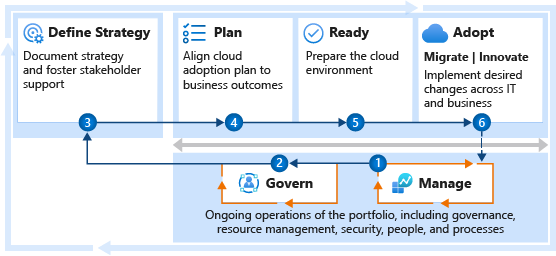

# Get started: Improve reliability with the right controls

How do you apply the right controls to improve reliability? This article helps you minimize disruptions related to:

- Inconsistencies in configuration.
- Resource organization.
- Security baselines.
- Resource protection.

The steps in this article help the operations team balance reliability and cost across the IT portfolio. This article also helps the governance team to ensure that balance is applied consistently. Reliability also depends on other roles and functions. This article maps supporting functions to help you create alignment among the involved teams.

Operations management and governance are equal partners in enterprise reliability. The decisions you make about operational practices set the baseline for reliability. The approaches used to govern the overall environment ensure consistency across all resources.

The first two steps in this article help both teams get started. They're listed sequentially, but you can perform them in parallel. The subsequent steps help you get the entire enterprise started on a shared journey toward more reliable solutions throughout the enterprise.

## Step 1: Establish operations management requirements

Not all workloads are created equal. In any environment, there are workloads that have a direct and constant impact on the business. There are also supporting business processes and workloads that have a smaller impact on the overall business. In this step, the cloud operations team identifies and implements initial requirements to support the overall IT portfolio.

**Deliverables:**

- Implement a management baseline to define the standard operations that are required for all production workloads.
- Negotiate business commitments with the cloud strategy team to develop a plan for advanced operations and resiliency requirements.
- Expand your management baseline, if additional operations are required for the majority of workloads.
- Apply advanced operations requirements to landing zones and resources that support the workloads that are most critical.
- Document operations decisions across the IT portfolio in the [operations management workbook](https://raw.githubusercontent.com/Microsoft/CloudAdoptionFramework/master/manage/opsmanagementworkbook.xlsx).

**Guidance to support deliverable completion:**

- [Management baseline](../manage/considerations/discipline.md):

  - [Inventory and visibility](../manage/considerations/inventory.md): [Cloud-native tools](../manage/azure-management-guide/inventory.md) can help you [collect data](../manage/monitor/data-collection.md) and [configure alerts](../manage/monitor/index.md). The tools also can help you implement the [monitoring platform](../manage/monitor/index.md) that best fits your operating model.
  - [Operational compliance](../manage/considerations/operational-compliance.md): The highest percentages of outages tend to come from changes to resource configuration or poor maintenance practices. Follow the [Azure server management guide](../manage/azure-server-management/index.md) to implement cloud-native tools to manage patching and changes to resource configuration.
  - [Protection and recovery](../manage/considerations/protect.md): Outages are inevitable on any platform. When a disruption occurs, be prepared with [backup and recovery solutions](../manage/azure-management-guide/protect-recover.md) to minimize the duration.
- [Advanced operations](../manage/design-principles.md): Use the management baseline as the foundation for your [business alignment](../manage/considerations/business-alignment.md) conversations. It helps you to clearly discuss [criticality](../manage/considerations/criticality.md), [business impact](../manage/considerations/impact.md), and [operations commitments](../manage/considerations/commitment.md). Business alignment helps quantify and validate requests for an [enhanced baseline](../manage/azure-management-guide/enhanced-baseline.md), management of specific [technology platforms](../manage/azure-management-guide/workload-specialization.md), or [workload-specific operations](../manage/azure-management-guide/platform-specialization.md).
- **Guide an architecture review:** Architecture changes at the workload level might be required to meet operations requirements. The [Microsoft Azure Well-Architected Framework](/azure/architecture/framework/cost/tradeoffs) and [Microsoft Azure Well-Architected Review](/assessments/?id=azure-architecture-review) can help guide those conversations with the technical owner of a specific workload.

 

| Accountable team | Responsible and supporting teams |
| --- | --- |
| <li> Cloud operations team | <li> Cloud strategy team <li> Cloud adoption team <li> Cloud governance team <li> Cloud center of excellence or central IT team |

## Step 2: Consistently apply the management baseline

Enterprise reliability requires consistent application of the management baseline. That consistency comes from appropriate corporate policy, IT processes, and automated tools. These resources govern the implementation of the management baseline for all affected resources.

**Deliverables:**

- Ensure proper application of the management baseline for all affected systems.
- Document your Resource Consistency policies, processes, and design guidance in the [Resource Consistency discipline template](../govern/resource-consistency/template.md).

**Guidance to support deliverable completion:**

- Ensure all workloads and resources follow [proper naming and tagging conventions](../ready/azure-best-practices/naming-and-tagging.md). [Enforce tagging conventions by using Azure Policy](/azure/governance/policy/tutorials/govern-tags), with a specific emphasis on tags for criticality.
- If you're new to cloud governance, establish [governance policies, processes, and disciplines](../govern/index.md) by using the Govern methodology.
- If you're new to the Cost Management discipline, follow the guidance in the [Cost Management discipline improvements](../govern/guides/complex/cost-management-improvement.md) article. Focus on the [Implementation](../govern/guides/complex/cost-management-improvement.md#incremental-improvement-of-best-practices) section.

> [!NOTE]
> **Steps to start reliability partnerships with other teams:** Various decisions throughout the cloud adoption lifecycle can have a direct impact on reliability. The following steps outline the partnerships and supporting efforts required to deliver consistent reliability across the IT portfolio.

 

| Accountable team | Responsible and supporting teams |
| --- | --- |
| <li> Cloud governance team | <li> Cloud strategy team <li> Cloud operations team <li> Cloud center of excellence or central IT team |

## Step 3: Define your strategy

Strategic decisions directly affect reliability. They ripple through the adoption lifecycle and into long-term operations. Strategic clarity improves reliability efforts.

**Deliverables:**

- Record motivations, outcomes, and business justification in the [strategy and plan template](https://raw.githubusercontent.com/microsoft/CloudAdoptionFramework/master/plan/cloud-adoption-framework-strategy-and-plan-template.docx).
- Ensure the management baseline provides operational support that aligns to the strategic direction of cloud adoption.

**Guidance to support deliverable completion:**

- [Understand motivations](../strategy/motivations.md): Critical business events and some migration motivations tend to be cost sensitive. These areas can increase the importance of cost control for all later efforts. Other forward-looking motivations related to innovation or growth through migration might be focused more on top-line revenue. Understanding motivations helps you prioritize your cost management.
- [Business outcomes](../strategy/business-outcomes/index.md): Some fiscal outcomes tend to be extremely cost sensitive. When the desired outcomes map to fiscal metrics, you should invest early in the Cost Management governance discipline.
- [Business justification](../strategy/cloud-migration-business-case.md): The business justification serves as a high-level view of the overall financial plan for cloud adoption. It can be a good source for initial budgeting efforts.

 

| Accountable team | Responsible and supporting teams |
| --- | --- |
| <li> Cloud strategy team | <li> Cloud governance team <li> Cloud operations team <li> Cloud center of excellence or central IT team |

## Step 4: Develop a cloud adoption plan

The digital estate (or analysis of the existing IT portfolio) can help you to validate the business justification. It can provide a refined view of the overall IT portfolio. The adoption plan provides clarity on the timeline of activities during adoption.

When you align the adoption plan with the digital estate analysis, you can plan for future operations management dependencies. Understanding the adoption plan also invites the cloud operations team into the development cycles. They can evaluate and plan for any changes to the management baseline that are required to provide workload operations.

**Deliverables:**

- Update the [strategy and plan template](https://raw.githubusercontent.com/microsoft/CloudAdoptionFramework/master/plan/cloud-adoption-framework-strategy-and-plan-template.docx) to reflect changes that are needed to achieve the desired strategy. The changes recorded can include:

  - An assessment of the existing digital estate.
  - A cloud adoption plan that reflects the required changes and the work involved.
  - The organizational change that's required to deliver on the plan.
  - A plan for addressing the skills that are needed to enable the existing team to successfully complete the required work.
- Work with the governance team to align cost models and forecast models. This process includes efforts to start optimizing spend through quantitative analysis.

**Guidance to support deliverable completion:**

- [Gather inventory](../digital-estate/inventory.md): Establish a source of data for analysis of the digital estate prior to adoption.
- [Best practice: Azure Migrate](../plan/contoso-migration-assessment.md): Use Azure Migrate to gather inventory.
- [Incremental rationalization](../digital-estate/rationalize.md#incremental-rationalization): During incremental rationalization, a quantitative analysis can identify cloud candidates for budgeting purposes.
- [Align cost models and forecast models](../digital-estate/calculate.md): Use Azure Cost Management + Billing to align cost and forecast models by [creating budgets](/azure/cost-management-billing/costs/tutorial-acm-create-budgets?toc=/azure/cloud-adoption-framework/toc.json&bc=/azure/cloud-adoption-framework/_bread/toc.json).
- [Build your cloud adoption plan](../plan/plan-intro.md#build-your-cloud-adoption-plan): Build a plan with actionable workload, assets, and timeline details.

 

| Accountable team | Responsible and supporting teams |
| --- | --- |
| <li> Cloud strategy team | <li> Cloud adoption team <li> Cloud governance team <li> Cloud operations team <li> Cloud center of excellence or central IT team |

## Step 5: Implement landing zone best practices

The Ready methodology of the Cloud Adoption Framework focuses heavily on the development of landing zones to host workloads in the cloud. During landing zone implementation, multiple decisions could affect operations. Consult the cloud operations team to help review the landing zone for operations improvements. Also consult the cloud governance team to understand Resource Consistency policies and design guidance that might affect the landing zone design.

**Deliverables:**

- Deploy one or more landing zones capable of hosting workloads in the short-term adoption plan.
- Ensure that all landing zones meet operations decisions and resource consistency requirements.

**Guidance to support deliverable completion:**

- [Improve landing zone operations](../ready/considerations/landing-zone-operations.md): Best practices for improving operations within a given landing zone.

 

| Accountable team | Responsible and supporting teams |
| --- | --- |
| <li> Cloud adoption team | <li> Cloud operations team <li> Cloud strategy team <li> Cloud governance team <li> Cloud center of excellence or central IT team |

## Step 6: Complete waves of adoption effort and change

Long-term operations can be affected by the decisions made during migration and innovation efforts. Maintaining consistent alignment early in adoption processes helps to remove barriers to production releases. It also reduces the effort that's required to introduce new solutions into operations management practices.

**Deliverables:**

- Test operational readiness of production deployments by using Resource Consistency policies.
- Validate adherence to resource consistency design guidance and operations requirements.
- Document any advanced operations requirements in the [operations management workbook](https://raw.githubusercontent.com/Microsoft/CloudAdoptionFramework/master/manage/opsmanagementworkbook.xlsx).

**Guidance to support deliverable completion:**

- [Environmental readiness checklist](../migrate/migration-considerations/prerequisites/planning-checklist.md)
- [Pre-promotion checklist](../migrate/migration-considerations/optimize/ready.md)
- [Production release checklist](../migrate/migration-considerations/optimize/promote.md)

 

| Accountable team | Responsible and supporting teams |
| --- | --- |
| <li> Cloud adoption team | <li> Cloud strategy team <li> Cloud operations team <li> Cloud governance team <li> Cloud center of excellence or central IT team |

## Value statement

These steps help you to implement the controls and processes that are needed to ensure reliability across the enterprise and all hosted resources.
