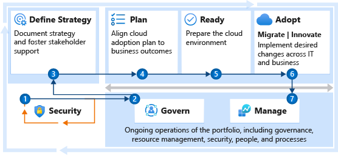
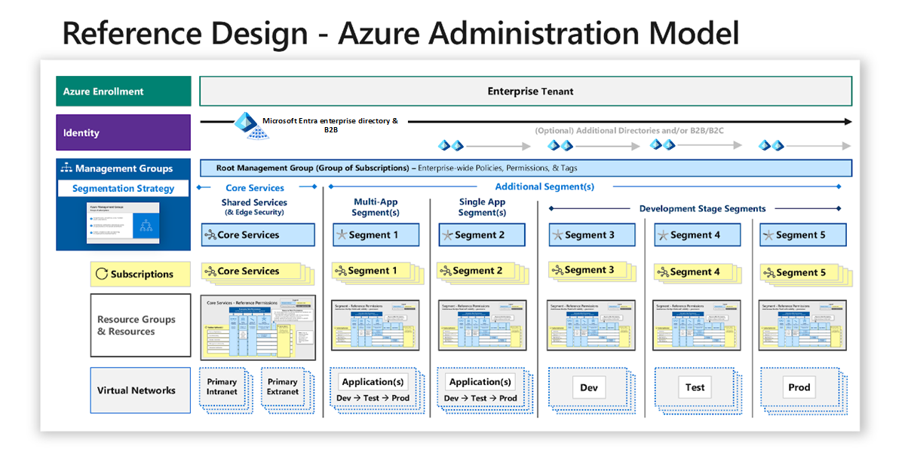
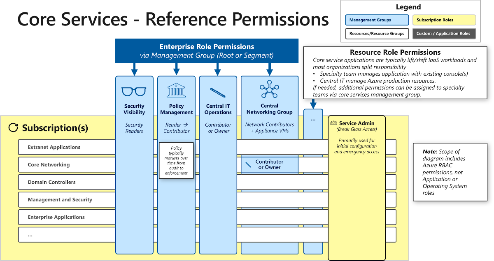

<!-- cSpell:ignore CISO passwordless -->

# Get started: Implement security across the enterprise environment

Security helps create assurances of confidentiality, integrity, and availability for a business. Security efforts have a critical focus on protecting against the potential impact to operations caused by both internal and external malicious and unintentional acts.

This getting-started guide outlines the key steps that will mitigate or avoid the business risk from cybersecurity attacks. It can help you rapidly establish essential security practices in the cloud and integrate security into your cloud adoption process.

The steps in this guide are intended for all roles that support security assurances for cloud environments and landing zones. Tasks include immediate risk mitigation priorities, guidance on building a modern security strategy, operationalizing the approach, and executing on that strategy.

This guide includes elements from across the Microsoft Cloud Adoption Framework for Azure:

Adhering to the steps in this guide will help you integrate security at critical points in the process. The goal is to avoid obstacles in cloud adoption and reduce unnecessary business or operational disruption.

Microsoft has built capabilities and resources to help accelerate your implementation of this security guidance on Microsoft Azure. You'll see these resources referenced throughout this guide. They're designed to help you establish, monitor, and enforce security, and they're frequently updated and reviewed.

The following diagram shows a holistic approach for using security guidance and platform tooling to establish security visibility and control over your cloud assets in Azure. We recommend this approach.

Use these steps to plan and execute your strategy for securing your cloud assets and using the cloud to modernize security operations.

## Step 1: Establish essential security practices

Security in the cloud starts with sound practices. Whether you're already operating in the cloud or you're planning for future adoption, it's important to rapidly establish essential security practices.

In addition to meeting any explicit regulatory compliance requirements, we recommend the following steps to address the top security challenges that most organizations face as they move to the cloud.

**Deliverables and supporting guidance:**

- **Technical:** Mitigate top risks and increase visibility and control of assets by enabling passwordless or multi-factor authentication for admins, and by enabling threat protection for cloud resources.
  - [Passwordless or multi-factor authentication for admins](https://docs.microsoft.com/azure/architecture/framework/security/critical-impact-accounts#passwordless-or-multi-factor-authentication-for-admins)
  - [Security operations](https://docs.microsoft.com/azure/architecture/framework/security/security-operations) and [Threat protection in Azure Security Center](https://docs.microsoft.com/azure/security-center/threat-protection)
- **Process:** Enable rapid security decisions and continuous improvement by assigning security roles and responsibilities, and by establishing an incident response process.
  - [Clear lines of responsibility](https://docs.microsoft.com/azure/architecture/framework/security/governance#clear-lines-of-responsibility), [Assign privileges for managing the environment](https://docs.microsoft.com/azure/architecture/framework/security/governance#assign-privileges-for-managing-the-environment), and Operationalize Secure Score <!-- TODO: Improve this and add link to AAF article -->
  - Security roles and responsibilities <!-- TODO: add link to bookmark -->
  - [Incident response reference guide](https://aka.ms/irrg)
- **People:** Provide security teams with the education, tools, and access required to successfully deploy and operate during the transition to the cloud environment.
  - **Educate everyone on concepts** of how cloud and cloud security are evolving:
    - [Evolution of threat environment, roles, and digital strategies](https://docs.microsoft.com/security/compass/microsoft-security-compass-introduction#evolution-of-threat-environment-roles--digital-strategies-2004)
    - [Transformation of security, strategies, tools, and threats](https://docs.microsoft.com/security/compass/microsoft-security-compass-introduction#transformation-of-security-strategies-tools--threats-1513)
  - **Train technical staff** on technical details of cloud security capabilities for the platforms they use. Microsoft provides extensive [Azure security documentation](https://docs.microsoft.com/azure/security).
- **Long-term architectural decisions:** Establish a long-term foundation with the right decisions. These are difficult and expensive to change later.
  - [Build an enterprise segmentation strategy and align technical architectures with it (network segmentation, identity segmentation, etc.)](https://docs.microsoft.com/azure/architecture/framework/security/network-security-containment#align-network-segmentation-with-enterprise-segmentation-strategy)
  - [Single enterprise directory](https://docs.microsoft.com/azure/architecture/framework/security/identity#single-enterprise-directory)
  - [Authentication strategy for services](https://docs.microsoft.com/azure/architecture/framework/security/applications-services#prefer-identity-authentication-over-keys)
  - [Permission assignment strategy](https://docs.microsoft.com/azure/architecture/framework/security/critical-impact-accounts#avoid-granular-and-custom-permissions)

<!-- markdownlint-disable MD033 -->
 

| Accountable team | Responsible and supporting teams |
| --- | --- |
| <li> Cloud security team     | <li> Cloud strategy team <li> Cloud adoption team <li> Cloud center of excellence or central IT |

During this initial step, governance teams should also start coordinating the creation of security baselines that can be monitored, managed, and enforced across environments. Additional guidance on building this is discussed later in step 4.

> [!NOTE]
> Each organization should define its own minimum standards. Risk posture and subsequent tolerance to that risk can vary widely based on industry, culture, and other factors. For example, a bank might not tolerate any potential damage to its reputation from even a minor attack on a test system. Some organizations would gladly accept that same risk if it accelerated their digital transformation by three to six months.

## Step 2: Modernize the security strategy

Effective security in the cloud requires a strategy that reflects the current threat environment and the nature of the cloud platform that's hosting the enterprise assets. A clear strategy improves the effort of all teams to provide a secure and sustainable enterprise cloud environment. The security strategy must enable defined business outcomes, reduce risk to an acceptable level, and enable employees to be productive.

A cloud security strategy provides guidance to all teams working on the technology, processes, and people readiness for this adoption. The strategy should inform the cloud architecture and technical capabilities, guide the security architecture and capabilities, and influence the training and education of teams.

**Deliverables:**

The strategy step should result in a document that can easily be communicated to many stakeholders within the organization. The stakeholders can potentially include executives on the organization's leadership team.

We recommended capturing the strategy in a presentation to facilitate easy discussion and updating. This presentation can be supported with a document, depending on the culture and preferences.

- **Strategy presentation:** You might have a single strategy presentation, or you might choose to also create summary versions for leadership audiences.
  - **Full presentation:** This should include the full set of elements for the security strategy in the main presentation or in optional reference slides.
  - **Executive summaries:** Versions to use with senior executives and board members might contain only critical elements relevant to their role, such as risk appetite, top priorities, or accepted risks.
- You can also record motivations, outcomes, and business justifications in the [strategy and plan template](https://archcenter.blob.core.windows.net/cdn/fusion/readiness/Microsoft-Cloud-Adoption-Framework-Strategy-and-Plan-Template.docx).

**Best practices for building security strategy:**

Successful programs incorporate these elements into their security strategy process:

- **Align closely to business strategy:** Security's charter is to protect business value. It's critical to align all security efforts to that purpose and minimize internal conflict.
  - **Build a shared understanding** of business, IT, and security requirements.
  - **Integrate security early into cloud adoption** to avoid last-minute crises from avoidable risks.
  - **Use an agile approach** to immediately establish minimum security requirements and continuously improve security assurances over time.
  - **Encourage security culture change** through intentional proactive leadership actions.

  For more information, see [Transformations, mindsets, and expectations](../strategy/define-security-strategy.md#transformations-mindsets-and-expectations).

- **Modernize security strategy:** The security strategy should include considerations for all aspects of modern technology environment, current threat landscape, and security community resources.
  - **Adapt to the shared responsibility model** of the cloud.
  - **Include all cloud types and multicloud deployments**.
  - **Prefer native cloud controls** to avoid unnecessary and harmful friction.
  - **Integrate the security community** to keep up with the pace of attacker evolution.

**Related resources for additional context:**

- [Evolution of threat environment, roles, and digital strategies](https://docs.microsoft.com/security/compass/microsoft-security-compass-introduction#evolution-of-threat-environment-roles--digital-strategies-2004)
- [Transformation of security, strategies, tools, and threats](https://docs.microsoft.com/security/compass/microsoft-security-compass-introduction#transformation-of-security-strategies-tools--threats-1513)
- Strategy considerations for the Cloud Adoption Framework:
  - [Modernize your security strategy](../strategy/define-security-strategy.md#modernize-your-security-strategy)
  - [Cybersecurity resilience](../strategy/define-security-strategy.md#cybersecurity-resilience)
  - [How cloud is changing security relationships and responsibilities](../strategy/define-security-strategy.md#how-the-cloud-is-changing-security)

<!-- markdownlint-disable MD033 -->
 

| Accountable team | Responsible and supporting teams |
| --- | --- |
| <li> Security leadership team (chief information security officer (CISO) or equivalent) | <li> Cloud strategy team <li> Cloud security team <li> Cloud adoption team <li> Cloud center of excellence or central IT |

**Strategy approval:**

Executives and business leaders with accountability for outcomes or risks of business lines within the organization should approve this strategy. This group might include the board of directors, depending on the organization.

## Step 3: Develop a security plan

Planning puts the security strategy into action by defining outcomes, milestones, timelines, and task owners. This plan also outlines the roles and responsibilities of the teams.

Security planning and cloud adoption planning should not be done in isolation. It's critical to invite the cloud security team into the planning cycles early, to avoid work stoppage or increased risk from security issues being discovered too late. Security planning works best with in-depth knowledge and awareness of the digital estate and existing IT portfolio that comes from being fully integrated into the cloud planning process.

**Deliverables:**

- **Security plan:** A security plan should be part of the main planning documentation for the cloud. It might be a document that uses the [strategy and plan template](https://archcenter.blob.core.windows.net/cdn/fusion/readiness/Microsoft-Cloud-Adoption-Framework-Strategy-and-Plan-Template.docx), a detailed slide deck, or a project file. Or it might be a combination of these formats, depending on organization's size, culture, and standard practices.

  The security plan should include all of these elements:

  - **Organizational functions plan**, so teams know how current security roles and responsibilities will change with the move to the cloud.
  - **Security skills plan** to support team members as they navigate the significant changes in technology, roles, and responsibilities.
  - **Technical security architecture and capabilities roadmap** to guide technical teams.
  Microsoft provides reference architectures and technology capabilities to help you as you build your architecture and roadmap, including:
    - [Azure components and reference model](https://docs.microsoft.com/security/compass/microsoft-security-compass-introduction#azure-components-and-reference-model-2151) to accelerate planning and design of Azure security roles.

      

      
    - [Microsoft cybersecurity reference architecture](https://aka.ms/mcra) to build a cybersecurity architecture for a hybrid enterprise that spans on-premises and cloud resources.
    - [Security operations center (SOC) reference architecture](https://docs.microsoft.com/security/compass/security-operations-videos-and-decks#part-1-introduction---soc-learnings-strategies-and-technical-integration-2430) to modernize security detection, response, and recovery.
    - [Zero-trust user access reference architecture](https://docs.microsoft.com/security/ciso-workshop/ciso-workshop-module-3#part-5-zero-trust-user-access-reference-architecture-842) to modernize access control architecture for cloud generation.
    - [Azure Security Center](https://docs.microsoft.com/azure/security-center/) and [Microsoft Cloud App Security](https://docs.microsoft.com/cloud-app-security/) to help secure cloud assets.
  - **Security awareness and education plan**, so all teams have basic critical security knowledge.
  - **Asset sensitivity marking** to designate sensitive assets by using a taxonomy aligned to business impact. The taxonomy is built jointly by business stakeholders, security teams, and other interested parties.

- **Security changes to the cloud plan:** Update other sections of the cloud adoption plan to reflect changes triggered by the security plan.

**Best practices for security planning:**
Your security plan is likely to be more successful if your planning takes the approach of:

- **Assume a hybrid environment:** That includes software as a service (SaaS) applications and on-premises environments. It also includes multiple cloud infrastructure as a service (IaaS) and platform as a service (PaaS) providers, if applicable.
- **Adopt agile security:** Establish minimum security requirements first and move all noncritical items to a prioritized list of next steps.
This should not be a traditional, detailed plan of 3-5 years. The cloud and threat environment change too fast to make that type of plan useful. Your plan should focus on developing the beginning steps and end state:
  - **Quick wins** for the immediate future that will deliver a high impact before longer-term initiatives begin. The time frame can be 3-12 months, depending on organizational culture, standard practices, and other factors.
  - **Clear vision** of the desired end state to guide each team's planning process (which might take multiple years to achieve).
- **Share the plan broadly:** Increase awareness of, feedback from, and buy-in by stakeholders.
- **Meet the strategic outcomes:** Ensure that your plan aligns to and accomplishes the strategic outcomes described in the security strategy.
- **Set ownership, accountability, and deadlines:** Ensure that the owners for each task are identified and are committed to completing that task in a specific time frame.
- **Connect with the human side of security:** Engage people during this period of transformation and new expectations by:
  - **Actively supporting team member transformation** with clear communication and coaching on:
    - What skills they need to learn.
    - Why they need to learn the skills (and the benefits of doing so).
    - How to get this knowledge (and provide resources to help them learn).
  
    You can document the plan by using the [strategy and plan template](https://archcenter.blob.core.windows.net/cdn/fusion/readiness/Microsoft-Cloud-Adoption-Framework-Strategy-and-Plan-Template.docx). And you can use [online Microsoft security training](https://docs.microsoft.com/security/compass/microsoft-security-compass-introduction) to help with education of your team members.
  - **Making security awareness engaging** to help people genuinely connect with their part of keeping the organization safe.
- **Review Microsoft learnings and guidance:** Microsoft has published insights and perspectives to help your organization plan its transformation to the cloud and a modern security strategy. The material includes recorded training, documentation, and security best practices and recommended standards.
  For technical guidance to help build your plan and architecture, see the [Microsoft security documentation](https://docs.microsoft.com/security).

<!-- markdownlint-disable MD033 -->
 

| Accountable team | Responsible and supporting teams |
| --- | --- |
| <li> Cloud security team | <li> Cloud strategy team <li> Cloud governance team <li> Any risk teams in your organization <li> Cloud center of excellence or central IT |

**Security plan approval:**

The security leadership team (CISO or equivalent) should approve the plan.

## Step 4: Secure new workloads

It's a lot easier to start in a secure state than to retrofit security later into your environment. We strongly recommend starting with a secure configuration to ensure that workloads are migrated to, and developed and tested in, a secure environment.

During [landing zone](https://docs.microsoft.com/azure/cloud-adoption-framework/ready/landing-zone) implementation, many decisions can affect security and risk profiles. The cloud security team should review the landing zone configuration to ensure that it meets the security standards and requirements in your organization's security baselines.

**Deliverables:**

- Ensure that new landing zones meet the organization's compliance and security requirements.

**Guidance to support deliverable completion:**

- **Blend existing requirements and cloud recommendations:** Start with recommended guidance and then adapt this to your unique security requirements. We have seen challenges with trying to enforce existing on-premises policies and standards, because these often refer to outdated technology or security approaches.

  Microsoft has published guidance to help you build your security baselines:
  - [Azure security standards for strategy and architecture](https://docs.microsoft.com/security/compass/compass): Strategy and architectural recommendations to shape your environment's security posture.
  - [Azure security benchmarks](https://docs.microsoft.com/azure/security/benchmarks/introduction): Specific configuration recommendations for securing Azure environments.
  - [Azure security baseline training](https://docs.microsoft.com/learn/modules/create-security-baselines).
- **Provide guardrails:** Safeguards should include automated policy auditing and enforcement. For these new environments, teams should strive to both audit and enforce the organization's security baselines. These efforts can help minimize security surprises during the development of workloads, as well as continuous integration and continuous deployment (CI/CD) of workloads.

  Microsoft provides several native capabilities in Azure to enable this:
  - [Secure score](https://docs.microsoft.com/azure/security-center/secure-score-security-controls): Use a scored assessment of your Azure security posture to track security efforts and projects in your organization.
  - [Azure Blueprints](https://docs.microsoft.com/azure/governance/blueprints/overview): Cloud architects and central IT groups can define a repeatable set of Azure resources that implements and adheres to an organization's standards, patterns, and requirements.
  - [Azure Policy](https://docs.microsoft.com/azure/governance/policy/): This is the foundation of the visibility and control capabilities that the other services use. Azure Policy is integrated into [Azure Resource Manager](https://docs.microsoft.com/azure/azure-resource-manager), so you can audit changes and enforce policies across any resource in Azure before, during, or after its creation.
- [Improve landing zone operations](../ready/considerations/landing-zone-security.md): Use best practices for improving security within a landing zone.

<!-- markdownlint-disable MD033 -->
 

| Accountable team | Responsible and supporting teams |
| --- | --- |
| <li> Cloud security team | <li> Cloud adoption team <li> Cloud platform team <li> Cloud strategy team <li> Cloud governance team <li> Cloud center of excellence or central IT |

## Step 5: Secure existing cloud workloads

Many organizations have already deployed assets to enterprise cloud environments without applying the security best practices, creating increased business risk.

After you ensure that new applications and landing zones follow security best practices, you should focus on bringing existing environments up to the same standards.

**Deliverables:**

- Ensure that all existing cloud environments and landing zones meet the organization's compliance and security requirements.
- Test operational readiness of production deployments by using policies for security baselines.
- Validate adherence to design guidance and security requirements for security baselines.

**Guidance to support deliverable completion:**

- Use the same security baselines that you built in [step 4](#step-4-secure-new-workloads) as your ideal state. You might have to adjust some policy settings to only audit instead of enforcing them.
- Balance operational and security risk. Because these environments might host production systems that enable critical business processes, you might need to implement security improvements incrementally to avoid risking operational downtime.
- Prioritize the discovery and remediation of security risk by business criticality. Start with workloads that have a high business impact if compromised and workloads that have a high exposure to risk.

For more information, see [Identify and classify business-critical applications](https://docs.microsoft.com/azure/architecture/framework/security/applications-services?toc=/security/compass/toc.json&bc=/security/compass/breadcrumb/toc.json#identify-and-classify-business-critical-applications).

<!-- markdownlint-disable MD033 -->
 

| Accountable team | Responsible and supporting teams |
| --- | --- |
| <li> Cloud adoption team | <li> Cloud adoption team <li> Cloud strategy team <li> Cloud security team <li> Cloud governance team <li> Cloud center of excellence or central IT |

## Step 6: Govern to manage and improve security posture

Like all modern disciplines, security is an iterative process that should focus on continuous improvement. Security posture can also decay if organizations don't sustain focus on it over time.

Consistent application of security requirements comes from sound governance disciplines and automated solutions. After the cloud security team defines the security baselines, those requirements should be audited to ensure they're applied consistently to all cloud environments (and enforced where applicable).

**Deliverables:**

- Ensure that the organization's security baselines are applied to all relevant systems. Audit anomalies by using a [secure score](https://docs.microsoft.com/azure/security-center/secure-score-security-controls) or a similar mechanism.
- Document security baseline policies, processes, and design guidance in the [Security Baseline Discipline template](../govern/security-baseline/template.md).

**Guidance to support deliverable completion:**

- Use the same security baselines and auditing mechanisms that you built in [step 4](#step-4-secure-new-workloads) as technical components of monitoring the baselines. Complement these baselines with people and process controls to ensure consistency.
- Ensure that all workloads and resources follow proper [naming and tagging conventions](../ready/azure-best-practices/naming-and-tagging.md). [Enforce tagging conventions by using Azure Policy](https://docs.microsoft.com/azure/governance/policy/tutorials/govern-tags), with a specific emphasis on tags for "data sensitivity."
- If you're new to cloud governance, establish [governance policies, processes, and disciplines](../govern/index.md) by using the Govern methodology.

<!-- markdownlint-disable MD033 -->
 

| Accountable team | Responsible and supporting teams |
| --- | --- |
| <li> Cloud governance team | <li> Cloud strategy team <li> Cloud security team <li> Cloud center of excellence or central IT |

## Next steps

The steps in this guide have helped you implement the strategy, controls, processes, skills, and culture needed to consistently manage security risks across the enterprise.
As you continue into the operations mode of cloud security, consider these next steps:

- Review [Microsoft security documentation](https://docs.microsoft.com/security). It provides technical guidance to help security professionals build and improve cybersecurity strategy, architecture, and prioritized roadmaps.
- Review security information in [Built-in security controls for Azure services](https://docs.microsoft.com/azure/security/fundamentals/security-controls).
- Review Azure security tools and services in [Security services and technologies available on Azure](https://docs.microsoft.com/azure/security/azure-security-services-technologies).
- Review the [Microsoft Trust Center](https://www.microsoft.com/trustcenter/guidance/risk-assessment). It contains extensive guidance, reports, and related documentation that can help you perform risk assessments as part of your regulatory compliance processes.
- Review third-party tools available to facilitate meeting your security requirements. See [Integrate security solutions in Azure Security Center](https://docs.microsoft.com/azure/security-center/security-center-partner-integration).
