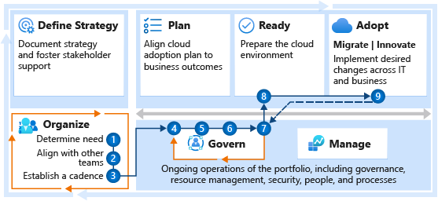

# Get started: Build a cloud governance team

A cloud governance team ensures that cloud-adoption risks and risk tolerance are properly evaluated and managed. The team identifies risks that can't be tolerated by the business, and it converts risks into governing corporate policies.

## Step 1: Determine whether a cloud governance team is needed

The official guidance in the Cloud Adoption Framework for Azure is to always create a cloud governance team. At first, the team might be exceptionally small. However, regardless of its size, its role will prove important. If a team isn't needed, a group or individual on an existing adoption team should agree to fulfill the responsibilities associated with the [cloud governance functions](../../organize/cloud-governance.md).

**Deliverables:**

- Determine whether you need a cloud governance team.
- Document the decision and the responsible individuals in the [RACI (responsible, accountable, consulted, and informed) template](https://archcenter.blob.core.windows.net/cdn/fusion/management/raci-template.xlsx) by selecting the **Org Alignment** tab.

**Guidance to support deliverable completion:**

- The [cloud governance functions](../../organize/cloud-governance.md) might be spread across multiple individuals or teams already. Having a team that goes by the title "cloud governance team" is of little importance. However, the required capabilities should sit with an accountable party or team.
- If the company's long-term cloud adoption strategy can be delivered from one landing zone in one cloud environment, the amount of governance and operations efforts might be small enough for delivery by one person or one team. That team is unlikely to be called cloud governance, because it serves many functions beyond cloud governance. Even for that team, this get-started guide can help ensure that it's prepared to deliver on this important function of governance.

<!-- markdownlint-disable MD033 -->
 

| Accountable team | Responsible and supporting teams |
| --- | --- |
| <li> Cloud strategy team | <li> Cloud adoption team |

## Step 2: Align with other teams

The governance team ensures consistency and adherence to a set of common policies. Those policies come from an ongoing alignment with other teams. 

Before it establishes policies or automated cloud governance, the cloud governance team should meet with other teams that are identified in the RACI template. This will help ensure alignment on critical topics, such as security, cost, performance, operations, and deployment. Steps 4 and 5 can help facilitate the alignment.

**Deliverables:**

- Discuss current-state implementation and ongoing adoption plans with each team.

**Guidance to support deliverable completion:**

- Review your company's [strategy and plan template](https://archcenter.blob.core.windows.net/cdn/fusion/readiness/Microsoft-Cloud-Adoption-Framework-Strategy-and-Plan-Template.docx) with members of the cloud strategy team to understand motivations, metrics, and strategy.
- Review your company's [cloud adoption plan template](../../plan/template.md) with members of the cloud adoption team to understand timelines and prioritization.
- Review the operation team's [operations management workbook](https://raw.githubusercontent.com/Microsoft/CloudAdoptionFramework/master/manage/opsmanagementworkbook.xlsx) to understand the operational requirements and commitments that have been established with the business.

<!-- markdownlint-disable MD033 -->
 

| Accountable team | Responsible and supporting teams |
| --- | --- |
| <li> Cloud governance team | <li> Cloud strategy team <li> Cloud adoption team <li> Cloud operations team <li> Cloud center of excellence or Central IT |

## Step 3: Establish a cadence with other teams

Cloud adoption generally comes in waves, or releases. A regular cadence that's aligned with those releases lets the cloud governance team look ahead and understand the risks that will be introduced in the next wave. Staying engaged with the strategy, adoption, and operations teams during planning and review also helps the governance team stay ahead of coming risks.

**Deliverables:**

- Establish a cadence with each of the supporting teams. If possible, align that cadence with release and planning cycles.
- Establish a separate cadence directly with the cloud strategy team (or various team members) to review risks that are associated with the next wave of adoption and gauge the team's level of tolerance for those risks.

**Guidance to support deliverable completion:**

- For additional guidance on cadences for meetings, review the "Deliverable" section of [Cloud governance functions](../../organize/cloud-governance.md#deliverable).

<!-- markdownlint-disable MD033 -->
 

| Accountable team | Responsible and supporting teams |
| --- | --- |
| <li> Cloud governance team | <li> Cloud strategy team <li> Cloud adoption team <li> Cloud operations team |

## Step 4: Review the methodology

To help establish a future vision for governance and a working approach to that vision, review the Govern methodology in the Cloud Adoption Framework.

**Deliverables:**

- Gain an understanding of the methodology, approach, and implementation that supports the Govern methodology.

**Guidance to support deliverable completion:**

- Review the [Govern methodology](../../govern/methodology.md).

**Accountable team:**

- The cloud governance team is accountable for establishing a vision and approach to governance.

## Step 5: Complete the governance benchmark

Governance is a broad topic. A short assessment can help the team understand where to get started.

**Deliverables:**

- Complete the governance benchmark assessment, which is based on conversations with various stakeholders. Or ask other teams to complete the assessment on their own.

**Guidance to support deliverable completion:**

- Assess your governance needs and priorities by using the [governance benchmark](../../govern/benchmark.md).

**Accountable team:**

- The cloud governance team should understand the gaps that are identified in the governance benchmark and then provide direction on governance that helps address the gaps.

## Step 6: Implement the initial governance best practice and configuration

The Govern methodology includes two approaches to an initial governance foundation. Review each approach, and implement the one that most closely matches your needs.

**Deliverables:**

- Deploy the basic governance tools and organization configurations that are required to govern the environment during the next few waves of adoption efforts.

**Guidance to support deliverable completion:**

- For guidance on configuration and implementation, review [Establish an initial cloud governance foundation](../../govern/initial-foundation.md).

**Accountable team:**

- The cloud governance team is accountable for the review and implementation of governance best practices and an initial governance foundation.

## Step 7: Continuously improve governance maturity

Governance needs grow as additional cloud adoption efforts are completed. Stay aligned with the ongoing adoption plan to ensure that the governance approach can maintain the proper levels of governance and control.

**Deliverables:**

- Implement governance improvements to guard against changing risks and governance needs.

**Guidance to support deliverable completion:**

- To help improve the initial governance foundation, implement [expanded governance scenarios](../../govern/foundation-improvements.md).

**Accountable team:**

- The cloud governance team is accountable for aligning with ongoing adoption plans.

## Step 8: Evaluate landing zone changes

As landing zones are deployed and expanded, new risks or governance violations might emerge. Periodically review landing zone configurations to identify any deviations from policy that aren't caught by the cloud-native governance tools. Ensure that each landing zone deployment adheres to guidelines for landing zone governance.

**Deliverables:**

- Help the cloud platform team develop improvements to the landing zone, which must comply with governance policies.

**Guidance to support deliverable completion:**

- Improve [landing zone governance](../../ready/considerations/landing-zone-governance.md).

**Accountable team:**

- The cloud governance team should make sure that each landing zone deployment adheres to governance guidelines.

## Step 9: Adoption handoffs

As new adoption efforts are completed, the cloud adoption team hands off operational responsibilities to the cloud operations team and cloud governance teams. Stay aligned with adoption release cadences to ensure proper documentation and policy alignment, and to help the team assume responsibility for the workloads.

**Deliverables:**

- Regularly review and accept handoffs from other cloud adoption teams.

**Guidance to support deliverable completion:**

- Establish a process for [onboarding new workloads and resources](https://docs.microsoft.com/azure/azure-resource-manager/custom-providers/concepts-resource-onboarding).

<!-- markdownlint-disable MD033 -->
 

| Accountable team | Responsible and supporting teams |
| --- | --- |
| <li> Cloud adoption teams | <li> Cloud governance team <li> Cloud operations team |

## What's next

All companies are unique, and so are their governance needs. Choose the level of maturity that fits your organization, and use the Cloud Adoption Framework to guide the practices, processes, and tooling that can help you get there.

As cloud governance matures, teams are empowered to adopt the cloud at a faster pace. Continuous cloud adoption efforts tend to trigger maturity in IT operations. To ensure that governance is a part of operations development, either develop a [cloud operations team](./cloud-operations.md) or sync with your existing cloud operations team.
