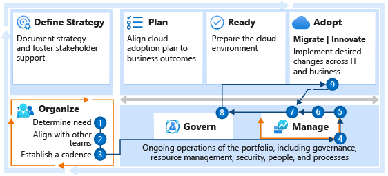

# Get started: Build a cloud operations team

An operations team focuses on monitoring, repairing, and remediating issues related to traditional IT operations and assets. In the cloud, many of the capital costs and operations activities are transferred to the cloud provider, giving IT operations the opportunity to improve and provide significant additional value.

## Step 1: Determine whether a cloud operations team is needed

Before you can release any workloads into production, an agreement must be reached on the accountability for delivery of [cloud operations functions](../../organize/cloud-operations.md). For some portfolios, operational responsibilities might belong to the DevOps and cloud adoption teams. In other cases, a managed service provider with cloud operations experience might assume ongoing operational duties.

If no DevOps or service-provider operations agreements are in place, it's safe to assume that someone within IT will need to commit to ongoing operational duties regarding the management of production workloads.

**Deliverables:**

- Determine whether you need a cloud operations team.
- Align responsibilities across teams by developing a cross-team matrix that identifies *responsible, accountable, consulted, and informed (RACI)* parties. Document the decision and responsible individuals in the [RACI template](https://raw.githubusercontent.com/microsoft/CloudAdoptionFramework/master/organize/raci-template.xlsx) in the `Org Alignment` worksheet.

**Guidance to support deliverable completion:**

- [Cloud operations functions](../../organize/cloud-operations.md) might be spread across multiple individuals or teams already. Decide whether a cloud operations team is required. Some level of operations is always needed for production workloads.
- If the company's long-term cloud adoption strategy can be delivered from one landing zone in one cloud environment, the governance and operations efforts might be small enough to be delivered by one person or one team. That team is unlikely to be called cloud operations, because it will serve many functions. For that individual or team, the following guidance can help ensure that it can deliver on this important function of operations.

 

| Accountable team | Responsible and supporting teams |
| --- | --- |
| <li> Cloud strategy team | <li> Cloud adoption team <li> Cloud governance team |

## Step 2: Align with other teams

The cloud operations team inherits operational responsibilities for all workloads in the production portfolio. Those responsibilities can vary between workloads, based on expectations and the commitments the team has made to business stakeholders. The architectural decisions made by migration-focused and innovation-focused cloud adoption teams also influence the team's operational commitments.

Before the cloud operations team implements any ongoing operations practices, it's important for it to align with other teams. The team should meet with other teams that are identified in the RACI template to ensure alignment on critical topics, such as security, cost, performance, governance, adoption, and deployment. Steps 4 and 5 can help facilitate this alignment.

**Deliverables:**

- Discuss current-state implementation and ongoing adoption plans with each team.

**Guidance to support deliverable completion:**

- To understand team motivations, metrics, and strategy, review your company's [strategy and plan template](https://raw.githubusercontent.com/microsoft/CloudAdoptionFramework/master/plan/cloud-adoption-framework-strategy-and-plan-template.docx) with members of the cloud strategy team.
- To understand timelines and prioritization, review your company's [cloud adoption plan](../../plan/template.md) with members of the cloud adoption team.
- To understand the operational requirements and commitments that the team has established with the business, begin developing the [operations management workbook](https://raw.githubusercontent.com/Microsoft/CloudAdoptionFramework/master/manage/opsmanagementworkbook.xlsx).

 

| Accountable team | Responsible and supporting teams |
| --- | --- |
| <li> Cloud operations team | <li> Cloud strategy team <li> Cloud adoption team <li> Cloud governance team <li> Cloud center of excellence or central IT team |

## Step 3: Establish a cadence with other teams

Cloud adoption generally comes in waves, or releases. A regular cadence that's aligned with those releases lets the cloud operations team prepare for the handoffs at the end of the next wave. Staying engaged with the strategy, adoption, and governance teams during planning and review helps the operations team stay ahead of the coming operational demands.

**Deliverables:**

- Establish a cadence with the supporting teams. If possible, align that cadence with release and planning cycles.
- Establish a separate cadence directly with the cloud strategy team or its various team members to review any operational requirements that are associated with the next wave of adoption.

**Guidance to support deliverable completion:**

- For additional guidance on cadences for meetings, see the "deliverables" section of [cloud operations functions](../../organize/cloud-operations.md#deliverables).

 

| Accountable team | Responsible and supporting teams |
| --- | --- |
| <li> Cloud operations team | <li> Cloud strategy team <li> Cloud adoption team <li> Cloud governance team |

## Step 4: Review the methodology

To help establish a future vision for operations management and a working approach to achieve that vision, review the Manage methodology of the Cloud Adoption Framework.

**Deliverables:**

- Gain an understanding of the methodology, approach, and implementation that supports the Manage methodology.

**Guidance to support deliverable completion:**

- Review the [Manage methodology of the Cloud Adoption Framework](../../manage/index.md).

**Accountable team:**

- The cloud operations team is accountable for the vision and approach to operations management.

## Step 5: Implement the operations baseline

If operations practices aren't already deployed to your cloud environments, start with the operations baseline. That baseline will implement cloud-native, no-ops/low-ops practices to provide a base level of operational protection.

**Deliverables:**

- Deploy the basic Azure server-management configurations that are required for operating the environment during the next few waves of adoption efforts.

**Guidance to support deliverable completion:**

- Implement the [operations baseline](../../manage/azure-server-management/index.md) configuration.

**Accountable team:**

- The cloud operations team is accountable for implementing the operations baseline.

## Step 6: Align business commitments

Review the team's operations baseline commitments with the business stakeholders. This baseline helps you evaluate the general requirements for the majority of workloads. The process also helps you identify the stakeholders for various workloads and enables you to document their ongoing operational expectations.

**Deliverables:**

- Document the expectations of business stakeholders.
- Determine whether advanced operations are required for specific workloads or platforms.

**Guidance to support deliverable completion:**

- Create [business alignment](../../manage/considerations/business-alignment.md) in the cloud.
- Document the portfolio and operations expectations in the [operations management workbook](https://raw.githubusercontent.com/Microsoft/CloudAdoptionFramework/master/manage/opsmanagementworkbook.xlsx).

**Accountable team:**

- The cloud operations team should understand the business expectations, and it's accountable for ongoing alignment with those expectations.

## Step 7: Operations maturity

By continually making operational improvements, the team can:

- Enhance the operations baseline.
- Improve platform operations.
- Implement workload-specific operations.

As additional workloads are transitioned to cloud operations, the need for operations improvements become clearer.

**Deliverables:**

- Improve operations maturity to support commitments to business stakeholders.

**Guidance to support deliverable completion:**

- Evaluate the best options for [advanced operations management](../../manage/design-principles.md).

**Accountable team:**

- The cloud operations team is accountable for operational improvements and maturity over time.

## Step 8: Scale operations consistency through governance

As operations planning continues to mature, the team should coordinate with the cloud governance team regularly to apply operations requirements across the portfolio.

**Deliverables:**

- Help the cloud governance team implement new requirements for resource consistency.

**Guidance to support deliverable completion:**

- Review the [governance guide for improving resource consistency](../../govern/guides/complex/resource-consistency-improvement.md).

 

| Accountable team | Responsible and supporting teams |
| --- | --- |
| <li> Cloud governance team | <li> Cloud operations team |

## Step 9: Adoption handoffs

As new adoption efforts are completed, the cloud adoption team hands off operational responsibilities to the cloud operations and cloud governance teams. To ensure proper documentation and policy alignment, and to assume responsibility for the workloads, the team should stay aligned with adoption releases.

**Deliverables:**

- Regularly review and accept handoffs from cloud adoption teams.

**Guidance to support deliverable completion:**

- Establish a process for [onboarding new workloads and resources](/azure/azure-resource-manager/custom-providers/concepts-resource-onboarding).

 

| Accountable team | Responsible and supporting teams |
| --- | --- |
| <li> Cloud adoption teams | <li> Cloud governance team <li> Cloud operations team |

## What's next

As adoption and operations scale, it's important to define and automate governance best practices that extend existing IT requirements. Forming a cloud center of excellence (CCoE) team is an important step toward scaling cloud adoption, cloud operations, and cloud governance efforts.

Learn more about:

- [Cloud center of excellence functions](../../organize/cloud-center-of-excellence.md)
- [Organizational antipatterns: silos and fiefdoms](../../organize/fiefdoms-silos.md)

Align responsibilities across teams by developing a cross-team matrix that identifies RACI parties. Download and modify the [RACI template](https://raw.githubusercontent.com/microsoft/CloudAdoptionFramework/master/organize/raci-template.xlsx).
