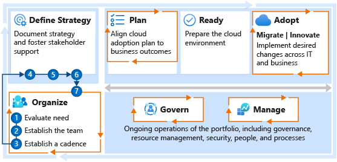

# Get started: Build a cloud strategy team

To be successful, every cloud adoption journey needs to involve some level of strategic planning. This getting started guide is designed to help you establish a dedicated team or virtual team that can build and deliver on a solid cloud strategy.

The first step in the journey is to decide whether you need a strategy team, or whether your existing team members can deliver on cloud strategy as a distributed responsibility.

Whichever approach you choose, you'll want to create a cloud strategy team that defines motivations and business outcomes, and that validates and maintains alignment between business priorities and cloud adoption efforts. When the business outcomes affect business functions, the strategy team should include business leaders from across the organization. The goal of the cloud strategy team is to produce tangible business results that are enabled by cloud technologies. Overall, this team ensures that cloud adoption efforts progress in alignment with business outcomes. Whenever possible, business outcomes and the cloud strategy team's efforts should both be defined early in the process.

> [!NOTE]
> This article discusses a *strategy facilitator*, a key player in the cloud-adoption process. The role is commonly held by a program manager, architect, or consultant. As the cloud strategy team forms and gets started, the strategy facilitator is temporarily accountable for creating alignment and keeping the team aligned with business goals. The strategy facilitator is often the person most accountable for the success of the cloud adoption journey.

## Step 1: Determine whether a cloud strategy team is needed

A cloud strategy team delivers on a required capability in the cloud, referred to as the cloud strategy capability. Forming a cloud strategy team requires a defined group of dedicated business leaders, stakeholders, and program managers to meet on a regular, recurring basis to advance the strategy that drives cloud adoption.

**Deliverables:**

- Determine whether your business requires a cloud strategy team.

**Guidance to support deliverable completion:**

Creating a cloud strategy team is often necessary for the following reasons:

| Reason | Considerations |
|---|---|
| **Cloud adoption is important to the business.** | <li> The cloud adoption effort has board-level visibility. <li> Success of the cloud adoption effort will improve market positioning, customer retention, or revenue. <li> The programs in the adoption portfolio map directly to strategic business outcomes. <li> The portfolio of workloads in this adoption effort is strategic and mission-critical and could affect multiple business units. |
| **Cloud adoption requires ongoing executive support.** | <li> The cloud adoption effort will affect how you manage organizational change. <li> The effort will require additional training from multiple business users and could interrupt certain business functions. <li> The existing IT operations team or vendor is motivated to remain in an existing datacenter. <li> The existing IT team hasn't fully bought into the effort. |
| **Cloud adoption presents risk to the business.** | <li> Failure to complete the migration within the specified time window will result in negative market impact or increased hosting costs. <li> Workloads slated for adoption need to be protected from data leakage that could affect business success or customer security. <li> Metrics that are being used to measure the cloud effort are business aligned, creating a dependency and risk on the technical success. |

If any or all of the preceding reasons represent your existing business considerations, the information in the rest of this article will help you establish your cloud strategy team.

**Accountable person or team:**

- The strategy facilitator is accountable for determining whether a cloud strategy team is needed.

## What if I don't need a cloud strategy team?

Review the [cloud strategy functions](../../organize/cloud-strategy.md) that are required to deliver on cloud strategy needs. Not every organization requires a dedicated team or virtual team to help meet its strategic needs. In your [RACI (responsible, accountable, consulted, and informed) template](https://raw.githubusercontent.com/microsoft/CloudAdoptionFramework/master/organize/raci-template.xlsx), list the core accountabilities of the strategy, and identify the person on your team who will be accountable for each. If one person will take on all of those accountabilities, simple replace "cloud strategy" with that person's name in the RACI template.

## Step 2: Establish the cloud strategy team

The cloud strategy team serves as a recurring alignment point between business leaders and IT leaders. Based on the levels of importance, risk, and executive support that drive the need for a strategy team, participation in and the composition of the team might vary.

**Deliverables:**

- Identify the appropriate organizations or individuals who are willing to share in the accountability and responsibility for driving the cloud adoption strategy.

**Guidance to support deliverable completion:**

- Document and share your reasoning from step 1 to identify stakeholders who will benefit from regular involvement and will be able to help drive the strategy.
- For ideas about who might be a good fit, see [Cloud strategy functions](../../organize/cloud-strategy.md).
- To validate the alignment and bandwidth from each potential participant, review the [minimum scope](../../organize/cloud-strategy.md#minimum-scope) and [deliverable](../../organize/cloud-strategy.md#deliverable) for this capability.
- To establish the right RACI chart based on you current team structures, review the various [RACI configuration examples](../../organize/raci-alignment.md#strategic-alignment), or select one of the example tabs at the bottom of the RACI template.
- Document the results in the [RACI template](https://raw.githubusercontent.com/microsoft/CloudAdoptionFramework/master/organize/raci-template.xlsx) in the `Org Alignment` worksheet.

**Accountable person or team:**

- The strategy facilitator is accountable for establishing the cloud strategy team.

## Step 3: Establish a cadence

Early in the cloud adoption journey, your team will require frequent interaction and iterative strategy reviews. As adoption starts, that frequency will lessen, transitioning to a focus on status and validation or adjustment of the backlog priorities.

Steps 4, 5, and 6 should be completed within four to six weeks. The remaining steps will be completed in subsequent meetings. More frequent meetings should be maintained until the team begins step 7.

**Deliverables:**

Review suggested meeting cadences and schedule meetings with all strategy team participants.

**Guidance to support deliverable completion:**

- Review the suggested short-term and long-term [meeting cadences](../../organize/cloud-strategy.md#deliverable) to align each of the documented participants.

**Accountable person or team:**

- The strategy facilitator is accountable for establishing an appropriate cadence for the cloud strategy team.

## Step 4: Establish a motivation-driven strategy

Cloud adoption journeys include approaches to both migration and innovation. When technical teams define the strategy, it's common for the strategy to be driven by the team members' current skills and strengths. Such a strategy is likely to be a technical success, but it risks producing limited business impact.

The first objective of the cloud strategy team is to define a high-level strategy that's based on business motivations. This can usually be completed in a one-hour workshop with all of the cloud strategy team members. It also requires a minimum of one additional hour to review the business motivations with various technical teams and affected stakeholders.

During the first workshop, each member of the team should prioritize its motivations in the [understand motivations](../../strategy/motivations.md) article and share its top priorities. The strategy facilitator helps guide one or more rounds of conversation until a theme emerges in the direction of migration or innovation. There will likely be motivations in the top 3 list from both categories, which might require the team to go deeper on its list before a clear pattern leans one way or another.

This exercise will surface conversations that can help build alignment among the team members. The deliverable will help guide the rest of the strategy and the resulting plan.

**Deliverables:**

- Record motivations in the [strategy and plan template](https://raw.githubusercontent.com/microsoft/CloudAdoptionFramework/master/plan/cloud-adoption-framework-strategy-and-plan-template.docx).

**Guidance to support deliverable completion:**

- [Understand motivations](../../strategy/motivations.md): Critical business events and some migration motivations tend to be cost sensitive, which increases the importance of cost control for all subsequent efforts. Other forward-looking motivations that are related to innovation or growth through migration might be focused more on top-line revenue. Understanding motivations helps team members decide how high to prioritize your cost management.

 

| Accountable team | Responsible and supporting teams |
| --- | --- |
| <li> Cloud strategy team | <li> Cloud governance team <li> Cloud adoption team <li> Cloud center of excellence or central IT team |

## Step 5: Establish business outcomes

Each member of the cloud strategy team is asked to define one or more business outcomes by applying specific metrics to measure business success. If a certain metric can be improved as a direct result of the cloud adoption effort, a team member is asked to share the expected impact. If the cloud adoption effort doesn't affect the metric but will enable the business to better drive the metric, that too should be documented.

Many leaders on the cloud strategy team might need to decompose their core metrics to identify an outcome that can be affected or influenced by the cloud adoption effort. If the team members' outcomes can't be affected or influenced by this journey, it might be hard for them to maintain their level of interest in the program. The facilitator should work with each leader to develop an aligned metric and reevaluate whether that team member is the right person to participate on the strategy team.

Impacts on business outcomes can take time. These types of changes typically move slower than technical changes. To maintain transparency, the strategy team should agree on shorter-term learning metrics. These metrics might include technical and other changes that can be reviewed at each team meeting to demonstrate progress toward technical goals and business outcomes.

**Deliverables:**

- Identify at least one expected business outcome per member of the cloud strategy team.
- Refine the list of members to align expected time commitments with expected outcomes.
- Align on a set of short-term and mid-term metrics to support ongoing progress reports.

**Guidance to support deliverable completion:**

- Record business outcomes in the [strategy and plan template](https://raw.githubusercontent.com/microsoft/CloudAdoptionFramework/master/plan/cloud-adoption-framework-strategy-and-plan-template.docx).
- [Business outcomes](../../strategy/business-outcomes/index.md): Some fiscal outcomes tend to be extremely cost sensitive. When the desired outcomes map to fiscal metrics, it can be wise to invest very early in the Cost Management governance discipline.
- [Learning metrics](../../strategy/learning-metrics.md) help bridge the gap between business outcomes and technical adoption efforts.

**Accountable team:**

The cloud strategy team is accountable for defining business outcomes. The team can use specific metrics to measure the success of the business outcomes.

## Step 6: Decide whether to proceed or cancel based on the business justification

Your business justification can help with planning, long-term return expectations, and expectations about total cost of ownership (TCO). In this step, the cloud strategy team should agree on the minimum amount of analysis required to help the strategy team align on a go-forward decision. Strategic alignment might require deep planning and TCO analysis. Most cloud strategy teams will find a simple cost analysis sufficient to align on direction.

Each member of the strategy team should review common myths and approaches to business justification. This can help the team communicate the specific analysis that's expected from the supporting teams. After the team communicates its expectations, it can reduce its time investment and meeting frequency. The team will maintain accountability for completing the strategy until the business justification and digital estate analysis have been agreed upon.

**Deliverables:**

- Kick off the business justification effort with your supporting teams.
- Meet with the supporting teams monthly (or as needed) until the strategy team can align on a go/no go decision to proceed with cloud adoption.

**Guidance to support deliverable completion:**

- The [business justification](../../strategy/cloud-migration-business-case.md) serves as a high-level view of the overall financial plan for cloud adoption. This can be a good source for initial budgeting efforts.

 

| Accountable team | Responsible and supporting teams |
| --- | --- |
| <li> Cloud strategy team | <li> Cloud governance team <li> Cloud adoption team <li> Cloud center of excellence or central IT team |

## Step 7: Support adoption through a regular cadence

After a go-forward decision has been agreed upon with the cloud strategy team, the team can transition into a less intense and less frequent meeting cadence. The expectations of the team also shift at this point. After the journey moves from strategic definition to adoption efforts (plan, ready, adopt), the strategy team is expected to focus on prioritization and strategic support.

**Deliverables:**

- **Prioritization:** When the existing digital estate is rationalized, the strategy team helps establish waves of migration or innovation priorities. This helps the technical implementation teams focus on actions that drive the greatest business value.
- **Evaluate risks:** As cloud adoption grows, new forms of adoption expose new risks. The strategy team is responsible for helping evaluate those new risks. The expectation of the strategy team is to evaluate new risks and determine whether the business can tolerate the risks or it needs policies that eliminate or mitigate them.
- **Review budget and spend:** As cloud adoption increases, so will budgets for various workloads in the portfolio. On a monthly basis, the cloud strategy team should review actual spend against budget to identify issues that need to be resolved. Detecting and addressing budgetary changes early will help prevent sticker shock later in the adoption lifecycle.
- **Business planning:** When the adoption teams complete their migration or innovation efforts, additional business planning will be required to maximize return from the new technology solutions. Such planning might include user training, business process modifications, or other post-adoption activities.
- **Executive support:** Cloud adoption will result in organizational change. This is most visible within the IT organization. At times, various teams or team members might need additional support from the strategy team to understand the changes, develop new skills, and understand how to best operate within the new models.

**Guidance to support deliverable completion:**

- [Incremental rationalization](../../digital-estate/rationalize.md): Consider an agile approach to rationalization that properly aligns late-bound technical decisions.
- The [five Rs of rationalization](../../digital-estate/5-rs-of-rationalization.md): Understand the various rationalization options.

 

| Accountable team | Responsible and supporting teams |
| --- | --- |
| <li> Cloud strategy team | <li> Cloud governance team <li> Cloud adoption team <li> Cloud center of excellence or central IT team |

## What's next

Strategy and planning are important. Nothing is actionable until you identify the cloud adoption functions that are needed on your team. It's important to understand these key capabilities before you begin your adoption efforts.

Align your strategy with the [cloud adoption functions](../../organize/cloud-adoption.md) by working with the adoption team or individuals who are responsible for these functions.

Learn to align responsibilities across teams by developing a cross-team matrix that identifies RACI parties. Download and modify the [RACI template](https://raw.githubusercontent.com/microsoft/CloudAdoptionFramework/master/organize/raci-template.xlsx).
