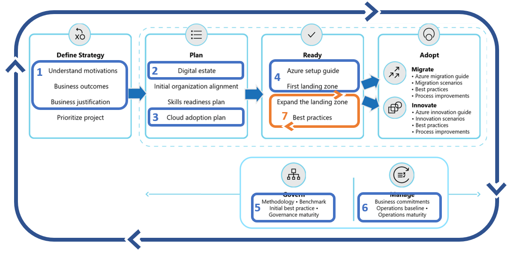

# Getting started: Design and configuration

Environmental design and configuration are the most common blockers to migration or innovation focused adoption efforts. Quickly implementing a design which supports your long term adoption plan can be very difficult. This article establishes an approach and series of steps to help overcome this common blocker & accelerate all of your adoption efforts.

## Get started

The technical effort required to create an effective environmental design and configuration can be complex, but the scope can be managed to improve the odds of success for the cloud platform team. The greatest challenge is alignment amongst multiple stakeholders, some of whom have the authority to stop or slow the adoption efforts. This checklist will outline ways to quickly meet short-term objectives and long-term success.

## Step 1: Document the business strategy

To avoid common migration blockers, ensure a clear and concise business strategy has been documented. Stakeholder alignment on motivations, expected business outcomes, and the business justification will be important throughout adoption and environment configuration.

The business strategy will help the cloud platform team understand what is important & what should be prioritized when making environmental configuration decisions. In particular, it will help them make decisions when forced to choose between speed of innovation or adherence to controls.

Involved teams

- Accountable team: [Cloud Strategy Team](../organize/cloud-strategy.md)
- Responsible/Supporting teams: [Cloud Adoption Team](../organize/cloud-adoption.md) and [Cloud center of excellence](../organize/cloud-center-of-excellence.md)/[Central IT](../organize/central-it.md)
- Informed: [Cloud Platform Team](../organize/cloud-platform.md)

Deliverable

- Use the [Strategy and Planning Template](https://archcenter.blob.core.windows.net/cdn/fusion/readiness/Microsoft-Cloud-Adoption-Framework-Strategy-and-Plan-Template.docx) to record motivations, desired business outcomes, and high-level business justification.

Guidance to support deliverable completion

- [Motivations](../strategy/motivations.md): The first step to strategic alignment is to gain consensus on the motivations driving the migration effort. Start by understanding and categorizing motivations and common themes from various stakeholders across business and IT.
- [Business Outcomes](../strategy/business-outcomes/index.md): Once motivations are aligned, it's possible to capture the desired business outcomes. This provides clear metrics by which the overall transformation can be measured.
- [Building a cloud migration business case](../strategy/cloud-migration-business-case.md) is a good starting point for developing a migration business case, with clarity on formulas and tools that can aid in business justification.

## Step 2: Assess the digital estate

Discovery and assessment provide a deeper level of technical alignment to create an actionable plan to deliver on the strategy. During this step, the business case is validated using data about the current state environment, quantitative analysis of that data, and a deep qualitative assessment of the highest priority workloads.

The output of the digital estate effort will provide the cloud platform team a clear view of the end-state environment and the requirements needed to support the adoption plan.

Involved teams

- Accountable team: [Cloud Adoption Team](../organize/cloud-adoption.md)
- Responsible/Supporting teams: [Cloud Strategy Team](../organize/cloud-strategy.md)
- Informed: [Cloud Platform Team](../organize/cloud-platform.md)

Deliverable

- Raw data on existing inventory
- Quantitative analysis on existing inventory to refine the business justification
- Qualitative analysis of the first 10 workloads
- Update business justification in the [Strategy and Planning Template](https://archcenter.blob.core.windows.net/cdn/fusion/readiness/Microsoft-Cloud-Adoption-Framework-Strategy-and-Plan-Template.docx).

Guidance to support deliverable completion

- [Inventory existing systems](../digital-estate/inventory.md): Understanding the current state from a programmatic, data-driven approach is the first step. Discover and gather data to enable all assessment activities.
- [Incremental rationalization](../digital-estate/rationalize.md#incremental-rationalization): Streamline assessment efforts to focus on a qualitative analysis of all assets (possibly even to support the business case). Then add a deep qualitative analysis for the first 10 workloads to be migrated.

## Step 3: Create a cloud adoption plan

The cloud adoption plan template provides an accelerated approach to developing a project backlog. The backlog can then be modified to reflect discovery results, rationalization, skilling, and partner contracting.

A review of the short-term cloud adoption plan and backlog will help the cloud platform team understand the needs of the environment for the next few months. This will allow them to tighten the "definition of done" for the first few landing zones.

Involved teams

- Accountable team: [Cloud Adoption Team](../organize/cloud-adoption.md)
- Responsible/Supporting teams: [Cloud Strategy Team](../organize/cloud-strategy.md)
- Informed: [Cloud Platform Team](../organize/cloud-platform.md)

Deliverable

- Deploy the backlog template
- Update the template to reflect first 10 workloads to be migrated
- Update people and velocity to estimate release timing
- Timeline risk: Familiarity with Azure DevOps can slow the deployment process. Complexity and data available for each workload can also impact timelines.

Guidance to support deliverable completion

- [Cloud adoption plan template](../plan/template.md): Deploy the basic template
- [Workload alignment](../plan/workloads.md): Define workloads in the backlog
- [Effort alignment](../plan/assets.md): Align assets and workloads in the backlog to clearly define effort for prioritized workloads
- [People & time alignment](../plan/iteration-paths.md): Establish iteration, velocity (people's time), and releases for the migrated workloads

## Step 4: Deploy the first landing zone

Initially, the cloud adoption team will need a landing zone that can support the requirements of the initial wave of workloads. Over time, the landing zone will scale to address more complex workloads. For now, start with an initial landing zone to enable early learning for the cloud platform team and the cloud adoption team.

Involved teams

- Accountable team: [Cloud Platform Team](../organize/cloud-platform.md)
- Responsible/Supporting teams: [Cloud Adoption Team](../organize/cloud-adoption.md) and [Cloud center of excellence](../organize/cloud-center-of-excellence.md)/[Central IT](../organize/central-it.md)

Deliverable

- Deploy a first landing zone for initial, low-risk migrations
- Develop a plan to refactor with the CCoE or Central IT
- Timeline risk: Governance, operations, and security requirements for the first 10 workloads can significantly slow this process. Actual refactoring of the first landing zone and subsequent landing zones will take considerably longer, but should happen in parallel to migration efforts.

Guidance to support deliverable completion

- [Choose a landing zone](../ready/landing-zone/first-landing-zone.md): Use this article to find the right approach to deploying a landing zone based on your short-term adoption plan. Then deploy that standardized code base.
- [Expand your landing zone](../ready/considerations/index.md): Do not attempt to meet long term governance, security, or operation constraints yet, unless they are required to support the short-term adoption plan.

## Step 5: Deploy an initial governance foundation

Governance is a key factor to the long-term success of any migration effort. Speed to migration and business impact is important. But speed without governance can be dangerous. Your organization will need to make decisions about governance, which align to your adoption patterns, and governance and compliance needs.

As those decisions are made, they will feed back into the parallel efforts of the cloud platform team.

Involved teams

- Accountable team: [Cloud Governance Team](../organize/cloud-governance.md)
- Responsible/Supporting teams: [Cloud Strategy Team](../organize/cloud-strategy.md) and [Cloud center of excellence](../organize/cloud-center-of-excellence.md)/[Central IT](../organize/central-it.md)
- Consulted: [Cloud Platform Team](../organize/cloud-platform.md)

Deliverable

- Deploy an initial governance foundation
- Complete a governance benchmark to plan for future improvements
- Timeline risks: Improve policies and governance implementation can add 1-4 weeks per discipline

Guidance to support deliverable completion

- [Governance approach](../govern/index.md): This methodology outlines a process for thinking about corporate policy and processes. Then building the disciplines required to deliver on governance across your cloud enterprise adoption efforts.
- [Initial governance foundation](../govern/guides/complex/prescriptive-guidance.md): Understand the Identity Baseline, Security Baseline, and Deployment Acceleration that are required to create a governance MVP, which will serve as the foundation for all adoption.

## Step 6: Implement an operations baseline

Operations Management is another requirement to reach migration success. Migrating to the cloud without an understanding of ongoing operations is a risky decision. In parallel to migration, it is suggested that you start planning for longer-term operations.

As those plans are made, they will feed back into the parallel efforts of the cloud platform team.

Involved teams

- Accountable team: [Cloud Operations Team](../organize/cloud-operations.md)
- Responsible/Supporting teams: [Cloud Strategy Team](../organize/cloud-strategy.md) and [Cloud center of excellence](../organize/cloud-center-of-excellence.md)/[Central IT](../organize/central-it.md)
- Consulted: [Cloud Platform Team](../organize/cloud-platform.md)

Deliverable

- Deploy a management baseline.
- Complete the Ops Management Workbook.
- Identify any workloads that will require an Azure Architecture Review assessment.
- Timeline risks:
  - Review the workbook: One hour per application owner
  - Complete the Azure Architecture Review assessment: One hour per application

Guidance to support deliverable completion

- [Management Baseline](../manage/index.md):
- [Define business commitments](../manage/considerations/business-alignment.md):
- [Expand the management baseline](../manage/best-practices.md):
- [Get specific with advanced operations](../manage/design-principles.md):

## Step 7: Expand the landing zone

As the cloud adoption team begins their first few migrations, the cloud platform team can begin building towards the end-state environment configuration with the support of the cloud governance and cloud operations teams. Depending on the pace of the cloud adoption plan, this will likely need to happen in iterative releases, adding functionality ahead of the requirements of the adoption plan.

Involved teams

- Accountable team: [Cloud Platform Team](../organize/cloud-platform.md)
- Responsible/Supporting teams: [Cloud Adoption Team](../organize/cloud-adoption.md) and [Cloud center of excellence](../organize/cloud-center-of-excellence.md)/[Central IT](../organize/central-it.md)

Deliverable

- Adopt a test-driven development approach to refactoring landing zones
- Improve landing zone governance
- Expand landing zone operations
- Implement landing zone security

Guidance to support deliverable completion

- [Refactoring landing zones](../ready/landing-zone/refactor.md)
- [Test-driven development of landing zones](../ready/considerations/test-driven-development.md)
- [Expand landing zone governance](../ready/considerations/landing-zone-governance.md)
- [Expand landing zone operations](../ready/considerations/landing-zone-operations.md)
- [Expand landing zone security](../ready/considerations/landing-zone-security.md)

## Value statement

The steps outlined in this getting started guide can help you and your teams accelerate their path to an enterprise ready cloud environment with proper configuration.

## Next Steps

Things you might want to do in a future iteration to build on this getting started

- [Environmental technical readiness learning paths](../ready/suggested-skills.md)
- [Migration environment planning checklist](../migrate/migration-considerations/prerequisites/planning-checklist.md)
