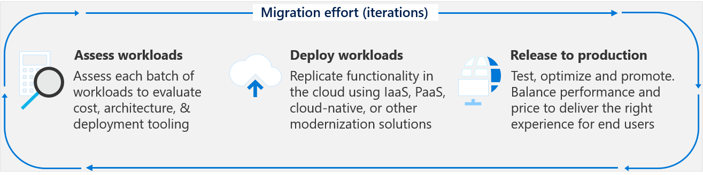

# Getting started: Accelerate migration

Proper alignment of business and IT stakeholders can help your organization overcome migration roadblocks and accelerate migration efforts. This article provides recommended steps for stakeholder alignment, migration planning, deploying a landing zone, and migrating the first 10 workloads. It can also help you with long-term success provided by proper governance and management.

Use this guide to reduce the amount of materials and the processes required to align an overall migration effort. This process utilizes the sections of the Cloud Adoption Framework that are highlighted in the following illustration.

If your migration scenario is atypical, you can get a personalized assessment of your organizations migration readiness, by using the Strategic Migration and Readiness Tool or [SMART Assessment](/assessments/?id=Strategic-Migration-Assessment) to identify the guidance that best aligns to your current needs.

## Get started

The technical effort and process required to migrate workloads is relatively straight forward. Efficient completion of the migration process is important. But, strategic migration readiness will have an even bigger impact on the timelines and successful completion of the overall migration.

Accelerating adoption means addressing the steps required to support the cloud adoption team during migration. This guide outlines these iterative tasks in a linear checklist format to help customers start on the right path towards any cloud migration. To illustrate the importance of the supporting steps, migration is listed as step 10 in this article. In reality, the cloud adoption team will likely begin their first pilot migration in parallel to steps 4 or 5.

## Step 1: Document the business strategy

To avoid common migration blockers, create a clear and concise business strategy for migration. Stakeholder alignment on motivations and expected business outcomes will shape decisions made by the cloud adoption team.

- [Motivations](../strategy/motivations.md): The first step to strategic alignment is to gain consensus on the motivations driving the migration effort. Start by understanding and categorizing motivations and common themes from various stakeholders across business and IT.
- [Business Outcomes](../strategy/business-outcomes/index.md): Once motivations are aligned, it's possible to capture the desired business outcomes. This provides clear metrics by which the overall transformation can be measured.

Deliverable

- Use the [Strategy and Planning Template](https://archcenter.blob.core.windows.net/cdn/fusion/readiness/Microsoft-Cloud-Adoption-Framework-Strategy-and-Plan-Template.docx) to record motivations and desired business outcomes.

Involved teams

- Accountable team: [Cloud Strategy Team](../organize/cloud-strategy.md)
- Responsible/Supporting teams: [Cloud Adoption Team](../organize/cloud-adoption.md) and [Cloud center of excellence](../organize/cloud-center-of-excellence.md)/[Central IT](../organize/central-it.md)

## Step 2: Make a business case

Making the business case for migration will likely be an iterative conversation amongst stakeholders. In this first pass at building the business case, evaluate the initial, high-level return from a potential cloud migration. The goal of this step is to ensure that all stakeholders align around one simple question, "Based on the available date, is the overall adoption of the cloud a wise business decision?".

- [Building a cloud migration business case](../strategy/cloud-migration-business-case.md) is a good starting point for developing a migration business case, with clarity on formulas and tools that can aid in business justification.

Deliverable

- Use the [Strategy and Planning Template](https://archcenter.blob.core.windows.net/cdn/fusion/readiness/Microsoft-Cloud-Adoption-Framework-Strategy-and-Plan-Template.docx) to record business justification.

Involved teams

- Accountable team: [Cloud Strategy Team](../organize/cloud-strategy.md)
- Responsible/Supporting teams: [Cloud Adoption Team](../organize/cloud-adoption.md)

## Step 3: Get partner support

Partners, Microsoft services, or various Microsoft programs are available to support you throughout the migration process.

- [Understand Partnership options](../migrate/migration-considerations/assess/partnership-options.md) and find the best way to find the right level of partnership and support.

Deliverable

- Establish terms and conditions, or other contractual agreements before engaging a supporting partner.
- Identify approved partners in the [Strategy and Planning Template](https://archcenter.blob.core.windows.net/cdn/fusion/readiness/Microsoft-Cloud-Adoption-Framework-Strategy-and-Plan-Template.docx).

Involved teams

- Accountable team: [Cloud Strategy Team](../organize/cloud-strategy.md)
- Responsible/Supporting teams: [Cloud Adoption Team](../organize/cloud-adoption.md) and [Cloud center of excellence](../organize/cloud-center-of-excellence.md)/[Central IT](../organize/central-it.md)

## Step 4: Gather data and analyze assets and workloads

Discovery and assessment provide a deeper level of technical alignment to create an actionable plan to deliver on the strategy. During this step, the business case is validated using data about the current state environment, quantitative analysis of that data, and a deep qualitative assessment of the highest priority workloads.

- [Inventory existing systems](../digital-estate/inventory.md): Understanding the current state from a programmatic, data-driven approach is the first step. Discover and gather data to enable all assessment activities.
- [Incremental rationalization](../digital-estate/rationalize.md#incremental-rationalization): Streamline assessment efforts to focus on a qualitative analysis of all assets (possibly even to support the business case). Then add a deep qualitative analysis for the first 10 workloads to be migrated.

Deliverable

- Raw data on existing inventory
- Quantitative analysis on existing inventory to refine the business justification
- Qualitative analysis of the first 10 workloads
- Update business justification in the [Strategy and Planning Template](https://archcenter.blob.core.windows.net/cdn/fusion/readiness/Microsoft-Cloud-Adoption-Framework-Strategy-and-Plan-Template.docx).

Involved teams

- Accountable team: [Cloud Adoption Team](../organize/cloud-adoption.md)
- Responsible/Supporting teams: [Cloud Strategy Team](../organize/cloud-strategy.md)

## Step 5: Build a skills readiness plan

Existing employees can play a hands-on role in the migration effort. However, additional skills might be required. In this step, the team will self-assess to identify opportunities to develop those skills or leverage partners to augment those skills.

- Plan: [Build a skills readiness plan](../plan/adapt-roles-skills-processes.md): Do a quick evaluation of the required skills and the existing skills to better understand what skilling requirements need to be addressed.

Deliverable

- Add skills readiness plan to the [Strategy and Planning Template](https://archcenter.blob.core.windows.net/cdn/fusion/readiness/Microsoft-Cloud-Adoption-Framework-Strategy-and-Plan-Template.docx)

Involved teams

- Accountable team: [Cloud Adoption Team](../organize/cloud-adoption.md)
- Responsible/Supporting teams: [Cloud Strategy Team](../organize/cloud-strategy.md)

## Step 6: Create a migration plan

The cloud adoption plan template provides an accelerated approach to developing a project backlog. The backlog can then be modified to reflect discovery results, rationalization, skilling, and partner contracting.

- [Cloud adoption plan template](../plan/template.md): Deploy the basic template
- [Workload alignment](../plan/workloads.md): Define workloads in the backlog
- [Effort alignment](../plan/assets.md): Align assets and workloads in the backlog to clearly define effort for prioritized workloads
- [People & time alignment](../plan/iteration-paths.md): Establish iteration, velocity (people's time), and releases for the migrated workloads

Deliverable

- Deploy the backlog template
- Update the template to reflect first 10 workloads to be migrated
- Update people and velocity to estimate release timing
- Timeline risk: Familiarity with Azure DevOps can slow the deployment process. Complexity and data available for each workload can also impact timelines.

Involved teams

- Accountable team: [Cloud Adoption Team](../organize/cloud-adoption.md)
- Responsible/Supporting teams: [Cloud Strategy Team](../organize/cloud-strategy.md)

## Step 7: Deploy and align a landing zone

All migrated assets are deployed within a landing zone. Initially, the landing zone will be simplistic to support smaller workloads. Over time, it will scale to address more complex workloads.

- [Choose a landing zone](../ready/landing-zone/first-landing-zone.md): Use this article to find the right approach to deploying a landing zone based on your adoption pattern. Then deploy that standardized code base.
- [Expand your landing zone](../ready/considerations/index.md): Regardless of the starting point, identify gaps in the deployed landing zone to add required components for resource organization, security, governance, compliance, operations, and so on.

Deliverable

- Deploy a first landing zone for initial, low-risk migrations
- Develop a plan to refactor with the CCoE or Central IT
- Timeline risk: Governance, operations, and security requirements for the first 10 workloads can significantly slow this process. Actual refactoring of the first landing zone and subsequent landing zones will take considerably longer, but should happen in parallel to migration efforts.

Involved teams

- Accountable team: [Cloud Platform Team](../organize/cloud-platform.md)
- Responsible/Supporting teams: [Cloud Adoption Team](../organize/cloud-adoption.md) and [Cloud center of excellence](../organize/cloud-center-of-excellence.md)/[Central IT](../organize/central-it.md)

## Step 8: Deploy an initial governance foundation

Governance is a key factor to the long-term success of any migration effort. Speed to migration and business impact is important. But speed without governance can be dangerous. Your organization will need to make decisions about governance, which align to your adoption patterns, and governance and compliance needs.

- [Governance approach](../govern/index.md): This methodology outlines a process for thinking about corporate policy and processes. Then building the disciplines required to deliver on governance across your cloud enterprise adoption efforts.
- [Initial governance foundation](../govern/guides/complex/prescriptive-guidance.md): Understand the Identity Baseline, Security Baseline, and Deployment Acceleration that are required to create a governance MVP, which will serve as the foundation for all adoption.

Deliverable

- Deploy an initial governance foundation
- Complete a governance benchmark to plan for future improvements
- Timeline risks: Improve policies and governance implementation can add 1-4 weeks per discipline

Involved teams

- Accountable team: [Cloud Governance Team](../organize/cloud-governance.md)
- Responsible/Supporting teams: [Cloud Strategy Team](../organize/cloud-strategy.md) and [Cloud center of excellence](../organize/cloud-center-of-excellence.md)/[Central IT](../organize/central-it.md)

## Step 9: Implement an operations baseline

Operations Management is another requirement to reach migration success. Migrating to the cloud without an understanding of ongoing operations is a risky decision. In parallel to migration, it is suggested that you start planning for longer-term operations.

- [Management Baseline](../manage/index.md):
- [Define business commitments](../manage/considerations/business-alignment.md):
- [Expand the management baseline](../manage/best-practices.md):
- [Get specific with advanced operations](../manage/design-principles.md):

Deliverable

- Deploy a management baseline.
- Complete the Ops Management Workbook.
- Identify any workloads that will require an Azure Architecture Review assessment.
- Timeline risks:
  - Review the workbook: One hour per application owner
  - Complete the Azure Architecture Review assessment: One hour per application

Involved teams

- Accountable team: [Cloud Operations Team](../organize/cloud-operations.md)
- Responsible/Supporting teams: [Cloud Strategy Team](../organize/cloud-strategy.md) and [Cloud center of excellence](../organize/cloud-center-of-excellence.md)/[Central IT](../organize/central-it.md)

## Step 10: Migrate your first 10 workloads

The technical effort required to migrate your first 10 workloads is relatively straight forward. It is also an iterative process that you will repeat as you migrate more assets. The process involves assessing your workloads (see **Step 4**), deploying your workloads, and then releasing them to your production environment.

Cloud migration tools make it possible to migrate all VMs in a data center in one pass (or iteration). However, it's more common to migrate a smaller number of workloads during each iteration. Breaking up the migration into smaller waves or releases requires more planning but reduces technical risks and the impact of organizational change management.

With each iteration, the cloud adoption team will get better at migrating workloads. The following steps will start the technical team on this maturity curve:

1. Migrate your **first workloads** in a pure IaaS approach using the tools outlined in the [Azure Migration guide](../migrate/azure-migration-guide/index.md).
2. Expand tooling options to **leverage migration and modernization** using the [Migration Scenarios](../migrate/azure-best-practices/contoso-migration-overview.md).
3. Develop your **technical strategy** using broader approaches outlined in the [Best Practices](../migrate/azure-best-practices/index.md).
4. Improve consistency, reliability, and performance through an efficient **migration factory** approach as outlined in the [Process Improvements](../migrate/migration-considerations/index.md).

Deliverable

Continuous improvement of the adoption team's ability to migrate workloads

Involved teams

- Accountable team: [Cloud Adoption Team](../organize/cloud-adoption.md)
- Responsible/Supporting teams: [Cloud Strategy Team](../organize/cloud-strategy.md) and [Cloud center of excellence](../organize/cloud-center-of-excellence.md)/[Central IT](../organize/central-it.md)

## Value statement

The steps outlined in this guide can help your teams accelerate their migration efforts through better change management and stakeholder alignment. Following these steps might slow the process, but these steps will remove common blockers and accelerate the realization of business value.

## Next steps

The Cloud Adoption Framework is a lifecycle solution. It can help you begin a migration journey, but can also help you advance the maturity of the teams that support the migration efforts. The following teams can use these next steps to continue to advance the maturity of their efforts. These parallel processes are not linear and shouldn't be viewed as blockers. Instead, each is a parallel value stream to help mature your company's overall cloud readiness.

|Team  |Next Iteration|
|---------|---------|
|Cloud&nbsp;Adoption&nbsp;Team|[Process improvements](../migrate/migration-considerations/index.md) provides insight about moving towards a migration factory with efficient ongoing migration capabilities.|
|Cloud&nbsp;Strategy&nbsp;Team|[Strategy](../strategy/index.md) and [Plan](../plan/index.md) are iterative processes that evolve with the adoption plan. Return to these overview pages and continue to iterate on your business and technical strategies.|
|Cloud&nbsp;Platform&nbsp;Team|Revisit the [Ready](../ready/index.md) methodology to continue to advance the overall cloud platform that supports migration or other adoption efforts.|
|Cloud&nbsp;Governance&nbsp;Team|Leverage the [Govern](../govern/index.md) methodology to continue to improve governance processes, policies, and disciplines.|
|Cloud&nbsp;Operations&nbsp;Team|Build on the [Manage](../manage/index.md) methodology to provide richer operations in Azure|

If your migration scenario is atypical, you can get a personalized assessment of your organization's migration readiness, by using the [Strategic Migration and Readiness Tool (SMART) Assessment](https://docs.microsoft.com/assessments/?id=Strategic-Migration-Assessment). Based on the answers you provide while taking the assessment, we can help you identify the guidance that best aligns to your current needs.