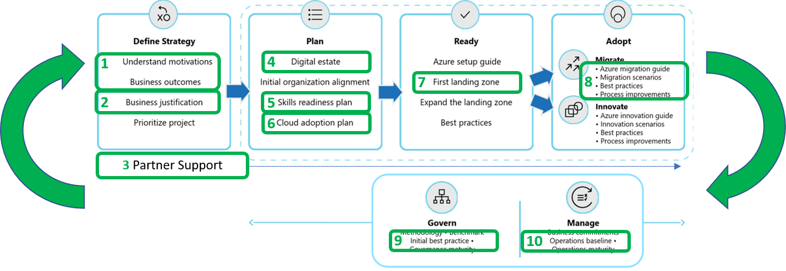

# Getting started: An accelerated migration journey in Azure

Migration to the cloud is a change management effort, which is cleverly disguised as a simple technology process. When getting started with any migration, it is important to align business strategy, portfolio planning, change management, cloud governance, and of course the actual migration effort. Each of those important alignment efforts is covered by a different methodology & is generally executed by various different teams throughout a customer's migration journey.

Accelerating alignment between various stakeholders and various aspects of migration can be overwhelming and complex. This getting started guide represents the smallest unit of effort required to accelerate migration success. Use this guide as a checklist to evaluate where you are at in your first migration & to find some steps that you may have missed. At the end of this article are a few suggested process improvements you may want to consider after you've mastered your first migration to Azure.

## Accelerating migration

The cloud adoption framework is an iterative guide providing holistic support throughout your cloud adoption journey. Within the overall framework are a series of actionable steps that can help accelerate migration efforts, outlined in the remainder of this article.

## Actionable steps checklist

The following steps reduce the amount of materials and the processes required during initial efforts to align an overall migration effort. This list serves as a checklist, asking a minimum set of questions required to ensure you are ready for migration.

For a deeper assessment of migration readiness, use the Strategic Migration and Readiness Tool or [SMART Assessment](/assessments/?id=Strategic-Migration-Assessment-and-Readiness-Tool).

1. **Business strategy:** Are all stakeholders aligned on the motivations and business outcomes expected?
2. **Business case:** Are all stakeholders aligned on the overall business justification?
3. **Partner support:** Are partners and other support models properly aligned for success of the migration effort?
4. **Discovery & assessment:** Has the team completed a discovery of existing inventory? Has an initial rationalization/assessment been completed?
5. **Technical skilling:** Does the team have a skills plan in place?
6. **Migration plan:** Is there a defined plan for the migration of the next 10 workloads & related assets, including clarity on people allocations?
7. **Landing zone:** Does the deployed landing zone align with the needs of the adoption plan?
8. **Migration execution:** Is the adoption team prepared to execute the technical migration effort?
9. **Governance:** Is the governance team aligned with the approach to governing the cloud environment?
10. **Management:** Is there a post-migration plan for on-going operations of any production workloads?

## Implementation details for each actionable steps

Each of these steps pulls from the broader cloud adoption framework, allowing readers to start fast and scale efforts overtime.

### Tools for acceleration

The following steps can easily be accelerated using the following tools, which each align to execution of these steps:

- [Strategy and Planning Template](https://archcenter.blob.core.windows.net/cdn/fusion/readiness/Microsoft-Cloud-Adoption-Framework-Strategy-and-Plan-Template.docx): The strategy and planning template is word doc template to help capture critical decisions made during the first 6 steps below. It also provides other deeper topics which may require further investigation.
- [SMART Assessment](/assessments/?id=Strategic-Migration-Assessment-and-Readiness-Tool): The SMART Assessment is a question and answer format assessment which will help identify areas of improvement related to the following steps.

### 1. Business strategy

The first challenge organizations face when attempting to migrate existing assets to the cloud, is the creation of a clear and concise business strategy for migration. The framework provides an entire methodology on the development and definition of a cloud adoption strategy. From that methodology, there are a few important links or activities that can help complete this step for a migration specific strategy:

- Strategy: [Understand motivations](../strategy/motivations.md): The first step to strategic alignment is to gain a consensus on the motivations driving the migration effort. This article outlines common motivations and themes to help capture the overall desires of the various stakeholders across business and IT.
- Strategy: [Business Outcomes](../strategy/business-outcomes/index.md): Once motivations are aligned, its possible to capture the desired business outcomes. This provides clear metrics by which the overall transformation can be measured.

Together, these data points will help maintain business alignment and prioritization throughout the migration effort.
Recording the results of these activities in the [Strategy and Planning Template](https://archcenter.blob.core.windows.net/cdn/fusion/readiness/Microsoft-Cloud-Adoption-Framework-Strategy-and-Plan-Template.docx) will help ensure consistent communication and alignment.

### 2. Business case

Making the business case for migration will likely be an iterative conversation amongst stakeholders. In this first pass at building the business case, less is more. The objective is to provide enough initial information to evaluate the general return from a potential cloud migration.

- Strategy: [Building a cloud migration business case](../strategy/cloud-migration-business-case.md) is a good starting point for developing a migration business case, with clarity on formulas and tools that can aid in business justification.

Recording a snapshot of the initial analysis in the [Strategy and Planning Template](https://archcenter.blob.core.windows.net/cdn/fusion/readiness/Microsoft-Cloud-Adoption-Framework-Strategy-and-Plan-Template.docx) will help provide a quick means of reminding stakeholders of the agreed upon initial direction.

### 3. Partner support

Support from partners, support, Microsoft services, and various Microsoft programs may be available throughout the migration process.

- Migrate: [Understand Partnership options](../migrate/migration-considerations/assess/partnership-options.md) provides a number of ways to find the right level of partnership and support.

### 4. Discovery & assessment

Discovery and assessment provides a deeper level of technical alignment to create an actionable plan to deliver on the strategy. During this step, the business case is expanded using data about the current state environment, quantitative analysis of that data, and a deep qualitative assessment of the highest priority workloads. The following steps may have been covered to deliver the business justification, use these steps to build on what has already been completed:

- Plan: [Inventory existing systems](../digital-estate/inventory.md): Understanding the current state from a programatic, data-driven approach is the first step. Discover and gather data to enable all assessment activities.
- Plan: [Incremental rationalization](../digital-estate/rationalize.md#incremental-rationalization): Streamline assessment efforts to focus on a qualitative analysis of all assets (possibly even to support the business case). Then add a deep qualitative analysis for the first 10 workloads to be migrated.
- Plan: [Select the first workload](../digital-estate/rationalize.md#select-the-first-workload): Go deeper with the first workload to validate the assessment and test the plan.
- Plan/Migrate: [Challenge assumptions](../digital-estate/rationalize.md#challenge-assumptions): Following a core principle of Agile called "late-bound technical decisions", the adoption team will continue to refine the plan and challenge assumptions during each iteration of migration execution.

### 5. Technical skilling

Once the high-level rationalization is completed & added to the [Strategy and Planning Template](https://archcenter.blob.core.windows.net/cdn/fusion/readiness/Microsoft-Cloud-Adoption-Framework-Strategy-and-Plan-Template.docx), the required skills becomes much clearer to the entire team. Once skills are understood the template can be used to track skilling opportunities.

- Plan: [Build a skills readiness plan](/plan/adapt-roles-skills-processes.md): A quick evaluation of the required skills and existing skills amongst the team will aid in understanding what skilling requirements need to be addressed. This is the first step of iterative skilling. At each release of the migration effort, the team can obtain a subset of the necessary skills through hands-on experienced and structured learning paths.

### 6. Migration plan

The cloud adoption plan template provides an accelerated approach to develop a project backlog. That backlog can then be modified to reflect discovery results, rationalization, skilling, and partner contracting.

- Plan: [Cloud adoption plan template](../plan/template.md): Deploy the basic template
- Plan: [Workload alignment](../plan/workloads.md): Define workloads in the backlog
- Plan: [Effort alignment](../plan/assets.md): Align assets and workloads in the backlog to clearly define effort for prioritized workloads
- Plan: [People & time alignment](../plan/iteration-paths.md): Establish iteration, velocity (people's time), and releases of migrated workloads

### 7. Landing zone

All migrated assets are deployed within a landing zone. Initially, the landing zone will be simplistic to support smaller workloads. Over time, it will scale to address more complex workloads.

- Ready: [Choose a landing zone](../ready/landing-zone/first-landing-zone.md): Use this article to find the right approach to deploying a landing zone based on your adoption pattern. Then deploy that standardized code base.
- Ready: [Expand your landing zone](../ready/considerations/index.md): Regardless of the starting point, identify gaps in the deployed landing zone to add required components for resource organization, security, governance, compliance, operations, etc...

### 8. Migration execution

For the majority of customer adoption patterns, the proceeding steps prepare the broader organization and platform for the migration work in this step. If migration is simply a technical process, skipping to this step may be perfectly acceptable. Some adoption patterns call for a one-time migration, wherein all assets are moved in a single motion, if that is the case you might be able to jump to this step as well.

Migration execution is an iterative process of its own. Many people also refer to migration execution as a migration factory, because each release and each iteration is similar to running a set of workloads and assets through a conveyor belt, migrating each to the cloud.

For more information on this step, see the [overview page for the Migration methodology](../migrate/index.md).

### 9. Governance

Governance is a key factor to the long-term success of any migration effort. Speed to migration and business impact is important. But, speed without governance can be dangerous. Each organization will need to make decisions about governance, which align to their adoption patterns and governance/compliance needs.

The following links outline three approaches to governance:

1. Ready: [TODO - Add governance to landing zones](../ready/considerations/governance.md): This section outlines way in which you can add basic governance to your first landing zone. This is not a governance solution, but will prepare for future governance by adding relevant tools to your environment.
2. Govern: [Approach](../govern/index.md): This methodology outlines a process for thinking about corporate policy and processes. Then building the disciplines required to deliver on governance across the cloud enterprise adoption efforts.
3. Govern: [Initial foundation](../govern/guides/complex/prescriptive-guidance.md): Similar to the landing zone article, this article will guide readers through the addition of governance to existing adoption efforts. The story-based article series follows a common set of customer stories & shows how to add governance controls in parallel to adoption needs.

### 10. Management

Operations Management is another requirement to reach migration success. Migrating to the cloud without an understanding of on-going operations is a risky decision. In parallel to migration, it is suggested that customers start planning for longer-term operations. The Manage methodology of CAF adds clarity to operations management in the cloud:

- Manage: [Management Baseline](../manage/index.md):
- Manage: [Define business commitments](../manage/considerations/business-alignment.md):
- Manage: [Expand the management baseline](../manage/best-practices.md):
- Manage: [Get specific with advanced operations](../manage/design-principles.md):

## Common outcomes

The steps outlined in this getting started guide will help teams accelerate migration efforts, through better change management and stakeholder alignment. Following these steps may slow the process. But these steps will remove common blockers accelerating realization of business value. As you move through this guide, you may also see some of the common outcomes.

## Next Steps

Migration involves a number of supporting teams and organizations. In parallel to the core migration efforts, the following teams can use these next steps to continue to advance the maturity of supporting efforts. These parallel processes are not linear & shouldn't be viewed as blockers. Instead, each is a parallel value stream to aid in maturing the company's overall cloud readiness. The table below outlines common next steps for each team.

The Cloud Adoption Framework is a lifecycle solution. It is designed to help readers who are just beginning their journey and as well as readers who are deep into their migration. These next steps represent iterative approaches to help with various needs throughout the journey.

|Team  |Next Iteration|
|---------|---------|
|Cloud Migration Team|[Process improvements](../migrate/migration-considerations/index.md) provide insights to mature towards a migration factory with efficient on-going migration capabilities.|
|Cloud Strategy Team|[Strategy](../strategy/index.md) and [Plan](../plan/index.md) are iterative processes, which will evolve with the adoption plan. Return to those overview pages to continue to iterate on the business and technical strategies.|
|Cloud Platform Team|Revisit the [Ready](../ready/index.md) methodology to continue to advance the overall cloud platform that supports migration or other adoption efforts.|
|Cloud Governance Team|Leverage the [Govern](../govern/index.md) methodology to continue to improve governance processes, policies, and disciplines|
|Cloud Operations Team|Build on the [Manage](../manage/index.md) methodology to provide richer operations in Azure|
