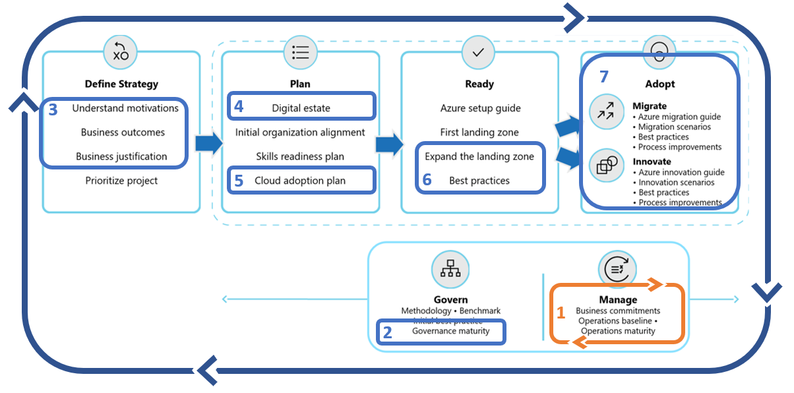

<!-- cSpell:ignore architected -->

# Getting started: Operational excellence during digital transformation

How do we ensure operational excellence during digital transformation? Operations excellence is a business function with direct impact on IT decisions. Operations excellence is a focus on driving customer and stakeholder value, with a constant eye on revenue, risk, and cost impacts. This organizational change management approach requires a defined strategy, clear business outcomes and change management planning. From a cloud perspective, the risk and cost impacts are managed through post-adoption change management and continuous refinement of operational processes, which can include systems automation, IT operations management practices, and resource consistency disciplines throughout the cloud adoption lifecycle. The steps in this guide will help the strategy team lead the organizational change management required to consistently ensure operational excellence.

## Get started

Operations excellence across the enterprise and portfolio starts with peer processes of strategy and planning to align and report on organizational change management expectations. The subsequent steps in this checklist will help technical teams deliver the disciplines required to achieve operations excellence.

## Step 1. Define a strategy to guide digital transformation and operations excellence expectations

A clear business strategy is the foundation for any digital transformation and any operational excellence effort. IT can reduce costs and streamline IT processes, but without a clear strategy its difficult to understand how those changes may impact the business outcomes targeted in the broader transformation effort.

### Involved teams

- Accountable team: [Cloud Strategy Team](../organize/cloud-strategy.md)
- Responsible/Supporting teams: [Cloud Adoption Team](../organize/cloud-adoption.md), [Cloud Governance Team](../organize/cloud-governance.md), [Cloud Operations Team](../organize/cloud-operations.md), and [Cloud center of excellence](../organize/cloud-center-of-excellence.md)/[Central IT](../organize/central-it.md)

### Deliverables

- Record motivations, outcomes, and business justification in the [Strategy and Planning Template](https://archcenter.blob.core.windows.net/cdn/fusion/readiness/Microsoft-Cloud-Adoption-Framework-Strategy-and-Plan-Template.docx). Ensure learning metrics are well understood and included in the business outcomes section, as those metrics will guide operational excellence activities and reporting within IT.

### Guidance to support deliverable completion

- Strategy: [Understand motivations](../strategy/motivations.md): Critical business events and some migration motivations tend to be cost sensitive, increasing the importance of cost control for all subsequent efforts. Other forward looking motivations related to innovation or growth through migration may be focused more on top-line revenue. Understanding motivations will help understand how high of a priority cost management should be.
- Strategy: [Business Outcomes](../strategy/business-outcomes/index.md): Some fiscal outcomes tend to be extremely cost sensitive. When the desired outcomes map to fiscal metrics, it can be wise to invest in the cost management discipline of governance very early.
- Strategy: [Business Justification](../strategy/cloud-migration-business-case.md): The business justification serves as a high-level view of the overall financial plan for cloud adoption. This can be a good source for initial budgeting efforts.
- Strategy: [Learning metrics](../strategy/learning-metrics.md): To maintain alignment between the overarching business strategy and the more tactical change management plans, it is important to establish learning metrics to show iterative and incremental progress towards the plan.

## Step 2. Develop an organizational change management plan to span cloud adoption

Organizational change management is an iterative approach to subtly realign people, process, and technology to support a holistic business strategy. In the case of operational excellence for digital transformation, this will often center around an IT-centric cloud adoption plan.

### Involved teams

- Accountable team: [Cloud Strategy Team](../organize/cloud-strategy.md)
- Responsible/Supporting teams: [Cloud Adoption Team](../organize/cloud-adoption.md), [Cloud Governance Team](../organize/cloud-governance.md), [Cloud Operations Team](../organize/cloud-operations.md), and [Cloud center of excellence](../organize/cloud-center-of-excellence.md)/[Central IT](../organize/central-it.md)

### Deliverables

- Update the [Strategy and Planning Template](https://archcenter.blob.core.windows.net/cdn/fusion/readiness/Microsoft-Cloud-Adoption-Framework-Strategy-and-Plan-Template.docx) to reflect required change to realize the desired strategy. The changes recorded are likely to include the following:
    - Assessment of the existing digital estate
    - Cloud adoption plan reflecting required changes and work involved
    - Changes to the organization to deliver on the plan
    - Skilling plan for the existing team to enable successful completion of the required work

### Guidance to support deliverable completion

- Plan: [Gather Inventory](../digital-estate/inventory.md): Establish a source of data for analysis of the digital estate prior to adoption.
- Plan: [Best Practice - Azure Migrate](../plan/contoso-migration-assessment.md): Leverage Azure Migrate to gather inventory
- Plan: [Incremental Rationalization](../digital-estate/rationalize.md#incremental-rationalization): During incremental rationalization a quantitative analysis will identify cloud candidates for budgeting purposes.
- Plan: [Align cost models and forecast models](../digital-estate/calculate.md): Leverage Azure Cost Management to align cost and forecast models by [creating budgets](https://docs.microsoft.com/azure/cost-management-billing/costs/tutorial-acm-create-budgets?toc=https://docs.microsoft.com/azure/cloud-adoption-framework/toc.json&bc=https://docs.microsoft.com/azure/cloud-adoption-framework/_bread/toc.json).
- Plan: [Build your cloud adoption plan](../plan/plan-intro.md#build-your-cloud-adoption-plan): Steps to build a plan with actionable workload, assets, and timeline details.

## Step 3. Manage change across cloud adoption efforts

Realization of business outcomes is the result of continuous delivery of adoption waves. Those waves could include migration and/or innovation cycles. In either case, delivery on operational excellence starts with regular cycles of change management. Each wave (or release in agile terms) will deliver a set of workloads to the cloud. As each wave of adoption is completed the cloud strategy team will be able to report on progress towards learning metrics, business outcomes, and the overall strategy. Likewise, as each wave of adoption is completed, the adoption teams will need backlog updates reflecting the prioritized workloads in the plan, based on any changes to business plans and customer needs.

### Involved teams

- Accountable team: [Cloud Strategy Team](../organize/cloud-strategy.md)
- Responsible/Supporting teams: [Cloud Adoption Team](../organize/cloud-adoption.md)

### Deliverables

- Continuous testing and improvements to the strategy and change management plan based on changing market conditions and completion of the most recent wave of technical change.

### Guidance to support deliverable completion

- Plan: [Release planning](../digital-estate/approach.md): Approaches to change management through release planning.
- Plan: [Incremental rationalization](../digital-estate/rationalize.md#incremental-rationalization): Iterative approach to change management focused on managing the release backlog to support manageable waves of change.
- Plan: [Power of 10 approach](../digital-estate/rationalize.md#release-planning): Limiting the change management plan to focus on detailed analysis and planning of a continuous base of 10 workloads to balance incremental change and iterative adoption efforts.
- Plan: [Align iteration paths](../plan/iteration-paths.md): Updating and adding details at each release to ensure current iteration paths.
- Migrate: [Assess workloads](../migrate/azure-migration-guide/assess.md?tabs=Challenge-Assumptions): Cloud adoption team's efforts to evaluate and act on the most recent set of migration priorities.
- Innovate: [Business value consensus](../innovate/business-value.md): Cloud adoption team's efforts to ensure business value alignment at each release of new innovation.

## Value statement

The above steps will outline operational excellence requirements throughout digital transformation. This will provide a consistent foundation that resonates throughout various other operating model functions.

## Next steps to delivering operational excellence across the portfolio

Operational excellence requires a disciplined approach to reliability, performance, security, and cost optimization. Leverage the remaining getting started articles in the next steps below will help ensure each of those principles is implemented through consistent automation approaches.

- Cost optimization: Continuously optimize operating costs using the getting started guide on [managing enterprise costs](./manage-costs.md)
- Security: Reduce risk by integrating enterprise security across the portfolio using the getting started guide on [implementing security across the portfolio](./security.md)
- Performance: Ensure IT asset performance supports business processes using the getting started guide on [performance management across the enterprise](./performance.md).
- Reliability: Improve reliability and reduce business disruptions using the getting started guide on [implementing controls to create reliability](./reliability.md)
