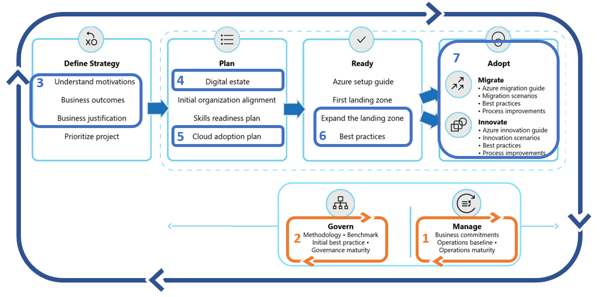

<!-- cSpell:ignore architected -->

# Getting started: Implementing the right controls to improve reliability

How do we apply the right controls to improve reliability? This guide helps minimize disruptions related to inconsistencies in configuration, resource organization, security baselines, or resource protection. The steps in this guide will help the operations team balance reliability and cost across the IT portfolio and aid the governance team in ensuring that balance is applied consistently. Reliability also depends on other roles and functions. This article maps those various supporting functions into one getting started guide to help create alignment between each of the involved teams.

## Get started

Operations management and governance are equal partners in enterprise reliability. The decisions made regarding operational practices will set the baseline for reliability. The approaches used to govern the overall environment will ensure consistency across all resources. The first two steps in this guide will help both teams get started. While they are listed sequentially, these steps will likely progress in parallel. The subsequent steps in this checklist will help get the entire enterprise started on a shared journey towards more reliable solutions throughout the enterprise.

## Step 1. Establish operations management requirements

All workloads are not created equal. In any environment, there will be workloads that have a direct and constant impact on the business. There will also be a number of supporting business processes and workloads, which have a smaller impact on the overall business. In this step, the cloud operations team will identify and implement initial requirements to support the overall IT portfolio.

### Involved teams

- Accountable team: [Cloud Operations Team](../organize/cloud-operations.md)
- Responsible/Supporting teams: [Cloud Strategy Team](../organize/cloud-strategy.md), [Cloud Adoption Team](../organize/cloud-adoption.md), [Cloud Governance Team](../organize/cloud-governance.md), and [Cloud center of excellence](../organize/cloud-center-of-excellence.md)/[Central IT](../organize/central-it.md)

### Deliverables

- Implement a management baseline to define standard operations delivered for all production workloads.
- Negotiate business commitments with the cloud strategy team to develop a plan for advanced operations and resiliency requirements.
- Expand your management baseline, if additional operations are required for the majority of workloads.
- Apply advanced operations requirements to landing zones and resources that support higher criticality workloads.
- Document operations decisions across the IT portfolio in the [Ops Management workbook](https://raw.githubusercontent.com/microsoft/CloudAdoptionFramework/master/manage/opsmanagementworkbook.xlsx).

### Guidance to support deliverable completion

- **[Management baseline](../manage/considerations/discipline.md)**:
    - [Inventory & visibility](../manage/considerations/inventory.md): There are a number of [cloud native tools](../manage/azure-management-guide/inventory.md) to help [Collect data](../manage/monitor/data-collection.md), [configure alerts](../manage/monitor/.md), and implement the [monitoring platform](../manage/monitor/.md) that best fits your operating model.
    - [Operational Compliance](../manage/considerations/operational-compliance.md): The highest percentages of outages tend to come from changes to resource configuration or poor maintenance practices. Follow the [Azure server management guide](../manage/azure-server-management/index.md) to implement cloud native tools to manage patching & changes to resource configuration.  
    - [Protection & recovery](../manage/considerations/protect.md): Outages are inevitable on any platform. When a disruption occurs be prepared with [back up and recovery solutions](../manage/azure-management-guide/protect-recover.md) to minimize the duration of any disruption.

- **[Advanced operations](../manage/design-principles.md)**: Use the management baseline as the foundation for [business alignment](../manage/considerations/business-alignment.md) conversations to create clarity regarding [criticality](../manage/considerations/criticality.md), [business impact](../manage/considerations/impact.md), and [operations commitments](../manage/considerations/commitment.md). Business alignment will help quantify and validate any requests for an [enhanced baseline](../manage/azure-management-guide/enhanced-baseline.md), management of specific [technology platforms](../manage/azure-management-guide/workload-specialization.md), or [workload-specific operations](../manage/azure-management-guide/platform-specialization.md).

- **Guide an architecture review**: Architecture changes at the workload level may be required to meet operations requirements. The [Azure Architecture framework](/azure/architecture/framework/cost/tradeoffs) and [Azure Architecture Review](/assessments/?id=azure-architecture-review) can help guide those conversations with the technical owner of a specific workload.

## Step 2. Consistent application of the management baseline

Enterprise reliability requires consistent application of the management baseline. That consistency comes from appropriate corporate policy, IT processes, and automated tools to govern the implementation of the management baseline for all impacted resources.

### Involved teams

- Accountable team: [Cloud Governance Team](../organize/cloud-governance.md)
- Responsible/Supporting teams: [Cloud Strategy Team](../organize/cloud-strategy.md), [Cloud Operations Team](../organize/cloud-operations.md), and [Cloud center of excellence](../organize/cloud-center-of-excellence.md)/[Central IT](../organize/central-it.md)

### Deliverables

- Ensure proper application of the management baseline for all impacted systems.
- Document resource consistency policies, processes, and design guidance in the [Resource consistency governance template](../govern/resource-consistency/template.md).

### Guidance to support deliverable completion

- Ensure all workloads and resources follow **[proper naming and tagging conventions](../ready/azure-best-practices/naming-and-tagging.md)** and [enforce tagging conventions using Azure policy](/azure/governance/policy/tutorials/govern-tags.md) with a specific emphasis on tags for "Criticality".
- If you are new to cloud governance, establish [governance policies, processes, and disciplines](../govern/index.md) using the Govern methodology.
- If you are new to the cost management discipline, consider following the [cost management improvements article](../govern/guides/complex/cost-management-improvement.md), with a focus on the [implementation](../govern/guides/complex/cost-management-improvement.md#incremental-improvement-of-the-best-practices) section.

## Steps to start reliability partnerships with other teams

Various decisions throughout the cloud adoption lifecycle can have a direct impact on reliability. The following steps help outline the partnerships and supporting efforts required to deliver consistent reliability across the IT portfolio.

## Step 3. Define strategy

Strategic decisions have direct impact on reliability, which ripple throughout the adoption life-cycle and beyond into long-term operations. Strategic clarity will improve reliability efforts.

### Involved teams

- Accountable team: [Cloud Strategy Team](../organize/cloud-strategy.md)
- Responsible/Supporting teams: [Cloud Governance Team](../organize/cloud-governance.md), [Cloud Operations Team](../organize/cloud-operations.md), and [Cloud center of excellence](../organize/cloud-center-of-excellence.md)/[Central IT](../organize/central-it.md)

### Deliverables

- Record motivations, outcomes, and business justification in the [Strategy and Planning Template](https://archcenter.blob.core.windows.net/cdn/fusion/readiness/Microsoft-Cloud-Adoption-Framework-Strategy-and-Plan-Template.docx). Ensure the management baseline provides operational support which aligns to the strategic direction of cloud adoption.

### Guidance to support deliverable completion

- Strategy: [Understand motivations](../strategy/motivations.md): Critical business events and some migration motivations tend to be cost sensitive, increasing the importance of cost control for all subsequent efforts. Other forward looking motivations related to innovation or growth through migration may be focused more on top-line revenue. Understanding motivations will help understand how high of a priority cost management should be.
- Strategy: [Business Outcomes](../strategy/business-outcomes/index.md): Some fiscal outcomes tend to be extremely cost sensitive. When the desired outcomes map to fiscal metrics, it can be wise to invest in the cost management discipline of governance very early.
- Strategy: [Business Justification](../strategy/cloud-migration-business-case.md): The business justification serves as a high-level view of the overall financial plan for cloud adoption. This can be a good source for initial budgeting efforts.

## Step 4. Digital estate

The digital estate (or analysis of the existing IT portfolio) can aid in validating the business justification and provide a refined view of the overall IT portfolio.

### Involved teams

- Accountable team: [Cloud Strategy Team](../organize/cloud-strategy.md)
- Responsible/Supporting teams: [Cloud Governance Team](../organize/cloud-governance.md), [Cloud Operations Team](../organize/cloud-operations.md), and [Cloud center of excellence](../organize/cloud-center-of-excellence.md)/[Central IT](../organize/central-it.md)

### Deliverables

- Update the [Strategy and Planning Template](https://archcenter.blob.core.windows.net/cdn/fusion/readiness/Microsoft-Cloud-Adoption-Framework-Strategy-and-Plan-Template.docx) to reflect changes triggered by the digital estate analysis.
- Work with the operations team to clearly define criticality and business impact of each workload in the near-term and long-term adoption plan.

### Guidance to support deliverable completion

- Plan: [Gather Inventory](../digital-estate/inventory.md): Establish a source of data for analysis of the digital estate prior to adoption.
- Plan: [Best Practice - Azure Migrate](../plan/contoso-migration-assessment.md): Leverage Azure Migrate to gather inventory
- Plan: [Incremental Rationalization](../digital-estate/rationalize.md#incremental-rationalization): During incremental rationalization a quantitative analysis will identify cloud candidates for budgeting purposes.
- Plan: [Align cost models and forecast models](../digital-estate/calculate.md): Leverage Azure Cost Management to align cost and forecast models by [creating budgets](https://docs.microsoft.com/azure/cost-management-billing/costs/tutorial-acm-create-budgets?toc=https://docs.microsoft.com/azure/cloud-adoption-framework/toc.json&bc=https://docs.microsoft.com/azure/cloud-adoption-framework/_bread/toc.json).

## Step 5. Adoption plan

The adoption plan provides clarity on the timeline of activities during adoption. Aligning that plan and digital estate analysis provides a means of planning for future operations management dependencies. Understanding the plan also invites the cloud operations team into the development cycles to evaluate and plan for any changes to the management baseline, required to provide workload operations.

### Involved teams

- Accountable team: [Cloud Adoption Team](../organize/cloud-adoption.md)
- Responsible/Supporting teams: [Cloud Strategy Team](../organize/cloud-strategy.md), [Cloud Operations Team](../organize/cloud-operations.md), [Cloud Governance Team](../organize/cloud-governance.md), and [Cloud center of excellence](../organize/cloud-center-of-excellence.md)/[Central IT](../organize/central-it.md)

### Deliverables

- Complete steps 1-6 of building a [cloud adoption plan](../plan/plan-intro.md#build-your-cloud-adoption-plan).
- Work with the cloud operations team to establish a timeline for operations readiness.

### Guidance to support deliverable completion

- Plan: [Build your cloud adoption plan](../plan/plan-intro.md#build-your-cloud-adoption-plan): Steps to build a plan with actionable workload, assets, and timeline details.

## Step 6. Landing zone best practices

The Ready methodology of the cloud adoption framework focuses heavily on the development of landing zones to host workloads in the cloud. During landing zone implementation, there are a number of decisions which may impact operations. Consult the cloud operations team to help review the landing zone for operations improvements. Also consult the cloud governance team to understand "resource consistency" policies and design guidance which may impact landing zone design.

### Involved teams

- Accountable team: [Cloud Adoption Team](../organize/cloud-adoption.md) or [Cloud Platform Team](../organize/cloud-platform.md)
- Responsible/Supporting teams: [Cloud Operations Team](../organize/cloud-operations.md), [Cloud Strategy Team](../organize/cloud-strategy.md), [Cloud Governance Team](../organize/cloud-governance.md), and [Cloud center of excellence](../organize/cloud-center-of-excellence.md)/[Central IT](../organize/central-it.md)

### Deliverables

- Deploy one or more landing zones capable of hosting workloads in the short term adoption plan.
- Ensure all landing zones meet operations decisions and resource consistency requirements.

### Guidance to support deliverable completion

- Ready: [Improve landing zone operations](../ready/considerations/landing-zone-operations.md): Best practices for improving operations within a given landing zone.

## Step 7. Adoption

Long-term operations may be impacted by the decisions made during migration and innovation efforts. Maintaining consistent alignment early in adoption processes will remove barriers to production release and reduce the effort required to on-board new solutions into operations management practices.

### Involved teams

- Accountable team: [Cloud Adoption Team](../organize/cloud-adoption.md)
- Responsible/Supporting teams: [Cloud Strategy Team](../organize/cloud-strategy.md), [Cloud Operations Team](../organize/cloud-operations.md), [Cloud Governance Team](../organize/cloud-governance.md), and [Cloud center of excellence](../organize/cloud-center-of-excellence.md)/[Central IT](../organize/central-it.md)

### Deliverables

- Test operations readiness of production deployments using resource consistency policies.
- Validate adherence to resource consistency design guidance and operations requirements.
- Document any advanced operations requirements in the [Ops Management workbook](https://raw.githubusercontent.com/microsoft/CloudAdoptionFramework/master/manage/opsmanagementworkbook.xlsx).

### Guidance to support deliverable completion

- Migrate: [environmental readiness checklist](../migrate/migration-considerations/prerequisites/planning-checklist.md)
- Migrate: [pre-promotion checklist](../migrate/migration-considerations/optimize/ready.md)
- Migrate: [Production release checklist](../migrate/migration-considerations/optimize/promote.md)

## Value statement

The above steps will help implement the right controls and processes needed to ensure reliability across the enterprise and all hosted resources.