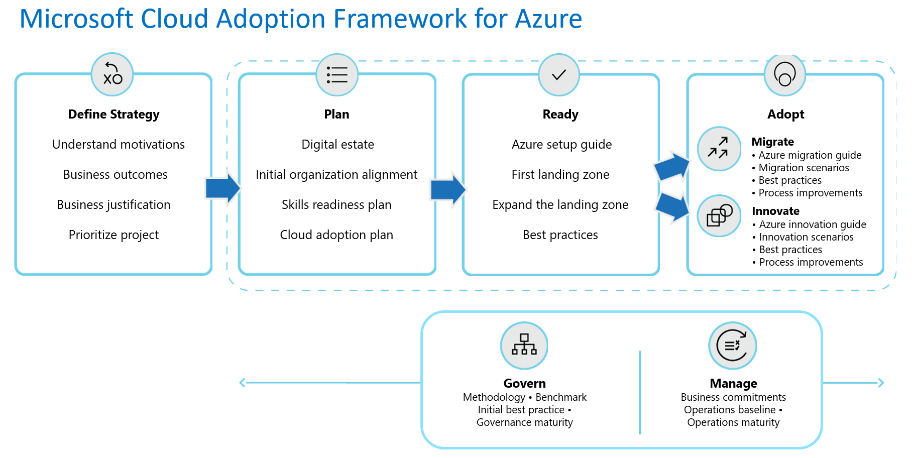

# Getting started: Address security

Clearly define the goal of the article and what the reader will accomplish. This article provides a checklist and recommended steps for…

## Get started

Use the checklists to… Follow the steps to… This process utilizes the sections of the Cloud Adoption Framework that are highlighted in the following illustration.

Understand how to apply the Cloud Adoption Framework guidance to your cloud security in Azure.

Modify the baseline journey graphic to highlighting the parts of CAF that are used in this scenario.  

<!---Required:
Modify the baseline graphic to show the parts of the cloud adoption framework that are used in this scenario.
--->

## Define strategy
<!--- remove this section if it doesn't apply to this scenario. --->
Use the following checklist to evaluate... Use the steps to...

- **Question one:** Are all stakeholders aligned on the motivations and expected business outcomes?
- **Question two:** Are all stakeholders aligned on the overall business justification?
- **Question n** blah?

### Step 1: start with a verb – e.g. do blah

Brief explanation of what this step accomplishes.

- Example - [Motivations](../strategy/motivations.md): Explanation of how this article will help them accomplish what is a necessary part of this step.
- Example - [Business Outcomes](../strategy/business-outcomes/index.md): Explanation of how this article will help them accomplish what is a necessary part of this step.

Deliverable

- what is produced during this step and links to tools, templates that can be utilized.

Involved teams

- Example - Accountable team: [Cloud Strategy Team](../organize/cloud-strategy.md)
- Example - Responsible/Supporting teams: [Cloud Adoption Team](../organize/cloud-adoption.md) and [Cloud center of excellence](../organize/cloud-center-of-excellence.md)/[Central IT](../organize/central-it.md)

## Plan
<!--- remove this section if it doesn't apply to this scenario. --->
Use the following checklist to evaluate... Use the steps to...

- **Question one:** Does the team have a skills plan in place?
- **Question two:** blah?
- **Question three:** blah?
- ...

### Step 2: start with a verb – e.g. do blah

Brief explanation of what this step accomplishes. e.g. set up a security team.

- Example - [Build a skills readiness plan](../plan/adapt-roles-skills-processes.md): Do a quick evaluation of the required skills and the existing skills to better understand what skilling requirements need to be addressed.

Deliverable

- what is produced during this step and links to tools, templates that can be utilized.
- Example - Add skills readiness plan to the [Strategy and Planning Template](https://archcenter.blob.core.windows.net/cdn/fusion/readiness/Microsoft-Cloud-Adoption-Framework-Strategy-and-Plan-Template.docx)

Involved teams

- Example - Accountable team: [Cloud Adoption Team](../organize/cloud-adoption.md)
- Example - Responsible/Supporting teams: [Cloud Strategy Team](../organize/cloud-strategy.md)

## Ready
<!--- remove this section if it doesn't apply to this scenario. --->
Use the following checklist to evaluate... Use the steps to...

- **Question one:** blah?
- **Question two:** blah?
- **Question three:** blah?
- ...

### Step 3: start with a verb – e.g. do blah

Brief explanation of what this step accomplishes.

- Example - link: Explanation of how this article will help them accomplish what is a necessary part of this step.
- Example - link: Explanation of how this article will help them accomplish what is a necessary part of this step.

Deliverable

- what is produced during this step and links to tools, templates that can be utilized.

Involved teams

- Example - Accountable team: [Cloud Strategy Team](../organize/cloud-strategy.md)
- Example - Responsible/Supporting teams: [Cloud Adoption Team](../organize/cloud-adoption.md) and [Cloud center of excellence](../organize/cloud-center-of-excellence.md)/[Central IT](../organize/central-it.md)

### Step 4: start with a verb – e.g. do blah

Brief explanation of what this step accomplishes.

- Example - link: Explanation of how this article will help them accomplish what is a necessary part of this step.
- Example - link: Explanation of how this article will help them accomplish what is a necessary part of this step.

Deliverable

- what is produced during this step and links to tools, templates that can be utilized.

Involved teams

- Example - Accountable team: [Cloud Adoption Team](../organize/cloud-adoption.md)
- Example - Responsible/Supporting teams: [Cloud center of excellence](../organize/cloud-center-of-excellence.md)/[Central IT](../organize/central-it.md)

## Adopt
<!--- remove this section if it doesn't apply to this scenario. --->
Use the following checklist to evaluate... Use the steps to...

- **Question one**: Is the adoption team prepared to execute the technical migration effort?
- **Question two:** blah?
- **Question three:** blah?
- ...

### Step 5: start with a verb – e.g. do blah

Brief explanation of what this step accomplishes.

- Example - link: Explanation of how this article will help them accomplish what is a necessary part of this step.
- Example - link: Explanation of how this article will help them accomplish what is a necessary part of this step.

Deliverable

- what is produced during this step and links to tools, templates that can be utilized.

Involved teams

- Example - Accountable team: [Cloud Strategy Team](../organize/cloud-strategy.md)
- Example - Responsible/Supporting teams: [Cloud Adoption Team](../organize/cloud-adoption.md) and [Cloud center of excellence](../organize/cloud-center-of-excellence.md)/[Central IT](../organize/central-it.md)

## Govern
<!--- remove this section if it doesn't apply to this scenario. --->
Use the following checklist to evaluate... Use the steps to...

- **Example one:** blah?
- **Example - Governance**: Is the governance team aligned with the approach to governing the cloud environment?
- ...

### Step 6: start with a verb – e.g. do blah

Brief explanation of what this step accomplishes.

- Example - link: Explanation of how this article will help them accomplish what is a necessary part of this step.
- Example - [Governance approach](../govern/index.md): This methodology outlines a process for thinking about corporate policy and processes. Then building the disciplines required to deliver on governance across your cloud enterprise adoption efforts.
- Example - [Initial governance foundation](../govern/guides/complex/prescriptive-guidance.md): Understand the Identity Baseline, Security Baseline, and Deployment Acceleration that are required to create a governance MVP, which will serve as the foundation for all adoption.

Deliverable

- what is produced during this step and links to tools, templates that can be utilized.
- Example: Deploy an initial governance foundation
- Example: Complete a governance benchmark to plan for future improvements
- Example: Timeline risks: Improve policies and governance implementation can add 1-4 weeks per discipline

Involved teams

- Example - Accountable team: [Cloud Strategy Team](../organize/cloud-strategy.md)
- Example - Responsible/Supporting teams: [Cloud Adoption Team](../organize/cloud-adoption.md) and [Cloud center of excellence](../organize/cloud-center-of-excellence.md)/[Central IT](../organize/central-it.md)

Note: Take the governance benchmark assessment to understand the security gaps that need to be addressed.

## Manage
<!--- remove this section if it doesn't apply to this scenario. --->
Use the following checklist to evaluate... Use the steps to...

- **Management**: Is there a plan for ongoing operations?

### Step 7: start with a verb – e.g. do blah

Brief explanation of what this step accomplishes.

- Example - link: Explanation of how this article will help them accomplish what is a necessary part of this step.
- Example -[Management Baseline](../manage/index.md):
- Example -[Define business commitments](../manage/considerations/business-alignment.md):

Deliverable

- what is produced during this step and links to tools, templates that can be utilized.
- Example: Complete the Ops Management Workbook

Involved teams

- Example - Accountable team: [Cloud Strategy Team](../organize/cloud-strategy.md)
- Example - Responsible/Supporting teams: [Cloud Adoption Team](../organize/cloud-adoption.md) and [Cloud center of excellence](../organize/cloud-center-of-excellence.md)/[Central IT](../organize/central-it.md)

## Value statement

The steps outlined in this getting started guide can help you and your teams… what is unblocked now that you're done…  …realize business value.

## Next steps

Things you might want to do in a future iteration to build on this getting started

For a complete list of Azure security tools and services, see [Security services and technologies available on Azure](https://docs.microsoft.com/azure/security/azure-security-services-technologies).

It is also common for customers to use third-party tools for facilitating Security Baseline activities. For more information, see the article [Integrate security solutions in Azure Security Center](https://docs.microsoft.com/azure/security-center/security-center-partner-integration).

In addition to security tools, the [Microsoft Trust Center](https://www.microsoft.com/trustcenter/guidance/risk-assessment) contains extensive guidance, reports, and related documentation that can help you perform risk assessments as part of your migration planning process.
