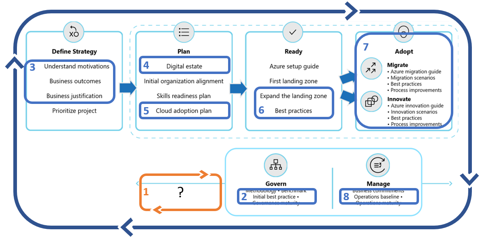

<!-- cSpell:ignore architected -->

# Getting started: Implementing security requirements across the enterprise

How do we consistently secure our cloud environment? This quickstart guide can help ensure the proper security requirements have been applied across the enterprise to minimize risk of breach and accelerate recover when breach occurs. The steps in this guide will help ensure that your cloud security requirements are consistently applied to all environments and landing zones across the enterprise. This article maps various supporting functions into one getting started guide to help ensure that security is a team sport.

## Get started

Consistent security is managed through the application of a security baseline. This checklist starts with the consistent application of security requirements. The subsequent steps in this checklist will help get the entire enterprise started on a shared journey towards more security adoption of the cloud.

## Step 1. Establish security requirements and practices

Security in the cloud starts with sound practices and requirements. In the first step, it is important to define actionable requirements and consistent processes to guide security decisions, which align to cloud provider capabilities and realistic risk profiles.

### Involved teams

- Accountable team: [Cloud Security Team](../organize/cloud-security.md)
- Responsible/Supporting teams: [Cloud Strategy Team](../organize/cloud-strategy.md), [Cloud Platform Team](../organize/cloud-platform.md), [Cloud Adoption Team](../organize/cloud-adoption.md), and [Cloud center of excellence](../organize/cloud-center-of-excellence.md)/[Central IT](../organize/central-it.md)

### Deliverables

- Implementation of well-managed security requirements aligned to the tools, capabilities, and risk profile of the specific cloud provider.

### Guidance to support deliverable completion

> [!WARNING]
> TODO - Create required guidance to determine the right processes, security toolchain, and portfolio-wide security requirements.

## Steps to scale security protections and a secure mindset across the organization

Various decisions throughout the cloud adoption lifecycle can have a direct impact on security. The following steps help outline the partnerships and supporting efforts required to deliver consistent security across the IT portfolio.

## Step 2. Apply a security baseline

Consistent application of security requirements come from sound governance disciplines and automated solutions. Once the security baseline is defined by the cloud security team, those requirements can be audited and/or applied to all cloud environments.

### Involved teams

- Accountable team: [Cloud Governance Team](../organize/cloud-governance.md)
- Responsible/Supporting teams: [Cloud Strategy Team](../organize/cloud-strategy.md), [Cloud Security Team](../organize/cloud-security.md), and [Cloud center of excellence](../organize/cloud-center-of-excellence.md)/[Central IT](../organize/central-it.md)

### Deliverables

- Ensure proper application of the security baseline for all impacted systems.
- Document security policies, processes, and design guidance in the [Security baseline governance template](../govern/security-baseline/template.md).

### Guidance to support deliverable completion

- Ensure all workloads and resources follow **[proper naming and tagging conventions](../ready/azure-best-practices/naming-and-tagging.md)** and [enforce tagging conventions using Azure policy](/azure/governance/policy/tutorials/govern-tags.md) with a specific emphasis on tags for "Data Sensitivity".
- If you are new to cloud governance, establish [governance policies, processes, and disciplines](../govern/index.md) using the Govern methodology.
- If you are new to the security baseline discipline, consider following the [security baseline improvements article](../govern/guides/complex/security-baseline-improvement.md), with a focus on the [implementation](../govern/guides/complex/security-baseline-improvement.md#incremental-improvement-of-the-best-practices) section.

## Step 3. Define strategy

Strategic decisions have direct impact on security, which ripple throughout the adoption life-cycle and beyond into long-term operations. Strategic clarity will improve security efforts by identifying the potential impact of the strategic direction on your long-term risk profile.

### Involved teams

- Accountable team: [Cloud Strategy Team](../organize/cloud-strategy.md)
- Responsible/Supporting teams: [Cloud Governance Team](../organize/cloud-governance.md), [Cloud Security Team](../organize/cloud-security.md), and [Cloud center of excellence](../organize/cloud-center-of-excellence.md)/[Central IT](../organize/central-it.md)

### Deliverables

- Record motivations, outcomes, and business justification in the [Strategy and Planning Template](https://archcenter.blob.core.windows.net/cdn/fusion/readiness/Microsoft-Cloud-Adoption-Framework-Strategy-and-Plan-Template.docx). Ensure the security baseline provides support, which aligns to the strategic direction of cloud adoption.

### Guidance to support deliverable completion

- Strategy: [Understand motivations](../strategy/motivations.md): Critical business events and some migration motivations tend to be cost sensitive, increasing the importance of cost control for all subsequent efforts. Other forward looking motivations related to innovation or growth through migration may be focused more on top-line revenue. Understanding motivations will help understand how high of a priority cost management should be.
- Strategy: [Business Outcomes](../strategy/business-outcomes/index.md): Some fiscal outcomes tend to be extremely cost sensitive. When the desired outcomes map to fiscal metrics, it can be wise to invest in the cost management discipline of governance very early.
- Strategy: [Business Justification](../strategy/cloud-migration-business-case.md): The business justification serves as a high-level view of the overall financial plan for cloud adoption. This can be a good source for initial budgeting efforts.

## Step 4. Digital estate

The digital estate (or analysis of the existing IT portfolio) can aid in validating the business justification and provide a refined view of the overall IT portfolio. This perspective and the supporting data can aid in identifying potential security risks and the overall security boundary requirements.

### Involved teams

- Accountable team: [Cloud Strategy Team](../organize/cloud-strategy.md)
- Responsible/Supporting teams: [Cloud Governance Team](../organize/cloud-governance.md), [Cloud Security Team](../organize/cloud-security.md), and [Cloud center of excellence](../organize/cloud-center-of-excellence.md)/[Central IT](../organize/central-it.md)

### Deliverables

- Update the [Strategy and Planning Template](https://archcenter.blob.core.windows.net/cdn/fusion/readiness/Microsoft-Cloud-Adoption-Framework-Strategy-and-Plan-Template.docx) to reflect changes triggered by the digital estate analysis.
- Work with the security team to clearly define data sensitivity and business impact of each workload in the near-term and long-term adoption plan.

### Guidance to support deliverable completion

- Plan: [Gather Inventory](../digital-estate/inventory.md): Establish a source of data for analysis of the digital estate prior to adoption.
- Plan: [Best Practice - Azure Migrate](../plan/contoso-migration-assessment.md): Leverage Azure Migrate to gather inventory
- Plan: [Incremental Rationalization](../digital-estate/rationalize.md#incremental-rationalization): During incremental rationalization a quantitative analysis will identify cloud candidates for budgeting purposes.
- Plan: [Align cost models and forecast models](../digital-estate/calculate.md): Leverage Azure Cost Management to align cost and forecast models by [creating budgets](https://docs.microsoft.com/azure/cost-management-billing/costs/tutorial-acm-create-budgets?toc=https://docs.microsoft.com/azure/cloud-adoption-framework/toc.json&bc=https://docs.microsoft.com/azure/cloud-adoption-framework/_bread/toc.json).

## Step 5. Adoption plan

The adoption plan provides clarity on the timeline of activities during adoption. Aligning that plan and digital estate analysis provides a means of planning for future risk profiles and security baseline improvements. Understanding the plan also invites the cloud security team into the development cycles early, to evaluate and plan for any changes to the security baseline.

### Involved teams

- Accountable team: [Cloud Adoption Team](../organize/cloud-adoption.md)
- Responsible/Supporting teams: [Cloud Strategy Team](../organize/cloud-strategy.md), [Cloud Security Team](../organize/cloud-security.md), [Cloud Governance Team](../organize/cloud-governance.md), and [Cloud center of excellence](../organize/cloud-center-of-excellence.md)/[Central IT](../organize/central-it.md)

### Deliverables

- Complete steps 1-6 of building a [cloud adoption plan](../plan/plan-intro.md#build-your-cloud-adoption-plan).
- Work with the cloud security team to establish a timeline for security readiness.

### Guidance to support deliverable completion

- Plan: [Build your cloud adoption plan](../plan/plan-intro.md#build-your-cloud-adoption-plan): Steps to build a plan with actionable workload, assets, and timeline details.

## Step 6. Landing zone best practices

The Ready methodology of the cloud adoption framework focuses heavily on the development of landing zones to host workloads in the cloud. During landing zone implementation, there are a number of decisions which may impact security and risk profiles. Consult the cloud security team to help review the landing zone for security improvements. Also consult the cloud governance team to understand "security baseline" policies and design guidance which may impact landing zone design.

### Involved teams

- Accountable team: [Cloud Adoption Team](../organize/cloud-adoption.md) or [Cloud Platform Team](../organize/cloud-platform.md)
- Responsible/Supporting teams: [Cloud Security Team](../organize/cloud-security.md), [Cloud Strategy Team](../organize/cloud-strategy.md), [Cloud Governance Team](../organize/cloud-governance.md), and [Cloud center of excellence](../organize/cloud-center-of-excellence.md)/[Central IT](../organize/central-it.md)

### Deliverables

- Deploy one or more landing zones capable of hosting workloads in the short term adoption plan.
- Ensure all landing zones meet operations decisions and resource consistency requirements.

### Guidance to support deliverable completion

- Ready: [Improve landing zone operations](../ready/considerations/landing-zone-security.md): Best practices for improving security within a given landing zone.

## Step 7. Adoption

Long-term security is impacted by the decisions made during migration and innovation efforts. Maintaining consistent alignment early in adoption processes will remove barriers to production release and reduce the effort required to on-board new solutions into security practices.

### Involved teams

- Accountable team: [Cloud Adoption Team](../organize/cloud-adoption.md)
- Responsible/Supporting teams: [Cloud Strategy Team](../organize/cloud-strategy.md), [Cloud Security Team](../organize/cloud-security.md), [Cloud Governance Team](../organize/cloud-governance.md), and [Cloud center of excellence](../organize/cloud-center-of-excellence.md)/[Central IT](../organize/central-it.md)

### Deliverables

- Test operations readiness of production deployments using security baseline policies.
- Validate adherence to security baseline design guidance and security requirements.

### Guidance to support deliverable completion

- Migrate: [environmental readiness checklist](../migrate/migration-considerations/prerequisites/planning-checklist.md)
- Migrate: [pre-promotion checklist](../migrate/migration-considerations/optimize/ready.md)
- Migrate: [Production release checklist](../migrate/migration-considerations/optimize/promote.md)

## Value statement

The above steps will help implement the right controls and processes needed to consistently manage security risks across the enterprise and all hosted resources.

## Next steps

Things you might want to do in a future iteration to build on this getting started

For a complete list of Azure security tools and services, see [Security services and technologies available on Azure](https://docs.microsoft.com/azure/security/azure-security-services-technologies).

It is also common for customers to use third-party tools for facilitating Security Baseline activities. For more information, see the article [Integrate security solutions in Azure Security Center](https://docs.microsoft.com/azure/security-center/security-center-partner-integration).

In addition to security tools, the [Microsoft Trust Center](https://www.microsoft.com/trustcenter/guidance/risk-assessment) contains extensive guidance, reports, and related documentation that can help you perform risk assessments as part of your migration planning process.
