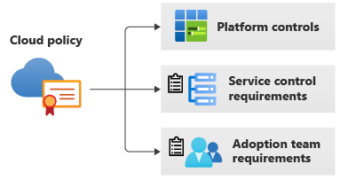
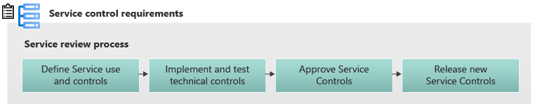
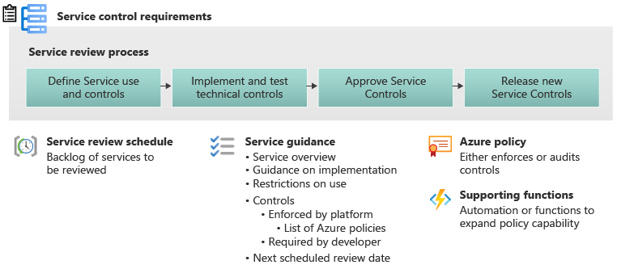
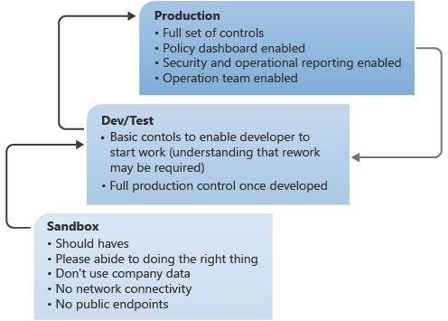

# Process for implementing Cloud Service Controls

Organizations face the problem of how to implement cloud governance at a pace that can not only sustain a high level of innovation, but also ensure the right level of control is implemented for the entire environment.

The process documented here outlines one possible implementation of governance allowing a controlled and measured implementation, that is non-disruptive, regardless of where the organization is in their cloud journey.

## Layers of governance

Determining the controls and measures that need to be implemented as part of an organizations governance process is outlined in [Define Corporate Cloud Policy](policy-compliance/policy-definition.md).

Implementing organizational Cloud Policy stretches across many layers of the implementation process, ranging from platform-wide controls, individual service controls, through to application controls. The higher the level of control, the more coverage it gets, but the more complex the implementation to ensure it covers all of the cloud adoption team needs.

| Control Level | Suitability                                  | Considerations                                                                                                                                                               | Examples                            |
| ------------- | -------------------------------------------- | ---------------------------------------------------------------------------------------------------------------------------------------------------------------------------- | ----------------------------------- |
| Platform      | Broad coverage that is generally             | Hard to implement service-specific management or remediation. Need to ensure that desired outcome is not negated by Application Implementation                               | Resource Tagging or Allowed regions |
| Cloud Service | Tailored for individual services             | Control must be implemented individually for each service. Need to ensure that desired outcome is not negated by Application Implementation                              | Data Encryption or Monitoring       |
| Adoption Team | Tailored for each Application implementation | Control must be implemented for each new application. Hard to standardize implementation. Multiple teams having to implement different controls for the desired outcome. | Application Failover Logic          |

Of these levels of control, Cloud Services is the most complex and the strongest. It strikes a balance between technical implementation with the fine grain control of each service, while allowing for single implementation to be used by multiple adoption teams. The process of implementing controls at the Cloud Service layer requires a level of scale to ensure that all services needed by the organization are covered.

## Levels of service governance

This level of implementation can be delivered in several layers of depth. The Governance Team should assess the level of implementation that they wish to peruse, based on influencing factors around risk profile, considering compliance requirements, security posture, and other factors.

| Service Governance      | Outline                                                                    | Adoption Team responsibilities                                                                                                   | Governance Team Responsibilities                                    |
| ----------------------- | -------------------------------------------------------------------------- | -------------------------------------------------------------------------------------------------------------------------------- | ------------------------------------------------------------------- |
| None                    | Services not centrally governed                                            | Cloud Adoption Teams musts build corporate policy into end solution                                                              | Identify and implement platform-wide controls                       |
| Basic (Allow Deny List) | Services are allowed or denied with no additional controls                 | Application teams build corporate policy into end solution. Can only utilize services that have been approved by Governance Team | Governance team must review and approve the use of services         |
| Service Review process  | Services are individually reviewed and controls placed around each service | Application teams build with confidence. Only the services that have been through service review are available                    | Complete Service Governance and implement controls for each service |

While classifying the different approaches lists out the extreme ends of the spectrum, many organizations will choose an approach somewhere between these models. For example most organizations will allow some Cloud services with a few controls, some will just be allowed without controls and access to others will be denied.

Regardless of the approach taken to Service Governance the key input is the corporate [Cloud Policy Statements](https://docs.microsoft.com/azure/cloud-adoption-framework/govern/policy-compliance/policy-definition#create-cloud-policy-statements) defined by the Governance Team.

## Basic governance (permitted services lists)

The most basic implementation of Service Governance is the listing of permitted or disallowed services in Azure.

In this form, the Governance team publishes a list of either the allowed or denied services to the adoption teams.

### Creating and reviewing allowed services

The process of creating the list of allowed (or denied) Cloud Services, is the review of each cloud service against several previously defined criteria, including but not limited to:

- Organization risk tolerance
- Corporate policy
- Capabilities of Adoption, Security, and Operational Teams

### Implementing deny lists

Services that are explicitly denied use in the organization should utilize [Azure Policy](https://docs.microsoft.com/azure/governance/policy/tutorials/create-and-manage) to deny the use of the service. This is a platform level of control and can be implemented at a Management Group to ensure control over subordinate subscriptions.

The number of policies used to implement the deny service is a balanced decision and must take into account the process for an exception of a Policy.

There will often be exceptions to the use of a service. Once the exception has been approved through organizational process, [Azure Policy Exceptions](https://docs.microsoft.com/azure/governance/policy/concepts/exemption-structure) can be used to allow the implementation of the service in a targeted area.

If a single policy is implemented with all the denied services listed, then granting an exception for a single service will grant an exception to all denied services. This makes the upfront implementation easy, but releases more control with exceptions.

If policies are implemented to deny each service individually, then exceptions only release control of that one policy. This allows for more control in the exception process, but creates greater work in the implementation of the initial deny policy set.

An organization should balance the outcome of these two processes in deciding their own approach.

## Service review process

Implementing Cloud Policy at the service level gives greater control, allows for granular solutions, but also requires larger effort. For this type of implementation, a strong process is required to get the best result.
This example is a simple four-step process.

Triggers for service review process can include the following:

- Project need for new service
- Scheduled review of existing service
- Major Cloud release of features in service
- Change in Imperatives (which triggers all services need for review)

The need for a Service Review puts the service in the backlog for the review process.

The schedule for the Service Review backlog should be published for Adoption and Operations teams to access to allow them to plan for their use of the service or any possible remediation work required because of changes.

The next part of the process is  steps that are iterative for each of the cloud services being used. This is a continual process in the core of the work for much of the cloud governance team. The core of this process is to take the Imperatives that have been defined and to interpret them into controls for each of the services in the cloud.

The selection of a service for review should be based on several components such as internal demand for the service complexity of the implementation of the review timing of the last review of the service and high-level risk value of the service.

This process should publish a backlog of items and a schedule of new reviews so that outside cloud adoption teams can understand when services are going to be selected for review and how long they may have to wait for a new service. This is key to allow cloud adoption teams to select services that have been under the controls of the environment.

### Define service use and controls

This stage of the process is about reviewing the capabilities of an individual cloud service and then determining what service-specific controls and guidance should be applied.

The primary inputs of this stage are the technical documentation of the cloud service and the Using the Service Control Requirements.

Through this process, the team will review the intended use of the service within the organization, and document any implementation-specific designs required. This may include different controls for different classifications of data, or could be simple guidance for all use.

The core artifact delivered from this stage is the Service Guidance, a document outlining the envisioned usage of the service, any guiding design principals and all of the audited and enforced controls on the service. This document acts as a reference for cloud adoption teams when they are choosing to implement a service as part of their design. The documents are key for the governance team communicating their intent to adoption teams at scale.

### Implement and test technical controls

The controls that have been defined in the previous stage should now be implemented in cloud controls. The technical implementation must provide the right level of enforcement as well are reporting.

In this stage, the controls of the service are interpreted into their technical implementation on the service. At this stage the controls are identified in their implementation of the Azure environment. For example, requiring encryption on a storage account requires that a certain property is set on the storage account, which then becomes the technical requirement of that control.

There are many offerings in the market that enable this capability, Azure Policy is native the Azure Cloud and is strongly recommended. Azure policy can enable both reporting of the current state vs the desired outcome, and as the enforcement of controls.

### Approve service controls

This stage is focused on the Governance team approving the work done in the last two stages.

As this approval stage is with the Governance team, the previous two stages may be completed by other teams, this is outlined in the Scaling Governance for services section below.

### Release service controls

Releasing changed controls for service that have an existing service guidance is slightly different from releasing a new service guidance.

With modification of an existing service guidance, we need to be mindful that there are adoption teams using the current service guidance in their work. Large changes may break their current projects.

In doing these incremental reviews of service guidance, we should look at how a service is currently being used to determine what impact new controls might create.

New controls should be released in an audit mode to start with, this would automatically trigger the policy alerting engine to start notifications to the application owners about remediation they need to implement.

#### Service governance, release, and version control

All this must be done under version the design imperatives need to have a version and release cycle and these need to be tide back to the service guidance, the service guidance must have a version and release cycle and these need to be tied back to the policy controls, and the policy controls need to have versions and be released in waves but is manageable.

- All this should happen with release cycles
- Services need to be made available on a set date
- Policy controls need to be advertised on release cycle

## Artifacts generated

There are four key artifacts developed throughout this process.

1. The **Service Control Requirements** this is the outline of the key controls that are required across all city all services. This document should be published up at the top over the reference documentation for cloud adoption teams to ensure that they have reviewed and understand the controls that are being built into the systems. This document must also be available to allow others to assist in the development of service review, this is outlined in the Scaling Governance for services section below.

2. The **Service Review Schedule** is a document that outlines when the services are being reviewed and how long the expected wait for a review on a service could be. This allows adoption teams to know when a new service will become available and have an understanding of when existing services might change and need additional implementation of controls.

3. **Service guidance**, is a per service document that outlines the key components around that service such as, when it should be used, any restrictions on what it should be used for, a list of controls that are enforced by the platform, and the list of controls that the developer should implement. This is a library of documents that cloud adoption teams will refer to constantly in their understanding of which services they can pick up, use and plan the implementation of their project around these controls and components. The service guidance should also list any Azure policies and supporting functions that have been implemented to ensure reference ability between the policy is being enforced and the service controls.

4. **Azure policy and supporting functions**, these are the components or the technical implementation of the controls that go into the platform this code is version controlled and deployed. These items of code must not only act in enforcing the policy, but also include the code for reporting the compliance of the policy.

### Starting with a baseline

In starting this process most organizations will already have some Azure footprint. To ensure the least disruptive implementation of a service governance, it's best to baseline off the current implementation and then start service reviews. This will avoid stifling innovation or being seen as the blocker to new projects while the governance team is starting.

- Start by creating a Service Guidance for every service that is being currently used in the organization with the controls that are currently enforced upon those services

  - For Example, if KeyVaults are being used and there has been no controls enforced on them, then create that service guidance for KeyVault with no controls. If storage accounts are in use and a policy enforces encryption, then create the storage account guidance with the control that encryption will be enforced.

- Trigger a “Service Review” for all services that are currently in use, adding them all to the Service Review schedule

- Start rollout of new or changed controls in line with the Service Review policy, giving product teams time to remediate their services.

In this stage, to baseline, all services currently in production use are approved with their current policy controls.

From here the process is ready to start working with the service guidance as if it were going through a normal review.

For example, if your organization has deployed virtual machines to production today, and the only policy governing that is tagging, then the MVP for the VM Service Guidance will only document the control around tagging.

If additional controls need to be enforced for Virtual machines, a new version of the service guidance is written and the new controls implemented and this goes through the release cycle for new service guidance version.

### What is different in additional reviews for a service from its initial review?

A key component of the service review process is to ensure that services that don't have a current published Service Guidance are prevented from being deployed into the environment. This is to prevent deployment of services that have not had a risk assessment performed against the current cloud Policy.

A staged approach of allowing the service use in different environments allows for earlier access to controls for adoption teams while reducing the exposure of services without controls.

To ensure that adoption teams are not blocked during the creation of new Service Guidance, there are several stages. The process looks to accelerate their ability to start using  services. The first stage "Sandbox" is for the adoption team to nominate the new service that they need for a service review.

At this stage, organizations can opt to allow adoption teams to start using the service in a disconnected sandbox environment. This allows the adoption team to start working with the service educating themselves prototyping solutions. The sandbox environment doesn't have any policy controls for the service as no review has been done yet, as such generic compensating controls should be enforced on the environment. These compensating controls could include:

- Agreement from the adoption team to try and work within the Cloud Policy
- Agreement to not store any company data in the sandbox environment
- Limited network connectivity to the corporate environment
- Limited connectivity to outside services

Once a draft version of the service review has been done, the service can then be provisionally approved for use in a development and test environment. At this stage, the code for the controls may not be complete, but basic guidance about how the service should be deployed will have been written. The developers can now start to work in the dev test environment with the understanding that they might require rework if new controls were to come in place as part of the final implementation of the production controls.

For the release of a Service Controls, and then application teams being authorized to deploy the service into the production environment, the following should be true:

- Service Guidance is completed
- Policy controls are code complete and tested
- Approval of Service Controls is complete
- Policy controls released to production

This ensures that the adoption team can deploy with the confidence of the final production controls and rework would be minimized.

After this the production controls are then migrated back to the development in test environment, which might cause rework for the development environment but ensures that the full controls are in place.

### Scaling the review process within an organization

The combination of the scale of the Cloud Services and the depth of the Service Review Process can often create a very large work effort. To avoid this backlog of work being the sole responsibility of the Governance team, it is possible to scale through the adoption teams to complete the work, while the Governance team retains control and approval in the process.

- **Final approval of content stays with the Governance Team**

One of the key components around driving the velocity required in placing controls on the cloud to keep pace with the rate of change in the cloud or innovation inside the organization is to enable people outside the cloud governance team to implement many pieces of the work.

This is where the implementation of clear set of Service Control Requirements can enable additional teams to work on the first two stages of the process for a service, contributing large amount of content to the process.

The cloud has many services. Though the cloud governance team can prepare a backlog for all of these services to go through a service review, there is no way that they can keep pace with the demands of a large organization. In addition, services in the cloud change at a continuing rate which places more and more demand on the need for a service review on previously defined services. Also projects may require knew types of services very quickly that they were not able to predict the demand for, and their immediate demand should not become a problem for the cloud governance team but rather should be borne by the cloud adoption team that needs a service.

When the Service Control Requirements are written clearly and understood by others then the first two steps of the service review process can be augmented or completed by teams outside the Governance team.

With the approval and release steps still within the control of the Governance team, organizations can scale the review process service while retaining centralized control.

For example, if a cloud adoption team would suddenly need a new service that has not been through a review, in order to get the service review completed quicker they can use the documentation in the imperatives to identify and produce the controls all the way through the technical implementation and policy code for the cloud governance team. This would speed the process enabling the cloud adoption team to get quicker access to that service as they need to. This in turn can be interpreted as the first user pays type scenario for the implementation of new services.

## Next steps

Learn more about regulatory compliance in the cloud.

> [!div class="nextstepaction"]
> [Regulatory compliance](./policy-compliance/regulatory-compliance.md)
