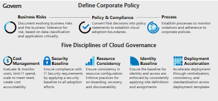

# Evaluate corporate policy

:::row:::
    :::column:::
        Any change to business processes or technology platforms introduces risk to the business. Cloud governance teams, whose members are sometimes known as cloud custodians, are tasked with mitigating these risks with minimal interruption to adoption or innovation efforts.    But cloud governance requires more than technical implementation. Subtle changes in the corporate narrative or corporate policies can affect adoption efforts significantly. Before implementation, it's important to look beyond IT while defining corporate policy.
    :::column-end:::
    :::column:::
           *Figure 1: Visual of corporate policy and the Five Disciplines of Cloud Governance.*
    :::column-end:::
:::row-end:::

## Define corporate policy

Defining corporate policy focuses on identifying and mitigating business risks regardless of the cloud platform. Healthy cloud governance strategy begins with sound corporate policy. The following three-step process guides the iterative development of such policies.

| &nbsp; | &nbsp; |
|--|--|
|    |   [Business risk](./policy-compliance/business-risk.md): Investigate current cloud adoption plans and data classification to identify risks to the business. Work with the business to balance risk tolerance and mitigation costs. |
|    |   [Policy and compliance](./policy-compliance/policy-definition.md): Evaluate risk tolerance to inform minimally invasive policies that govern cloud adoption and manage risks. In some industries, third-party compliance affects initial policy creation. |
|    |   [Processes](./policy-compliance/processes.md): The pace of adoption and innovation activities will naturally create policy violations. Executing relevant processes will aid in monitoring and enforcing adherence to policies. |

## Next steps

Learn how to prepare your corporate policy for the cloud.

> [!div class="nextstepaction"]
> [Prepare your corporate policy for the cloud](./policy-compliance/index.md)
