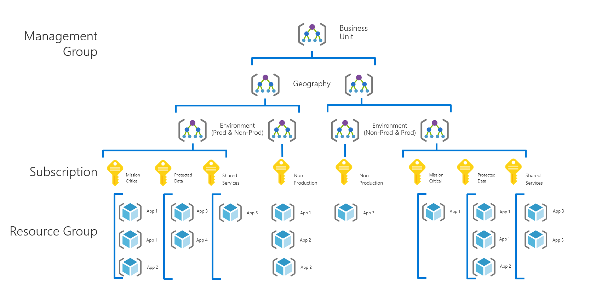

# Governance guide for complex enterprises

## Overview of best practices

This governance guide follows the experiences of a fictional company through various stages of governance maturity. It is based on real customer experiences. The suggested best practices are based on the constraints and needs of the fictional company.

As a quick starting point, this overview defines a minimum viable product (MVP) for governance based on best practices. It also provides links to some governance improvements that add further best practices as new business or technical risks emerge.

> [!WARNING]
> This MVP is a baseline starting point, based on a set of assumptions. Even this minimal set of best practices is based on corporate policies driven by unique business risks and risk tolerances. To see if these assumptions apply to you, read the [longer narrative](./narrative.md) that follows this article.

### Governance best practices

These best practices serve as a foundation for an organization to quickly and consistently add governance guardrails across multiple Azure subscriptions.

### Resource organization

The following diagram shows the governance MVP hierarchy for organizing resources.

Every application should be deployed in the proper area of the management group, subscription, and resource group hierarchy. During deployment planning, the cloud governance team will create the necessary nodes in the hierarchy to empower the cloud adoption teams.

1. Define a management group for each business unit with a detailed hierarchy that reflects geography then environment type (for example, production or not production).
2. Create a subscription for each unique combination of business unit, geography, and environment. Care should be taken if creating multiple subscriptions. See [here](http://) for more.
3. Apply [consistent nomenclature](../../../ready/considerations/naming-and-tagging.md) at each level of this grouping hierarchy.

These patterns provide room for growth without complicating the hierarchy unnecessarily.

[!INCLUDE [governance-of-resources](../../../../includes/caf-governance-of-resources.md)]

<!-- See comments for suggestion to possibly add here -->

## Incremental governance improvements

Once this MVP has been deployed, additional layers of governance can be quickly incorporated into the environment. Here are some ways to improve the MVP to meet specific business needs:

- [Security Baseline for protected data](./security-baseline-improvement.md)
- [Resource configurations for mission-critical applications](./resource-consistency-improvement.md)
- [Controls for Cost Management](./cost-management-improvement.md)
- [Controls for incremental multicloud improvement](./multicloud-improvement.md)

<!-- markdownlint-disable MD026 -->

## What does this guidance provide?

In the MVP, practices and tools from the [Deployment Acceleration](../../deployment-acceleration/index.md) discipline are established to quickly apply corporate policy. In particular, the MVP uses Azure Blueprints, Azure Policy, and Azure management groups to apply a few basic corporate policies, as defined in the narrative for this fictional company. Those corporate policies are applied using Azure Resource Manager templates and Azure policies to establish a small baseline for identity and security.

## Incremental improvements to governance practices

Over time, this governance MVP will be used to incrementally improve governance practices. As adoption advances, business risk grows. Various disciplines within the Cloud Adoption Framework governance model will adapt to manage those risks. Later articles in this series discuss the changes in corporate policy affecting the fictional company. These changes happen across four disciplines:

- Identity Baseline, as migration dependencies change in the narrative.
- Cost Management, as adoption scales.
- Security Baseline, as protected data is deployed.
- Resource Consistency, as IT Operations begins supporting mission-critical workloads.

## Next steps

Now that you’re familiar with the governance MVP and the forthcoming governance changes, read the supporting narrative for additional context.

> [!div class="nextstepaction"]
> [Read the supporting narrative](./narrative.md)
