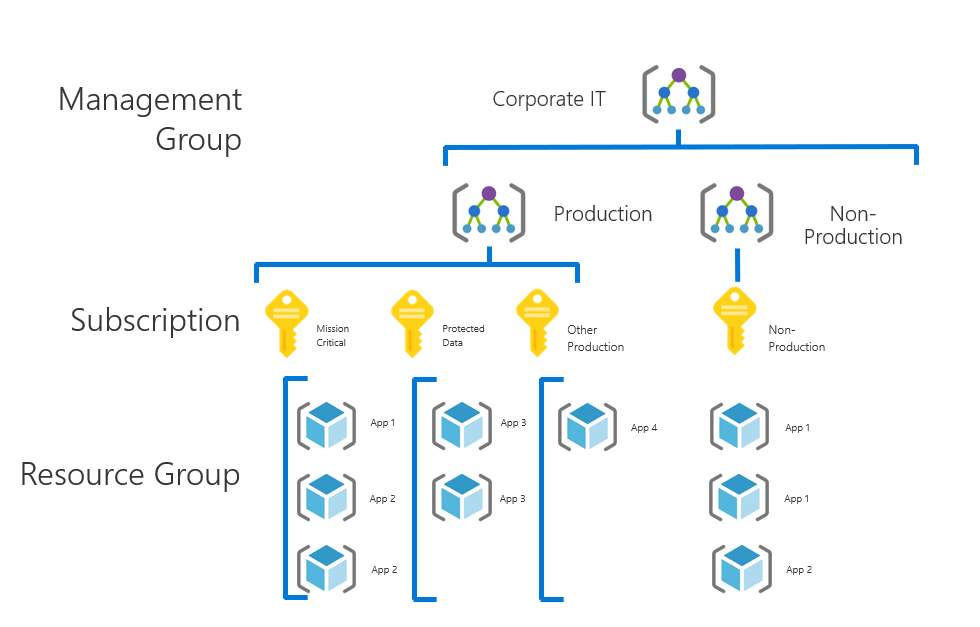

# Standard enterprise governance guide

## Overview of best practices

This governance guide follows the experiences of a fictional company through various stages of governance maturity. It's based on real customer experiences. The best practices are based on the constraints and needs of the fictional company.

As a quick starting point, this overview defines a minimum viable product (MVP) for governance based on best practices. It also provides links to some governance improvements that add further best practices as new business or technical risks emerge.

> [!WARNING]
> This MVP is a baseline starting point, based on a set of assumptions. Even this minimal set of best practices is based on corporate policies that are driven by unique business risks and risk tolerances. To see whether these assumptions apply to you, read the [longer narrative](./narrative.md) that follows this article.

### Governance best practices

These best practices serve as a foundation for an organization to quickly and consistently add governance guardrails across your subscriptions.

### Resource organization

The following diagram shows the governance MVP hierarchy for organizing resources.

Every application should be deployed in the proper area of the management group, subscription, and resource group hierarchy. During deployment planning, the cloud governance team will create the necessary nodes in the hierarchy to empower the cloud adoption teams.

1. One management group for each type of environment (such as production, development, and test).
2. Two subscriptions, one for production workloads and another for nonproduction workloads.
3. [Consistent nomenclature](../../../ready/azure-best-practices/naming-and-tagging.md) should be applied at each level of this grouping hierarchy.
4. Resource groups should be deployed in a manner that considers its contents lifecycle: everything that is developed together, is managed together, and retires together goes together. For more information about resource group best practices, see the [resource consistency decision guide](../../../decision-guides/resource-consistency/index.md).
5. [Region selection](../../../migrate/azure-best-practices/multiple-regions.md) is incredibly important and must be considered so that networking, monitoring, auditing can be in place for failover/failback as well as confirmation that [needed SKUs are available in the preferred regions](https://azure.microsoft.com/global-infrastructure/services/).

Here is an example of this pattern in use:

These patterns provide room for growth without complicating the hierarchy unnecessarily.

[!INCLUDE [governance-of-resources](../../../../includes/governance-of-resources.md)]

## Iterative governance improvements

Once this MVP has been deployed, additional layers of governance can be incorporated into the environment quickly. Here are some ways to improve the MVP to meet specific business needs:

- [Security baseline for protected data](./security-baseline-improvement.md)
- [Resource configurations for mission-critical applications](./resource-consistency-improvement.md)
- [Controls for cost management](./cost-management-improvement.md)
- [Controls for multicloud evolution](./multicloud-improvement.md)

## What does this guidance provide?

In the MVP, practices and tools from the [Deployment Acceleration discipline](../../deployment-acceleration/index.md) are established to quickly apply corporate policy. In particular, the MVP uses Azure Blueprints, Azure Policy, and Azure management groups to apply a few basic corporate policies, as defined in the narrative for this fictional company. Those corporate policies are applied using Resource Manager templates and Azure policies to establish a small baseline for identity and security.

## Incremental improvement of governance practices

Over time, this governance MVP will be used to improve governance practices. As adoption advances, business risk grows. Various disciplines within the Cloud Adoption Framework governance model will change to manage those risks. Later articles in this series discuss the incremental improvement of corporate policy affecting the fictional company. These improvements happen across three disciplines:

- The Cost Management discipline, as adoption scales.
- The Security Baseline discipline, as protected data is deployed.
- The Resource Consistency discipline, as IT operations begins supporting mission-critical workloads.

## Next steps

Now that you're familiar with the governance MVP and have an idea of the governance improvements to follow, read the supporting narrative for additional context.

> [!div class="nextstepaction"]
> [Read the supporting narrative](./narrative.md)
