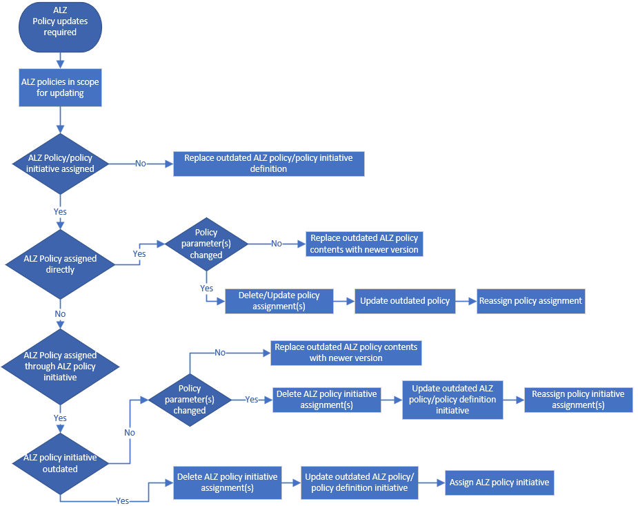

# Azure Landing Zone governance guide: Update Azure Landing Zone custom policies

Over time Azure Landing Zone (ALZ) custom policies and policy initiatives will be updated to newer versions that you'll want to incorporate into your Azure environment. This article describes how to update ALZ custom policies and policy initiatives when newer versions are released. Refer to [this article](update-alz-policies.md) if you are wanting to migrate custom policies to built-in policies. The guidance provided in this document describes manual high-level steps for performing the update, and references on how to handle the process for implementations managed through the [ALZ Terraform module](https://github.com/Azure/terraform-azurerm-caf-enterprise-scale) and [ALZ Bicep module(s)](https://aka.ms/alz/bicep).

The following infographic provides a frame of reference for the update process flow.

> [!CAUTION]
> When deleting existing Policy Assignments, the time it takes to reassign policy assignments leaves your environment unprotected. After assigning the updated policy, review the Policy Compliance section for unhealthy resources and remediate.

## Manual update steps for Azure Landing Zone environments

This section describes the generic high-level steps you would need to undertake to update ALZ custom policies and initiatives to the latest versions.

### Detect updates

There are the following authoritative options for determining that one or more custom ALZ policies has been updated as follows:

- You periodically review [What's new](https://github.com/Azure/Enterprise-Scale/wiki/Whats-new) and note that one or more policies are indicated as being outdated. An example can be seen [here](https://github.com/Azure/Enterprise-Scale/wiki/Whats-new#policy-11).
- You're using the [Azure Governance Visualizer](https://github.com/JulianHayward/Azure-MG-Sub-Governance-Reporting) and note that one or more policies are marked as *outDated*.

### Updating steps

- Determine if the ALZ policies in scope for update are currently assigned at any scope in your Azure estate. If using the [Azure Governance Visualizer](https://github.com/JulianHayward/Azure-MG-Sub-Governance-Reporting) this can be determined by checking the **TenantSummary**.
- Determine if any ALZ policies to be updated are part of an ALZ custom policy initiative.
- Determine if ALZ custom policy initiatives in scope for update are currently assigned at any scope in your Azure estate.

Depending on the result of the above investigations, the following actions should be taken.

#### Policies not assigned and not part of Azure Landing Zone custom policy initiative

If the outdated policy isn't assigned in your Azure estate, and isn't part of an existing ALZ custom policy initiative, do the following:

- Replace the outdated ALZ policy definition from the ALZ intermediate root Management Group (for example, `Contoso`) with the updated ALZ policy definition

If the ALZ custom policy initiative is outdated by an updated ALZ custom policy initiative and isn't assigned in your Azure estate, do the following:

- Replace the outdated ALZ policy initiative with the updated ALZ custom policy initiative at the ALZ intermediate root Management Group (for example, `Contoso`)

#### Policies assigned and not part of Azure Landing Zone custom policy initiative

If the outdated ALZ policy to be updated is assigned to any scope in your Azure estate, and isn't part of an existing ALZ custom policy initiative, and the number of parameters and their names hasn't changed, do the following:

- Replace the existing ALZ custom policy definition contents with the updated ALZ custom policy definition contents at the ALZ intermediate root Management Group (for example, `Contoso`)

For detailed guidance on how to achieve the above, refer to [this article](https://aka.ms/alz/custompolicyupdate).

#### Policies with changed parameters assigned and not part of Azure Landing Zone custom policy initiative

If the outdated ALZ policy to be updated is assigned to any scope in your Azure estate, and isn't part of an existing ALZ custom policy initiative, and the number of parameters and/or their names have changed, do the following:

- Capture all policy assignment(s), where assigned, and parameter value(s) for the outdated ALZ policy
- If there is more than one policy definition included in the policy assignment:
  - Update the existing policy assignments at all scopes, where assigned, by removing the outdated ALZ policy
    - Before removing the outdated ALZ policy, record the parameter value(s)
- If the policy assignment only contains the outdated ALZ policy:
  - Delete the existing policy assignments at all scopes, where assigned
    - Before deleting the policy assignment, record the assignment scope and parameter value(s)
- Delete the outdated ALZ policy from the ALZ intermediate root Management Group (for example, `Contoso`)
- Create (import) the updated ALZ policy to the ALZ intermediate root Management Group (for example, `Contoso`)
- Update the existing policy assignment(s) or create new policy assignments at the pre-recorded scopes by including the updated ALZ policy
- Review the Policy Compliance section to validate resources are in a healthy state after reassigning the updated ALZ custom policy initiative.

For detailed guidance on how to achieve the above, refer to [this article](https://aka.ms/alz/custompolicyupdate).

#### Policies assigned through Azure Landing Zone custom policy initiative

If the outdated policy to be updated is part of an ALZ custom policy initiative, and is assigned at any scope in your Azure estate, and the number of parameters and their names hasn't changed, do the following:

- Replace the existing ALZ custom policy definition contents with the updated ALZ custom policy definition contents
  - No further changes need to be made to the ALZ custom policy initiative or assignments since there weren't any changes to the number parameters or their names

For detailed guidance on how to achieve the above, refer to [this article](https://aka.ms/alz/custompolicyupdate).

#### Policies with changed parameters assigned through Azure Landing Zone custom policy initiative

If the outdated policy to be updated is part of an ALZ custom policy initiative, and is assigned at any scope in your Azure estate, and the number of parameters and/or their names have changed, do the following:

- Capture all policy assignment(s), where assigned, and parameter value(s) for the ALZ custom policy initiative
- Delete the existing policy assignments at all scopes, where assigned
  - Before deleting the policy assignment, record the assignment scope and parameter value(s)
- Delete the outdated policy from the ALZ custom policy initiative
  - **Initiative parameter(s)** can't be deleted from the ALZ custom policy initiative, consider reusing them
- Delete the outdated ALZ policy from the ALZ intermediate root Management Group (for example, `Contoso`)
- Create (import) the updated ALZ policy to the ALZ intermediate root Management Group (for example, `Contoso`)
- Add the updated ALZ policy to the ALZ custom policy initiative
  - If applicable, reuse the previous **Initiative parameter(s)**
  - If applicable, add another **Initiative parameter(s)** following existing naming patterns defined in the ALZ custom policy initiative
- Reassign the updated ALZ custom policy initiative
- Review the Policy Compliance section to validate resources are in a healthy state after reassigning the updated ALZ custom policy initiative.

For detailed guidance on how to achieve the above, refer to [this article](https://aka.ms/alz/custompolicyupdate).

#### Assigned outdated Azure Landing Zone custom policy initiative

If an outdated ALZ custom policy initiative is fully updated, and is assigned at any scope in your Azure estate, do the following:

- Capture all policy assignment(s), where assigned, and parameter value(s) for the ALZ custom policy initiative
- Delete the existing policy assignments at all scopes, where assigned
  - Before deleting the policy assignment, record the assignment scope and parameter value(s)
- Delete the ALZ custom policy initiative from the ALZ intermediate root Management Group (for example `Contoso`)
  - Before deleting, record all of the ALZ custom policy definitions names/ids
  - Assuming all ALZ custom policy definitions are up to date
- Create (import) the ALZ custom policy initiative definition with the appropriate policy references. Updated initiatives are available [here](https://github.com/Azure/Enterprise-Scale/tree/main/src/resources/Microsoft.Authorization/policySetDefinitions) with a generic *contoso* scope for custom policies. Remember to change *contoso* scope for each policy definition id(s) to your management group hierarchy pseudo root name.
- Reassign the updated ALZ custom policy initiative
- Review the Policy Compliance section to validate resources are in a healthy state after reassigning the updated ALZ custom policy initiative.

For detailed guidance on how to achieve the above, refer to [this article](https://aka.ms/alz/custompolicyupdate).

## Update steps for Azure Landing Zone Terraform module deployments

If you are using the [ALZ Terraform module](https://github.com/Azure/terraform-azurerm-caf-enterprise-scale) to manage you ALZ deployment, this section references resources on how to update ALZ custom policies and initiatives to newer policies.

### Terraform Detect updates

In addition to the methods described in [Detect updates](#detect-updates) on how to determine whether policies has changed, in the Terraform Module, you will also be able to see changes to policies in the [ALZ Terraform releases page](https://github.com/Azure/terraform-azurerm-caf-enterprise-scale/releases). An example can be seen [here](https://github.com/Azure/terraform-azurerm-caf-enterprise-scale/releases/tag/v2.3.0).

### Terraform Updating steps

The ALZ Terraform module provides update guidance when deploying breaking changes. Follow the upgrade guidance available for your specific version [here](https://aka.ms/alz/tf/upgrade) shown at the bottom of the page.

## Update steps for Azure Landing Zone Bicep deployments

If you are using the [ALZ Bicep](https://github.com/Azure/alz-bicep) to manage you ALZ deployment, this section references resources on how to update ALZ custom policies and initiatives to newer policies.

### Bicep Detect updates

In addition to the methods described in [Detect updates](#detect-updates) on how to determine whether policies has changed, in ALZ Bicep, you will also be able to see changes to policies in the [ALZ-Bicep releases](https://github.com/Azure/ALZ-Bicep/releases).

### Bicep Updating steps

ALZ Bicep provides generic guidance for updating policies from ALZ custom policies to newer policies. For more similar details, refer to [How to migrate ALZ custom policies to Azure built-in policies](https://github.com/Azure/ALZ-Bicep/wiki/PolicyDeepDive#how-to-migrate-alz-custom-policies-to-azure-built-in-policies).

## Next steps

Regardless of whether you use Azure Portal, Bicep or Terraform to manage your ALZ infrastructure, policies will change over time and will need to be managed. Use the flow described in this article as a starting point to develop processes around policy management for your specific ALZ implementation.
