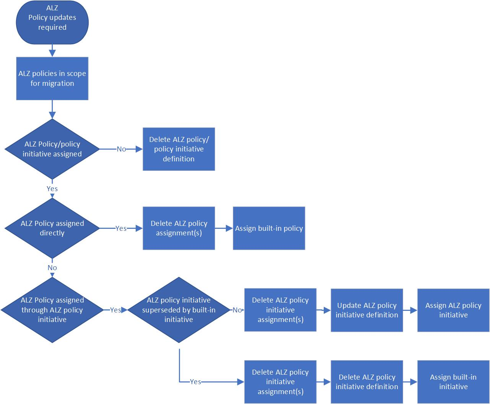

# Azure Landing Zone governance guide: Updating Azure Landing Zone custom policies to new versions of ALZ custom policies

Over time Azure Landing Zone (ALZ) custom policies and policy initiatives, may become outdated and should be removed or updated. This article describes how to update ALZ custom policies and policy initiatives to updated custom ALZ policies. The guidance provided in this document describes manual high-level steps for performing the update, as well as how to handle the process for implementations managed through the [ALZ Terraform module](https://github.com/Azure/terraform-azurerm-caf-enterprise-scale) and [ALZ Bicep module(s)](https://aka.ms/alz/bicep).

The following infographic provides a frame of reference for the update process flow.

## Manual update steps for Azure Landing Zone environments

### Detect updates

There are the following authoritative options for determining that one or more custom ALZ policies has been updated as follows:
- You periodically review [What's new](https://github.com/Azure/Enterprise-Scale/wiki/Whats-new) and note that one or more policies are indicated as being outdated. An example can be seen [here](https://github.com/Azure/Enterprise-Scale/wiki/Whats-new#policy-13)
- You are leveraging the [AzGovViz tool](https://github.com/JulianHayward/Azure-MG-Sub-Governance-Reporting) and note that one or more policies are marked as outDated. For more details on how this can be determined refer to [here](https://github.com/JulianHayward/Azure-MG-Sub-Governance-Reporting#screenshots)

### Migration steps

- Determine if the ALZ policies in scope for update are currently assigned at any scope in your Azure estate. If leveraging the [AzGovViz tool]() this can be determined by checking the tenant summary as shown [here](https://github.com/JulianHayward/Azure-MG-Sub-Governance-Reporting#screenshots)
- Determine if any ALZ policies to be updated are part of an ALZ custom policy initiative
- Determine if ALZ custom policy initiatives in scope for update are currently assigned at any scope in your Azure estate.

Depending on the result of the above investigations the following actions should be taken.

#### Policies not assigned and not part of Azure Landing Zone custom policy initiative

If the outdated policy is not assigned in your Azure estate, and is not part of an existing ALZ custom policy initiative, do the following:

- Replace the outdated ALZ policy definition from the ALZ intermediate root Management Group (for example, `Contoso`) with the updated ALZ policy definition

If the ALZ custom policy initiative is outdated by an updated ALZ custom policy initiative and is not assigned in your Azure estate, do the following:

- Replace the outdated ALZ policy initiative with the updated ALZ custom policy initiative at the ALZ intermediate root Management Group (for example, `Contoso`)

#### Policies assigned and not part of Azure Landing Zone custom policy initiative

If the outdated ALZ policy to be updated is assigned to any scope in your Azure estate, and is not part of an existing ALZ custom policy initiative, and the number of parameters and their names hasn't changed, do the following:

- Replace the existing ALZ custom policy definition contents with the updated ALZ custom policy definition contents at the ALZ intermediate root Management Group (for example, `Contoso`)

#### Policies with changed parameters assigned and not part of Azure Landing Zone custom policy initiative

If the outdated ALZ policy to be updated is assigned to any scope in your Azure estate, and is not part of an existing ALZ custom policy initiative, and the number of parameters and/or their names have changed, do the following:

- Capture all policy assignment(s), where assigned, and parameter value(s) for the outdated ALZ policy
- If there are more than one policy definition included in the policy assignment:
  - Update the existing policy assignments at all scopes, where assigned, by removing the outdated ALZ policy
    - Before removing the outdated ALZ policy, record the parameter value(s)
- If the policy assignment only contains the outdated ALZ policy:
  - Delete the existing policy assignments at all scopes, where assigned
    - Before deleting the policy assignment, record the assignment scope and parameter value(s)
- Delete the outdated ALZ policy from the ALZ intermediate root Management Group (for example, `Contoso`)
- Create (import) the updated ALZ policy to the ALZ intermediate root Management Group (for example, `Contoso`)
- Update the existing policy assignment(s) or create new policy assignments at the pre-recorded scopes by including the updated ALZ policy

#### Policies assigned through Azure Landing Zone custom policy initiative

If the outdated policy to be updated is part of an ALZ custom policy initiative, and is assigned at any scope in your Azure estate, and the number of parameters and their names hasn't changed, do the following:

- Replace the existing ALZ custom policy definition contents with the updated ALZ custom policy definition contents
  - No further changes need to be made to the ALZ custom policy initiative or assignments since there weren't any changes to the number parameters or their names

#### Policies with changed parameters assigned through Azure Landing Zone custom policy initiative

If the outdated policy to be updated is part of an ALZ custom policy initiative, and is assigned at any scope in your Azure estate, and the number of parameters and/or their names have changed, do the following:
- Capture all policy assignment(s), where assigned, and parameter value(s) for the ALZ custom policy initiative
- Delete the existing policy assignments at all scopes, where assigned
  - Before deleting the policy assignment, record the assignment scope and parameter value(s)
- Delete the outdated policy from the ALZ custom policy initiative
  - **Initiative parameter(s)** cannot be deleted from the ALZ custom policy initiative, consider reusing them
- Delete the outdated ALZ policy from the ALZ intermediate root Management Group (for example, `Contoso`)
- Create (import) the updated ALZ policy to the ALZ intermediate root Management Group (for example, `Contoso`)
- Add the updated ALZ policy to the ALZ custom policy initiative
  - If applicable, reuse the previous **Initiative parameter(s)**
  - If applicable, add additional **Initiative parameter(s)** following existing naming patterns defined in the ALZ custom policy initiative
- Re-assign the updated ALZ custom policy initiative

#### Assigned outdated Azure Landing Zone custom policy initiative

If an outdated ALZ custom policy initiative is fully updated, and is assigned at any scope in your Azure estate, do the following:
- Capture all policy assignment(s), where assigned, and parameter value(s) for the ALZ custom policy initiative
- Delete the existing policy assignments at all scopes, where assigned
  - Before deleting the policy assignment, record the assignment scope and parameter value(s)
- Delete the ALZ custom policy initiative from the ALZ intermediate root Management Group (for example `Contoso`)
  - Before deleting, record all of the policy definitions names/ids
  - Assuming all policy definitions are up to date
- Create (import) the ALZ custom policy initiative definition with the appropriate policy references. Updated initiatives are available [here](https://github.com/Azure/Enterprise-Scale/tree/main/src/resources/Microsoft.Authorization/policySetDefinitions) with a generic *contoso* scope for custom policies. Remember to change *contoso* scope for each policy definition ids to your management group hierarchy pseudo root name.
- Re-assign the updated ALZ custom policy initiative

## Update steps for Azure Landing Zone Terraform module deployments

### Terraform Detect updates

There are the following authoritative options for determining that one or more ALZ policies have been updated as follows:

- You periodically review [What's new](https://github.com/Azure/Enterprise-Scale/wiki/Whats-new) and note that one or more policies are indicated as being updated. An example can be seen [here](https://github.com/Azure/Enterprise-Scale/wiki/Whats-new#policy-13)
- You follow [ALZ Terraform release guidance](https://github.com/Azure/terraform-azurerm-caf-enterprise-scale/wiki/%5BUser-Guide%5D-Module-Releases) and note that one or more policies are indicated as being updated
- You are leveraging the [AzGovViz tool](https://github.com/JulianHayward/Azure-MG-Sub-Governance-Reporting) and note that one or more policies are marked as outDated. For more details on how this can be determined refer to [here](https://github.com/JulianHayward/Azure-MG-Sub-Governance-Reporting#screenshots)

### Terraform Migration steps

The ALZ Terraform module provides update guidance when deploying breaking changes. Follow the upgrade guidance available for your specific version [here](https://github.com/Azure/terraform-azurerm-caf-enterprise-scale/wiki), look under Upgrade Guides in the sidebar.

## Update steps for Azure Landing Zone Bicep deployments

### Bicep Detect updates

There are the following authoritative options for determining that one or more ALZ policies has been superseded by built-in Azure policies as follows:

- You periodically review [What's new](https://github.com/Azure/Enterprise-Scale/wiki/Whats-new) and note that one or more policies are indicated as being updated. An example can be seen [here](https://github.com/Azure/Enterprise-Scale/wiki/Whats-new#policy-13)
- You follow [ALZ-Bicep releases](https://github.com/Azure/ALZ-Bicep/releases) and note that one or more policies are indicated as being updated
- You are leveraging the [AzGovViz tool](https://github.com/JulianHayward/Azure-MG-Sub-Governance-Reporting) and note that one or more policies are marked as outDated. For more details on how this can be determined refer to [here](https://github.com/JulianHayward/Azure-MG-Sub-Governance-Reporting#screenshots)

### Bicep Migration steps

ALZ Bicep provides generic guidance for updating policies from ALZ custom policies to updated policies. `need to update for updated policies` For more details refer to [How to migrate ALZ custom policies to Azure built-in policies](https://github.com/Azure/ALZ-Bicep/wiki/PolicyDeepDive#how-to-migrate-alz-custom-policies-to-azure-built-in-policies).
