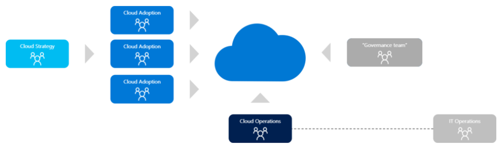
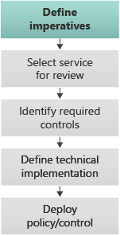
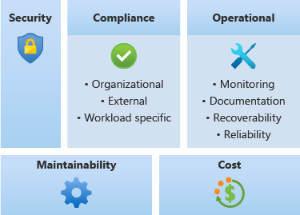
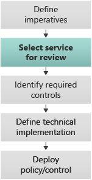
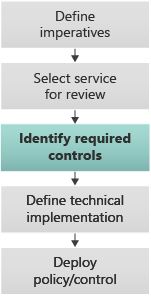
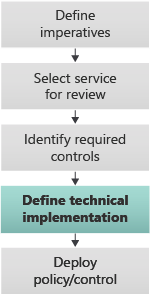
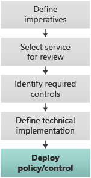
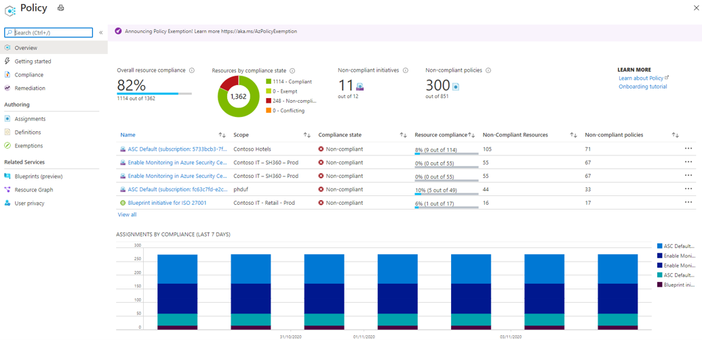
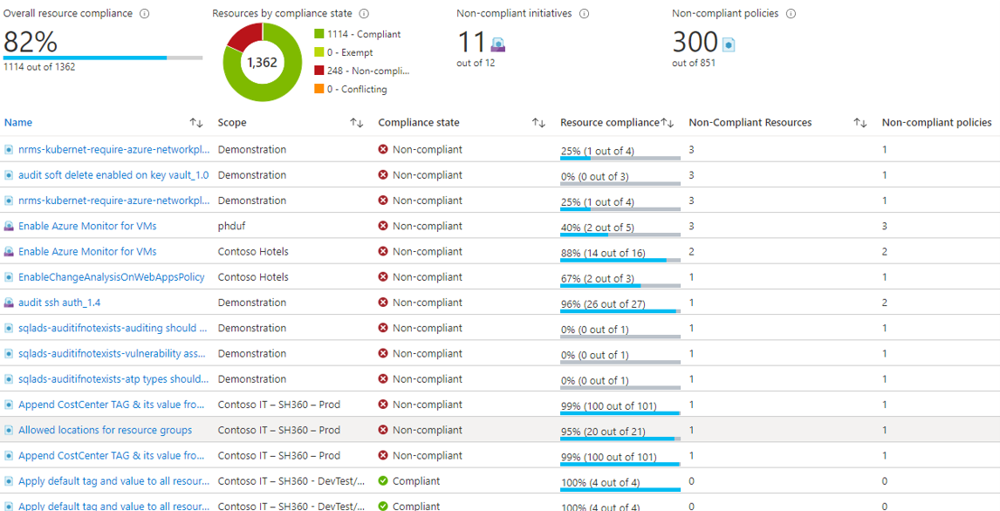

# Implementing Governance

## Architecture vs Governance

Previous to the cloud world, control and consistency was implemented by the architecture team, having influence and seeding each project.

In a cloud based world, with many implementations teams and the embrace of technological diversity, a central architecture team often struggles to scale and can be seen as a bottleneck to innovation. This causes many projects to implement without the involvement of the central team.

To embrace this level of diversity, empower the adoption teams and still maintain control the traditional architecture team need to drive the cloud governance function.

| Waterfall Architecture | Cloud Governance |
|--------------|------------|
| Dedicated team | Virtual team |
| Waterfall based approach | Often run by the architecture team |
| Gave strong guidance at the start of the project | Includes representatives from all areas (sec, network, ops, etc) |
| Control tapered off in the development process | Provides the rules and guardrails for component services |
| Could be a bottleneck for new projects | Works with a distributed adoption teams |
| Distributed adoption teams bypassed much of the process | Focus on all voices being heard and quality control |
| Architecture review used to check controls | Focus on all voices being heard and quality control |
| No enforcement on result |

By moving these controls to cloud governance, the same level of value can be implemented, while completely removing the bottleneck of the architecture team.

The problem then faced by the organization is how to implement cloud governance at a pace that can not only sustain a high level of innovation, but also ensure the right level of due diligence is implemented for all parts of the governance.

This process describes one possible implementation of governance allowing a controlled and measured implementation that is non-disruptive, regardless of the stage the organization is in the their cloud journey.

## Cloud as the arbitrator

One of the core components in providing control at cloud scale is to use the cloud itself to implement those controls. This is where we get the core concept where the [cloud becomes the arbiter of the controls](https://docs.microsoft.com/azure/cloud-adoption-framework/organize/organization-structures).

The cloud governance team decides, designs and builds the controls for the cloud, but ultimately the cloud executes the controls.

This enables the cloud governance team to implement the controls in a single place whilst the cloud adoption teams can come from many different areas. While it is desirable the cloud adoption teams interact and work with the cloud governance team there is no true requirement for this to happen.

## Service Review

The core part of this process is a simple five step process we will go through each of these individual items.

- [Define imperatives](#define-imperatives)
- [Select service for review](#select-service-for-review)
- [Identify required controls](#identify-required-controls)
- [Define technical implementation](#define-technical-implementation)
- [Deploy policy and control](#deploy-policy-control)

### Define Imperatives

| Process | Description |
|--|--|
|    | <li> Define guiding principles <li> Ensure statements are as generic as possible <li> Guidance should try to be minimized <li> Use the word MUST when defining controls <li> Written to empower Crowd sourcing of Service documentation <li> Change to the imperatives should be minimized and done on a predictable basis |

The first component of this process is to define the imperatives. These imperatives are clear guiding principles that outline the needs for security, operations or design consistency for all services in the cloud. The idea of these imperatives is to provide a set of understandable principals that should be adhered to when implementing all types of cloud technology.

The imperatives are collected and defined by the cloud governance team from many different sources, these include teams such as networking operations security risk and architecture. Ideally the imperatives include the reasoning for their sources to help people outside the governance team understand why these imperatives are important. This helps provide buy in from the different teams that are either implementing controls or ensuring that they adhere to the core controls.

While the core of the imperatives is for building the cloud controls they should be well understood by the cloud adoption teams as well, ensuring that their implementation of the cloud environment doesn't subvert the imperative controls.

The imperatives should be written in such a fashion that they are required, should avoid using words such as can or may, or controls that are only implemented in certain requirements. The controls should be clear and not open to interpretation to ensure that if two different teams were to implement a control they would come to the same level of control. This is key when leveraging the capability of crowd sourcing to get controls written in an agile manner.

If the imperatives provide overarching statements to all of the cloud implementations, it's important to try and minimize the change to these imperatives. When implementing change ensure that it's implemented on a predictable basis as these changes are far reaching.

#### Imperative Types

In the same way that the cloud governance team is collected from representatives of different parts of the organization, so too are the imperatives must include requirements from around the organization, both internal and external requirements. An imperative for a security requirement is no more, or less, important than the imperative for an operational requirement.

#### Why Crowd Source?

| Process | Description |
|--|--|
|    | <li> Azure is a very big resource with many services <li> The goal of this process is to accelerate and unblock <li> Crowd sourcing enables projects to be masters of their own destiny <li> Crowd sourcing empowers the governance process with a new work force <li> Written to empower Crowd sourcing of Service documentation <li> It keeps the governance team focused on Imperatives and review <li> **Final approval of content stays with the Governance Team** |

One of the key components around driving the velocity required in placing controls on the cloud to keep pace with the rate of change in the cloud, or innovation inside the organization, is to enable people outside the cloud governance team to implement many pieces of the work. This is where the implementation of clear imperatives can enable a crowd sourcing implementation of work.

The cloud has many services and whilst the cloud governance team can prepare a backlog for all of these services to go through a service review there is no way that they can keep pace with the demands of a large organization. In addition to this services in the cloud change at a continuing rate placing more and more demand on the need for a service review on previously defined services. Also projects may require knew types of services very quickly that they were not able to predict the demand for, and their immediate demand should not become a problem for the cloud governance team but rather should be borne by the cloud adoption team that needs a service.

When the imperatives are written clearly and understood by others then the following four steps of the service review pipeline can be augmented by the people that need the service or buy outside teams to help accelerate the service review process.

The crowd sourcing of these steps do not place control to other parties but rather allow outside teams to do the heavy lifting and creation of the content of these steps, the final approval any implementation of these with review is kept within the cloud governance team.

For example, if a cloud adoption team would suddenly need a new service that has not been through a review, in order to get the service review completed quicker they can leverage the documentation in the imperatives to identify and produce the controls all the way through the technical implementation and policy code for the cloud governance team. This would speed the process enabling the cloud adoption team to get quicker access to that service as they need to. This in turn can be interpreted as the first user pays type scenario for the implementation of new services.

Good Imperatives

- All business data should be encrypted at REST
- All services should report available operational metrics and logs to the central monitoring system

Not so good Imperatives

- All Data must be encrypted in transit
  - Should be focused on sensitive or meaningful data, no need to encrypt a network port probe from a LB
- Docker containers must have their JigaFlip option set
  - Is a control and is too specific
- Try and name virtual machines the same
  - Too open to interpretation and not imperative

Good imperatives shouldn't be open to interpretation, they should be simple to read, they should give the reader an understanding of why they're being implemented.

### Select service for review

The next part of the process is 4 steps that are iterative for each of the cloud services being used. This is a continual process in the core of the work for much of the cloud governance team. The core of this process is to take the Imperatives that have been defined and to interpret them into controls for each of the services in the cloud.

The selection of a service for review should be based on several components such as internal demand for the service complexity of the implementation of the review timing of the last review of the service and high-level risk value of the service.

This process should publish a backlog of items and a schedule of new reviews so that outside cloud adoption teams can understand when services are going to be selected for review and how long they may have to wait for a new service. This is key to allow cloud adoption teams to select services they have been under the controls of the environment.

| Process | Description |
|--|--|
|    | Triggers for service review <li> Project need for new service <li> Scheduled review of existing service <li> Major Cloud release of features in service <li> Change in Imperatives (this triggers all services need for review) <li> The need for a Service Review puts the service in the backlog for the review process <li> Review Schedule should be published for Adoption and Operations teams to access |

### Identify Required Controls

| Process | Description |
|--|--|
|    | <li> Review the capabilities of the service <li> Apply the matrix of Imperatives against the service capabilities <li> Define how the imperatives would be applied against the service <li> Other sources of controls to be considered, such as Azure Security best practices and common sense <li> Controls may be defined in different levels based on information classification. Beware of complexity, and try for standardization  |

### Define Technical Implementation

In this stage the controls of the service outlined in the service guidance are interpreted into their technical implementation on the service. At this stage the controls are identified in their implementation of the Azure environment for example requiring encryption on a storage account would require that a certain property be set on the storage account and this becomes the technical requirement of that control.

| Process | Description |
|--|--|
|    | Take the controls from the previous stage and define technical implementation.   |

### Deploy Policy Control

Finally, all controls are interpreted into Azure policy.
| Process | Description |
|--|--|
|    | Controls need to be passed to engineers to coded up and scheduled into releases.  |

> [!NOTE]
> Not all controls can be solely implemented through Azure policy.

## All controls are reported in Policy

A key component to the implementation is that all controls are reported through policy and thus the policy dashboard in Azure becomes the one place to review for an application owner the governance team or operations teams in understanding the status of any project or the platform in its entirety.

## Detailed breakdown of the compliance

## Azure Policy as dashboard and alerting

The Azure policy dashboard provides a single pane of glass for all teams to be able to review their compliance status. Additionally, the policy ancient drives exceptions and triggers to enable alerts to be sent through to the application owner should compliance file. Using this process and keeping Azure policy at the center of all control compliance enables a single engine for reporting and alerting without having to redesign these controls each time.

### Policy Enforcement is not all about Policy

- Policy should be the Single pane of glass

- All exceptions should report in Policy

- Policy is Imperative and cannot contain complex business logic

- Policy can work in conjunction with other systems
  - PowerShell Functions
  - Logic Apps

The controls should all be reported by policy however it is not possible to enforce all controls through policy alone.

Each policy control should be referenced back to the service review document to ensure people can get a deep understanding of where the control came from and what it's trying to achieve.

Any exception to a control that is outlined in the service review documents should appear in the Azure policy control panel.

However, as your policy needs to be imperative and thus it cannot contain complex business logic that is influenced by systems outside of the policy itself, an example of this is the implementation of a control that says all systems should be tagged with a valid cost centre. Well as your policy can ensure that systems have A tag called cost centre, and ensure that that tag meets a certain format, policy is not able to investigate the corporate accounting system to ensure that that costs enter is valid in the accounting system. For this purpose, we need to rely on other systems that can reach into business logic external systems and evaluate things in a complex manner but still bring the controls back to policy.

Components like PowerShell functions or logic apps can implement the review of an Service Review control but then being coded to ensure that they link back their results of implementation into Azure policy itself. This is usually achieved through the insertion of special tags onto an object that are then further audited by Azure policy. Using the example above, an Azure function could check any changes to a system and look at its cost centre and look inside the accounting system and confirm that this cost centre is valid, if the cost centre is found to be invalid it could then implement an additional tag on the resources to checked flagging that the cost centre is currently invalid. This is then further linked to an Azure policy that cheques for tags against invalid cost centres, now the Azure policy page has a list of assets but have cost center against them that is in the right format but is not valid in the current accounting system.

There are four key artifacts developed throughout this process.

1. The **service imperatives** this is the outline of the key controls that are required across all city all components of the cloud. They should be published up at the top over the reference documentation for cloud adoption teams to ensure that they have reviewed and understand the imperatives that are being built into the in systems. These imperatives must also be available to allow crowd sourcing teams to come in and implement service reviews.

2. The **service review schedule** is a document that outlines when the services are being reviewed and how long the expected wait for a review on a service could be. This not only allows adoption teams to know when a new service will become available, but also have an understanding of when existing services might change and need additional implementation of controls.

3. **Service guidance**, this is a per service document that outlines the key components around that service when it should be used any restrictions on what it should be used for as well as a list of controls that are enforced by the platform and the list of controls that are expected to be implemented by the developer. This is a library of documents that cloud adoption teams will refer to constantly in their understanding of which services they can pick up, use and plan the implementation of their project around these controls and components. The service guidance should also list any Azure policies and supporting functions that have been implemented to ensure reference ability between the policy is being enforced and the service controls.

4. **Azure policy and supporting functions**, these are the components or the technical implementation of the controls that go into the platform this code is version controlled and deployed.

### How do I start this process if I already have services in production?

Start by baselining every service that you are currently using and the controls that you currently enforce. For example, if KeyVaults are being used and there has been no controls enforced on them, then create that service guidance with no controls. This is called an MVP (or minimally viable product). Then trigger a “Service Review” for all services that are currently in use. Start the rollout of new controls in line with the Service Review policy, giving product teams time to remediate their services.

One of the key parts of this process is getting started when you already have an Azure footprint. The main thing you want to avoid is stifling innovation or being seen as the blocker to new projects. If this occurs, the business will usually try to work around the process.

To avoid this scenario, we start with a baseline of your organizations current implemented controls and services in use. This is the MVP start. In this stage to baseline, all services currently in production use are approved with their current policy controls. From here the process is ready to start working with the service guidance as if it were going through a normal review. For example, if your organization has deployed virtual machines to production today, and the only policy governing that is tagging, then the MVP for the VM Service Guidance will only document the control around tagging.

If additional controls need to be enforced for Virtual machines, a new version of the service guidance is written and the new controls implemented and this goes through the release cycle for new service guidance version.

### What is different in additional reviews for a service from its initial review?

- Service reviews happen on-demand or regular schedule

- Closer look at any changed company policy or new features of product

- Should look at how the service is currently  being used in the environment

- Consideration for existing development or production use in the release of changed controls
  - Consider releasing changed controls in Audit mode for period of time while notifying product owners of their compliance position to enable remediation  
  - Review audit position before deploying enforcement to get a view of change impact

Doing reviews for service that have an existing service guidance is slightly different from creating a new service guidance.

With the modification of an existing service guidance, we need to be mindful that there are adoption teams using the current service guidance in their work. Large changes may break their current projects.

In doing these incremental reviews of service guidance, we should look at how a service is currently being used to determine what impact new controls might create.

New controls should be released in an audit mode to start with, this would automatically trigger the policy alerting engine to start notifications to the application owners about remediation they need to implement.

A key component of the service review is to ensure that services that don't have recurrent review are not being deployed in the environment, the rationale behind this is the risk assessment must be done against the service before the organization starts using it .

In the initial stages when a service review process is just being put in place there is a slightly different adoption component on this and this is explained in the later section on how to get started .

In normal process when an application team needs to use a new service there are several stages of this and the process looks to accelerate their ability to start using the service and adopting it. The first stage is for the application team to nominate the new service that they need for a service review .

At the same time the adoption team can put in a request to start using a service in a disconnected sandbox environment , this allows the adoption team to start working with the service educating themselves prototyping solutions . The sandbox environment doesn't have any policy controls for the service as no review has been done yet. As part of the agreement to leverage these tools in the sandbox the adoption team always keeps in mind the service imperatives when implementing the services and tries to adhere to controls that would make the service compliant.

Once I draft version of the service review has been done, the service can then be provisionally approved for use in a development and test environment . At this stage, the code for the controls might not have been developed but basic guidance about how the service should be deployed will have been written. The developers can now start to work in the dev test environment with the understanding that they might require rework if new controls were to come in place as part of the final implementation of the full controls.

Once the service guidance is completed all the controls are signed off on and authorized by the cloud governance team the policy controls deployed to production environment then application teams are free to deploy the service into the production environment . This ensures that the team can deploy with the confidence of the final production controls and rework would be minimized.

After this the production controls are then migrated back to the development in test environment which may cause rework for the development environment  but ensures that the right controls are put in place.

## What happens with versioning this?

- All this needs to happen with release cycles
- Services need to be made available on a set date
- Policy controls need to be advertised on release cycle

All this needs to be done under version the design imperatives need to have a version and release cycle and these need to be tide back too the service guidance,  the service guidance needs to have a version and release cycle and these need to be tied back to the policy controls, and the policy controls need to have versions and be released in waves but is manageable.

