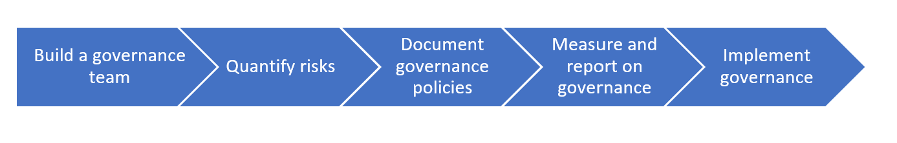

# Overview

Definition of governance: Governance in an organization serves to define its objectives, shape the organization’s culture, ensure compliance with laws, regulations, and standards, hold management accountable for their actions and decisions, and provide a structure for decision-making and control. 

## Why govern?

Governance acts as a system of protective barriers, ensuring risk management across all operations. Its primary function is to create a balanced framework that allows for autonomous decision-making within safe limits. It safeguards the organization against both accidental and deliberate internal or external threats by ensureing that stakeholder needs, conditions and options are evaluated to determine:
• balanced, agreed-on enterprise objectives to be achieved
• setting direction through prioritization and decision making
• and monitoring performance and compliance against agreed-on direction and objectives

## Cloud Governance principles
... be addressed early to ensure the successful use of the cloud within the enterprise.

... be configured when possible. Human behavior is controlled when proper guardrails are applied.

... evolve. Cloud governance is an iterative process. It must constantly be evaluated and strengthened.

## Governance MVG - Minimum Viable Governance (MVG) Approach – getting started

- Governance can be large and complex leading to slow cloud adoption.
- To overcome this challenge, organizations shall introduce a Minimum Viable Governance (MVG) approach for governance using agile methodologies.
- MVG involves creating a ‘simplified’ version of the overarching Cloud Governance with the minimum process, capabilities and functionalities required to address a core problem or deliver value to users.
- Incremental governance relies on a small set of corporate policies, processes, and tools to establish a foundation for adoption and governance.
- The foundation is called a minimum viable governance (MVG).
- An MVG allows the governance team to quickly incorporate governance into implementations throughout the adoption lifecycle.
- By levaraging for instance Azure Devops capabilites, governance activies can be easily linked to agile working styles within in an organization  and make it actionable by directly linking governance policies to code in a repository (e.g Azure Policies)

## Possible elements of a Governance Model are:
- Clearly defined Roles & Bodies/Boards
- Essential Governance Tasks & Responsibilities -> RACI Matrix
- Detailed Process description (e.g. Swim lane diagrams)
- Detailed Work Instructions or Operation procedures

Usual Outcome of a Governance model:
- Written Governance (Collection of policies) as items availables in (e.g. Wikis, Azure DevOps) for all Stakeholder
- Technical controls (e.g. Azure Policies)
  
## How to govern

## Prerequisites
