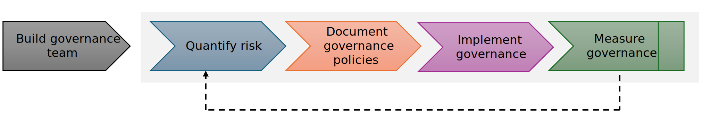

# Overview

Governance refers to the establishment of policies within an organization to minimize risk. Governance in an organization serves to define its objectives, shape the organization’s culture, ensure compliance with laws, regulations, and standards, hold management accountable for their actions and decisions, and provide a structure for decision-making and control.

## Why govern?

Governance acts as a system of protective barriers, ensuring risk management across all operations. Its primary function is to create a balanced framework that allows for autonomous decision-making within safe limits. It safeguards the organization against both accidental and deliberate internal or external threats by ensuring that stakeholder needs, conditions and options are evaluated to determine:
• balanced, agreed-on enterprise objectives to be achieved
• setting direction through prioritization and decision making
• and monitoring performance and compliance against agreed-on direction and objectives

## Why govern the cloud

## How to govern

## Next step

> [!div class="nextstepaction"]
> [Cloud governance checklist](cloud-governance-checklist.md)
