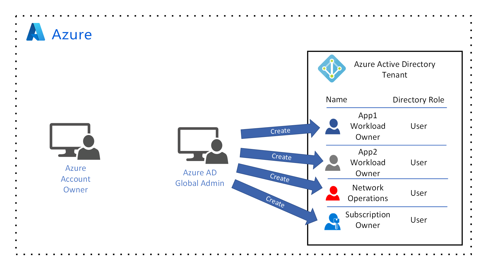

<!-- TODO: Rationalize name formats. -->

# Governance design for multiple teams

The goal of this guidance is to help you learn the process for designing a resource governance model in Azure to support multiple teams, multiple workloads, and multiple environments. First you'll look at a set of hypothetical governance requirements, then go through several example implementations that satisfy those requirements.

The requirements are:

- The enterprise plans to transition new cloud roles and responsibilities to a set of users and therefore requires identity management for multiple teams with different resource access needs in Azure. This identity management system is required to store the identity of the following users:
  - The individual in your organization responsible for ownership of **subscriptions**.
  - The individual in your organization responsible for the **shared infrastructure resources** used to connect your on-premises network to a virtual network in Azure.
  - Two individuals in your organization responsible for managing a **workload**.
- Support for multiple **environments**. An environment is a logical grouping of resources, such as virtual machines, virtual networking, and network traffic routing services. These groups of resources have similar management and security requirements and are typically used for a specific purpose such as testing or production. In this example, the requirement is for four environments:
  - A **shared infrastructure environment** that includes resources shared by workloads in other environments. For example, a virtual network with a gateway subnet that provides connectivity to on-premises.
  - A **production environment** with the most restrictive security policies. Could include internal or external facing workloads.
  - A **nonproduction environment** for development and testing work. This environment has security, compliance, and cost policies that differ from those in the production environment. In Azure, this takes the form of an Enterprise Dev/Test subscription.
  - A **sandbox environment** for proof of concept and education purposes. This environment is typically assigned per employee participating in development activities and has strict procedural and operational security controls in place to prevent corporate data from landing here. In Azure, these take the form of Visual Studio subscriptions. These subscriptions should also *not* be tied to the enterprise Azure Active Directory.
- A **permissions model of least privilege** in which users have no permissions by default. The model must support the following:
  - A single trusted user at the subscription scope, treated like a service account and granted permission to assign resource access rights.
  - Each workload owner is denied access to resources by default. Resource access rights are granted explicitly by the single trusted user at the resource group scope.
  - Management access for the shared infrastructure resources, limited to the shared infrastructure owners.
  - Management access for each workload restricted to the workload owner in production, and increasing levels of control as development proceeds through the various deployment environments (development, test, staging, and production).
  - The enterprise does not want to have to manage roles independently in each of the three main environments, and therefore requires the use of only [built-in roles](/azure/role-based-access-control/built-in-roles) available in Azure role-based access control (Azure RBAC). If the enterprise absolutely requires custom roles, additional processes would be needed to synchronize custom roles across the three environments.
- Cost tracking by workload owner name, environment, or both.

## Identity management

Before you can design identity management for your governance model, it's important to understand the four major areas it encompasses:

- **Administration:** The processes and tools for creating, editing, and deleting user identity.
- **Authentication:** Verifying user identity by validating credentials, such as a user name and password.
- **Authorization:** Determining which resources an authenticated user is allowed to access or what operations they have permission to perform.
- **Auditing:** Periodically reviewing logs and other information to discover security issues related to user identity. This includes reviewing suspicious usage patterns, periodically reviewing user permissions to verify they're accurate, and other functions.

There is only one service trusted by Azure for identity, and that is Azure Active Directory (Azure AD). You'll be adding users to Azure AD and using it for all of the functions listed above. Before looking at how to configure Azure AD, it's important to understand the privileged accounts that are used to manage access to these services.

When your organization signed up for an Azure account, at least one Azure **account owner** was assigned. Also, an Azure AD **tenant** was created, unless an existing tenant was already associated with your organization's use of other Microsoft services such as Microsoft 365. A **global administrator** with full permissions on the Azure AD tenant was associated when it was created.

The user identities for both the Azure account owner and the Azure AD Global Administrator are stored in a highly secure identity system that is managed by Microsoft. The Azure account owner is authorized to create, update, and delete subscriptions. The Azure AD Global Administrator is authorized to perform many actions in Azure AD, but for this design guide you'll focus on the creation and deletion of user identity.

> [!NOTE]
> Your organization may already have an existing Azure AD tenant if there's an existing Microsoft 365, Intune, or Dynamics 365 license associated with your account.

The Azure account owner has permission to create, update, and delete subscriptions:

*Figure 1: An Azure account with an Azure account owner and Azure AD global administrator.*

The Azure AD **global administrator** has permission to create user accounts:

*Figure 2: The Azure AD global administrator creates the required user accounts in the tenant.*

The first two accounts, **app1 workload owner** and **app2 workload owner**, are each associated with an individual in your organization responsible for managing a workload. The **network operations** account is owned by the individual that is responsible for the shared infrastructure resources. Finally, the **subscription owner** account is associated with the individual responsible for ownership of subscriptions.

## Resource access permissions model of least privilege

Now that your identity management system and user accounts have been created, you have to decide how to apply Azure roles to each account to support a permissions model of least privilege.

There's another requirement stating the resources associated with each workload be isolated from one another such that no one workload owner has management access to any other workload they do not own. There's also a requirement to implement this model using only built-in roles for Azure role-based access control.

Each Azure role is applied at one of three scopes in Azure: **subscription**, **resource group**, then an individual **resource**. Roles are inherited at lower scopes. For example, if a user is assigned the [built-in Owner role](/azure/role-based-access-control/built-in-roles#owner) at the subscription level, that role is also assigned to that user at the resource group and individual resource level unless overridden.

Therefore, to create a model of least-privilege access you have to decide the actions a particular type of user is allowed to take at each of these three scopes. For example, the requirement is for a workload owner to have permission to manage access to only the resources associated with their workload and no others. If you were to assign the built-in Owner role at the subscription scope, each workload owner would have management access to all workloads.

Let's take a look at two example permission models to understand this concept a little better. In the first example, the model trusts only the Service Administrator to create resource groups. In the second example, the model assigns the built-in Owner role to each workload owner at the subscription scope.

In both examples, there is a subscription Service Administrator that is assigned the built-in Owner role at the subscription scope. Recall that the built-in Owner role grants all permissions including the management of access to resources.

*Figure 3: A subscription with a Service Administrator assigned the built-in Owner role.*

<!-- docutune:casing "group A" "groups A and B" "owner A" -->

1. In the first example, **workload owner A** has no permissions at the subscription scope and no resource access management rights by default. This user wants to deploy and manage the resources for their workload. They must contact the **Service Administrator** to request creation of a resource group.
  
1. The **Service Administrator** reviews their request and creates **resource group A**. At this point, **workload owner A** still doesn't have permission to do anything.
  
1. The **Service Administrator** adds **workload owner A** to **resource group A** and assigns the [built-in Contributor role](/azure/role-based-access-control/built-in-roles#contributor). The Contributor role grants all permissions on **resource group A** except managing access permission.
  
1. Let's assume that **workload owner A** has a requirement for a pair of team members to view the CPU and network traffic monitoring data as part of capacity planning for the workload. Because **workload owner A** is assigned the Contributor role, they do not have permission to add a user to **resource group A**. They must send this request to the **Service Administrator**.
  
1. The **Service Administrator** reviews the request, and adds the two **workload contributor** users to **resource group A**. Neither of these two users require permission to manage resources, so they're assigned the [built-in Reader role](/azure/role-based-access-control/built-in-roles#contributor).
  
1. Next, **workload owner B** also requires a resource group to contain the resources for their workload. As with **workload owner A**, **workload owner B** initially does not have permission to take any action at the subscription scope so they must send a request to the **Service Administrator**.
  
1. The **Service Administrator** reviews the request and creates **resource group B**.
  
1. The **Service Administrator** then adds **workload owner B** to **resource group B** and assigns the built-in Contributor role.
  

At this point, each of the workload owners is isolated in their own resource group. None of the workload owners or their team members have management access to the resources in any other resource group.

*Figure 4: a subscription with two workload owners isolated with their own resource group.*

This model is a least-privilege model. Each user is assigned the correct permission at the correct resource management scope.

Consider that every task in this example was performed by the **Service Administrator**. While this is a simple example and may not appear to be an issue because there were only two workload owners, it's easy to imagine the types of issues that would result for a large organization. For example, the **Service Administrator** can become a bottleneck with a large backlog of requests that result in delays.

Let's take a look at second example that reduces the number of tasks performed by the **Service Administrator**.

1. In this model, **workload owner A** is assigned the built-in Owner role at the subscription scope, enabling them to create their own resource group: **resource group A**.
  
1. When **resource group A** is created, **workload owner A** is added by default and inherits the built-in Owner role from the subscription scope.
  
1. The built-in Owner role grants **workload owner A** permission to manage access to the resource group. **Workload owner A** adds two **workload contributors** and assigns the built-in Reader role to each of them.
  
1. The **Service Administrator** now adds **workload owner B** to the subscription with the built-in Owner role.
  
1. **Workload owner B** creates **resource group B** and is added by default. Again, **workload owner B** inherits the built-in Owner role from the subscription scope.
  

Note that in this model, the **Service Administrator** performed fewer actions than they did in the first example due to the delegation of management access to each of the individual workload owners.

*Figure 5: A subscription with a Service Administrator and two workload owners, all assigned the built-in Owner role.*

Because both **workload owner A** and **workload owner B** are assigned the built-in Owner role at the subscription scope, they have each inherited the built-in Owner role for each other's resource group. This means that not only do they have full access to each other's resources, they can also delegate management access to each other's resource groups. For example, **workload owner B** has rights to add any other user to **resource group A** and can assign any role to them, including the built-in Owner role.

If you compare each example to the requirements, you'll see that both examples support a single trusted user at the subscription scope with permission to grant resource access rights to the two workload owners. Each of the two workload owners did not have access to resource management by default and required the **Service Administrator** to explicitly assign permissions to them. Only the first example supports the requirement that the resources associated with each workload are isolated from one another such that no workload owner has access to the resources of any other workload.

## Resource management model

Now that you've designed a permissions model of least privilege, let's move on to take a look at some practical applications of these governance models. Recall from the requirements that you must support the following three environments:

1. **Shared infrastructure environment:** A group of resources shared by all workloads. These are resources such as network gateways, firewalls, and security services.
2. **Production environment:** Multiple groups of resources representing multiple production workloads. These resources are used to host the private and public-facing application artifacts. These resources typically have the tightest governance and security models to protect the resources, application code, and data from unauthorized access.
3. **Preproduction environment:** Multiple groups of resources representing multiple workloads not yet ready for production. These resources are used for development and testing, and may have a more relaxed governance model to enable increased developer agility. Security within these groups should increase as the application development process moves closer to production.

For each of these three environments, there is a requirement to track cost data by **workload owner**, **environment**, or both. That is, you'll want to know the ongoing cost of the **shared infrastructure**, the costs incurred by individuals in both the **nonproduction** and **production** environments, and finally the overall cost of **nonproduction** and **production** environments.

You have already learned that resources are scoped to two levels: **subscription** and **resource group**. Therefore, the first decision is how to organize environments by **subscription**. There are only two possibilities: a single subscription or multiple subscriptions.

Before you look at examples of each of these models, let's review the management structure for subscriptions in Azure.

Recall from the requirements that you have an individual in the organization who is responsible for subscriptions, and this user owns the **subscription owner** account in the Azure AD tenant. This account does not have permission to create subscriptions. Only the **Azure account owner** has permission to do this:

*Figure 6: An Azure account owner creates a subscription.*

Once the subscription has been created, the **Azure account owner** can add the **subscription owner** account to the subscription with the **owner** role:

.
*Figure 7: The Azure account owner adds the subscription owner user account to the subscription with the owner role.*

The **subscription owner** account can now create **resource groups** and delegate resource access management.

First let's look at an example resource management model using a single subscription. The first decision is how to align resource groups to the three environments. You have two options:

1. Align each environment to a single resource group. All shared infrastructure resources are deployed to a single **shared infrastructure** resource group. All resources associated with development workloads are deployed to a single **development** resource group. All resources associated with production workloads are deployed into a single **production** resource group for the **production** environment.
1. Create separate resource groups for each workload, using a naming convention and tags to align resource groups with each of the three environments.

Let's begin by evaluating the first option. You'll be using the permissions model that was discussed in the previous section, with a single subscription Service Administrator who creates resource groups and adds users to them with either the built-in **Contributor** or **Reader** role.

1. The first resource group deployed represents the **shared infrastructure** environment. The **subscription owner** account creates a resource group for the shared infrastructure resources named `netops-shared-rg`.
  
1. The **subscription owner** account adds the **network operations user** account to the resource group and assigns the **Contributor** role.
  
1. The **network operations user** [creates a VPN gateway](/azure/vpn-gateway/vpn-gateway-about-vpngateways) and configures it to connect to the on-premises VPN appliance. The **network operations user** also applies a pair of [tags](/azure/azure-resource-manager/management/tag-resources) to each of the resources: `environment:shared` and `managedBy:netops`. When the **subscription Service Administrator** exports a cost report, costs will be aligned with each of these tags. This allows the **subscription Service Administrator** to pivot costs using the `environment` tag and the `managedBy` tag. Notice the **resource limits** counter at the top right-hand side of the figure. Each Azure subscription has [service limits](/azure/azure-resource-manager/management/azure-subscription-service-limits), and to help you understand the effect of these limits you'll follow the virtual network limit for each subscription. There is a limit of 1,000 virtual networks per subscription, and after the first virtual network is deployed there are now 999 available.
  
1. Two more resource groups are deployed. The first is named `prod-rg`. This resource group is aligned with the production environment. The second is named `dev-rg` and is aligned with the development environment. All resources associated with production workloads are deployed to the production environment and all resources associated with development workloads are deployed to the development environment. In this example, you'll only deploy two workloads to each of these two environments, so you won't encounter any Azure subscription service limits. Consider that each resource group has a limit of 800 resources per resource group. If you continue to add workloads to each resource group, you'll eventually reach this limit.
  
1. The first **workload owner** sends a request to the **subscription Service Administrator** and is added to each of the development and production environment resource groups with the **Contributor** role. As you learned earlier, the **Contributor** role allows the user to perform any operation other than assigning a role to another user. The first **workload owner** can now create the resources associated with their workload.
  
1. The first **workload owner** creates a virtual network in each of the two resource groups with a pair of virtual machines in each. The first **workload owner** applies the `environment` and `managedBy` tags to all resources. Note that the Azure service limit counter is now at 997 virtual networks remaining.
  
1. None of the virtual networks has connectivity to on-premises when created. In this type of architecture, each virtual network must be peered to the `hub-vnet` in the **shared infrastructure** environment. Virtual network peering creates a connection between two separate virtual networks and allows network traffic to travel between them. Note that virtual network peering is not inherently transitive. A peering must be specified in each of the two virtual networks that are connected, and if only one of the virtual networks specifies a peering, then the connection is incomplete. To illustrate the effect of this, the first **workload owner** specifies a peering between `prod-vnet` and `hub-vnet`. The first peering is created, but no traffic flows because the complementary peering from `hub-vnet` to `prod-vnet` has not yet been specified. The first **workload owner** contacts the **network operations** user and requests this complementary peering connection.
  
1. The **network operations** user reviews the request, approves it, then specifies the peering in the settings for the `hub-vnet`. The peering connection is now complete, and network traffic flows between the two virtual networks.
  
1. Now, a second **workload owner** sends a request to the **subscription Service Administrator** and is added to the existing **production** and **development** environment resource groups with the **Contributor** role. The second **workload owner** has the same permissions on all resources as the first **workload owner** in each resource group.
  
1. The second **workload owner** creates a subnet in the `prod-vnet` virtual network, then adds two virtual machines. The second **workload owner** applies the `environment` and `managedBy` tags to each resource.
  

This example resource management model enables us to manage resources in the three required environments. The shared infrastructure resources are protected because only a single user in the subscription has permission to access those resources. Each of the workload owners can use the shared infrastructure resources without having any permissions on the shared resources themselves. This management model fails the requirement for workload isolation, because both **workload owners** can access the resources of each other's workload.

There's another important consideration with this model that may not be immediately obvious. In the example, it was **app1 workload owner** that requested the network peering connection with the `hub-vnet` to provide connectivity to the on-premises network. The **network operations** user evaluated that request based on the resources deployed with that workload. When the **subscription owner** account added **app2 workload owner** with the **Contributor** role, that user had management access rights to all resources in the `prod-rg` resource group.

This means **app2 workload owner** had permission to deploy their own subnet with virtual machines in the `prod-vnet` virtual network. By default, those virtual machines have access to the on-premises network. The **network operations** user is not aware of those machines and did not approve their connectivity to on-premises.

Next, let's look at a single subscription with multiple resource groups for different environments and workloads. Note that in the previous example, the resources for each environment were easily identifiable because they were in the same resource group. Now that you no longer have that grouping, you will have to rely on a resource group naming convention to provide that functionality.

1. The **shared infrastructure** resources will still have a separate resource group in this model, so that remains the same. Each workload requires two resource groups, one for each of the **development** and **production** environments. For the first workload, the **subscription owner** account creates two resource groups. The first is named `app1-prod-rg` and the second is named `app1-dev-rg`. As discussed earlier, this naming convention identifies the resources as being associated with the first workload, `app1`, and either the **development** or **production** environment. Again, the **subscription owner** account adds **app1 workload owner** to the resource group with the **Contributor** role.
  
2. Similar to the first example, **app1 workload owner** deploys a virtual network named `app1-prod-vnet` to the **production** environment, and another named `app1-dev-vnet` to the **development** environment. Again, **app1 workload owner** sends a request to the **network operations** user to create a peering connection. Note that **app1 workload owner** adds the same tags as in the first example, and the limit counter has been decremented to 997 virtual networks remaining in the subscription.
  
3. The **subscription owner** account now creates two resource groups for **app2 workload owner**. Following the same conventions as for **app1 workload owner**, the resource groups are named `app2-prod-rg` and `app2-dev-rg`. The **subscription owner** account adds **app2 workload owner** to each of the resource groups with the **Contributor** role.
  
4. The **app2 workload owner** account deploys virtual networks and virtual machines to the resource groups with the same naming conventions. Tags are added and the limit counter has been decremented to 995 virtual networks remaining in the subscription.
  
5. The **app2 workload owner** account sends a request to the **network operations user** to peer the `app2-prod-vnet` with the `hub-vnet`. The **network operations** user creates the peering connection.
  

The resulting management model is similar to the first example, with several key differences:

- Each of the two workloads is isolated by workload and by environment.
- This model required two more virtual networks than the first example model. While this is not an important distinction with only two workloads, the theoretical limit on the number of workloads for this model is 24.
- Resources are no longer grouped in a single resource group for each environment. Grouping resources requires an understanding of the naming conventions used for each environment.
- Each of the peered virtual network connections was reviewed and approved by the **network operations user**.

Now let's look at a resource management model using multiple subscriptions. In this model, you'll align each of the three environments to a separate subscription: a **shared services** subscription, **production** subscription, and finally a **development** subscription. The considerations for this model are similar to a model using a single subscription in that you have to decide how to align resource groups to workloads. Already determined is that creating a resource group for each workload satisfies the workload isolation requirement, so you'll stick with that model in this example.

1. In this model, there are three subscriptions: **shared infrastructure**, **production**, and **development**. Each of these three subscriptions requires a subscription owner, and in the simple example you'll use the same user account for all three. The **shared infrastructure** resources are managed similarly to the first two examples above, and the first workload is associated with the `app1-rg` resource group in the **production** environment and the same-named resource group in the **development** environment. The **app1 workload owner** account is added to each of the resource group with the **Contributor** role.

    

2. As with the earlier examples, **app1 workload owner** creates the resources and requests the peering connection with the **shared infrastructure** virtual network. The **app1 workload owner** account adds only the `managedBy` tag because there is no longer a need for the `environment` tag. That is, resources are for each environment are now grouped in the same **subscription** and the `environment` tag is redundant. The limit counter is decremented to 999 virtual networks remaining.

    

3. Finally, the **subscription owner** account repeats the process for the second workload, adding the resource groups with **app2 workload owner** in the **Contributor** role. The limit counter for each of the environment subscriptions is decremented to 998 virtual networks remaining.

This management model has the benefits of the second example above. The key difference is that limits are less of an issue due to the fact that they're spread over two subscriptions. The drawback is that the cost data tracked by tags must be aggregated across all three subscriptions.

Therefore, you can select any of these two examples resource management models depending on the priority of your requirements. If you anticipate that your organization will not reach the service limits for a single subscription, you can use a single subscription with multiple resource groups. Conversely, if your organization anticipates many workloads, multiple subscriptions for each environment may be better.

## Implement the resource management model

You've learned about several different models for governing access to Azure resources. Now you'll walk through the steps necessary to implement the resource management model with one subscription for each of the **shared infrastructure**, **production**, and **development** environments from the design guide. You'll have one **subscription owner** account for all three environments. Each workload will be isolated in a **resource group** with a **workload owner** added with the **Contributor** role.

> [!NOTE]
> To learn more about the relationship between Azure accounts and subscriptions, see [Understanding resource access in Azure](/azure/role-based-access-control/rbac-and-directory-admin-roles).

Follow these steps:

1. Create an [Azure account](/azure/active-directory/fundamentals/sign-up-organization) if your organization doesn't already have one. The person who signs up for the Azure account becomes the Azure account administrator, and your organization's leadership must select an individual to assume this role. This individual will be responsible for:
    - Creating subscriptions.
    - Creating and administering [Azure Active Directory (Azure AD)](/azure/active-directory/fundamentals/active-directory-whatis) tenants that store user identity for those subscriptions.
2. Your organization's leadership team decides who is responsible for:
    - Management of user identity; an [Azure AD tenant](/azure/active-directory/develop/quickstart-create-new-tenant) is created by default when your organization's Azure account is created, and the account administrator is added as the [Azure AD Global Administrator](/azure/active-directory/roles/permissions-reference) by default. Your organization can choose another user to manage user identity by [assigning the Azure AD Global Administrator role to that user](/azure/active-directory/fundamentals/active-directory-users-assign-role-azure-portal).
    - Subscriptions, which means these users:
        - Manage costs associated with resource usage in that subscription.
        - Implement and maintain least permission model for resource access.
        - Keep track of service limits.
    - Shared infrastructure services (if your organization decides to use this model), which means this user is responsible for:
        - On-premises to Azure network connectivity.
        - Ownership of network connectivity within Azure through virtual network peering.
    - Workload owners.
3. The Azure AD Global Administrator [creates the new user accounts](/azure/active-directory/fundamentals/add-users-azure-active-directory) for:
    - The person who will be the subscription owner for each subscription associated with each environment. Note that this is necessary only if the subscription Service Administrator will not be tasked with managing resource access for each subscription/environment.
    - The person who will be the **network operations user**.
    - The people who are **workload owners**.
4. The Azure account administrator [creates three Azure subscriptions](/azure/cost-management-billing/manage/create-subscription):
    - A subscription for the **shared infrastructure** environment.
    - A subscription for the **production** environment.
    - A subscription for the **development** environment.
5. The Azure account administrator [adds the subscription service owner to each subscription](/azure/cost-management-billing/manage/add-change-subscription-administrator#to-assign-a-user-as-an-administrator).
6. Create an approval process for **workload owners** to request the creation of resource groups. The approval process can be implemented in many ways, such as over email, or you can using a process management tool such as [SharePoint workflows](https://support.office.com/article/introduction-to-sharepoint-workflow-07982276-54e8-4e17-8699-5056eff4d9e3). The approval process can follow these steps:
    - The **workload owner** prepares a bill of materials for required Azure resources in either the **development** environment, **production** environment, or both, and submits it to the **subscription owner**.
    - The **subscription owner** reviews the bill of materials and validates the requested resources to ensure that the requested resources are appropriate for their planned use, such as checking that the requested [virtual machine sizes](/azure/virtual-machines/sizes) are correct.
    - If the request is not approved, the **workload owner** is notified. If the request is approved, the **subscription owner** [creates the requested resource group](/azure/azure-resource-manager/management/manage-resource-groups-portal#create-resource-groups) following your organization's [naming conventions](../../ready/azure-best-practices/naming-and-tagging.md), [adds the **workload owner**](/azure/role-based-access-control/role-assignments-portal#add-a-role-assignment) with the [**Contributor** role](/azure/role-based-access-control/built-in-roles#contributor) and sends notification to the **workload owner** that the resource group has been created.
7. Create an approval process for workload owners to request a virtual network peering connection from the shared infrastructure owner. As with the previous step, this approval process can be implemented using email or a process management tool.

Now that you've implemented your governance model, you can deploy your shared infrastructure services.

## Related resources

[Azure built-in roles](/azure/role-based-access-control/built-in-roles)
