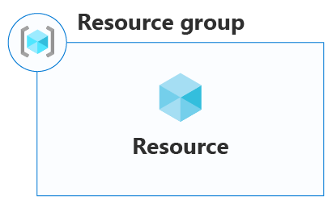
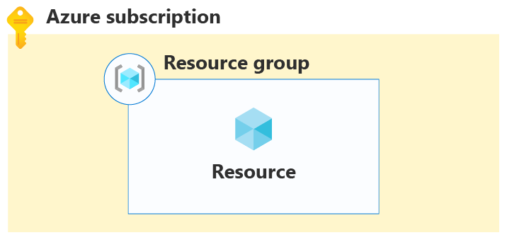
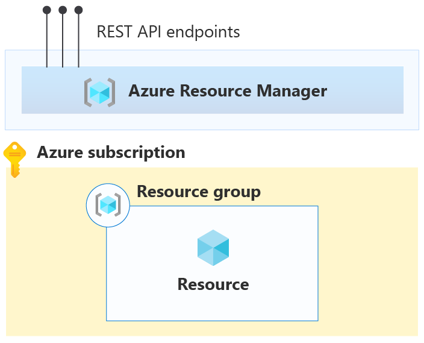
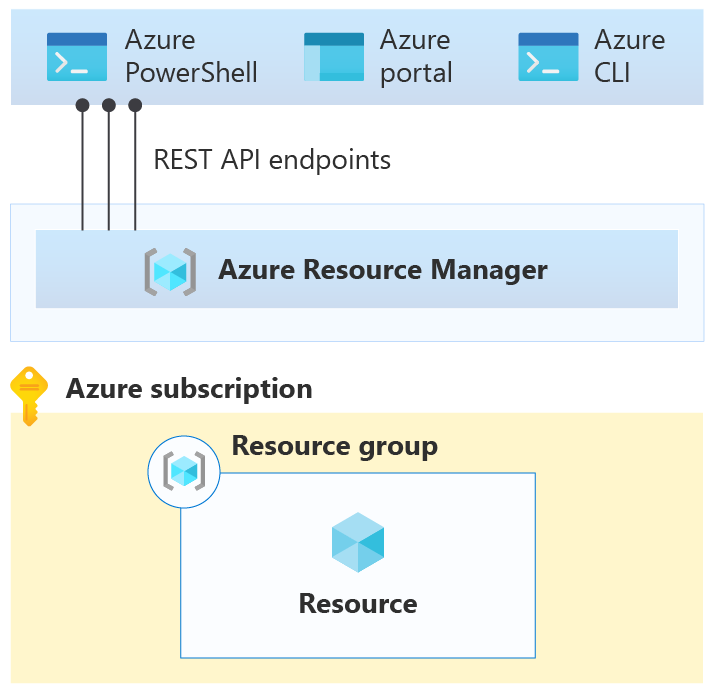
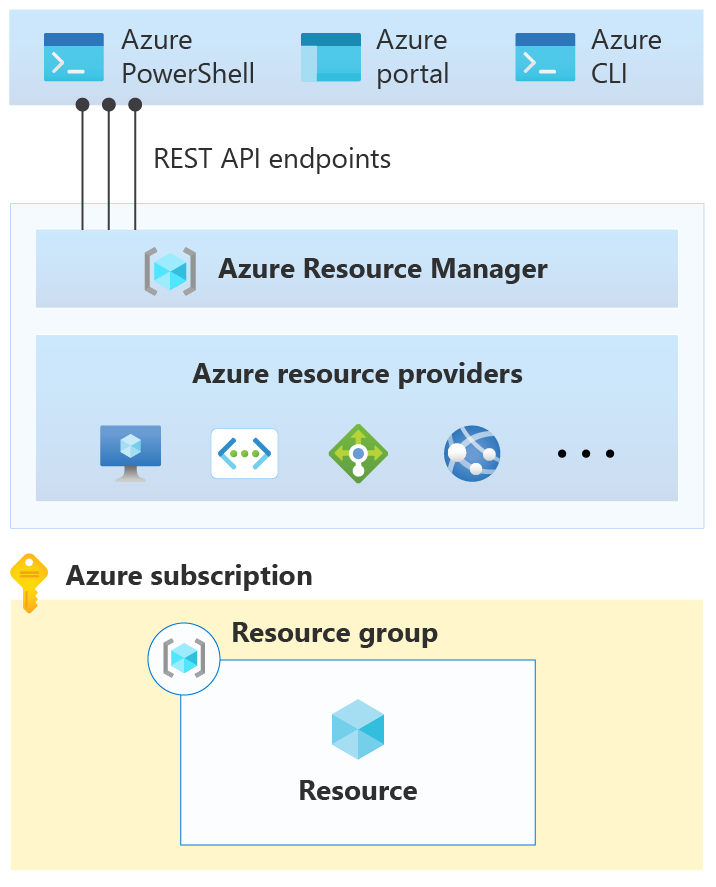
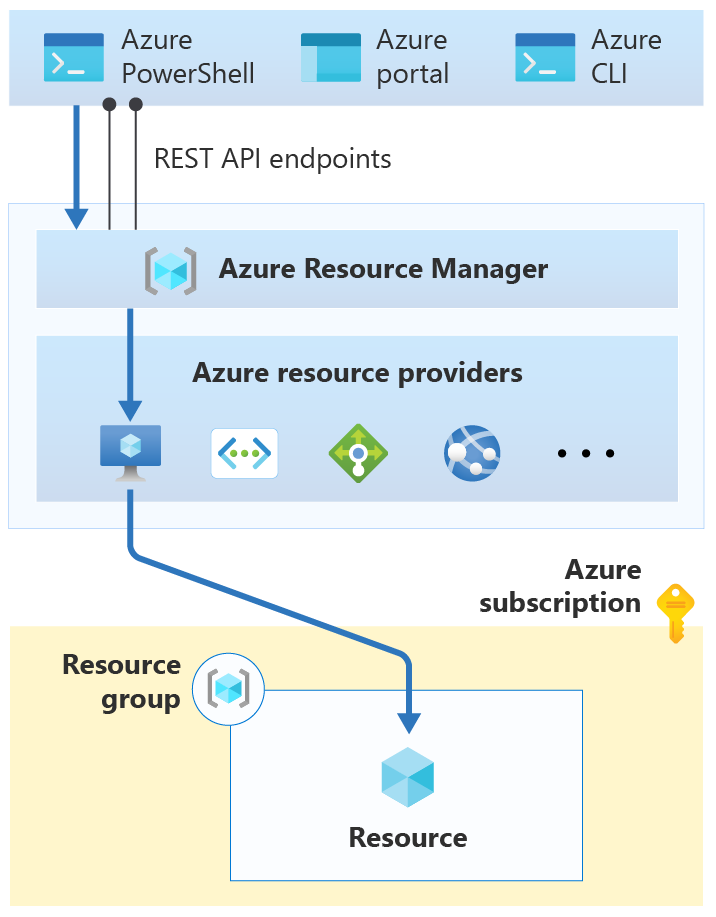
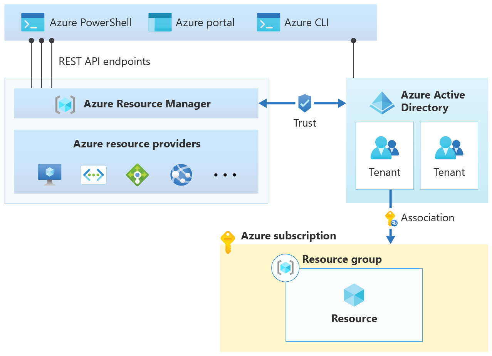
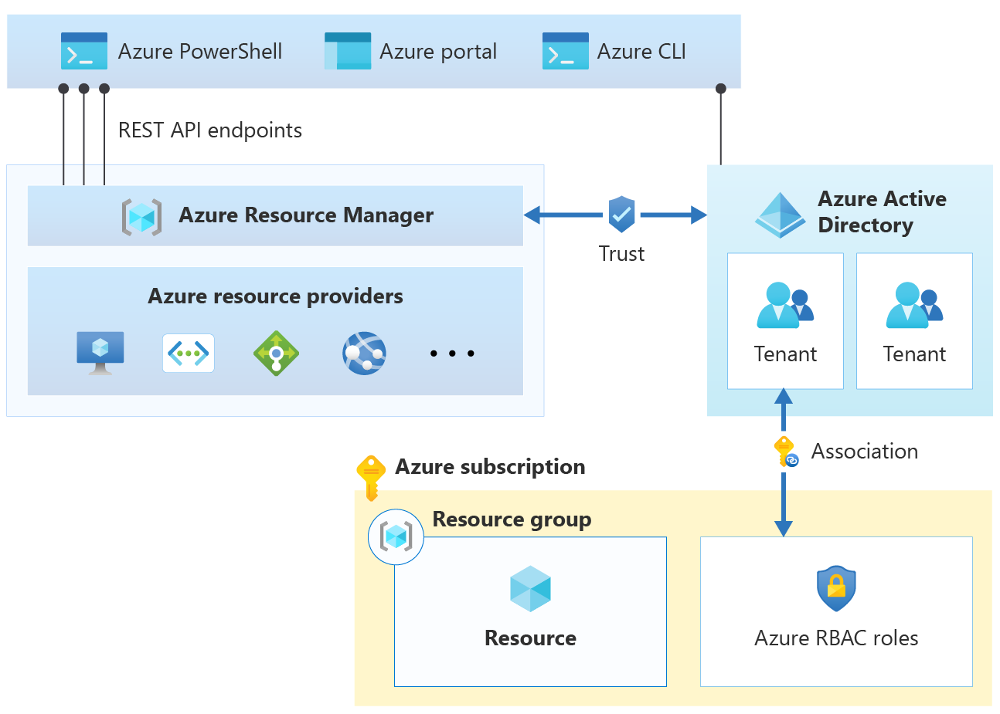
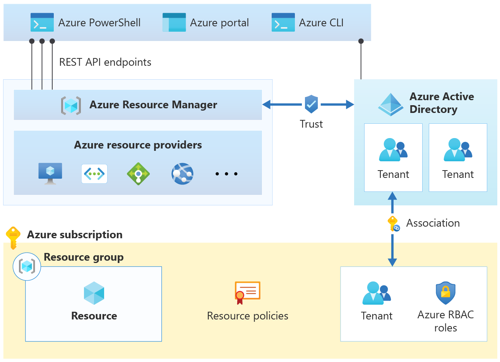
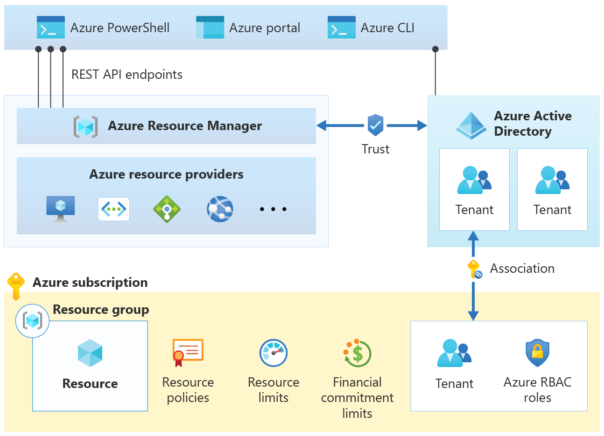

# Resource access management in Azure

The [Govern methodology](../index.md) outlines the Five Disciplines of Cloud Governance, which includes resource management. [What is resource access governance](./index.md) furthers explains how resource access management fits into the resource management discipline. Before you move on to learn how to design a governance model, it's important to understand the resource access management controls in Azure. The configuration of these resource access management controls forms the basis of your governance model.

Begin by taking a closer look at how resources are deployed in Azure.

## What is an Azure resource?

In Azure, the term _resource_ refers to an entity managed by Azure. For example, virtual machines, virtual networks, and storage accounts are all referred to as Azure resources.

_Figure 1: A resource._

## What is an Azure resource group?

Each resource in Azure must belong to a [resource group](/azure/azure-resource-manager/management/overview#resource-groups). A resource group is simply a logical construct that groups multiple resources together so they can be managed as a single entity **based on lifecycle and security**. For example, resources that share a similar lifecycle, such as the resources for an [n-tier application](/azure/architecture/guide/architecture-styles/n-tier) may be created or deleted as a group. In other words, everything that is born together, gets managed together, and deprecates together, goes together in a resource group.

_Figure 2: A resource group contains a resource._

Resource groups and the resources they contain are associated with an Azure subscription.

## What is an Azure subscription?

An Azure _subscription_ is similar to a resource group in that it's a logical construct that groups together resource groups and their resources. An Azure subscription is also associated with the controls used by Azure Resource Manager. Take a closer look at Azure Resource Manager to learn about the relationship between it and an Azure subscription.

_Figure 3: An Azure subscription._

## What is Azure Resource Manager?

In [How does Azure work?](../../get-started/what-is-azure.md) you learned that Azure includes a front end with many services that orchestrate all the functions of Azure. One of these services is [Azure Resource Manager](/azure/azure-resource-manager), and this service hosts the RESTful API used by clients to manage resources.

_Figure 4: Azure Resource Manager._

The following figure shows three clients: [PowerShell](/powershell/azure/overview), the [Azure portal](https://portal.azure.com), and the [Azure CLI](/cli/azure):

_Figure 5: Azure clients connect to the Resource Manager REST API._

While these clients connect to Resource Manager using the REST API, Resource Manager does not include functionality to manage resources directly. Rather, most resource types in Azure have their own [resource provider](/azure/azure-resource-manager/management/overview#terminology).

_Figure 6: Azure resource providers._

When a client makes a request to manage a specific resource, Azure Resource Manager connects to the resource provider for that resource type to complete the request. For example, if a client makes a request to manage a virtual machine resource, Azure Resource Manager connects to the `Microsoft.Compute` resource provider.

_Figure 7: Azure Resource Manager connects to the `Microsoft.Compute` resource provider to manage the resource specified in the client request._

Azure Resource Manager requires the client to specify an identifier for both the subscription and the resource group in order to manage the virtual machine resource.

Now that you have an understanding of how Azure Resource Manager works, return to the discussion of how an Azure subscription is associated with the controls used by Azure Resource Manager. Before any resource management request can be executed by Azure Resource Manager, a set of controls are checked.

The first control is that a request must be made by a validated user, and Azure Resource Manager has a trusted relationship with [Azure Active Directory (Azure AD)](/azure/active-directory) to provide user identity functionality.

_Figure 8: Azure Active Directory._

In Azure AD, users are segmented into tenants. A _tenant_ is a logical construct that represents a secure, dedicated instance of Azure AD typically associated with an organization. Each subscription is associated with an Azure AD tenant.

_Figure 9: An Azure AD tenant associated with a subscription._

Each client request to manage a resource in a particular subscription requires that the user has an account in the associated Azure AD tenant.

The next control is a check that the user has sufficient permission to make the request. Permissions are assigned to users using [role-based access control (RBAC)](/azure/role-based-access-control).

_Figure 10: Each user in the tenant is assigned one or more RBAC roles._

An RBAC role specifies a set of permissions a user may take on a specific resource. When the role is assigned to the user, those permissions are applied. For example, the [built-in `owner` role](/azure/role-based-access-control/built-in-roles#owner) allows a user to perform any action on a resource.

The next control is a check that the request is allowed under the settings specified for [Azure resource policy](/azure/governance/policy). Azure resource policies specify the operations allowed for a specific resource. For example, an Azure resource policy can specify that users are only allowed to deploy a specific type of virtual machine.

_Figure 11: Azure resource policy._

The next control is a check that the request does not exceed an [Azure subscription limit](/azure/azure-resource-manager/management/azure-subscription-service-limits). For example, each subscription has a limit of 980 resource groups per subscription. If a request is received to deploy an additional resource group when the limit has been reached, it is denied.

_Figure 12: Azure resource limits._

The final control is a check that the request is within the financial commitment associated with the subscription. For example, if the request is to deploy a virtual machine, Azure Resource Manager verifies that the subscription has sufficient payment information.

_Figure 13: A financial commitment is associated with a subscription._

## Summary

In this article, you learned about how resource access is managed in Azure using Azure Resource Manager.

## Next steps

Now that you understand how to manage resource access in Azure, move on to learn how to design a governance model [for a simple workload](./governance-simple-workload.md) or for [multiple teams](./governance-multiple-teams.md) using these services.

> [!div class="nextstepaction"]
> [An overview of governance](../index.md)
