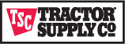
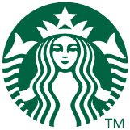

# Improving retail experience with a retail recommender solution accelerator

In the retail world, digital channels drive improved customer engagement. Retailers reimagine how they communicate and share updates on their products. Retailers are looking for ways to improve the connection between shopper and product to improve the attach rate of products.

In-person shopping can lead to impulse buying. Retailers have all products on display. The online shopping experience is different. Shoppers look for specific products, add them to their basket, and then checkout. The retail recommender solution helps retailers highlight and expose associated products that might interest a shopper.

This solution accelerator creates a personalized online shopping experience. Applying AI and advanced data analytics technology present shoppers with relevant content and products in the following ways:

- A shopper visits a retailer online commercial page, which prompts the user with personalized selections, based on purchase history.
- When the shopper adds items to the cart, the site offers more recommendations, based on what products would be purchased with these items.
- As the shopper moves around the retailer's site, the site offers new recommendations based on what the shopper looks at.

Here are some benefits of using the solution accelerator:

- Easily launch using pre-configured GitHub code and architecture.
- Reduce development time with unified analytics by using Azure Synapse Analytics, Azure Machine Learning, and other Azure services.
- Quickly personalize customer experience with advanced analytics that track behavior.
- Get technical support from Azure experts and the Microsoft partner network.
- Secure data with the advanced security and privacy features.

## Prerequisites

This article shows you how to build out a minimal product for the solution accelerator. Before you begin, be sure you have access to the following items:

- An Azure account with an active subscription. [Create an account for free.](https://azure.microsoft.com/free/)
- [Visual Studio 2017 or Visual Studio 2019](https://azure.microsoft.com/downloads/). Ensure you select the **Azure development** workload during installation.
- [Azure PowerShell](/azure/get-started-azureps).
- [Azure CLI](/cli/azure/install-azure-cli).
- [The Postman app](https://www.postman.com/downloads).
- [Visual Studio Code](https://code.visualstudio.com/) (optional).

## Azure and Analytics Platform  

You need basic working knowledge of Azure, Cosmos DB, Azure Machine Learning Services, and Azure Kubernetes.

For information and support, see the following resources:

- [Azure Synapse Analytics (workspace preview)](/azure/synapse-analytics/)
- [Azure Kubernetes Services](/azure/aks/)
- [Azure Machine Learning Services](/azure/machine-learning/overview-what-is-azure-ml)
- [Azure Synapse Content on Microsoft Learn](https://docs.microsoft.com/learn/browse/?terms=synapse)
- [Azure Kubernetes on Microsoft Learn](https://docs.microsoft.com/learn/browse/?terms=kubernetes)
- [Data Scientist learning path on Microsoft Learn](https://docs.microsoft.com/learn/browse/?roles=data-scientist)

## Getting started and process overview

Clone the [Solution Accelerator](https://github.com/microsoft/Azure-Synapse-Retail-Recommender-Solution-Accelerator) repository. The `README` file contains the deployment guide. You can do the following tasks:

- Use Azure Data Lake Storage Gen2 for the enterprise-scale data lake.
- With the models trained, use the two main recommendation paths: user-based and item-based.
- Use external tables in Azure Synapse Analytics to serve the generated user-based recommendations.
- Use Azure Cognitive Search to index the recommendations and allow for REST-based querying.
- Use Azure Machine Learning Service to deploy the item-based recommender to Azure Kubernetes Services as a Web Service.
- With Azure API Management, the front end queries the user-based and the item-based recommendations in one unified API layer.
- Clickstream data and user events are brought back into the data lake for retraining the models and refreshing the recommendations. This feedback increases the accuracy of the recommendations over time.

### Resource Deployment

Use the PowerShell script in the [Resource Deployment](https://github.com/microsoft/Azure-Synapse-Retail-Recommender-Solution-Accelerator/tree/main/Resource_Deployment) folder to deploy the required resources into your Azure Subscription. You can run the script in Cloud Shell in the Azure portal.

### Analytics Deployment

Use the Notebooks in the [Analytics Deployment](https://github.com/microsoft/Azure-Synapse-Retail-Recommender-Solution-Accelerator/tree/main/Analytics_Deployment) folder to complete this solution accelerator. After you deploy all the required resources from the [ResourceDeployment](https://github.com/microsoft/Azure-Synapse-Retail-Recommender-Solution-Accelerator/blob/main/Resource_Deployment), follow the instructions in Resource Deployment for the Notebooks.  

### Application Frontend Web Application Deployment

The [Application Front-end](https://github.com/microsoft/Azure-Synapse-Retail-Recommender-Solution-Accelerator/tree/main/Application_Frontend_Deployment) folder contains the resources to deploy the front-end web application.  

### Application Backend API Deployment

The [Application Backend](https://github.com/microsoft/Azure-Synapse-Retail-Recommender-Solution-Accelerator/tree/main/Application_Backend_Deployment) folder contains the resources for product details. Manage the products presented to the Azure portal.

### ML Model Building

The [ML Model Building](https://github.com/microsoft/Azure-Synapse-Retail-Recommender-Solution-Accelerator/tree/main/ML_Model_Building) folder contains the resources for exploring how the model was constructed.

## Customer examples  

Tractor Supply Company To Expand Relationship With Microsoft. The largest rural lifestyle retailer in the United States, announced the selection of Microsoft as its preferred and strategic cloud provider to support technology architecture and modernization for the Company's Ecommerce website and enterprise analytics platform.
  
"As Tractor Supply is committed to providing legendary service to our customers, this partnership with Microsoft to enhance our analytics platform will deliver insights that help us better understand our customers, while offering products and services that truly meet their needs," said Rob Mills, Tractor Supply's Executive Vice President, Chief Technology, Digital Commerce, and Strategy Officer. "We believe that this collaboration with Microsoft will help us drive innovation and stay nimble when responding to market changes and our customers’ ever-evolving needs."
  
Read the full story here: [https://corporate.tractorsupply.com/newsroom/news-releases/news-releases-details/2020/Tractor-Supply-Company-To-Expand-Relationship-With-Microsoft/default.aspx](https://corporate.tractorsupply.com/newsroom/news-releases/news-releases-details/2020/Tractor-Supply-Company-To-Expand-Relationship-With-Microsoft/default.aspx)

Starbucks turns to technology to brew up a more personal connection with its customers. They have been using reinforcement learning technology—a type of machine learning in which a system learns to make decisions in complex, unpredictable environments based upon external feedback—to provide a more personalized experience for customers who use the Starbucks® mobile app.

Within the app, customers receive tailor-made order suggestions generated by using a reinforcement learning platform that is built and hosted in Microsoft Azure. Through this technology and the work of Starbucks data scientists, 16 million active Starbucks® Rewards members now receive thoughtful recommendations from the app for food and drinks based on local store inventory, popular selections, weather, time of day, community preferences, and previous orders.

"Everything we do in technology is centered around the customer connection in the store, the human connection, one person, one cup, one neighborhood at a time." — Gerri Martin-Flickinger, Starbucks executive vice president and chief technology officer.

Read the full story here:
[https://news.microsoft.com/transform/starbucks-turns-to-technology-to-brew-up-a-more-personal-connection-with-its-customers/](https://news.microsoft.com/transform/starbucks-turns-to-technology-to-brew-up-a-more-personal-connection-with-its-customers/)

## Next steps

To take a tour of our Live Demo, see [Synapse/AI-Retail-Recommender](https://synapsefornextgenretail.azurewebsites.net/).

To use the Azure DevOps template to help deploy in your own environment, see [Retail Recommender ADO Template](https://azuredevopsdemogenerator.azurewebsites.net/):

1. Sign in to the generator.
1. Navigate to Cloud Adoption Framework.
1. Select the **Retail Recommender** template.
1. Deploy to your Azure DevOps environment.
