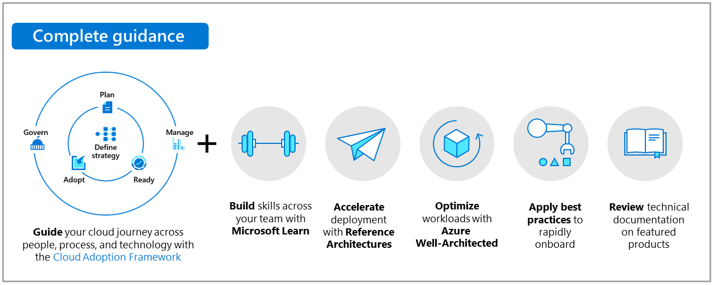

# Cloud adoption for the retail industry

As retail companies address larger and more sophisticated forms of cloud adoption, their journey to the cloud becomes more complex. This series of articles guides you in planning a retail cloud adoption journey.

## Scenario components

This scenario is designed to guide a retail company's cloud adoption journey from beginning to end.

Use the following information to guide you on your journey:

| &nbsp; | &nbsp; |
|--|--|
|   :::image type="icon" source="../../_images/hybrid/cloud-journey.png"::: |   **[Microsoft Cloud Adoption Framework for Azure](../../get-started/index.md):** These articles provide guidance for planning a cloud adoption journey. They are the right starting point for business decision makers, technology leaders, solution architects, and infrastructure architects. |
|   :::image type="icon" source="../../_images/hybrid/hybrid-well-architected.png"::: |   **[Microsoft Azure Well-Architected Framework](/azure/architecture/framework/):** These articles outline what every retail workload owner should consider when deploying and managing workloads in the cloud. |
|   :::image type="icon" source="../../_images/hybrid/hybrid-architectures.png"::: |   **[Retail solutions](/azure/architecture/industries/retail?bc=/azure/cloud-adoption-framework/_bread/toc.json&toc=/azure/cloud-adoption-framework/industry/retail/toc.json):** These architecture solutions are developed and recommended for common retail industry scenarios. You can customize them to fit your business needs and accelerate deployment. |
|   :::image type="icon" source="../../_images/hybrid/hybrid-skills.png"::: |   **[Microsoft Learn modules](/learn/azure/):** Learn the skills to implement, maintain, and support your solution. |

## Common customer challenges and supporting guidance

**Prepare for centralized operations or cloud center of excellence:** Review the [Cloud Adoption Framework](../../get-started/index.md) articles. Establish the processes and approaches required to support your workloads.

**Monitor assets across an existing retail portfolio:** Focus on the govern and manage articles to integrate Azure into your existing operations processes. Use the ready article to deploy those improvements across all of your cloud environments.

**Influence changes to individual workloads (Central IT/Cloud Center of Excellence (CCoE)):** As controls improve, the central IT teams will need to know the architectures that handle the workloads. Use the [Azure Well-Architected Framework](/azure/architecture/framework/) guidance to help workload owners improve the handling of the workloads.

**Optimize individual workloads (workload teams):** Workload owners should start with the [Microsoft Azure Well-Architected Review](/assessments/?id=azure-architecture-review&mode=pre-assessment) guidance to understand the best ways to handle their workloads to support company business strategies. A central IT or CCoE team that supports the workload can use the guidance for insights into best practices and architectures to accelerate implementation.

**Implement specific Azure products:** Use Azure products outlined in the featured products section to improve and accelerate your implementation.

## Next steps

The following articles can guide your cloud adoption journey and help you succeed in the cloud adoption scenario for the retail industry.

- [Cloud adoption strategy for the retail industry](./strategy.md)
- [Cloud adoption plan for the retail industry](./plan.md)
- [Review your environment or Azure landing zones](./ready.md)
- [Migrate common retail industry technologies](./migrate.md)
- [Innovation in the retail industry](./innovate.md)
- [Governance in the retail industry](./govern.md)
- [Management in the retail industry](./manage.md)
