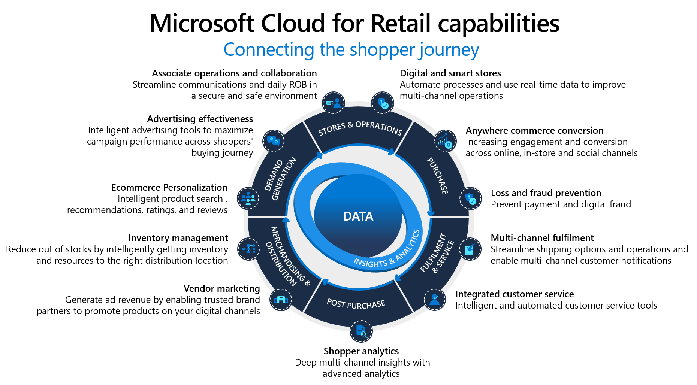

# Innovation in the retail industry

In the [Innovate methodology](../../innovate/index.md) of the Cloud Adoption Framework for Azure, innovation and DevOps practices are aligned to a series of behaviors proven to drive repeatable innovation and customer impact. The steps outlined in the innovation methodology apply to any Retail industry innovations. But this article calls out specific ways to accelerate innovation even faster when striving to achieve common retail industry outcomes.

## Aligning to Retail industry maturity model

Innovation becomes critical to retail maturity when organizations strive to move into Analytics-driven retail or Intelligent retail, based on the [retail cloud maturity model](./retail-cloud-maturity.md).

One example of achieving Intelligent retail maturity, is the [retail recommender](./improve-retail-experience.md), which improves the overall retail experience using data, applications, analytics, and AI.

As you strive to develop innovation within any retail organization, the following disciplines of innovation will help accelerate those innovations in similar ways.

## Rapid innovation with the Microsoft Cloud for Retail

TODO: Delete this section & update after release of MC4R

## Democratize data

The most important step to innovation is [democratizing data](../../innovate/best-practices/data.md). Making data accessible AND understandable across the organization will fuel innovation.

This step is significantly accelerated through the use of a common industry-specific data model. Maintaining a common model breaks down silos which prevent communication between applications & limit the pace of data democratization. When all employees, processes, and applications operate from a common data model, they can all participate in the application of technology to improve the products and services available to your customers.

TODO: Link to common data model for retail

To extend your common data model, use cloud native tools in Azure:

- **Power BI** to create rich visualizations and build business insights on top of your data models. Build and share reports, dashboards, and provide notifications to bring the power of your data to your workforce.
- **Azure Purview** to classify and add metadata to data sources, making it easier for all users to the find the data they need within your data structures.
- **Azure Data Factory** to move and transform data so it can be used by various applications and reports.
- Other **big data** sources, such as **Hadoop**, **HDInsights**, and **Databricks**, to allow data scientists to build advanced analytics solutions on top of your existing data.

## Engage via apps

Learn more about ways you can [build applications](../../innovate/best-practices/apps.md) to extend, improve, and automate your retail processes.

- **Microsoft cloud for Retail** provides a number of packaged solutions which can extend your common data model & rapidly deliver innovative new applications to improve customer engagement TODO: Add other MC4R benefits & links here.
- **Power Platform** empower citizen developers from business teams across sales, payroll, finance, and so on. Extend your common data model by empowering teams to create their own Power Apps and Power Automate solutions.
- **Intelligent experiences** build modern applications in the cloud with web apps or serverless functions. Infuse intelligence into your modern applications with speech, text, vision, and chat bots.

## Interact on devices

Learn more about using [device interactions](../../innovate/best-practices/devices.md) to get closer to your customers through connected devices that may already exist in your retail environment.

- **Mobile experiences:** Extend customer interactions through the rapid development of mobile apps and Power Apps for mobile experiences.
- **IoT:** Collect data in near-real time from devices in your retail, supply chain, and other environments.

## Next step: Governance in the Retail industry

The following list of articles will take you to guidance found at specific points throughout the cloud adoption journey to help you be successful in the cloud adoption scenario.

- [Governance in the Retail industry](./govern.md)
- [Management in the Retail industry](./manage.md)
