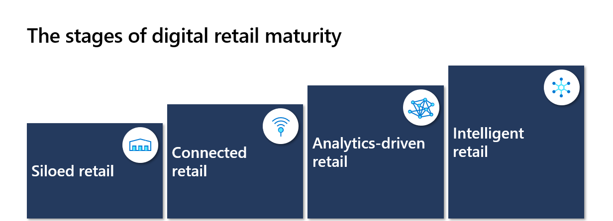
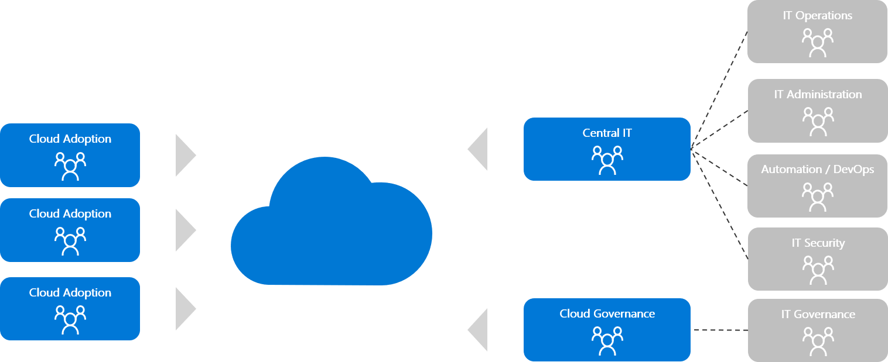
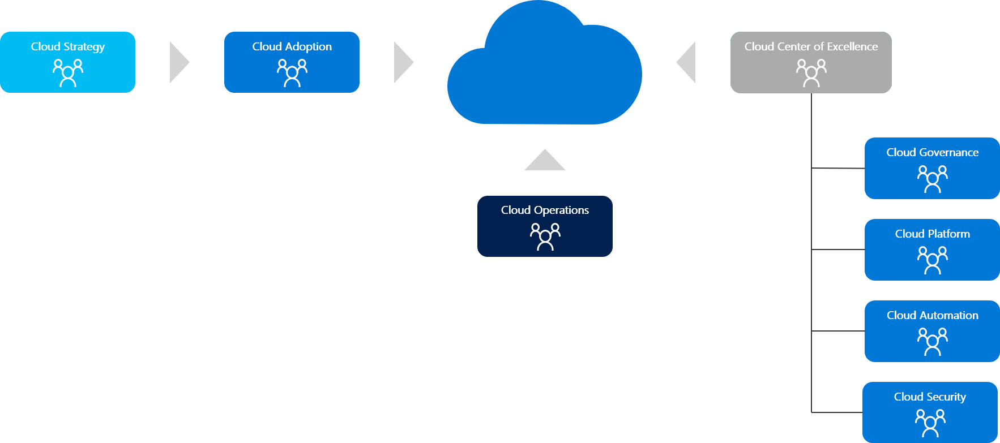

# Organizational structures the retail industry

Organizational structures in the retail industry tend to be the result of decades of organic or acquisition-based growth. This article builds on the Organize methodology in the Cloud Adoption Framework to understand how some companies in the retail industry have reorganized for new technologies. For more information, see [Manage organizational alignment](../../organize/index.md).

## Cloud strategy team and retail decision makers

As with any other industry, a cloud strategy team is critical to long-term business success. The members of this team represent business needs throughout your cloud adoption. For more information, see [Cloud strategy functions](../../organize/cloud-strategy.md).

Be sure to include the following roles or proxies for each role in recurring meetings of the cloud strategy team:

:::row:::
    :::column:::
        **Business decision maker roles**
    :::column-end:::
    :::column span="2":::
        **Desired outcomes**
    :::column-end:::
:::row-end:::

---
:::row:::
    :::column:::
        Customer experience manager
    :::column-end:::
    :::column span="2":::
       Deliver seamless, personalized experiences across all channels
    :::column-end:::
:::row-end:::

:::row:::
    :::column:::
        Chief marketing officer
    :::column-end:::
    :::column span="2":::
        Optimize advertising, marketing campaigns, channels, and purchase behavior with insights
    :::column-end:::
:::row-end:::

---
:::row:::
    :::column:::
        VP of human resources
    :::column-end:::
    :::column span="2":::
        Ensure remote access and collaboration
    :::column-end:::
:::row-end:::

---
:::row:::
    :::column:::
        Chief financial officer
    :::column-end:::
    :::column span="2":::
        Maintain optimal inventory levels
    :::column-end:::
:::row-end:::
:::row:::
    :::column:::
        Business operations
    :::column-end:::
    :::column span="2":::
        Make better forecasting decisions
    :::column-end:::
:::row-end:::
:::row:::
    :::column:::
        Head of supply chain
    :::column-end:::
    :::column span="2":::
        Reduce loss by tracking assets throughout the logistics journey
    :::column-end:::
:::row-end:::
:::row:::
    :::column:::
    :::column-end:::
    :::column span="2":::
        Increase agility and responsiveness across the supply chain
    :::column-end:::
:::row-end:::
:::row:::
    :::column:::
    :::column-end:::
    :::column span="2":::
        Increase safety and security of goods and shipments
    :::column-end:::
:::row-end:::

---

:::row:::
    :::column:::
        Customer experience manager
    :::column-end:::
    :::column span="2":::
        Optimize energy efficiency and cost savings
    :::column-end:::
:::row-end:::
:::row:::
    :::column:::
        Chief marketing officer
    :::column-end:::
    :::column span="2":::
        Reduce labor needs with automation
    :::column-end:::
:::row-end:::
:::row:::
    :::column:::
    :::column-end:::
    :::column span="2":::
        Facilitate contact-less shopping and fulfillment
    :::column-end:::
:::row-end:::
:::row:::
    :::column:::
    :::column-end:::
    :::column span="2":::
        Comply with social distancing
    :::column-end:::
:::row-end:::
:::row:::
    :::column:::
    :::column-end:::
    :::column span="2":::
        Set up new fulfillment nodes with micro fulfillment centers
    :::column-end:::
:::row-end:::
:::row:::
    :::column:::
    :::column-end:::
    :::column span="2":::
        Use location-based personalized advertising
    :::column-end:::
:::row-end:::

When aligning your cloud strategy team, it's important to understand the desired outcomes for each of the various roles. By mapping these desired outcomes to your [cloud adoption strategy](./strategy.md), you can ensure these roles are adequately represented and can provide feedback to guide and support your [cloud adoption plans](./plan.md).

## Common growth patterns for retailers

Companies in the retail industry tend to follow one of three growth patterns:

- Brick and mortar organization with an organically grown e-commerce presence
- Rapid-growth startups with most or all of their revenue coming from online growth
- Brick and mortar organization that acquired one or more startups

The organizational structures that result from these growth patterns have a direct impact on a company's ability to mature in the cloud. To organize around cloud strategies and cloud plans, it's important to understand your current organization. Compare and contrast between your current organization and the organization required to reach the cloud maturity described below. For more information, see [Cloud maturity model for retail](./retail-cloud-maturity.md).

The following sections will help compare your current and future state objectives. Use it to provide a customized course of action to reach your goals.

## Traditional IT, central IT, and centralized operations

When the foundation of a retail company is a brick and mortar business, the technology organization likely formed around specific goals. Such goals might include *keep the lights on* and *keep products moving*. Traditional retail organizations tend to focus on facility management and supply chain technologies. The technology organization tends to emphasize security, stability, and operations over innovation. Technology teams that have grown in this growth model often operate as a central IT organization, with a focus on central operations.

This type of technology team is well suited for the first two stages of the retail cloud maturity model. These stages are siloed retail and connected retail. If your organization needs to go further in that maturity, be sure to read the next section about cloud center of excellence (CCoE) and enterprise operations.

Traditional central IT teams value consistency and strive to minimize risk, change, or experimentation. This operating model can be replicating in the cloud. To replicate this operating model, study the "start small and expand" approach to Azure landing zones. For more information, see [Azure landing zones for the retail industry](./ready.md). For more information about developing change control practices in the cloud, see [Governance for the retail industry](./govern.md) and [Manage the cloud for the retail industry](./manage.md).

To prepare for central IT and central operations in Azure, evaluate how the current organization structure aligns to the central IT organizational structure pictured above. New virtual teams or adjustments to the organization may be useful to deliver your current operations approaches in Azure. Specifically, early cloud adoption projects should focus on building cloud governance and cloud platform functions to extend your central IT model. Those teams also need to define a plan for extending or modernizing operations tools to support your overall operating model. For more information, see [Cloud governance functions](../../organize/cloud-governance.md) and [Cloud platform functions](../../organize/cloud-platform.md).

## Cloud center of excellence and enterprise operations

As retail organizations expand into more mature phases of the retail cloud maturity model, central IT models could become an inhibitor to innovation for some organizations. It's possible for central IT to evolve and support more mature models. However, reorganization is common for modern retailers.

Retail consumers are increasingly fickle. Retail competitors respond with rapid innovation to stay relevant. Rapid innovation requires systems and processes that can channel, not block, rapid change. For more information, see [Cloud center of excellence](../../organize/cloud-center-of-excellence.md).

Rapid growth startups often begin with this fast pace of change. They have processes to channel the change. Brick and mortar organizations that fully embrace and integrate a startup acquisition often have some of those controls in place. In either case, innovation tends to have an equal or greater priority, compared to stability found in more traditional organizations.

These organizations empower workload owners to make more decisions. They focus on establishing guardrails to protect the company against poor decisions. This approach is a shift in perspective for traditional central IT operations teams.

This type of technology team organization is well suited to achieve the latter two stages of the retail cloud maturity model. These stages are analytics-driven retail and intelligent retail. We refer to these organizations as cloud center of excellence (CCoE) teams. Those teams tend to align best with enterprise operations.

CCoE teams tend to value innovation and delegated responsibility. To replicate this operating model in the cloud, the CCoE team enables advanced cloud capabilities:

- Enable zero trust security
- Separate duties
- Centralize monitoring and visibility
- Create policies to force adherence to compliance, security, and operations guardrails

Those advanced controls can most easily be deployed using the enterprise-scale architecture and implementation options of Azure landing zones. For more information, see [Cloud governance functions](../../organize/cloud-governance.md) and [Cloud platform functions](../../organize/cloud-platform.md).

To prepare for CCoE and enterprise operations in Azure, evaluate how the current organization structure aligns to the CCoE organizational structure pictured above. New virtual teams or adjustments to the organization may be useful to deliver this advanced operations approach in Azure. Specifically, early cloud adoption projects should focus on building the CCoE functions to modernize existing central IT models. Those teams may also need to define a plan for replacing existing operations tools used to support any central IT processes.

## Next steps

This basic understanding of organizational structures and critical roles in the retail organization provides information to prepare your cloud adoption strategy.

- [Cloud adoption strategy for the retail industry](./strategy.md)
- [Cloud adoption plan for the retail industry](./plan.md)
- [Azure landing zones for the retail industry](./ready.md)
- [Migrate common retail industry technologies](./migrate.md)
- [Innovation in the retail industry](./innovate.md)
- [Governance in the retail industry](./govern.md)
- [Management in the retail industry](./manage.md)
