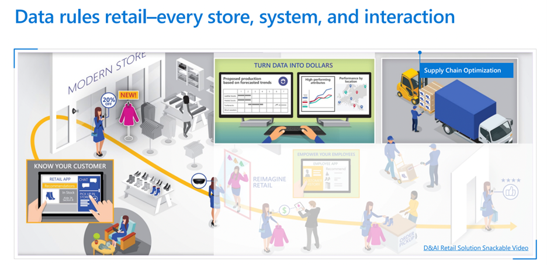
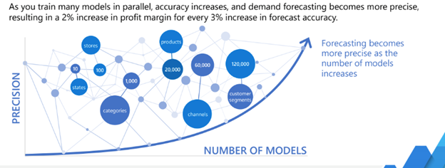

# Forecast customer demand with the Demand Forecasting Solution Accelerator

## End-to-end solution with consolidated machine learning models

The global retail ecosystem is a reflection of our fast-paced modern environment we live in. You must be able to change quickly, and adjust based on the demands of the moment. Businesses can't meet the
demand of their customers in an increasingly competitive retail marketplace, where consumer preferences change frequently, and presume customer experiences that are personal, cross platform—delivered on any medium.

Retailers are looking for an approach to understand where there is any amount of shortfall, backlog, or break-down in the supply chain. In the supercharged, competitive retail ecosystem in these challenging times, it's a requirement to have a 360-degree view of all dimensions of the customer journey—from production to delivery—along the supply chain. Operations and manufacturing teams need to remove silos and data antipatterns within the organization—to free up resources and prevent waste along the supply chain.

To assist you in meeting the demands of your highly time-sensitive market, we recommend the Demand Forecasting Solution Accelerator. The Demand Forecasting Solution Accelerator shows you how to build a customized sales forecasting model. This
accelerator will assist by reducing development time through pre-built, pre-configured assets. Deploying the Demand Forecasting Solution can help you return results in weeks, and deliver you the ability to scale as your business requirements grow.

## Improve accuracy with the "many models" approach

The Pattern of many models is very common across a wide variety of industries,
and applicable to many real-world use cases. In the retail sector, the many
models approach is commonly seen in:

- Retail organizations building workforce optimization models for thousands of stores

- Campaign promotion propensity models

- Price optimization models for hundreds of thousands of products being sold

- Restaurant chains building demand forecasting models across many outlets

### Customer Examples

Carhartt

To remain competitive, Carhartt sought a comprehensive data-driven solution. Since on-premises virtual machines created a memory bottleneck, the company worked with Microsoft to expand its model with high-performance solutions from Azure Machine Learning. Supercharged data insights helped Carhartt optimize sales across e-commerce sites, big-box retailers, and its 33 physical stores. Read the full [Carhartt customer story](https://customers.microsoft.com/story/816179-carhartt-retailers-azure).

Walgreens

Walgreens processes vast amounts of data, relying on insights from comparing point of sale transactions to historical data across the supply chain, and had acquired other pharmacies, adding more data points to analyze. With Azure, Walgreens was able to use machine learning to connect the disparate sources of data to optimize its inventory and promotions to target the right customers at the right time. Read the full [Walgreens customer story](https://customers.microsoft.com/story/1411448755996187154-walgreens-health-provider-azure)

Learn how to configure your environment, prepare your dataset, train 10,000+ models, and forecast sales. Then you can customize your accelerator for your business challenges.

## Get started deploying the MVP

1. Find your code in the Demand Forecasting Solution Accelerator [GitHub repository](https://github.com/microsoft/solution-accelerator-many-models).
2. Deploy Azure machine learning and assets to Azure.
3. Configure the development environment using a Notebook virtual machine.
4. **Run Jupyter Notebooks**. Once your development environment is set up, run through the
    Jupyter Notebooks step by step, [following the steps for the Many Models Solution Accelerator](https://github.com/microsoft/solution-accelerator-many-models).

Read more:

- [Azure Synapse Analytics](/azure/synapse-analytics/)
- [Azure Kubernetes Service](/azure/aks/)
- [Azure Machine Learning](/azure/machine-learning/overview-what-is-azure-ml)
- [Azure Synapse content on Microsoft Learn](/learn/browse/?terms=synapse)
- [Azure Kubernetes on Microsoft Learn](/learn/browse/?terms=kubernetes)
- [Data scientist learning path on Microsoft Learn](/learn/browse/?roles=data-scientist)