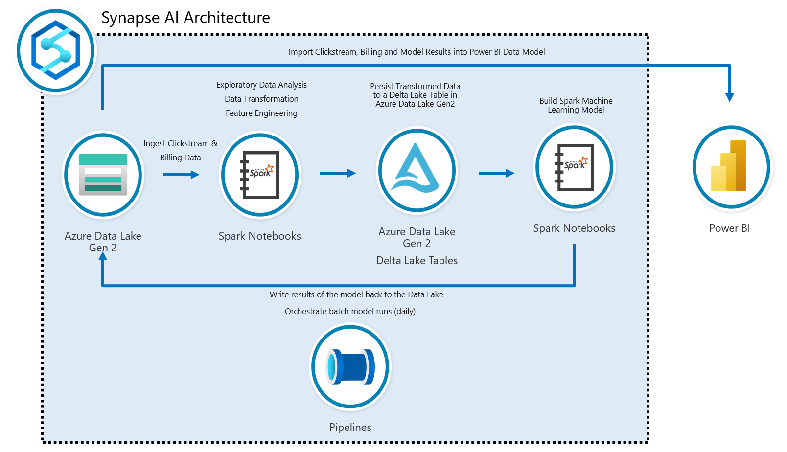
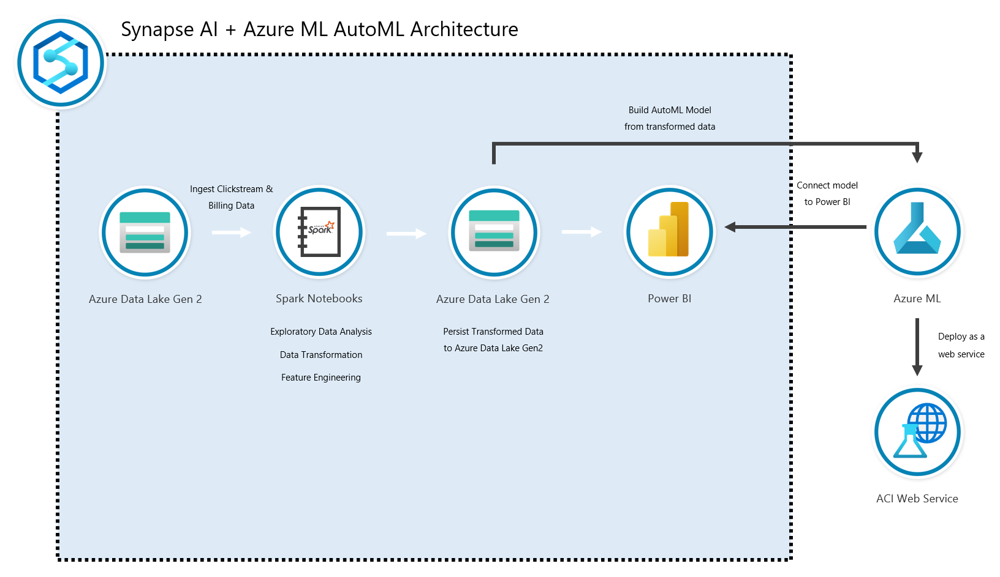

# Identify key revenue factors with a Modern Finance Solution Accelerator

## Modern Finance Solution Accelerator introduction

Many businesses have separate systems for invoice, revenue, and user behavior data. With disparate datasets and traditional analytics methods, it can be challenging to correlate data and identify what the top factors for revenue growth are for your organization. So, what common challenges do you face in calculating possible future growth trajectories for your company?

## Customer challenges

- Invoice and revenue data housed in different systems than point of sale or behavioral data
- Hard to predict what's leading growth—caused by multiple locations, promotions, and brand data
- Hard to track the effectiveness and prioritization of loyalty programs
- Importing data from multiple sources like clickstream and billing data

The Modern Finance Solution Accelerator changes the way we deliver an impact across how all of finance works. The surplus value for you is created by your spending less time performing transactional activities, and more time delivering insights to drive better business decisions for your organization.

Let's look at the Modern Finance Solution Accelerator through 4 pillars:

- Financial analysis and reporting – transforming legacy systems and tools to increase insight and productivity
- Strategy and forecasting – driving forward-looking forecasting and strategic decision making
- Business process automation – enabling greater efficiency through chat bots and automated workflows
- Risk and compliance – harnessing technology to mitigate and proactively control risk

## Modern finance success story

Chipotle used Azure Machine Learning to unify customer profiles and integrate multiple data sources with digital advertising channels. Chipotle has been able to enrich customer profiles with demographics and preference across multiple data platforms. Chipotle is using these insights to drive a personalized digital advertising experience for known and unknown customers, grow digital orders, and increase customer loyalty. Read the full [Chipotle customer story](https://customers.microsoft.com/story/849868-chipotle-retailers-dynamics-365)

## Modern Finance Solution Accelerator overview

You can help identify key revenue generating factors for your organization from a sample e-commerce platform. Lever machine learning and big data analytics, to bring together and transform your data, allowing you to build and deploy a machine learning model to easily identify any factors for growth.

The Modern Finance Solution Accelerator gathers data from Azure Synapse Analytics into a single platform to analyze which factors in your business currently lead to revenue growth.

## Identity top factors for your revenue growth

- Unite siloed departments by eliminating restricted data flow—and deliver faster customer demand responses for rapid fulfillment, flexible delivery, and easy returns
- Launch your solution and reach your business outcomes in weeks from ready-to-deploy, custom-built code and GitHub architectures

### Modern Finance Solution Accelerator technical overview

Modern Finance Solution Accelerator [GitHub repository](https://github.com/microsoft/Azure-Synapse-Solution-Accelerator-Financial-Analytics-Customer-Revenue-Growth-Factor)

The Modern Finance Solution Accelerator is built on Azure Synapse Analytics and Azure Machine learning—with these prerequisites:

- Access to an Azure subscription.
- Power BI pro license (or free trial).
- Knowledge of Azure, Azure Synapse Analytics, Azure Machine Learning Services, and Power BI.

The following technologies will be used in this solution accelerator:

- Azure Data Lake Storage Account
- Azure Synapse Analytics
- Spark Pool
- Azure Machine Learning Service
- Azure Storage Account
- Azure Key Vault
- Azure Application Insights

## Get started with deployment

The Modern Finance Solution Accelerator was built to provide developers with the required resources to build a solution to identify the top factors for revenue growth from an e-commerce platform using Azure Synapse Analytics and Azure Machine Learning. Here are architecture diagrams that provide a high-level overview of what you will be building for this Solution Accelerator:

1. Clone the [Modern Finance Solution GitHub repository](https://github.com/microsoft/Azure-Synapse-Solution-Accelerator-Financial-Analytics-Customer-Revenue-Growth-Factor) and navigate to the root of the directory.
1. Go to the [deployment guide](https://github.com/microsoft/Azure-Synapse-Solution-Accelerator-Financial-Analytics-Customer-Revenue-Growth-Factor/blob/main/Resource_Deployment/README.md) for next steps to complete the deployment.

Read more:

- [Azure Synapse Analytics](/azure/synapse-analytics/)
- [Azure Kubernetes Service](/azure/aks/)
- [Azure Machine Learning](/azure/machine-learning/overview-what-is-azure-ml)
- [Learn modules for Azure Synapse](/training/browse/?terms=synapse)
- [Learn modules for Azure Kubernetes](/training/browse/?terms=kubernetes)
- [Data scientist learning path](/training/browse/?roles=data-scientist)
