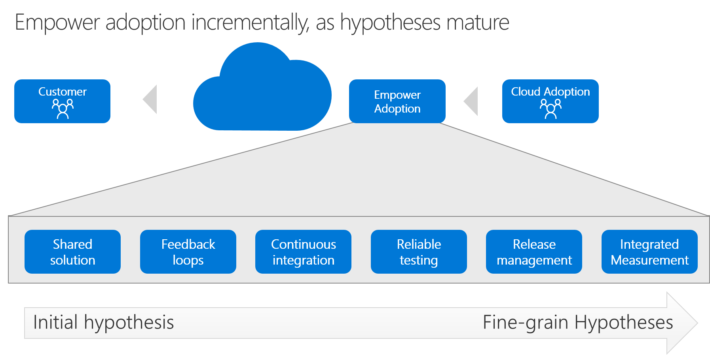

# Tools to empower adoption in Azure

As described in [Empower adoption](../considerations/ci-cd.md), building true innovation at scale requires an investment in removing friction that could slow adoption. In the early stages of testing a hypothesis, a solution is small. The investment in removing friction is likely small as well. As hypotheses prove true, the solution and the investment in empowering adoption grows. This article provides key continuous integration links to help you get started with each stage of the maturity model.

## Alignment to the innovation methodology

You can accelerate this type of digital invention through the following levels of maturity. Technical guidance to accelerate digital invention is listed in the table of contents on the left side of this page. Those articles are grouped by maturity model level.

- **Shared solution:** Establish a centralized repository for all aspects of the solution.
- **Feedback loops:** Ensure feedback loops can be managed consistently throughout iterations.
- **Continuous integration:** Regularly build and consolidate a continuous integration and continuous deployment (CI/CD) solution.
- **Reliable testing:** Validate solution quality and expected changes to drive ensuring measurements.
- **Solution deployment:** Deploy a solution to allow a team to quickly share changes with customers.
- **Integrated measurement:** Add learning metrics to the feedback loop for clear analysis by the full team.

## Toolchain

For adoption teams that are mature professional development teams with many contributors, the Azure toolchain starts with GitHub and Azure DevOps.

As your need grows, you can expand this foundation to use other tool features. The expanded foundation might involve tools like:

- Azure Blueprints
- Azure Policy
- Azure Resource Manager templates
- Azure Monitor

The table of contents on the left side of this page lists guidance for each tool and aligns with the previously described maturity model.

## Get started

The table of contents on the left side of this page outlines many articles. These articles help you get started with each of the tools in this toolchain.

> [!NOTE]
> Some links might leave the Cloud Adoption Framework to help you go beyond the scope of this framework.
