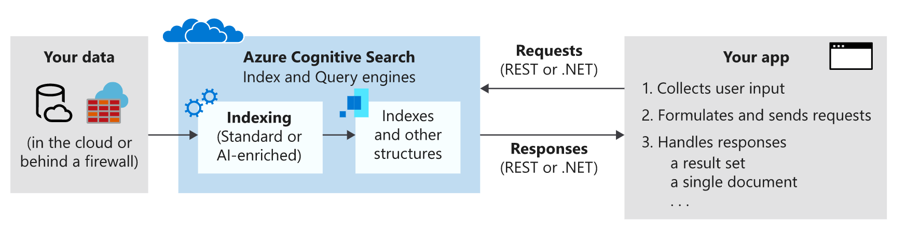

<!-- cSpell:ignore Lucene -->

<!-- docsTest:ignore "Azure Search" "JFK Files" -->

# What is Azure Cognitive Search?

Azure Cognitive Search (formerly known as Azure Search) is a managed cloud solution that gives developers APIs and tools for adding a rich search experience over private, heterogeneous content in web, mobile, and enterprise applications. Your code or a tool invokes data ingestion (indexing) to create and load an index. Optionally, you can add cognitive skills to apply AI processes during indexing. Doing so can add new information and structures useful for search and other scenarios.

On the other side of your service, your application code issues query requests and handles responses. The search experience is defined in your client using functionality from Azure Cognitive Search, with query execution over a persisted index that you create, own, and store in your service.

Functionality is exposed through a simple [REST API](https://docs.microsoft.com/rest/api/searchservice/) or [.NET SDK](https://docs.microsoft.com/azure/search/search-howto-dotnet-sdk) that masks the inherent complexity of information retrieval. In addition to APIs, the Azure portal provides administration and content management support, with tools for prototyping and querying your indexes. Because the service runs in the cloud, infrastructure and availability are managed by Microsoft.

## When to use Azure Cognitive Search

Azure Cognitive Search is well suited for the following application scenarios:

- Consolidation of heterogeneous content types into a private, single, searchable index. Queries are always over an index that you create and load with documents, and the index always resides in the cloud on your Azure Cognitive Search service. You can populate an index with streams of JSON documents from any source or platform. Alternatively, for content sourced on Azure, you can use an indexer to pull data into an index. Index definition and management/ownership is a key reason for using Azure Cognitive Search.
- Raw content is large undifferentiated text, image files, or application files such as Microsoft Office content types on an Azure data source such as Azure Blob storage or Azure Cosmos DB. You can apply cognitive skills during indexing to add structure or extract meaning from image and application files.
- Easy implementation of search-related features. Azure Cognitive Search APIs simplify query construction, faceted navigation, filters (including geo-spatial search), synonym mapping, type-ahead queries, and relevance tuning. Using built-in features, you can satisfy end-user expectations for a search experience similar to commercial web search engines.
- Indexing unstructured text, or extracting text and information from image files. The [AI enrichment](https://docs.microsoft.com/azure/search/cognitive-search-concept-intro) feature of Azure Cognitive Search adds AI processing to an indexing pipeline. Some common use-cases include OCR over scanned document, entity recognition and key phrase extraction over large documents, language detection and text translation, and sentiment analysis.
- Linguistic requirements satisfied using the custom and language analyzers of Azure Cognitive Search. If you have non-English content, Azure Cognitive Search supports both Lucene analyzers and Microsoft's natural language processors. You can also configure analyzers to achieve specialized processing of raw content, such as filtering out diacritics.

## How to use Azure Cognitive Search

### Step 1: Provision service

You can provision an Azure Cognitive Search service in the [Azure portal](https://portal.azure.com/) or through the [Azure Resource Manager REST API](https://docs.microsoft.com/rest/api/searchmanagement/). You can choose either the free service shared with other subscribers, or a paid tier that dedicates resources used only by your service. For paid tiers, you can scale a service in two dimensions:

- Add replicas to grow your capacity to handle heavy query loads.
- Add partitions to grow storage for more documents.

By handling document storage and query throughput separately, you can calibrate resourcing based on production requirements.

### Step 2: Create index

Before you can upload searchable content, you must first define an Azure Cognitive Search index. An index is like a database table that holds your data and can accept search queries. You define the index schema to map to reflect the structure of the documents you wish to search, similar to fields in a database.

A schema can be created in the Azure portal, or programmatically using the [.NET SDK](https://docs.microsoft.com/azure/search/search-howto-dotnet-sdk) or [REST API](https://docs.microsoft.com/rest/api/searchservice/).

### Step 3: Load data

After you define an index, you're ready to upload content. You can use either a push or pull model. The pull model retrieves data from external data sources. It's supported through indexers that streamline and automate aspects of data ingestion, such as connecting to, reading, and serializing data. [Indexers](https://docs.microsoft.com/rest/api/searchservice/Indexer-operations) are available for Azure Cosmos DB, Azure SQL Database, Azure Blob storage, and SQL Server hosted in an Azure VM. You can configure an indexer for on-demand or scheduled data refresh. The push model is provided through the SDK or REST APIs, used for sending updated documents to an index. You can push data from virtually any dataset using the JSON format. For more information,see [Add, update, or delete documents](https://docs.microsoft.com/rest/api/searchservice/addupdate-or-delete-documents) or [how to use the .NET SDK](https://docs.microsoft.com/azure/search/search-howto-dotnet-sdk) for guidance on loading data.

### Step 4: Search

After populating an index, you can [issue search queries](https://docs.microsoft.com/azure/search/search-query-overview) to your service endpoint using simple HTTP requests with [REST API](https://docs.microsoft.com/rest/api/searchservice/Search-Documents) or the [.NET SDK](https://docs.microsoft.com/dotnet/api/microsoft.azure.search.idocumentsoperations?view=azure-dotnet). Step through [creating your first search application](https://docs.microsoft.com/azure/search/tutorial-csharp-create-first-app) to build and then extend a web page that collects user input and handles results. You can also use [Postman for interactive REST](https://docs.microsoft.com/azure/search/search-get-started-postman) calls or the built-in [Search explorer](https://docs.microsoft.com/azure/search/search-explorer) in Azure portal to query an existing index.

## Next steps

- Learn more about [Azure Cognitive Search](https://docs.microsoft.com/azure/search/)
- Browse more [AI architectures](https://docs.microsoft.com/azure/architecture/browse/)
- See an example knowledge mining solution: [JFK Files example architecture and solution](https://docs.microsoft.com/azure/architecture/solution-ideas/articles/cognitive-search-with-skillsets)
