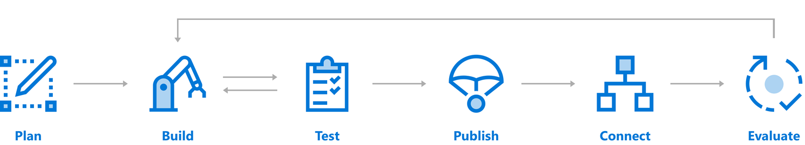

<!-- docutune:ignore "natural language understanding" -->

# What are AI agents?

AI agents are code or mechanisms which act to achieve predetermined goals. Examples of AI agents can be found in the code for things like chat bots, smart homes, and the programmatic trading software used in finance. The Azure Bot Service and Bot Framework are examples of platforms that can be used to build these AI agents and integrate them into larger software applications.

Users are engaging more and more with conversational interfaces, which can present a more natural experience where humans express their needs through natural language and quickly complete tasks. For many companies, conversational AI applications are becoming a competitive differentiator. Many organizations are strategically making bots available within the same messaging platforms in which their customers spend time.

Organizations around the world are transforming their businesses with conversational AI, which can promote more efficient and natural interactions with both their customers and their employees. Here are a few common use cases:

- Customer support
- Enterprise assistant
- Call center optimization
- In-car voice assistant

## Build a bot

Azure Bot Service and Bot Framework offer an integrated set of tools and services to help create the AI agent you need. Choose your favorite development environment or command-line tools to create your bot. SDKs exist for C#, JavaScript, TypeScript, and Python. The SDK for Java is under development. We provide tools for various stages of bot development to help you design and build bots.

### Plan

Having a thorough understanding of the goals, processes, and user needs is important to the process of creating a successful bot. Before you write code, review the bot [design guidelines](/azure/bot-service/bot-service-design-principles) for best practices, and identify the needs for your bot. You can create a simple AI agent or include more sophisticated capabilities such as speech, natural language understanding, and question answering.

While you design your AI agent during the planning phase, consider these aspects:

- Define bot personas:
  - What should your bot look like?
    - What should it be named?
    - What's your bot's personality? Does it have a gender?
    - How should your bot handle difficult situations and questions?
- Design conversation flow:
  - What type of conversations can you expect for your use cases?
- Define an evaluation plan:
  - How would you measure success?
  - What measurements do you want to use to improve your service?

To learn more about how to design your bot, see [Principles of bot design](/azure/bot-service/bot-service-design-principles).

### Build

Your bot is a web service that implements a conversational interface and communicates with the Bot Framework Service to send and receive messages and events. The Bot Framework Service is one of the components of Azure Bot Service and Bot Framework. You can create bots in any number of environments and languages. You can start your bot development in the [Azure portal](/azure/bot-service/abs-quickstart) or use [C#, JavaScript, or Python](/azure/bot-service/dotnet/bot-builder-dotnet-sdk-quickstart) templates for local development. You also have access to a variety of [samples](https://github.com/microsoft/botbuilder-samples) that showcase many of the capabilities available through the SDK. These samples are great for developers who want a more feature-rich starting point.

As part of the Azure Bot Service and Bot Framework, we offer additional components you can use to extend the functionality of your bot. With the Azure Bot Service and Bot Framework, you can build a bot with confidence and speed.

| Feature | Description | Link |
| --- | --- | --- |
| Add natural language processing | Enable your bot to understand natural language, understand spelling errors, use speech, and recognize the user's intent. | How to use [LUIS](/azure/bot-service/bot-builder-howto-v4-luis) |
| Answer questions | Add a knowledge base to answer questions users ask in a more natural, conversational way. | How to use [QnA Maker](/azure/bot-service/bot-builder-howto-qna) |
| Manage multiple models | If you use more than one model, such as for LUIS and QnA Maker, intelligently determine when to use which one during your bot's conversation. | [Dispatch](/azure/bot-service/bot-builder-tutorial-dispatch) tool |
| Add cards and buttons | Enhance the user experience with media other than text, such as graphics, menus, and cards. | How to [add cards](/azure/bot-service/bot-builder-howto-add-media-attachments) |

> [!NOTE]
> This table isn't a comprehensive list. For more information, see the [Azure Bot Service documentation](/azure/bot-service/).

### Test

Bots are complex applications with many different parts that work together. Like any other complex application, this complexity can lead to some interesting bugs or cause your bot to behave differently than expected. Before you publish your bot, test it. We provide several ways to test bots before they're released for use:

- Test your bot locally with the [emulator](/azure/bot-service/bot-service-debug-emulator). The Bot Framework Emulator is a stand-alone application that not only provides a chat interface but also debugging and interrogation tools to help you understand how and why your bot does what it does. The emulator can be run locally alongside your in-development bot application.
- Test your bot on the [web](/azure/bot-service/abs-quickstart). After your bot is configured through the Azure portal, it can also be reached through a web chat interface. The web chat interface is a great way to grant access to your bot to testers and other people who don't have direct access to the running code.
- [Unit test your bot](/azure/bot-service/unit-test-bots) with the July update of the Bot Framework SDK.

### Publish

When you're ready to make your bot available on the web, [publish it to Azure](/azure/bot-service/bot-builder-deploy-az-cli) or to your own web service or datacenter. Having an address on the public internet is the first step to bringing your bot to life on your site or inside chat channels.

### Connect

Connect your bot to channels such as Facebook, Messenger, Kik, Skype, Slack, Microsoft Teams, Telegram, text/SMS, Twilio, Cortana, and Skype. Bot Framework does most of the work necessary to send and receive messages from all of these different platforms. Your bot application receives a unified, normalized stream of messages no matter number and type of channels to which it's connected. For information on how to add channels, see [Channels](/azure/bot-service/bot-service-manage-channels).

### Evaluate

Use the data collected in the Azure portal to identify opportunities to improve the capabilities and performance of your bot. You can get service-level and instrumentation data like traffic, latency, and integrations. Analytics also provide conversation-level reporting on user, message, and channel data. For more information, see [How to gather analytics](/azure/bot-service/bot-service-manage-analytics).

### Patterns for common use cases

There are common patterns used for implementation of a conversational AI application:

- **Knowledge base:** A knowledge bot can be designed to provide information about virtually any subject. For example, one knowledge bot might answer questions about events such as "what bot events are there at this conference?" Or "when is the next reggae show?" Another bot might answer IT-related questions such as "how do I update my operating system?" Yet another bot might answer questions about contacts such as "who is john doe?" Or "what is jane doe's email address?"

   For information on the design elements for knowledge bots, see [Design knowledge bots](/azure/bot-service/bot-service-design-pattern-knowledge-base).

- **Hand off to a human:** No matter how much AI a bot possesses, there might still be times when it needs to hand off the conversation to a human being. In such cases, the bot should recognize when it needs to hand off and provide the user with a smooth transition.

   For information on the patterns to hand off, see [Transition conversations from bot to human](/azure/bot-service/bot-service-design-pattern-handoff-human).

- **Embed a bot in an application:** Although bots most commonly exist outside of applications, they can also be integrated with applications. For example, you could embed a [knowledge bot](/azure/bot-service/bot-service-design-pattern-knowledge-base) within an application to help users find information. You could also embed a bot within a help desk application to act as the first responder to incoming user requests. The bot could independently resolve simple issues and [hand off](/azure/bot-service/bot-service-design-pattern-handoff-human) more complex issues to a human agent.

   For information on the ways to integrate your bot within an application, see [Embed a bot in an application](/azure/bot-service/bot-service-design-pattern-embed-app).

- **Embed a bot in a website:** Like embedding bots in applications, bots can also be embedded within a website to enable multiple modes of communication across channels.

   For information on the ways to integrate your bot within a website, see [Embed a bot in a website](/azure/bot-service/bot-service-design-pattern-embed-web-site).

## Next steps

- Review machine learning white papers and e-books about [Azure Bot Service](https://azure.microsoft.com/resources/whitepapers/search/?service=bot-service).
- Review [AI + Machine Learning architectures](/azure/architecture/browse/).
- [Building intelligent applications with cognitive APIs (e-book)](https://azure.microsoft.com/resources/building-intelligent-apps-with-cognitive-apis/).
- [FAQ chatbot architecture](https://azure.microsoft.com/resources/faq-chatbot-architecture/).
