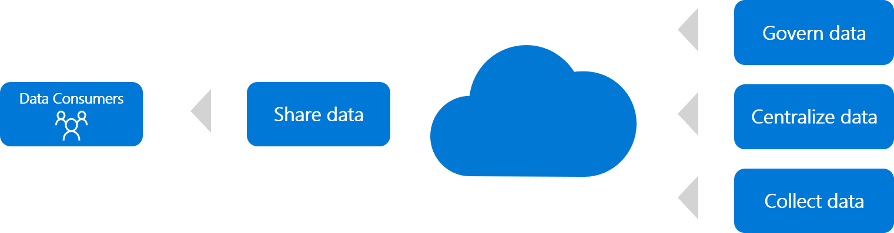

# Innovation tools to democratize data in Azure

As described in the conceptual article on [democratizing data](../considerations/data.md), you can deliver many data collection innovations with little technical investment. Many major innovations require little more than raw data. Democratizing data is about investing the least resources needed to engage your customers. The customers then use the data to take advantage of their existing knowledge.

Starting with data democratization is a quick way to test a hypothesis before expanding into broader, more costly digital inventions. As you refine more of the hypothesis and begin to adopt the inventions at scale, the following processes will help you prepare for operational support of the innovation.

## Alignment to the methodology

This type of digital invention can be accelerated through each phase of the following processes, as shown in the preceding image. Technical guidance to accelerate digital invention is listed in the table of contents on the left side of this page. Those articles are grouped by phase to align guidance with the overall methodology.

- **Share collected data:** The first step of democratizing data is to share openly.
- **Govern data:** Ensure that any sensitive data is secured, tracked, and governed before sharing.
- **Centralize data:** Sometimes you need to provide a centralized platform for data democratization, sharing, and governance.
- **Collect data:** Migration, integration, ingestion, and virtualization can each collect existing data to be centralized, governed, and shared.

In every iteration, cloud adoption teams should go only as deep into the stack as they require to put the focus on customer needs over architecture. Delaying technical spikes in favor of customer needs accelerates validation of your hypothesis.

All guidance maps to the four preceding processes. Guidance ranges from the highest customer effect to the highest technical effect. Across each process, you'll see guidance on different potential ways that Azure can accelerate your ability to [build with customer empathy](../considerations/build.md).

## Toolchain

In Azure, the following innovation tools are commonly used to accelerate digital invention across the preceding phases:

- [Power BI](/power-bi/)
- [Azure Data Catalog](/azure/data-catalog/)
- [Azure Synapse Analytics](/azure/synapse-analytics/)
- [Azure Cosmos DB](/azure/cosmos-db/)
- [Azure Database for PostgreSQL](/azure/postgresql/)
- [Azure Database for MySQL](/azure/mysql/)
- [Azure Database for MariaDB](/azure/mariadb/)
- [Azure Database for PostgreSQL hyperscale](/azure/postgresql/concepts-hyperscale-nodes)
- [Azure Data Lake Storage](/azure/storage/blobs/data-lake-storage-introduction)
- [Azure Database Migration Service](/azure/dms/)
- [Azure SQL Database, with or without Azure SQL Managed Instance](/azure/azure-sql/)
- [Azure Data Factory](/azure/data-factory/)
- [Azure Stream Analytics](/azure/stream-analytics/)
- [SQL Server Integration Services](/sql/integration-services/sql-server-integration-services)
- [Azure Stack](/azure-stack/)
- [SQL Server Stretch Database](/sql/sql-server/stretch-database/stretch-database)
- [Azure StorSimple](/azure/storsimple/)
- [Azure Files](/azure/storage/files/)
- [Azure File Sync](/azure/storage/files/storage-sync-files-planning)
- [PolyBase](/sql/relational-databases/polybase/polybase-guide)

As the invention approaches adoption at scale, the aspects of each solution require refinement and technical maturity. As that happens, more of these services are likely to be required. Use the table of contents on the left side of this page for Azure tools guidance relevant to your hypothesis-testing process.

## Get started

The table of contents on the left side of this page outlines many articles. These articles help you get started with each of the tools in this toolchain.

> [!NOTE]
> Some links might leave the Cloud Adoption Framework to help you go beyond the scope of this framework.
