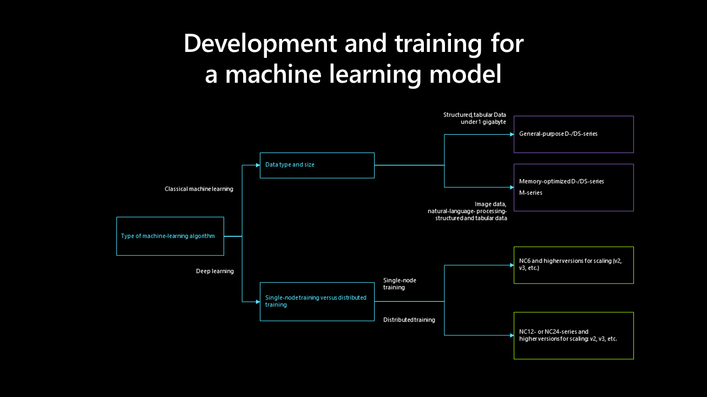
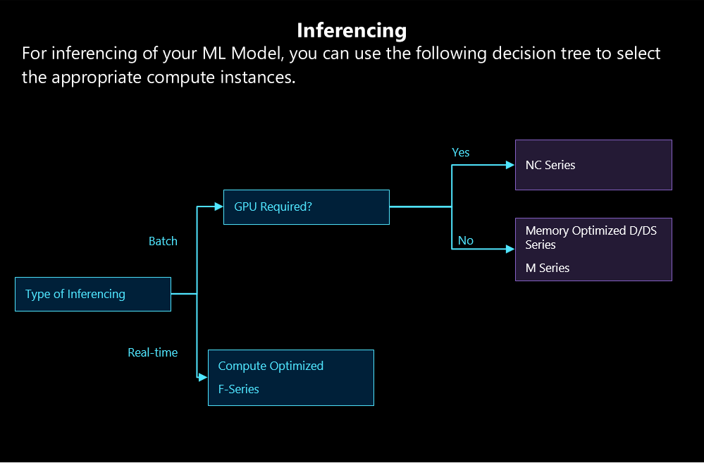

# Determine development, training, and compute instances for your machine learning model

When determining development, training, and compute instances for your machine learning model, consider the algorithm that you're using, the data type, data sizes, and if you'll perform distributed training.

## Development and training for your machine learning model

Reference the following diagram to understand development and training for your machine learning model:

## Compute instances for your machine learning model

The following diagram can help you to choose compute instances that help your machine learning model to run inference:

## Next steps

- [Create and manage a compute instance](/azure/machine-learning/how-to-create-manage-compute-instance) in your Azure Machine Learning workspace to understand the process in more detail.

- Read about [compute targets in Azure Machine Learning](/azure/machine-learning/concept-compute-target) to learn how these environments can help you to train and deploy your model during the development lifecycle.
