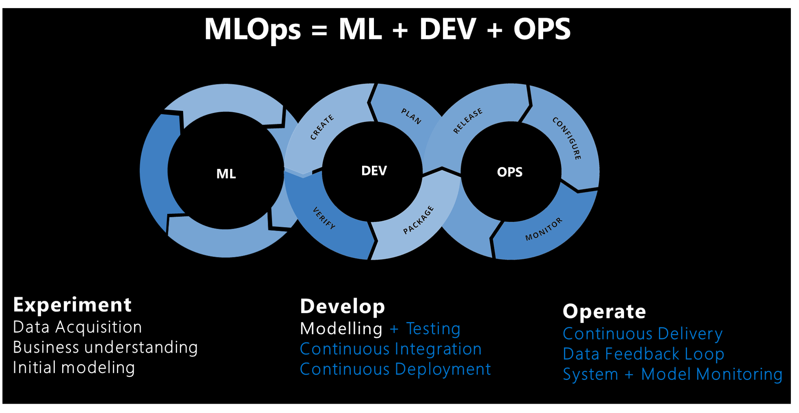

# How to approach machine learning operations

## An overview of machine learning operations

Machine learning operations consist of principles and best practices about to organize and standardize machine model development, deployment, and maintenance in a scalable way.

The main components influencing how a machine learning system develops are outlined below:

*Source: Sculley et al. 2015. Hidden technical debt in machine learning systems. In Proceedings of the 28th International Conference on Neural Information Processing Systems - Volume 2 (NIPS’15)*

## Machine learning operations vs. development operations

While development operations (DevOps) influence machine learning operations, there are differences between their processes. In addition to DevOps practices, machine learning operations addresses the following concepts not covered in DevOps:

- **Data versioning:** In addition to code versioning, there must also be versioning of datasets, as the schema and actual data can change over time. This allows data to be reproduced, makes the data visible other team members, and helps use cases to be audited.

- **Model tracking:** Model artifacts are often stored in a model registry that should expose storage, versioning, and tagging capabilities. These registries need to identify the source code, its parameters, and the corresponding data used to train the model, all of which indicate where a model was created.

- **Digital audit trail**: When working with code and data, all changes need to be tracked.

- **Generalization:** Models are different than code for reuse, as models must be tuned based on the input data or scenario. You might need to fine-tune the model for the new data to use it for a new scenario.

- **Model retraining:** Model performance can decrease over time, and it's important to retrain models for them to remain useful.

## Model Development process

The following steps comprise the development process:

- Training is automated, and models are validated, which includes testing functionality and performance (for example, using accuracy metrics).
- Deployment to the infrastructure used for inferencing (including monitoring) is automated.
- Mechanisms create an end-to-end data audit trail. Automatic model retraining occurs when data drifts over time, which is relevant to large-scale, machine-learning-infused systems.

The following diagram depicts the deployment lifecycle of a machine learning system:

Once developed, a machine learning model is trained, validated, deployed, and monitored. From an organizational perspective and on the managerial and technical level, it's important to define who owns and implements this process. In larger enterprises, a data scientist might own the model training and validation steps, and a machine learning engineer might tend to the remaining steps. In smaller companies, a data scientist might own all steps.

### Train the model

In this step, a training dataset trains the machine learning model. The training code is version-controlled and reusable, and this feature optimizes button clicks and event triggers (such as a new version of the data becoming available) to automate how the model is trained.

### Validate the model

This step uses established metrics like an accuracy metric to automatically validate the newly trained model and compare it to older ones. Did its accuracy increase? If yes, this model might be registered in the model registry for ensuring that next steps can consume it. If the new model performs worse, then a data scientist can be alerted to investigate why, or the newly trained model can be discarded.

### Deploy the model

In the deployment step, the model is either deployed as an API service that applications can use. This is the recommended approach for web applications, as it enables the model to be scaled and updated independently of the application itself. Alternatively, the model can be used to perform batch scoring. In this case, the model is used once or periodically to calculate predictions on new data points. This is useful when large amounts of data need to be processed asynchronously. More details on deployment models can be found on the [Deployment](ml-deployment-inference.md) page.

### Monitor the model

It's necessary to monitor the model for two key reasons. First, monitoring the model helps to ensure that it's technically functional; for example, able to generate predictions. This is important if an organization's applications depend on the model and use it in real time. Monitoring the model also helps organizations to gauge if it continuously generates useful predictions. This might not be useful when data drift occurs, such as when the data used to train the model significantly differs from the data that's sent to the model during prediction phase. For example, a model trained for recommending products to young people might produce  undesirable results when recommending products to people from a different age group. Model monitoring with data drift can detect this type of mismatch, alert machine learning engineers, and automatically retrain the model with more relevant or newer data.

### How to monitor models

Since data drift, seasonality, or newer architecture tuned for better performance can all cause model performance to wane over time, it's important to establish a process to continuously deploy models. Some best practices include:

- **Ownership:** An owner should be assigned to the model performance monitoring process to actively manage its performance.

- **Release pipelines:** Set up a release pipeline in Azure DevOps \[Github\] first, and set the trigger to the model registry. When a new model is registered in the registry, the release pipeline triggers sign off and a deployment process.

## Prerequisites for retraining models

[Collecting data from models in production](/azure/machine-learning/how-to-enable-data-collection) is one prerequisite to retraining models in a continuous integration/continuous development framework, and this process uses input data from scoring requests. This capability is currently limited to tabular data that can be parsed as JSON with minimal formatting and manipulation; video, audio, and images are excluded. This capability is available for models on the Azure Kubernetes Service (AKS). The collected data is stored in an Azure Blob.

To prepare for retraining a model:

1. **Monitor data drift from the input data collected.**

Setting up a monitoring process requires extraction of timestamp from the production data. This is required to compare the production data and the baseline data (the training data which used to build the model).

The preferred way to monitor data drift is through Azure Monitor Application Insights. This feature provides an [alert](/azure/machine-learning/how-to-monitor-datasets#metrics-alerts-and-events) that can trigger actions like email, SMS text, push, or Azure Functions. You need to [enable](/azure/machine-learning/how-to-enable-app-insights#configure-logging-with-azure-machine-learning-studio) Application Insights to log data.

2. **Analyze the collected data.**

Make sure to [collect data from models in production](/azure/machine-learning/how-to-enable-data-collection), and include the results in the model scoring script. It is recommended to collect all features used for model scoring. This ensures that all necessary features are present and can be used as training data.

3. **Decide if retraining with the collected data is necessary.**

Many things cause data drift, ranging from sensor issues to seasonality, changes in user behavior, and data quality issues related to the data source. Model retraining isn't required in all cases, so it's recommended to investigate and understand the cause of the data drift before pursuing this.

4. **Retrain the model.**

Model training should already be automated, and this step is about triggering the current training step. This could be for when data drift has been detected (and it isn't related to a data issue), or when a data engineer has published a new version of a dataset.

Depending on the use case, these steps can be fully automated or supervised by a human. Use cases such as product recommendations might be running fully autonomous in the future, while others, (for example, in finance, would factor standards like model fairness and transparency, requiring a human to approve newly trained models.

Initially, it's common for an organization to only automate a model's training and deployment but not the validation, monitoring, and retraining steps, which are performed manually. Eventually, automation steps for these tasks can progress until the desired state is achieved. DevOps and machine learning operations are concepts that develop over time, and organizations should be aware of their evolution.

## The Team Data Science Process lifecycle

The Team Data Science Process (TDSP) provides a lifecycle to structure the development of your data science projects. The lifecycle outlines the major stages that projects typically execute, often iteratively:

- Business understanding
- Data acquisition and understanding
- Modeling
- Deployment

The goals, tasks, and documentation artifacts for each stage of the TDSP lifecycle are described in [Team Data Science Process lifecycle](/azure/machine-learning/team-data-science-process/lifecycle).

## The roles and activities within machine learning operations

Per the TDSP lifecycle, the key roles in the AI project are data engineer, data scientist, and machine learning operations engineer. These roles are critical to your project's success and must work together toward accurate, repeatable, scalable, and production-ready solutions.

- **Data engineer:** This role ingests, validates, and cleans the data. Once the data is refined, it's cataloged and made available for data scientists to use. At this stage, it's important to explore and analyze duplicate data, remove outliers, and identify missing data. These activities should be defined in the pipeline steps and are executed during the preprocessing of the train pipeline. A meaningful naming convention should be used for naming the core and derived features.  

- **Data scientist (or AI engineer):** This role navigates the training pipeline process and evaluates models. A data scientist receives data from the data engineer and identifies patterns and relationships within it, possibly selecting or generating features for the experiment. Since feature engineering plays a major role in building a sound generalized model, it's key for this phase to be completed as thoroughly as possible. Various experiments can be performed with different algorithms and hyperparameters. Azure tools like Automated-ML can automate this task, which can also help with under- and overfitting a model. A successfully trained model is then registered in the model registry. A meaningful model naming convention should be used, and version history should be retained for lineage and traceability.

- **Machine learning operations engineer:** This role builds end-to-end pipelines for continuous integration and delivery. This includes packing the model in a Docker image, validating and profiling the model, awaiting approval from a stakeholder, and deploying the model in a container orchestration service such as AKS. Various triggers can be set as part of continuous integration, such as for the model's code to trigger the train pipeline and then the release pipeline.  

## Approaches to machine learning operations

Data scientists within an organization apply a broad spectrum of experience, maturity, skills, and tools to experimenting with machine learning operations. Since it's important to encourage as many participants as possible to embrace AI, a consensus about how all organizations should approach machine learning operations isn't likely or desirable. In light of this variety, a clear starting point for your organization is to understand how its size and resources will influence its approach to machine learning operations.

A company's size and maturity indicate if data science teams or individuals with unique roles will own the machine learning lifecycle and navigate each phase. The following approaches to the lifecycle are the most common to each scenario:

### A centralized approach

Data science teams will likely monitor the machine learning lifecycle in small companies with limited resources and specialists. This team applies their technical expertise to cleaning and aggregating data, developing a model, deployment, and monitoring and maintaining deployed models.

One advantage of this method is that it progresses the model quickly to production, but it increases costs because of the specialized skill levels that need to be maintained on the data science team. Quality suffers when those required levels of expertise aren't present.

### A decentralized approach

Individuals with specialized roles will likely monitor and be responsible for the machine learning lifecycle in companies with dedicated operations teams. Once a use case is approved, a machine learning engineer is assigned to assess its current state and the amount of work needed to elevate it to format that can be supported.

The data scientist will need to gather information for the following questions:

- Who will be the business owner?
- How will the model be consumed?
- What level of service availability will be needed?
- How will the model be retrained?
- How often will the model be retrained?
- Who will decide the conditions for model promotion?
- How sensitive is the use case, and is the code shareable?
- How will the model and code be modified in the future?
- How much of the current experiment is reusable?
- Are there existing project workflows that can assist?
- How much work will it take to get the model into production?

Next, a machine learning engineer designs the workflow and estimates the amount of work required. One best practice is to involve the data scientist(s) in building out the workflow; this time presents a key opportunity to cross-train and familiarize them with the final repo since it's common for the data scientist to work on the use case in the future.

## How machine learning operations benefit business

Machine learning operations connect traditional development operations, data operations, and data science/AI. Understanding how machine learning operations can benefit your business will help your AI journey.

Integrating machine learning operations with your business can create the following benefits:

- Enterprise model management streamlines and automates the lifecycle for model development, training, deployment, and operationalization. This allows businesses to be agile and respond to immediate needs and business changes in a repeatable and managed way.

- Model versioning and data realization allow the enterprise to generate iterated and versioned models to adjust to the nuances of the data or the particular use case. This provides flexibility and agility in responding to business challenges and changes.

- Model monitoring and management helps organizations to quickly respond to significant changes in the data or the scenario. For example, an implemented model might experience extreme data drift because of an external factor or a change in the underlying data. This would make the previous models unusable and require the current model to be retrained as soon as possible. Machine learning  models to be tracked for accuracy and performance. It alerts stakeholders when changes impact model reliability and performance, which leads to quick retraining and deployment.

- Applied machine learning operations processes support business outcomes by allowing rapid auditing, compliance, governance, and access control throughout the development lifecycle. The visibility of model generation, data usage, and regulatory compliance is clear as changes take place in the business.

The [Microsoft AI Business School](https://docs.microsoft.com/learn/topics/ai-business-school) is a resource that outlines AI, including holistic approaches to its implementation, understanding dependencies above and beyond the technology, and how to drive lasting business impact.

## Next steps