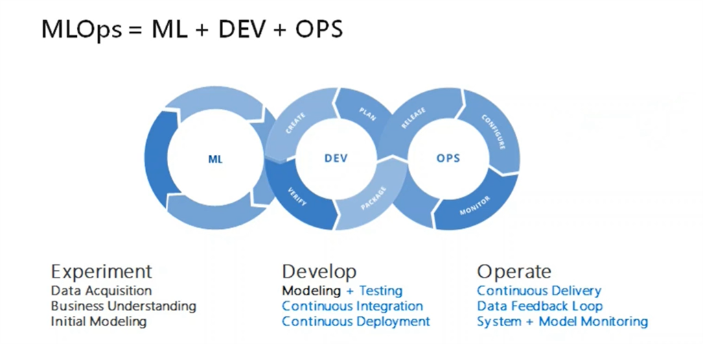
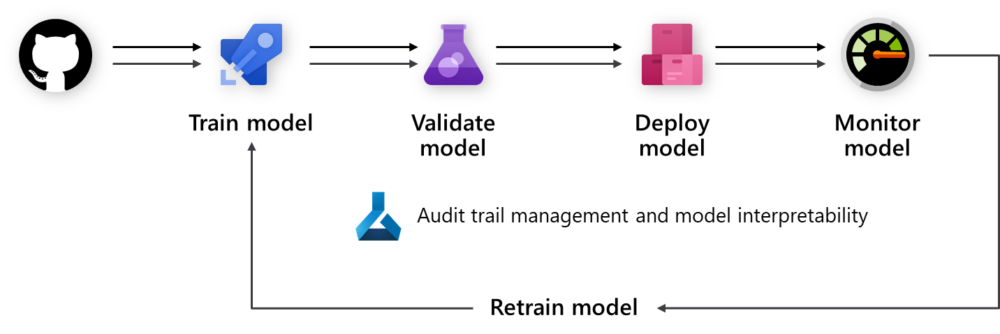

# How to approach MLOps

## Approaches to ML Ops

Data Scientists within an organization will have a wide spectrum of skills and there could be variation in the maturity of experimentation methods and the tools used. Standardization can either be mandated or encouraged through templates and experiment galleries. Full conformity is probably not possible or even desirable as it is important to encourage as many people as people to embrace AI, regardless of experience.

The size and maturity of the company is a deciding factor in whether the whole ML lifecycle falls under the Data Scientists responsibility or whether specialist teams will be in place for each of the phases. We tend to find that either one of two approaches are followed.

## Centralized approach

In a small company the number of resources available to dedicate to specialist roles and teams may be limited and therefore the Data Science team become responsible for the whole Machine Learning lifecycle.

It requires the Data Science team to have a breadth of and depth of technical expertise as they become responsible for the data cleaning and aggregation, model development, deployment, monitoring and maintenance of the deployed models.

One distinct advantage of this method is that the time to production is considerably reduced, however the cost is the increased skill level that needs to be maintained throughout the Data Science team.

When those required levels of expertise are not present, quality will suffer.

## Decentralized approach

In companies with a more established operational teams, specialist roles become responsible for the Machine Learning Lifecycle.

An ML Engineer will be assigned to review a use case once it has been approved. They will need to assess the current state and the amount of work it will need to get into a supportable format.

The type of Information that they might need to collect form the data scientist includes:

- Who will be the Business owner?
- How will the model be consumed?
- What level of Service availability will be needed?
- How will the model be retrained?
- How often will the model be retrained?
- Who will decide the conditions for model promotion?
- How sensitive is the use case and is the code shareable?
- How will the model and code be modified in the future?
- How much of the existing experiment is reusable?
- Are their existing project workflow that can be leveraged?
- How much work will it take to get the model into production?

At this this point the ML engineer will be able to design the workflow and estimate the amount of work required. It is good practice to ensure that the Data Scientists is engaged throughout the workflow build process.

During this period there is the opportunity to cross train the Data Scientist, so they are familiar with the final repo, in many circumstances the Data Scientist may be required to work on the use case in the future.

## Benefits of MLOps for businesses:

MLOps is the junction point between tradition DevOps, DataOps and Data Science / AI. Understanding how MLOps can benefit your business and the considerations for implementing MLOps will enable success in your AI journey.

Implementing MLOps provides a number of benefits to businesses:

- Enterprise model Management streamlines and automates the lifecycle for model development, training, deployment, and operationalization. This allows businesses to be agile and respond to immediate needs and business changes in a repeatable and managed way.
- Model versioning and Data Realization allows the enterprise to generate iterated and versioned models to adjust to nuances of either the data or the particular use case. This provides flexibility and agility in responding to busines challenges and changes.
- Model monitoring and management enables organizations to quickly respond to significant changes in either the data or scenario. E.g. an implemented model may experience extreme data drift due to an external factor or a change in the underlying data. This would make the previous models unusable and require immediate retraining of the model. MLOps enables models to be tracked for model accuracy and performance and alert stakeholders when changes impact model reliability and performance. It then enables quick retraining and deployment.
- As enterprise consumption is closely tied to business outcomes, implemented MLOps processes allow rapid auditing, compliance, governance, and access control through the development lifecycle. As changes occur, transparency of model generation, data usage, or regulatory compliance is ensured.

Microsoft’s AI Business School is a great resource to leverage and provides a holistic approach to AI including how to successfully implement AI, understand dependencies above and beyond the technology and how to learn and drive lasting business impact.

## Machine Learning Operations (MLOps) Overview

Machine Learning Operations (MLOps) consists of a set of principles and best practices on how to organize and orchestrate the development, deployment and maintenance of Machine Learning models in a scalable and standardized way.

The main components at play of the development and deployment of a Machine Learning system are outlined below.

*Source: Sculley et al. 2015. Hidden technical debt in Machine learning systems. In Proceedings of the 28th International Conference on Neural Information Processing Systems - Volume 2 (NIPS’15)*

## MLOps vs Dev Ops

Given that MLOps draws its inspiration from DevOps, it remains to wonder what the differences between the two are.

In addition to DevOps practices, MLOps addresses the following concepts not covered in Devops:

- **Data versioning:** in addition to code versioning there must also be versioning of data sets as the schema and actual data can change over time. This allows for reproducibility, creates transparency for other team members and enables auditing use cases.
- **Model tracking:** Model artifacts are often stored in a Model Registry, which should expose storage, versioning and tagging capabilities. Furthermore, those registries need to help with linking where a model was created from, e.g., the source code, its parameters, as well as the associated data that has been used to train the model.
- **Digital audit trail**: all changes need to be tracked when dealing with code and data.
- **Generalization:** models are different than code for reuse, as models must be tuned based on input data / scenario. To reuse a model for a new scenario, you may need to fine-tune the model for the new data.
- **Model re-training**: model performance can decrease over time and it is important to be able to retrain them when required to remain useful.

## Model Development process

The process of development is then standardized given the following:

- Automation for training and validation of models, including testing around functionality and performance (e.g., accuracy metrics).
- Automation for deployment to the infrastructure used for inferencing including monitoring.
- Mechanisms to create an end-to-end data audit trail, as well as automatic model retraining when data drifts over time (especially relevant for large-scale, ML-infused systems).

Given the Components in the previous diagram above, the deployment lifecycle of a Machine Learning system can be organized as in the diagram immediately above. Once developed, a Machine Learning model is then trained, validated, deployed and monitored. From the organizational perspective, it is important to define who owns and implements this process both on managerial and technical level. In larger enterprises, a data scientist might own the model training and validation steps and an ML engineer might take care of the reminder steps. In smaller companies, a data scientist might own all steps.

## Train Model

In this step, the Machine Learning model is trained using a training data set. The training code is versioned and can be reused. Version control of the training code enables automated training of the model, ideally with a “click of a button” or an event-trigger such as a new version of data available.

## Validate Model

This step automatically validates the newly trained model based on established metrics (e.g. an accuracy metric to compare it to older models). Did its accuracy increase? If yes, this model might be registered in the model registry for ensuring that next steps can consume it. If the new model performs worse, either a Data Scientist can be alerted to investigate why, or the newly trained model can just be discarded.

## Deploy/Consume Model

In the deployment step, the model is either deployed as an API service that applications can use. This is the recommended approach for web applications, as it enables the model to be scale and updated independently of the application itself. Alternatively, the model can be used to perform batch scoring. In this case, the model is used once or periodically to calculate predictions on new data points. This is useful when large amounts of data need to be processed asynchronously. More details on deployment models can be found on the [Deployment page](machine-learning-deployment-inferencing.md)

## Monitor the Model

Monitoring the model in production is crucial in two regards. Firstly, it allows to make sure that the model is technically functioning, e.g. able to generate predictions. This is especially important if applications within an organization are using the model in real-time and are depending on it. Secondly, it helps to ensure that the model is continuously generating useful predictions. This might not be the case when Data Drift occurs. Data Drift is the condition where the data being used to train the model significantly differs from the data that is being sent to the model during prediction phase. For example, a model trained for recommending products to young people might produce very undesirable results when being used to recommend products for people from a different age group. Model monitoring with Data Drift helps to detect such a mismatch and allows to alert the ML engineers, or even automatically retrains the model with more relevant or newer data.

## How to Monitor Models

Model performance often goes stale over time, this can be due to data drift, seasonality, or conversely a newer model architecture may be available that is tuned for better performance. Therefore, having a process for continuous deployment of models is recommended.

Some best practices related to model monitoring include:

- **Ownership:** There should be an owner assigned to the model performance monitoring process to ensure performance is actively managed.
- **Release Pipelines:** It is recommended to set up a release pipeline in Azure DevOps \[Github\] first, and set the trigger to the model registry. When a new model is registered in the registry, the release pipeline triggers a sign-off and deployment process.

A prerequisite to retraining model in a CI/CD framework is using the input data from scoring requests. The process is known as [collecting data from models in production](/azure/machine-learning/how-to-enable-data-collection). Currently this capability is limited to tabular data that can be parsed as JSON with minimal formatting and manipulation (video, audio, images are excluded). This capability is available for models served on AKS. The collected data is stored in an Azure Blob storage. The general recommended steps leading to retraining model are as follow:

1. **Monitor data drift from the collected input data**

Setting up a monitoring process requires extraction of timestamp from the production data. This is required to compare the production data and the baseline data (the training data which was used to build the model).

The preferred way to monitor data drift is through Application Insights. Application Insights provides an [alert](/azure/machine-learning/how-to-monitor-datasets#metrics-alerts-and-events) capability, which can trigger actions such as email, SMS text, push, or even execution of Azure Function. You have to [enable](/azure/machine-learning/how-to-enable-app-insights#configure-logging-with-azure-machine-learning-studio) Application Insights to log data.

2. **Analyze collected data**

Make sure [Enabling data collection](/azure/machine-learning/how-to-enable-data-collection) is included in the model scoring script. It is recommended to collect all features that are used for model scoring. This ensures all necessary features are present and therefore may be used as training data.

3. **Decide if retraining with the collected data is warranted**

There are many reasons you may experience data drift, ranging from a sensor issue, seasonality, change in user behavior as well as data quality issues related to the data source. In some cases model retraining is not required so it is recommended that the cause of the data drift is investigated and understood before the model is retrained.

4. **Retraining the model**

As model training should already be automated, this step is about triggering the existing training step. This could be for example when Data Drift has been detected (and it is not related to a data issue) or when a Data Engineer has published a new version of a dataset.

Depending on the use case, these steps can be fully automated or supervised by a human. Some use cases, such as product recommendations might be running fully autonomous in the future, while other others (e.g. finance) require a human in the loop to approved newly trained models, given metrics about model fairness, transparency, etc.

Often, an organization might start out with only automating the training and deployment of model, but not automate the validation, monitoring and retraining steps. Instead, one might perform those tasks manually, but slowly increase automation around those steps until the desired state has been achieved. DevOps and MLOps are both concepts that often evolve over time and organizations should treat them as such.

## Data science lifecycle

The Team Data Science Process (TDSP) provides a lifecycle to structure the development of your data science projects. The lifecycle outlines the major stages that projects typically execute, often iteratively:

- Business Understanding
- Data Acquisition and Understanding
- Modeling
- Deployment

The goals, tasks, and documentation artifacts for each stage of the lifecycle in TDSP are described in the [Team Data Science Process lifecycle](/azure/machine-learning/team-data-science-process/lifecycle) documentation.

## MLOps Roles

Within the AI Project and as described in the Data Science Lifecycle process there are 3 key roles, the Data Engineer, the Data Scientist and the MLOps Engineer. These roles are all critical in the success of your project and must work together to ensure that the end solution is accurate, repeatable, scalable and production ready.

**A Data Engineer** A Data engineer undertakes the responsibility of ingesting the data, data validation and cleansing activities.  Once the data is at sufficient quality and it is cataloged and made available for data scientists to use.  It is important to do some level exploratory analysis at this stage, such as checking for duplication of data, outliers are removed, missing data is computed. All these activities should be defined in a pipeline steps and are executed as the pre-processing of the train pipeline.  A meaningful naming convention should be used for naming the core and derived features.  

**Data Scientist (or AI Designer)** is responsible for preparing, training and evaluating models. The data that was prepared by a Data Engineer would go through a further exploratory analysis phase, where a Data Scientist identifies various patterns and relationships within the data and may undergo feature engineering to select/derive features for the experiment. It is important that this phase is completed as comprehensively as possible, since feature engineering plays a major role in building a good, generalized model. Various experiments would be carried out using different algorithms and hyper parameters.  Tooling such as AutomatedML can be used to automate this task, which can also help with the underfitting and overfitting of a model.  A successful trained model is then registered in the model registry. A meaningful model naming convention should be used, and version history should be retained for lineage and traceability.  This process can be formalized as a training pipeline.

**A ML Ops Engineer** undertakes the responsibility of building the end-to-end pipelines for continuous integration and delivery.   This includes packing the model in a Docker Image, validating and profiling the model, followed by the necessary approval from a stakeholder, then deploying the model in a container orchestration service, such as AKS.  As part of the continuous integration, various triggers may be set, such as, on commit of the model code to trigger the train pipeline, followed by the release pipeline.  

In a production setting, we may see a number of environments being used to orchestrate the MlOps process, namely: Dev, Test and Prod.

## Machine Learning Environments & Role-based Access Control

**In a Dev environment** a Data Scientist and a Data Engineer will normally carry out data engineering and data science activities. These activities should be facilitated by the ML Pipelines.  It is recommended that they have full access to all the permissions related to carrying out experiments, such as provisioning training clusters, building models, etc.  However, they should not have permission for activities such as delete or create Workspaces, add or remove workspace users.

**In a Test environment**, various tests are carried out on the environment deployment and the model.  For the model, it is recommended to use either Champion/Challenger or A/B testing.  The test environment should mimic as close to the deployment environment; therefore, it is recommended to run tests such as load, model response time, and others.  A Data Scientist and Data Engineer has limited access to this environment, primarily read only access, with some right access, such as configuration.  A DevOps on the other hand has full access to the environment. It is recommended to automate as many tests as possible.  Once all the tests are completed, an approval form a stakeholder is required to be deployed in the Prod environment.

**In a Prod environment**, deployment of a model takes place either for batch or real-time inference.  A Prod is typically a read-only environment, however, a DevOps engineer has full access to the environment, and is responsible for on-going support and maintenance of the environment.  A Data Scientist and a Data Engineer has limited access to the environment and is read-only.

The role-based access control for all the environments can be summarized as follows:

From this table, it can be observed that the Data Engineer and Data Scientist’s level of access decreases as we go up the higher environments, while DevOPs Engineer increases.  This is because an MLOPs engineer is tasked with building the pipeline, gluing things together, and ultimately deploying models in production. This is the recommended level of granularity should be provided for each role.