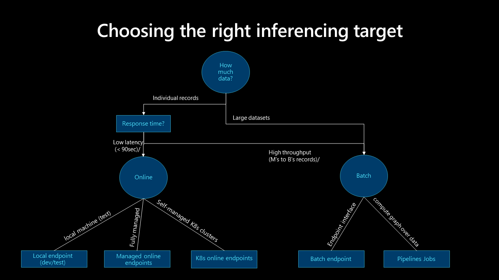

# Deploy machine learning models in production environments

This article describes best practices for deploying machine learning models in production environments by using Azure Machine Learning. Deploying machine learning models in production is important for organizations that use AI to enhance their operations. It can be a complex process, but this article helps you understand the steps.

## Architectural considerations

- **Choose the right deployment method.** Each deployment method has advantages and disadvantages. It's important to choose the one that best suits your organization's needs. There are two main deployment methods:

  - **Real-time** (online) inference processes input data as it's received, often with a low-latency requirement. Low latency is important for applications that require immediate responses, such as fraud detection, speech recognition, or recommendation systems. Real-time inference is more complex and expensive to implement than batch inference because it requires a faster and more reliable infrastructure. The underlying compute for real-time inference usually runs continuously to service requests faster.

  - **Batch** (offline) inference processes a large batch of input data at once rather than processing each input data point individually in real time. Batch inference is well suited for large data volume scenarios that need efficient processing but response time isn't critical. For example, you might use batch inference to process a large dataset of images, and the machine learning model makes predictions on all the images at once. Batch inference is less expensive and more efficient than real-time inference. The underlying compute for batch inference usually runs only during the batch job.

  Machine Learning uses endpoints to deploy models in real time and batch scenarios. Endpoints provide a unified interface to invoke and manage model deployments across compute types. Managed online endpoints serve, scale, secure, and monitor your machine learning models for inference.

  For more information, see the following section in this article, [Deployment methods](#deployment-methods).

- **Ensure consistency.** It's important to deploy your model consistently across environments, such as development, staging, and production. Use containerization or virtualization technologies, such as [Machine Learning environments](/azure/machine-learning/concept-environments), to provide consistency and to encapsulate your environment.

- **Monitor performance.** After your model deploys into production, you should track metrics, such as accuracy, latency, and throughput, and set up alerts to notify you when performance falls below acceptable levels. Use Application Insights and the [built-in monitoring capabilities of managed endpoints](/azure/machine-learning/how-to-monitor-online-endpoints) to view metrics and create alerts.  

- **Implement security measures.** Protect your data and systems. You can set up authentication and access controls, encrypt data in transit and at rest, use network security, and monitor for suspicious activity.

- **Create a plan for updates.** Machine learning models need updates as new data and new algorithms become available. It's important to create a process to test and validate the updated model before deploying it in production. Blue/green deployment is a common strategy that updates machine learning models in production. With blue/green deployment, you can update a model to a new environment, test it, and then switch to the new model after it's validated. Blue/green deployment ensures that potential issues with the updated model don't affect your customers. For more information, see [Native blue/green deployment](/azure/machine-learning/concept-endpoints-online#native-bluegreen-deployment).

## Deployment methods

Consider the following questions to evaluate your model, compare the two deployment methods, and select the method that suits your model:

- How often should predictions be generated?
- How soon do you need the results?
- Are the predictions stored or used immediately?
- Should predictions be generated individually, in small batches, or in large batches?
- Is latency expected from the model?
- How much compute power does the model need to run?
- Are there operational implications and costs to maintain the model?
- How is the prediction triggered? Is it event-based or scheduled?

See the following decision tree to determine which deployment model best fits your use case:

### Batch inference

Batch inference is a simple process that enables models to run in timed intervals or based on triggers. With batch inference, business applications can store predictions.

Consider the following best practices for batch inference:

- **Run batch operations by using API.** Use [batch endpoints](/azure/machine-learning/concept-endpoints) to create a durable HTTPS endpoint that triggers a batch-scoring job for scheduled or event-based data pipelines. The API can integrate with any data orchestration platform that supports REST API invocation. For more information, see the Batch integration bullet point in this section and [Deploy models for scoring in batch endpoints](/azure/machine-learning/how-to-use-batch-endpoint).

- **Compute options.** Batch inference processes don't usually run continuously, so it's beneficial to automatically start, stop, and scale reusable clusters that can handle a range of workloads. Different models often require different environments. Your solution needs to deploy a specific environment and remove it when inference is complete. Automation makes the compute available for the next model. To reduce cost, use [low-priority virtual machines](/azure/machine-learning/how-to-use-low-priority-batch) for your compute nodes.

  > [!IMPORTANT]
  > The size of the compute nodes is important. If the nodes are too small, the batch inference job takes longer. If the nodes are too large, the job is more expensive. Test and monitor compute nodes to determine the right size for your model.

- **Consider scalability needs.** For improved performance, Machine Learning supports features that enable scalable processing. The number of compute nodes and maximum concurrency parameters are defined during the batch endpoint deployment in Machine Learning. You can override the parameters for each job, which provides customers runtime flexibility and out-of-the-box parallelism. These features work with tabular and file-based inference.

- **Batch inference challenges.** Batch inference is a simpler way to use and deploy your model in production, but it does present its own set of challenges.

  - Depending on the frequency that the inference runs, the prediction that's generated might be irrelevant by the time it's accessed.  

  - Deploying to many regions and designing the solution for high availability aren't critical concerns in a batch inference scenario because the model isn't deployed regionally. But the data store might need to be deployed with a high-availability strategy in many locations. The deployment should follow the application high-availability design and strategy.

  - Data that's generated during a batch inference might partially fail. For example, if a scheduled pipeline triggers a batch inference job and the pipeline fails, the data that's generated by the batch inference job might be incomplete. Partial restarts are a common problem with batch inference. One solution is to use a staging area for the data, and only move the data to the final destination after the batch inference job is successfully complete. Another solution is to maintain a record, or transaction, of each file that’s processed, and compare that record to the input file list to avoid duplication. This method incorporates logic in the scoring script. This solution is more complex, but you can customize the failure logic if the batch inference job fails.

- **Security requirements.** Use authentication and authorization to control access to the batch endpoint for enhanced security.  
  - A batch endpoint with ingress protection only accepts scoring requests from hosts inside a virtual network. It doesn't accept scoring requests from the public internet. A batch endpoint that's created in a private link-enabled workspace has ingress protection. For more information, see [Network isolation in batch endpoints](/azure/machine-learning/how-to-secure-batch-endpoint).
  - Use Azure Active Directory (Azure AD) tokens for authentication.
  - Use SSL encryption on the endpoint, which is enabled by default for Machine Learning endpoint invocation.
  - Batch endpoints ensure that only authorized users can invoke batch deployments, but individuals can use other credentials to read the underlying data. For a reference of the data stores and the credentials to access them, see the [data access table](/azure/machine-learning/how-to-access-data-batch-endpoints-jobs#security-considerations-when-reading-data).

- **Batch integration.** Machine Learning batch endpoints use an open API. Batch inference can integrate with other Azure services, such as Azure Data Factory, Azure Databricks, and Azure Synapse Analytics to form part of a larger data pipeline. For example, you can use:

  - Data Factory to orchestrate the batch inference process.
  - Azure Databricks to prepare the data for batch inference.
  - Machine Learning to run the batch inference process.
  - Azure Synapse Analytics to store the subsequent predictions.

  Batch endpoints support Azure AD for authorization. The request to the API requires proper authentication. Azure services, such as Data Factory, support using a service principal or a managed identity to authenticate against batch endpoints. For more information, see [Run batch endpoints from Data Factory](/azure/machine-learning/how-to-use-batch-azure-data-factory).  

  To choose the best method for batch input and output processing, it's important to understand how data moves through the stages of your data pipelines. You can access Azure data services directly through the batch endpoint scoring script by using SDKs, but using Machine Learning registered datastores is more simple, secure, and auditable. For third-party data sources, use a data processing engine, such as Data Factory, Azure Databricks, or Azure Synapse Analytics, to prepare the data for batch inference and apply post-inference processing.  

- **MLflow.** Use the open-source framework, [MLflow](/azure/machine-learning/concept-mlflow), during model development. Machine Learning supports no-code deployment of models that you create and log with MLflow. When you [deploy your MLflow model to a batch endpoint](/azure/machine-learning/how-to-mlflow-batch), you don't need to indicate a scoring script or an environment.

### Real-time inference

Real-time inference is a method that enables you to trigger model inference at any time and provides an immediate response. Use this method to analyze streaming data or interactive application data.

Consider the following best practices for real-time inference:

- **Compute options.** The best way to implement real-time inference is to deploy the model that's in an online endpoint to a managed online endpoint or a Kubernetes online endpoint. Managed online endpoints deploy your machine learning models immediately by using CPU or GPU machines in Azure. This method is scalable and fully managed. Kubernetes online endpoints deploy models and serve online endpoints on your fully configured and managed Kubernetes cluster. For more information, see [Managed online endpoints vs Kubernetes online endpoints](/azure/machine-learning/concept-endpoints-online#managed-online-endpoints-vs-kubernetes-online-endpoints).

- **Multiregional deployment and high availability.** Regional deployment and high-availability architectures are examples of real-time inference scenarios because latency and model performance are critical. To reduce latency in multiregional deployments, locate the model as close as possible to the consumption point. For the model and the supporting infrastructure, follow the business' high-availability and disaster recovery principles and strategy.

- **Real-time inference challenges.**  
  - Real-time inference is more complex because of latency and performance requirements. A simple real-time system receives input via an HTTP request and returns a prediction. But a complex system might need to respond in 100 milliseconds or less. During that time, it retrieves data, performs feature engineering, performs inference, validates and stores the model results, runs business logic, and returns the results to the system or application.
  - Offload feature engineering to a low-latency data store, caching service, or dedicated feature store. A feature store is a centralized repository that enables data scientists to find and share features. A feature store ensures that the same code that's used to compute the feature values is also used for model training and inference.

- **Security requirements.** For enhanced security, use authentication and authorization to control access to the online endpoint.  
  - An online endpoint with ingress protection only accepts scoring requests from hosts inside a virtual network. It doesn't accept scoring requests from the public internet. An online endpoint that's created in a private link-enabled workspace has ingress protection. For more information, see [Use network isolation with managed online endpoints](/azure/machine-learning/how-to-secure-online-endpoint).
  - Use Azure AD tokens for control plane authentication. For data plane operations, [key-based and token-based](/azure/machine-learning/how-to-authenticate-online-endpoint) approaches are supported. The token-based approach is preferred because tokens expire. Use Azure role-based access controls (RBAC) to restrict access and retrieve the key or token for an online endpoint.
  - Use SSL encryption on the endpoint, which is enabled by default for Machine Learning endpoint invocation.

- **Real-time integration.** Integrate real-time inference with other Azure services by using SDKs for different languages and invoking the endpoint by using a REST API. You can invoke the online endpoint as part of an application's code.

- **MLflow.** Use the open-source framework, [MLflow](/azure/machine-learning/concept-mlflow), during model development. Machine Learning supports no-code deployment of models that you create and log with MLflow. When you [deploy your MLflow model to an online endpoint](/azure/machine-learning/how-to-deploy-mlflow-models-online-endpoints), you don't need to indicate a scoring script or an environment.

- **Safe rollout.** Deploy phased-out updates to machine learning models to ensure that the model performs as expected. Use the Machine Learning safe rollout strategy to deploy a model to an endpoint, perform testing against the model, and gradually increase the traffic to the new model. Take advantage of mirrored traffic to mirror a percentage of live traffic to the new model for extra validation. Traffic mirroring, also called shadowing, doesn't change the results that are returned to clients. All requests still flow to the original model. For more information, see [Safe rollout for online endpoints](/azure/machine-learning/how-to-safely-rollout-online-endpoints).

## Other considerations

Keep these considerations in mind when you deploy machine learning models in production environments.

### ONNX

To optimize the inference of your machine learning models, use [Open Neural Network Exchange (ONNX)](https://onnx.ai/). It can be a challenge to fully utilize hardware capabilities when you optimize models, particularly when you use different platforms (for example, cloud/edge or CPU/GPU). You can train a new model or convert an existing model from another format to ONNX.

### Many-models scenario

A singular model might not capture the complex nature of real-world problems. For example, supermarkets have demographics, brands, SKUs, and other features that vary between regions, which makes it a challenge to create a single sales-prediction model. Similarly, regional variations can pose a challenge for a smart-meter predictive maintenance model. Use many models to capture regional data or store-level relationships to provide higher accuracy than a single model. The many-models approach assumes that enough data is available for this level of granularity.

A many-models scenario has three stages: data source, data science, and many models.

- **Data source.** In the data source stage, it's important to segment data into only a few elements. For example, don't factor the product ID or barcode into the main partition because it produces too many segments and might inhibit meaningful models. The brand, SKU, or locality are more suitable elements. It's important to simplify the data by removing anomalies that might skew the data distribution.

- **Data science.** In the data science stage, several experiments run parallel to each data segment. Many-models experimentation is an iterative process that evaluates models to determine the best one.

- **Many models.** The best models for each segment or category are registered in the model registry. Assign meaningful names to the models to make them more discoverable for inference. Use tagging where necessary to group the model into specific categories.

### Batch inference for many models

For many models, during batch inference, predictions are on a recurring schedule, and they can handle large-volume data that runs at the same time. Unlike a single-model scenario, many-models inference occurs at the same time.

Many models for batch inference use multiple deployments against a single-managed endpoint. Batch inference for specific models invokes the deployment name during the REST or SDK call. For more information, see [Deploy multiple models to one deployment](https://github.com/Azure/azureml-examples/blob/main/sdk/python/endpoints/batch/deploy-models/mnist-classifier/mnist-batch.ipynb).

### Real-time inference for many models

You can deploy multiple models into a single-managed online endpoint, which you can invoke via a REST API or SDK. When you create the deployments, register the multiple models as a single "registered model" on Azure. Include the multiple models in the same directory and pass that directory as the path of the single model. The models are loaded into a dictionary that's keyed on their names. When a REST request is received, the desired model is retrieved from the JSON payload, and the relevant model scores the payload.

Models that are loaded in a multi-model deployment by using this technique must share the same Python version and have no conflicting dependencies. Their libraries must be simultaneously imported even if they don't strictly have the same dependencies.

For an example, see [Create a multimodel deployment by using a custom container](https://github.com/Azure/azureml-examples/blob/main/sdk/python/endpoints/online/custom-container/online-endpoints-custom-container-multimodel.ipynb).

## Next steps

- [What are Machine Learning endpoints?](/azure/machine-learning/concept-endpoints)
- [Secure a Machine Learning inferencing environment with virtual networks](/azure/machine-learning/how-to-secure-inferencing-vnet)
- [What are Machine Learning pipelines?](/azure/machine-learning/concept-ml-pipelines)
- [Deploy and score a machine learning model by using an online endpoint](/azure/machine-learning/how-to-deploy-online-endpoints)
- [Deploy models for scoring in batch endpoints](/azure/machine-learning/how-to-use-batch-endpoint)
- [Deploy a model as an online endpoint](/azure/machine-learning/tutorial-deploy-model)
- [What is Responsible AI?]( /azure/machine-learning/concept-responsible-ai)
- [ONNX and Machine Learning: Create and accelerate machine learning models](/azure/machine-learning/concept-onnx)
