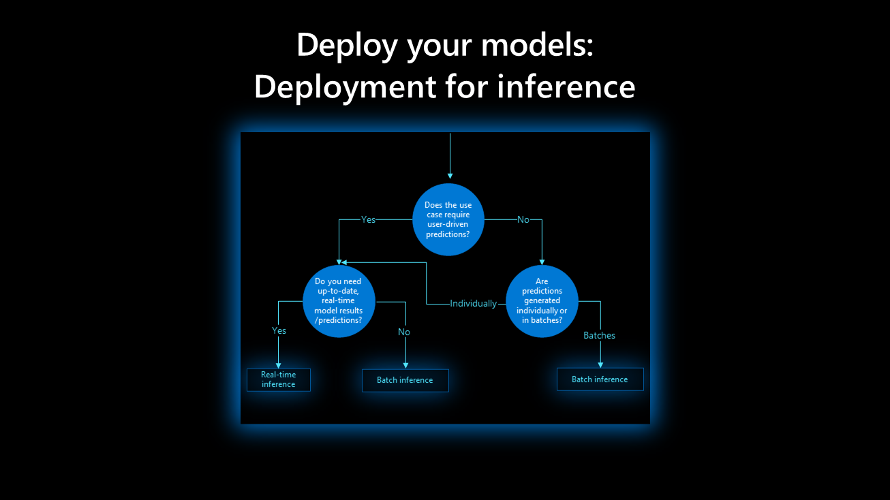
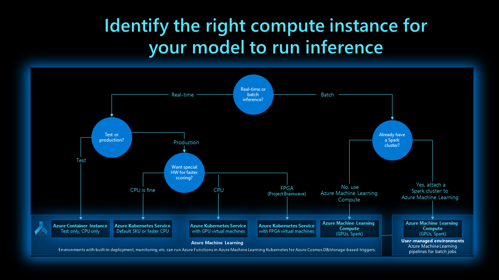
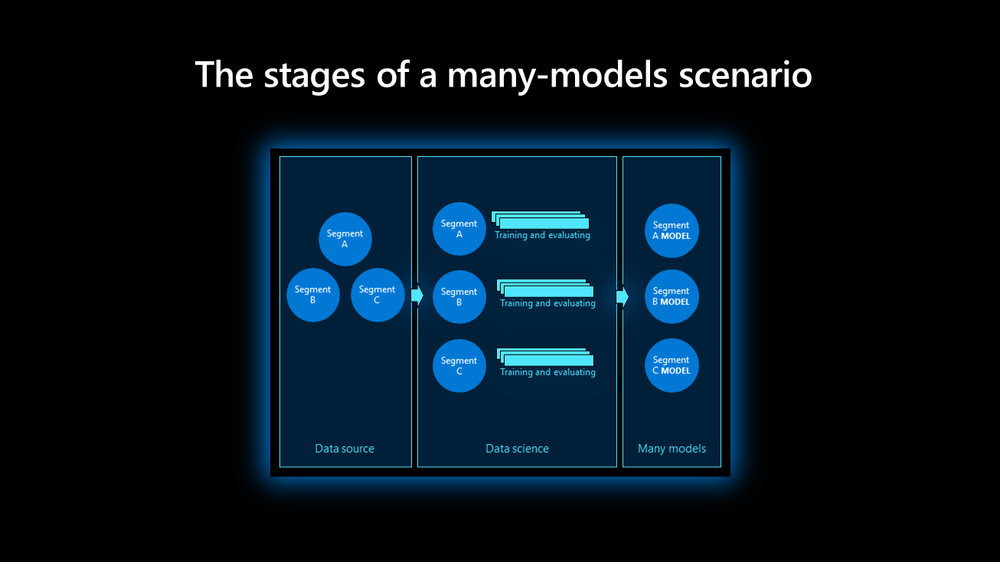
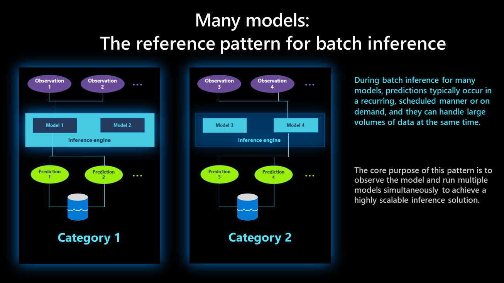
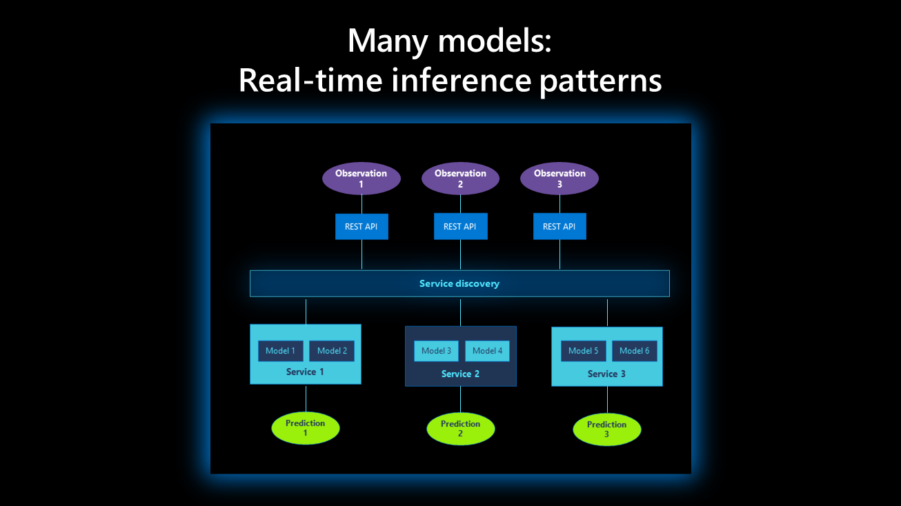

# Machine learning inference during deployment

When deploying your AI model during production, you need to consider how it will make predictions. The two main processes for AI models are:

- **Batch inference:** An asynchronous process that bases its predictions on a batch of observations. The predictions are stored as files or in a database for end users or business applications.

- **Real-time (or interactive) inference:** Frees the model to make predictions at any time and trigger an immediate response. This pattern can be used to analyze streaming and interactive application data.

Consider the following questions to evaluate your model, compare the two processes, and select the one that suits your model:

- How often should predictions be generated?
- How soon are the results needed?
- Should predictions be generated individually, in small batches, or in large batches?
- Is latency to be expected from the model?
- How much compute power is needed to execute the model?
- Are there operational implications and costs to maintain the model?

The following decision tree can help you to determine which deployment model best fits your use case:

## Batch inference

Batch inference, sometimes called offline inference, is a simpler inference process that helps models to run in timed intervals and business applications to store predictions.

Consider the following best practices for batch inference:

- **Trigger batch scoring:** Use Azure Machine Learning pipelines and the `ParallelRunStep` feature in Azure Machine Learning to set up a schedule or event-based automation. Navigate to the AI show to perform [batch inference using Azure Machine Learning `ParallelRunStep`](https://channel9.msdn.com/Shows/AI-Show/How-to-do-Batch-Inference-using-AML-ParallelRunStep) and learn more about the process.

- **Compute options for batch inference:** Since batch inference processes don't run continuously, it's recommended to automatically start, stop, and scale reusable clusters that can handle a range of workloads. Different models require different environments, and your solution needs to be able to deploy a specific environment and remove it when inference is over for the compute to be available for the next model. See the following decision tree to identify the right compute instance for your model:

  

- **Implement batch inference:** Azure supports multiple features for batch inference. One feature is `ParallelRunStep` in Azure Machine Learning, which allows customers to gain insights from terabytes of structured or unstructured data stored in Azure. `ParallelRunStep` provides out-of-the-box parallelism and works within Azure Machine Learning pipelines.

- **Batch inference challenges:** While batch inference is a simpler way to use and deploy your model in production, it does present select challenges:

  - Depending on the frequency at which inference runs, the data produced could be irrelevant by the time it's accessed.

  - A variation of the cold-start problem; results might not be available for new data. For example, if a new user creates and account and starts shopping with a retail recommendation system, product recommendations won't be available until after the next batch inference run. If this is an obstacle for your use case, consider real-time inference.

  - Deploying to many regions and high availability aren't critical concerns in a batch inference scenario. The model doesn't need to be deployed regionally, and the data store might need to be deployed with a high-availability strategy in many locations. This will normally follow the application HA design and strategy.

## Real-time inference

Real-time, or interactive, inference is architecture where model inference can be triggered at any time, and an immediate response is expected. This pattern can be used to analyze streaming data, interactive application data, and more. This mode allows you to take advantage of your machine learning model in real time and resolves the cold-start problem outlined above in batch inference.

The following considerations and best practices are available if real-time inference is right for your model:

- **The challenges of real-time inference:** Latency and performance requirements make real-time inference architecture more complex for your model. A system might need to respond in 100 milliseconds or less, during which it needs to retrieve the data, perform inference, validate and store the model results, run any required business logic, and return the results to the system or application.

- **Compute options for real-time inference:** The best way to implement real-time inference is to deploy the model in a container form to Docker or AKS cluster and expose it as a web-service with REST API. This way, the model executes in its own isolated environment and can be managed like any other web service there. Docker/AKS capabilities can then be used for management, monitoring, scaling, and more. The model can be deployed on-premises, in the cloud, or on the edge. The preceding compute decision outlines real-time inference.

- **Multiregional deployment and high availability:** Regional deployment and high availability architectures need to be considered in real-time inference scenarios, as latency and the model's performance will be critical to resolve. To reduce latency in multiregional deployments, it's recommended to locate the model as close as possible to the consumption point. The model and supporting infrastructure should follow the business' high availability and DR principles and strategy.

## Many-models scenario

A singular model might not be able to capture the complex nature of real-world problems, such as predicting sales for a supermarket where demographics, brand, SKUs, and other features could cause customer behavior to vary significantly. Regions could cause developing predictive maintenance for smart meters to also vary significantly. Having many models for these scenarios to capture regional data or store-level relationships could produce higher accuracy than a single model. This approach assumes that enough data is available for this level of granularity.

At a high level, a many-models scenario occurs in three stages: data source, data science, and many models.

**Data source:** It's important to segment data without too many cardinalities in the data source stage. The product ID or barcode shouldn't be factored into the main partition, as this will produce too many segments and could inhibit meaningful models. The brand, SKU, or locality could be more fitting features. It's also important to homogenize the data by removing anomalies that would skew data distribution.

**Data science:** Several experiments run parallel to each data partition in the data science stage. This is a typically iterative process where models from the experiments are evaluated to determine the best one.

**Many models:** The best models for each segment or category are registered in the model registry. Assign meaningful names to the models, which will make them more discoverable for inference. Use tagging where necessary to group the model into specific categories.

## Batch inference for many models

During batch inference for many models, predictions are typically scheduled, recurring, and they can handle large volumes of data running at the same time. Unlike in a single-model scenario, many models inference at the same time, and it's important to select the correct ones. The following diagram shows the reference pattern for many-models batch inference:

The core purpose of this pattern is to observe the model and run multiple models simultaneously to achieve a highly scalable inference solution that can handle large data volumes. To achieve hierarchical model inference, many models can be split into categories. Each category can have its own inference storage, like an Azure data lake. When implementing this pattern, one needs to balance scaling the models horizontally and vertically, as this would impact the cost and performance. Running too many model instances might increase performance but impact the cost. Too few instances with high spec nodes might be more cost effective but could cause issues with scaling.

## Real-time inference for many models

Real-time many-models inference requires low latency and on-demand requests, typically via a REST endpoint. This is useful when external applications or services require a standard interface to interact with the model, typically via a REST interface with a JSON payload.

The core purpose of this pattern is to use the discovery service to identify a list of services and their metadata. This can be implemented as an Azure function and enables clients to obtain relevant service details of service, that can be invoked with a secure REST URI. A JSON payload be sent to the service, which would summon the relevant model and provide a JSON response back to the client.

Each service is stateless microservice that can handle multiple requests simultaneously and is limited to the physical virtual machine resource. The service can deploy multiple models if multiple groups are selected; homogeneous groupings like the category, SKU, and more are recommended for this. The mapping between the service request and model selected for a given service needs to be baked into the inference logic, typically via the score script. If the size of models is relatively small (a few megabytes), it's recommended to load them in memory for performance reasons; otherwise, each model can be loaded dynamically per request.

## Next steps

Explore the following resources to learn more about inference in Azure Machine Learning:

- [Build an Azure Machine Learning pipeline for batch scoring](/azure/machine-learning/tutorial-pipeline-batch-scoring-classification)
- [Run batch prediction using Azure Machine Learning designer](/azure/machine-learning/how-to-run-batch-predictions-designer)
- [Batch inference in Azure Machine Learning](https://techcommunity.microsoft.com/t5/azure-ai/batch-inference-in-azure-machine-learning/ba-p/1417010)
