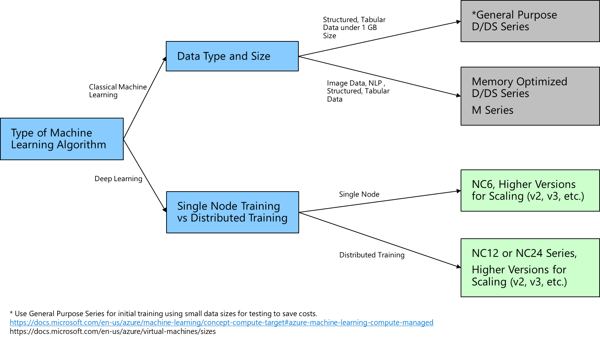

# Select and size compute instances for machine learning

## Development and training

When selecting and sizing your compute instances for developing and training your machine learning models, consider the type of algorithm that you're using, the data type, data sizes, and if you'll perform distributed training. To select compute instances, reference to the following decision tree:

## Inferencing

You can use the following decision tree to determine and select the appropriate compute instances for inferencing with your machine learning model.

