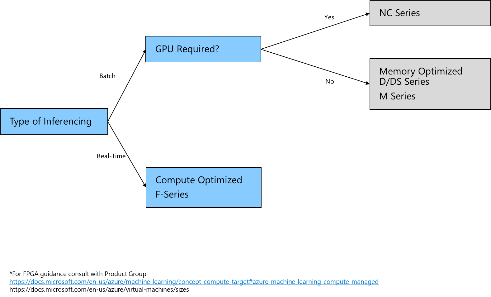

# Select and size Compute Instances for Machine Learning

## Development and Training

When selecting and sizing your compute instances for the development and training of your ML models you need to consider the type of algorithm you are using, data type and sizes and if you will be utilizing distributed training. Refer to the following decision tree for selection of compute Instances.

## Inferencing

For inferencing of your ML Model you can use the following decision tree to select the appropriate compute instances.

