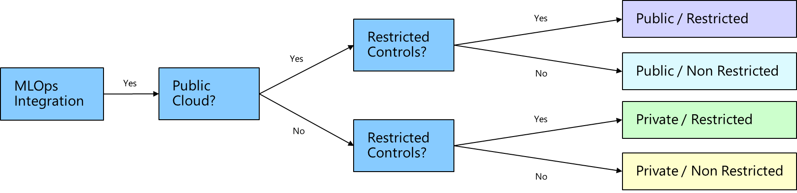

# Set up your Machine Learning Workspaces

When setting up your machine learning workspaces in Azure Machine Learning service there are multiple considerations to take into account when determining the best structure and controls.

1. **Public / Restricted:**
   - Dev, Test & Prod Workspace
   - Data Scientist Custom Role
   - Git Integration for Version Control and CI/CD
1. **Public / Non Restricted:**
   - Dev, Test & Prod Workspace
   - Contributor Role
   - Git Integration for Version Control and CI/CD
1. **Private / Restricted:**
   - Dev, Test & Prod Workspace
   - Private Link Enabled
   - Data Scientist Custom Role
   - Git Integration for Version Control and CI/CD
1. **Private / Non Restricted:**
   - Dev, Test & Prod Workspace
   - Private Link Enabled
   - Contributor Role
   - Git Integration for Version Control and CI/CD
1. **All Workspaces**
   - One AMLS Workspace per Project
   - One Compute Instance per Data Scientist
   - One Compute Cluster per VM size shared with Data Scientists for Development
   - One Compute Cluster per Production Pipeline
   - Set Compute Cluster Minimum Node Size to 0 to save Costs
   - Instruct users to shutdown Compute Instances manually after use
   - Workspace admin Custom Role who has access to create Compute Instances and Clusters
   - Data Scientist Custom Role requires all infrastructure to be set up by another user before the Data Scientist can begin work